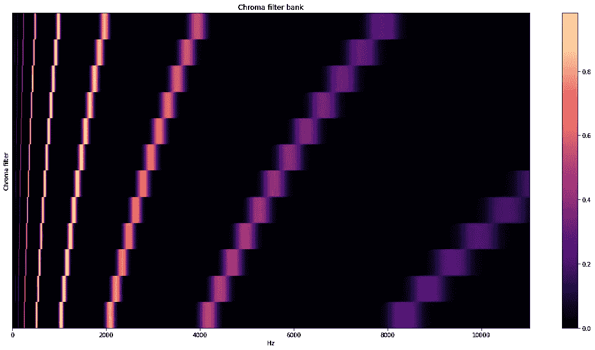
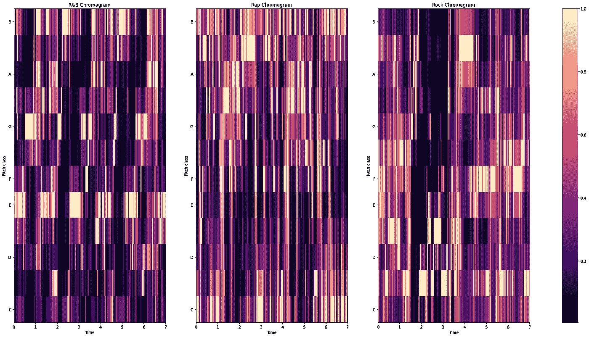

# 从音频中学习:音高和色谱图

> 原文：<https://towardsdatascience.com/learning-from-audio-pitch-and-chromagrams-5158028a505?source=collection_archive---------20----------------------->

## 为音乐信息检索解释音高变化

# 介绍

既然已经完全理解了声谱图的概念，我们想更深入地研究频率以外的各种结构。当研究 Mel 标度上的声波时，我们体会到了这一点——特别是使用 MFCCs。虽然可视化 MFCCs 在技术上不是光谱图，但粗略的想法仍然成立。

然而，这篇文章将更侧重于音乐信息检索(MIR ),因为我们将研究音高随时间的变化。为了做到这一点，我们需要了解什么是音高，它是如何表示的，以及我们如何使用傅立叶变换来确定音高的变化。

## 相关文章:

*   [学习音频:波形](/learning-from-audio-wave-forms-46fc6f87e016)
*   [从音频中学习:时域特征](/learning-from-audio-time-domain-features-4543f3bda34c)
*   [从音频中学习:傅立叶变换](/learning-from-audio-fourier-transformations-f000124675ee)
*   [从音频中学习:频谱图](/learning-from-audio-spectrograms-37df29dba98c)
*   [从音频中学习:梅尔标度、梅尔频谱图和梅尔频率倒谱系数](/learning-from-audio-the-mel-scale-mel-spectrograms-and-mel-frequency-cepstral-coefficients-f5752b6324a8)

**一如既往，如果你想查看 Jupyter 笔记本中的代码，你可以在我的** [**GitHub 上找到一切。**](https://github.com/theadamsabra/LearningfromAudio)

# 什么是音高？

音高可以理解为声音的相对高低。声音越高，音调越高，声音越低，音调越低。很简单，对吧？为了完全理解音高，我们需要理解音高类别和八度音阶。

音高类别是与每个声音相关联的字母。所有的音高都属于 7 个字母中的一个:A、B、C、D、E、F 和 g。让我们假设我们正在弹钢琴，我们从 A 开始。我们将一直上升一个白键，直到我们到达 g 键。当我们随着每个白键上升时，我们不可避免地一遍又一遍地循环这些字母。然而，当我们按下 G 后的第二个 A 键时，重要的是要注意，它不是我们最初开始时的那个音。音高类是一样的；这是一把钥匙。然而，声音比以前更高，表明我们在下一个(更高的)八度。

在潜入八度之前，我们先快速覆盖一下黑键。如果我们从 C 开始，上升一个黑键，我们就达到了所谓的 C#(读作 C 调。)如果我们再看一下这幅图，我们还会发现它也被称为 D♭(pronounced 降 d 调。)这是因为黑键也在 d 之前，简单来说，如果我们上一个黑键，音符就“升”了，如果我们下一个黑键，音符就“降”了。就人类听到的而言，它们是等价的，所以我们称这些音符为等音。至于两个白键之间没有黑键的情况，你不必为这篇文章担心，因为这涉及到更多的音乐理论。

一个八度音程是一个数字，它指明了我们所处的音高组。如果我们重复我们的例子，知道我们在 A3，下一个 A 键是 A4。同样，这应该不难理解。键盘的中间键是 C4，它通常被用作你所在八度的参照。

值得注意的是，该数字不是在每个 A 值之后增加，而是在每个 C 值之后增加。这意味着，如果我们从中间的 C，或 C4 开始，它后面的 B 键是 B3，B 键在 B4 之后。

# 关于色谱图

既然我们了解了音乐中的音高，我们就可以深入到色度滤波器中去，它是我们色度图的基础。

色度滤波器可以从色度滤波器组中导出。滤波器组旨在将录制声音的所有能量投射到 12 个箱中，即我们看到的所有音符，加上小调/大调(也是钢琴的黑键)，而不管它在哪个八度音阶中。通过忽略八度音阶，我们可以创建一个音高如何随时间变化的热图，这是 MIR 的一个重要方面。例如，如果你决定教 LSTM 人如何演奏音乐，这些功能将非常有用，因为它们会告诉神经网络音高可能如何随时间变化。

让我们想象一下不同频率下的色度滤波器组。

作者照片

通过取我们基于傅立叶的声谱图(通过取 STFT)和这个滤波器组的点积，我们可以将所讨论的歌曲映射到我们之前讨论过的一组音高上。幸运的是，多亏了`librosa`,创建色谱图的功能已经为我们创建好了。请注意，我们不必使用音频上的 STFT 作为我们的基础，但这超出了本文的范围。

记住这一点，让我们研究我们的各种体裁片段的色谱图。

作者照片

现在我们可以看到音高是如何随时间变化的，我们可以在每种体裁中看到一些有趣的观察结果。

对于 R&B 来说，很明显艺术家决定让歌曲围绕 e 音符，对于 Rap 来说，它是高度分散和分布的，这是有意义的，因为这种类型利用了类似于打击乐的声音节奏，而对于 Rock 来说，它围绕 C#或 D♭.音符

# 结论

到目前为止，您应该已经很好地理解了什么是音高，我们如何对每个音高进行分类，色度滤镜的目的是什么，以及我们如何可视化色度图。

如果你有任何问题，请在下面留下。