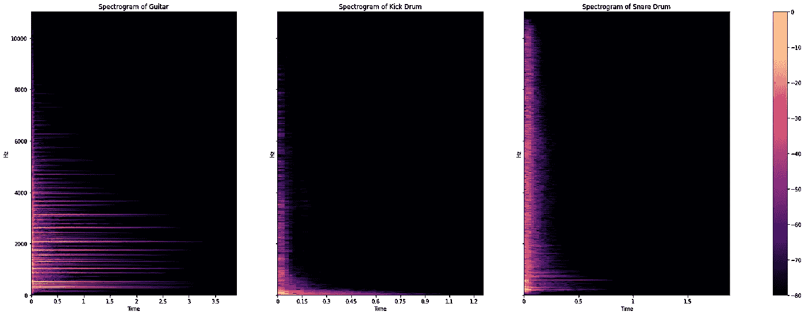
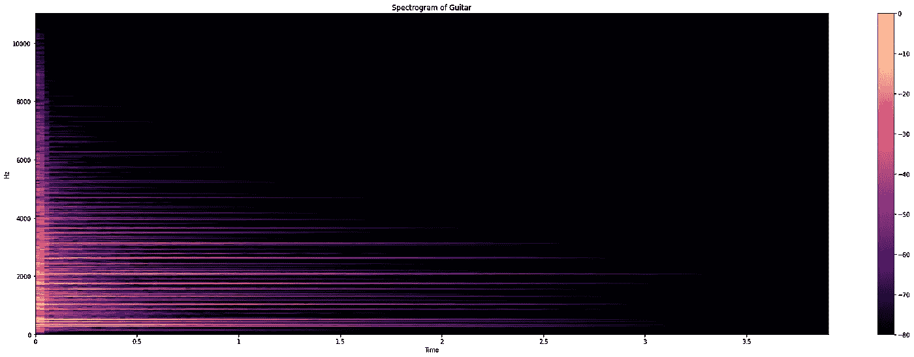
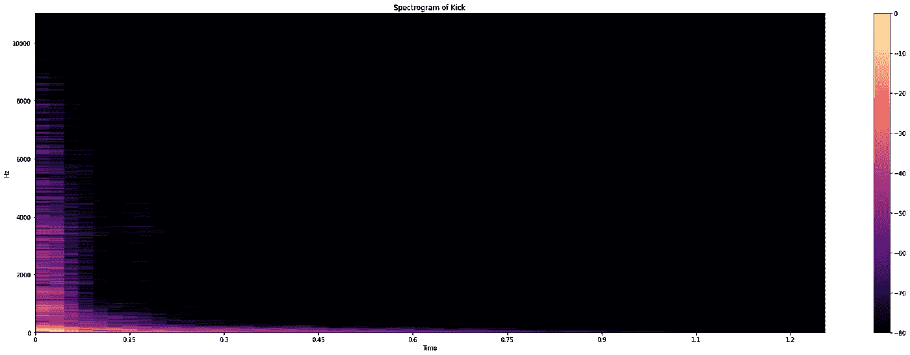
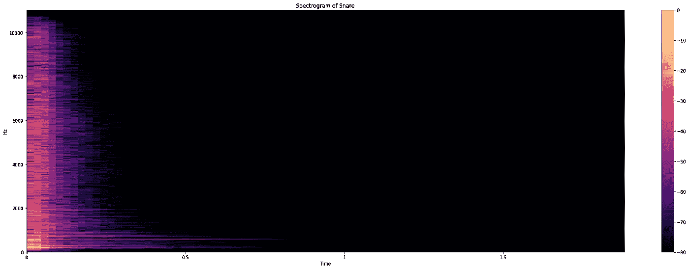

# 从音频中学习:频谱图

> 原文：<https://towardsdatascience.com/learning-from-audio-spectrograms-37df29dba98c?source=collection_archive---------23----------------------->

## 将音频结构可视化到毫秒级。



到本文结束时，你将能够创建像这样的图形。图片作者。

# 简介:

当涉及到机器学习，甚至深度学习时，如何处理数据是模型训练和测试性能的基础。当在音频领域工作时，在到达这个阶段之前有几个步骤需要理解，但是一旦你到达那里，从音频中学习就成为一个相当容易的任务。在阅读本文之前，请务必理解下面链接的概念。

## 相关文章:

*   [学习音频:波形](/learning-from-audio-wave-forms-46fc6f87e016)
*   [从音频中学习:时域特征](/learning-from-audio-time-domain-features-4543f3bda34c)
*   [从音频中学习:傅立叶变换](/learning-from-audio-fourier-transformations-f000124675ee)
*   [从音频中学习:梅尔标度、梅尔频谱图和梅尔频率倒谱系数](/learning-from-audio-the-mel-scale-mel-spectrograms-and-mel-frequency-cepstral-coefficients-f5752b6324a8)
*   [从音频中学习:音高和色度图](/learning-from-audio-pitch-and-chromagrams-5158028a505)

在这篇文章中，我的目标是分解什么是频谱图，它是如何在机器学习领域使用的，以及你如何使用它们来解决你试图解决的任何问题。

**和往常一样，如果你想查看代码，以及需要跟进的文件，你可以在我的**[**GitHub**](https://github.com/theadamsabra/MediumCode/tree/master/Learning%20From%20Audio)**上找到一切。**

# 什么是声谱图？

你可以把光谱图想象成声音的图片。我知道这有点奇怪，但你应该尽可能加强这种直觉。光谱图中的 *spec* 部分来自光谱，你在图右侧看到的色带就是这个。的光谱是什么？音频的频率。

记住所有这些信息，让我正式定义。

> 声谱图是表示一段时间内记录的音频的频谱的图形。

这意味着，当我们在图中颜色变亮时，声音严重集中在这些特定频率周围，而当我们颜色变暗时，声音接近空/死声。这使得我们甚至不用听就能很好地理解音频的形状和结构！这就是光谱图在各种 ML/DL 模型中发挥作用的地方。

# 如何创建光谱图:

现在出现了一个问题，我们如何计算光谱图？这个问题的答案比预想的要简单很多。

*   将音频分割成重叠的块或窗口。
*   在每个窗口上执行[短时傅立叶变换](/learning-from-audio-fourier-transformations-f000124675ee)。记得取其绝对值！
*   每个结果窗口都有一条垂直线代表幅度与频率的关系。
*   取结果窗口并转换为分贝。这给了我们声音结构的丰富图像。
*   最后，我们将这些窗口重新布置成原始歌曲的长度，并显示输出。

现在我们已经对频谱图有了一个很好的理解，让我们学习如何用 Python 从声音中检索它们！使用`librosa`中的函数，我们可以不费吹灰之力就完成这项工作。

首先，让我们导入所需的包并加载音频。

第二，我要定义两个函数；一个将执行所有必要的步骤并输出处理后的信号，另一个将绘制频谱图。请务必通读注释和行，以了解完成此操作的过程。

现在，定义好函数后，我们可以简单地使用`plot_spec`来绘制结果！

```
plot_spec(to_decibles(guitar), sr, 'Guitar')
```



作者图。

```
plot_spec(to_decibles(kick), sr, 'Kick')
```



作者图。

```
plot_spec(to_decibles(snare), sr, 'Snare')
```



作者图。

# 结论:

至此，您应该能够理解如何使用短时傅立叶变换创建光谱图，以及如何用 Python 创建光谱图。音频的这些表示允许各种深度学习架构比波形甚至傅立叶表示更容易地提取特征。

请继续关注更多音频声谱图。

> 感谢您的阅读。