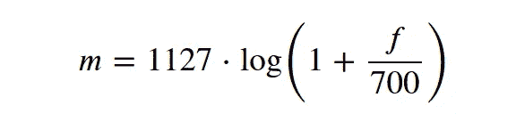
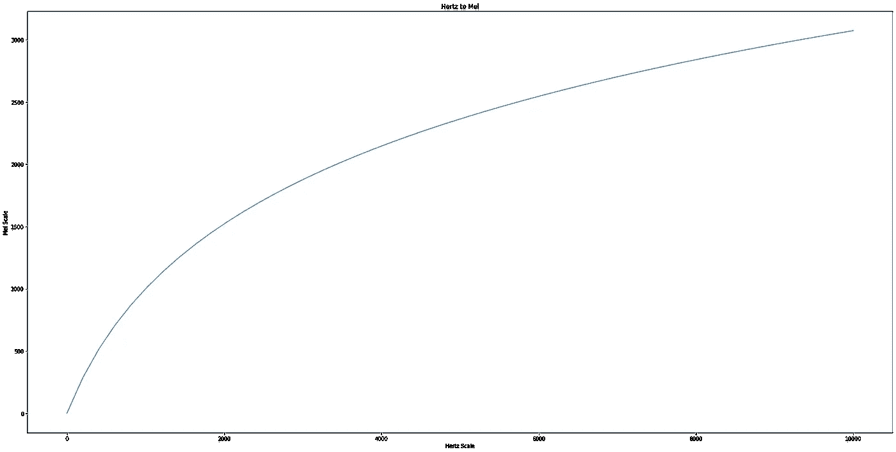
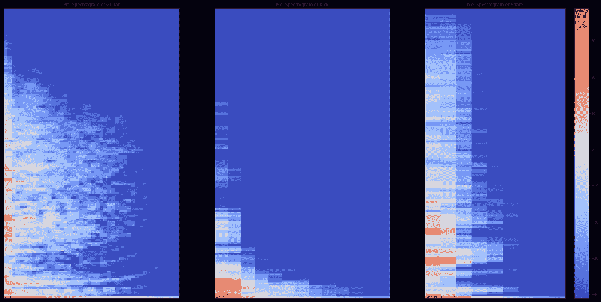
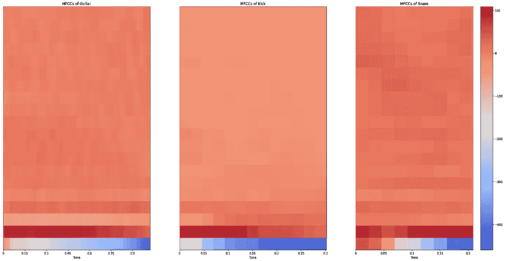

# 从音频中学习:梅尔标度、梅尔频谱图和梅尔频率倒谱系数

> 原文：<https://towardsdatascience.com/learning-from-audio-the-mel-scale-mel-spectrograms-and-mel-frequency-cepstral-coefficients-f5752b6324a8?source=collection_archive---------2----------------------->

## 打破对类似人类的声音表达的直觉

## 相关文章:

*   [学习音频:波形](/learning-from-audio-wave-forms-46fc6f87e016)
*   [从音频中学习:时域特征](/learning-from-audio-time-domain-features-4543f3bda34c)
*   [从音频中学习:傅立叶变换](/learning-from-audio-fourier-transformations-f000124675ee)
*   [从音频中学习:频谱图](/learning-from-audio-spectrograms-37df29dba98c)
*   [从音频中学习:音高和色度图](/learning-from-audio-pitch-and-chromagrams-5158028a505)

到现在为止，我们对光谱图是什么以及如何创建光谱图有了更强的直觉。简而言之，声谱图让我们能够看到音频和这些声波产生的压力，从而让我们看到记录的声音的形状和形式。

本文的主要目的是介绍一种新的光谱图——一种在机器学习领域广泛使用的光谱图，因为它很好地代表了类似人类的感知。

**和往常一样，如果你想查看代码，以及需要跟进的文件，你可以在我的**[**GitHub**](https://github.com/theadamsabra/MediumCode/tree/master/Learning%20From%20Audio)**上找到一切。**

让我们首先从导入所有必需的包开始。

*注:所有图片均由作者创作。*

# 梅尔标度

在讨论 Mel 光谱图之前，我们首先需要了解 Mel 标度是什么以及它为什么有用。Mel 标度是信号频率的对数变换。这种转换的核心思想是，Mel 标度上距离相等的声音被感知为与人类距离相等。这是什么意思？

例如，大多数人可以很容易地分辨出 100 赫兹和 200 赫兹的声音。然而，出于同样原因，我们应该假设我们能够区分 1000Hz 和 1100 Hz，对吗？不对。

实际上，人类很难区分较高的频率，而区分较低的频率更容易。因此，即使两组声音之间的距离相同，我们对距离的感知却不同。这使得 Mel 标度成为音频机器学习应用的基础，因为它模拟了我们对声音的感知。

从赫兹标度到梅尔标度的变换如下:

注意，这里的`log`指的是自然对数(也表示为`ln`)。)如果对数的底数是 10，则方程的系数(1127)会略有变化。然而，在本文中，我们将简单地参考上述等式。

让我们想象一下 Hertz 和 Mels 之间的关系:

正如我们从上面的图表中看到的，频率较低的 Hz Mel 之间的距离较大，而频率较高的 Hz Mel 之间的距离较小，从而加强了其类似人类的属性。

现在我们已经很好地理解了梅尔标度的效用，让我们利用这种直觉来开发梅尔光谱图。

# 梅尔光谱图

Mel 声谱图是在 Mel 标度上可视化声音的声谱图，与频域的[相对，正如我们之前看到的](/learning-from-audio-spectrograms-37df29dba98c)。现在，我知道你在想什么，真的有那么简单吗？是的，它是。

一旦光谱图的直觉建立起来，学习它们的各种味道就变得非常容易。我们所需要的是一个新的框架，在这个框架下我们可以开发光谱图。我将假设你知道这是如何做到的基本属性。开发 Mel 光谱图比它们的定义更容易。

我们是这样做的:

[回忆波形图](/learning-from-audio-wave-forms-46fc6f87e016)中的信封遮罩。此功能创建一个遮罩来生成一个包络，该包络会修剪掉不必要的无用噪声。这使我们能够专注于音频的重要部分。

类似于我们在频谱图中的结果，我们可以看到每个声音是如何根据它实际产生的声音而呈现出独特的形状的。

吉他(长度比脚鼓和小军鼓长)比其他研究过的声音更能向外共鸣。直觉上，这应该是有意义的，因为当一个人弹吉他时，被拨动的琴弦甚至在弹奏后仍在振动，这就是这种共振结构是如何被描绘的。底鼓的声音很低且很快。你可以把踢鼓想象成一种重击。响弦频率很高，虽然向外轻微共鸣(向上共鸣更多)，但比其他声音消散得更快。

# 梅尔频率倒谱系数

Mel 频率倒谱系数(MFCC)最初用于各种语音处理技术，然而，随着音乐信息检索(MIR)领域开始进一步发展为机器学习的附属物，人们发现 MFCC 可以很好地表示音色。

开发 MFCCs 的基本程序如下:

*   从赫兹转换到梅尔标度
*   取音频 Mel 表示的对数
*   取对数幅度并使用离散余弦变换
*   这个结果在 Mel 频率上而不是在时间上创建了一个频谱，因此创建了 MFCCs

如果 ML 问题保证使用 MFCCs，例如自动语音识别或去噪音频，则使用的系数的数量是模型的超参数。因此，MFC 的数量会根据问题的不同而不同。然而，对于这个例子，我们将使用`librosa`的默认 20 个 MFCCs。在`librosa`中，我们可以完成所有这些工作，并在短短几行代码中可视化输出:

# 结论

作为本文的总结，您现在已经了解了:

*   什么是 Mel 音阶，它如何在类似人类的音频解释中发挥作用
*   如何将 Mel 标度映射到光谱图上
*   什么是 MFCC，MFCC 的某些用例，以及如何开发它们

利用 Mel Spectrograms 是处理音频的一种非常好的方式，这样各种深度学习和机器学习问题就可以从记录的声音中学习。

在下一篇文章中，我们将使用我们已经建立的基础更深入地研究音乐信息检索(MIR ),并试图获得更多关于是什么使音乐对人类如此独特的见解。