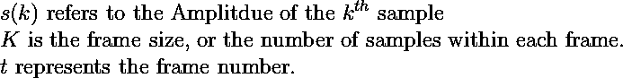
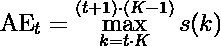
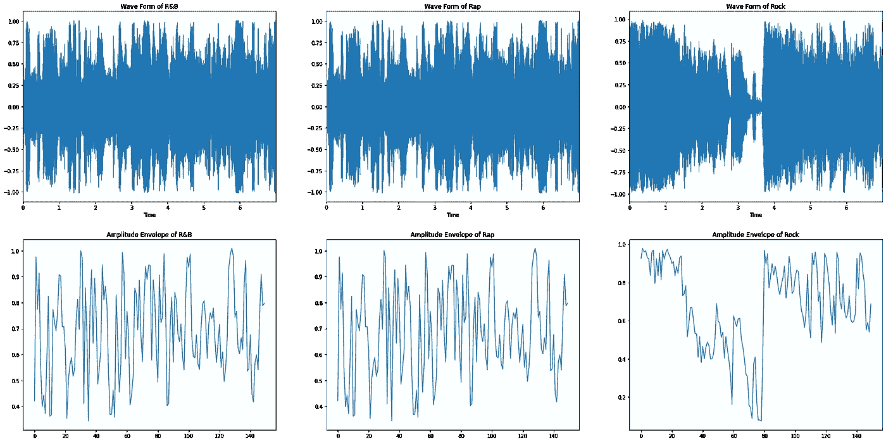
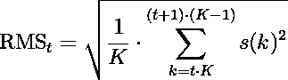
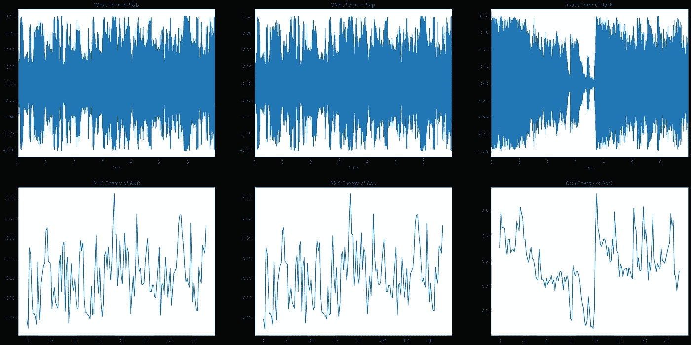
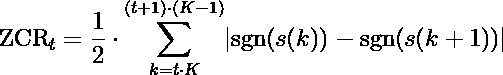
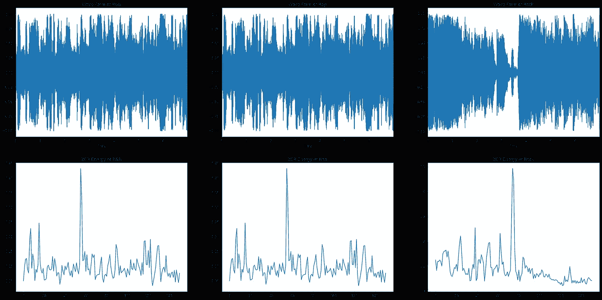

# 从音频中学习:时域特性

> 原文：<https://towardsdatascience.com/learning-from-audio-time-domain-features-4543f3bda34c?source=collection_archive---------12----------------------->

## 在时间上更深入。

# 介绍

虽然深度学习经常利用频域中的过程，但在时域中仍有许多相关特征可以利用，这些特征与许多机器学习技术相关。简而言之，可以提取和分析这些特征来理解波形的属性。当在时域内提取特征时，我们通常会研究每个样本的幅度。我们如何操纵振幅，给我们提供了有关信号的某些细节。

## 相关文章:

*   [学习音频:波形](/learning-from-audio-wave-forms-46fc6f87e016)
*   [从音频中学习:傅立叶变换](/learning-from-audio-fourier-transformations-f000124675ee)
*   [学习音频:声谱图](/learning-from-audio-spectrograms-37df29dba98c)
*   [从音频中学习:梅尔标度、梅尔频谱图和梅尔频率倒谱系数](/learning-from-audio-the-mel-scale-mel-spectrograms-and-mel-frequency-cepstral-coefficients-f5752b6324a8)
*   [从音频中学习:音高和色度图](/learning-from-audio-pitch-and-chromagrams-5158028a505)

开始之前，我想建立一些符号:

在这些例子中，我将详细说明什么是特性，如何正式定义它，并展示如何用 Python 提取特性。在前面的例子中，我们看了乐器的某些声音。然而，在本例中，我们将随机查看不同流派(特别是 R&B、说唱和摇滚)的 7 秒歌曲片段，以便更好地了解这些特征的属性。

出于版权原因，我不能分享有问题的歌曲，但是我会分享歌曲的输出情节和风格。这将允许我们研究流派之间的细微差别。

**一如既往，资源库中的所有代码都可以在** [**上从音频学习 GitHub 资源库**](https://github.com/theadamsabra/LearningfromAudio) **中找到。**

*注:所有数字均由作者提供。*

# 振幅包络

振幅包络(AE)旨在提取每帧中的最大振幅，并将它们串在一起。记住振幅代表信号的音量(或响度)是很重要的。首先，我们将信号分成不同的窗口，找出每个窗口内的最大幅度。从那里，我们沿着时间绘制每个窗口中的最大振幅。

我们可以使用 AE 来进行开始检测，或者检测声音的开始。在各种语音处理应用中，这可能是有人说话或外部噪声，而在音乐信息检索(MIR)中，这可能是音符或乐器的开始。

AE 的主要缺点是对异常值的鲁棒性不如均方根能量，我们将很快对此进行研究。

下面是我们如何将这个概念形式化:

在 Python 中搜索可以完成这项任务的已定义方法时，我没有找到。因此，我们将从头开始定义它，因为这很容易做到。我们将看到的其他特征提取方法已经在`librosa`中定义了，所以我们将在正式定义它们之后使用这些函数。

值得注意的是，在这个`for`循环的设置中，我们没有指定`hop length`。这意味着当我们创建上限和下限时，窗口不会重叠，使得`hop length`和`frame length`相同。

现在，为了可视化和比较不同流派的 AE:

# 均方根能量

如前所述，均方根(RMS)能量与 AE 非常相似。然而，与开始检测相反，它试图感知响度，这可用于事件检测。此外，它对异常值更加鲁棒，这意味着如果我们分割音频，我们可以检测到新的事件(如新的乐器、有人说话等)。)要可靠得多。

均方根能量的正式定义:

如果你熟悉均方根的概念，这对你来说不会太陌生。然而，如果你不是，不要担心。

当我们在波形上加窗时，我们对窗内的振幅求平方，然后求和。一旦完成，我们将除以帧长度，取平方根，这将是该窗口的均方根能量。

要提取均方根，我们可以简单地使用`librosa.feature.rms`。现在，我们想象一下:

从均方根和声发射可以看出，均方根波动不如声发射剧烈。这一特性使得幅度的均方根值对异常值更加稳健。

# 过零率

过零率(ZCR)旨在研究信号幅度在每一帧内改变符号的速率。与前两个特征相比，这个特征很容易提取。

ZCR 的正式定义如下:

对于和平号来说，这一特征与识别撞击声相关，因为它们通常具有波动信号，can ZCR 可以很好地检测到这些信号以及音高检测。然而，该特征通常被用作语音识别中用于声音活动检测的特征。

使用`librosa`，我们可以使用`librosa.feature.zero_crossing_rate`提取 ZCR。

# 结论

到目前为止，您应该已经了解了时间特征提取是如何工作的，如何在各种基于音频的应用中使用它，以及如何自己开发特征提取方法。通过利用特定窗口内的振幅，我们对 MIR 和 ASR 中的各种应用有了深入的了解。感谢您的阅读，如果您有任何问题，请随时提问！