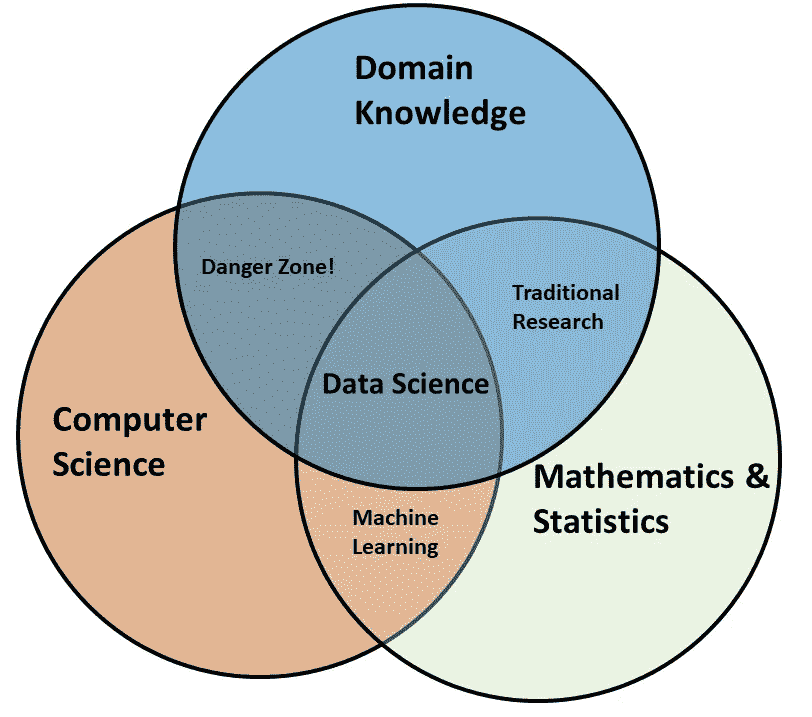
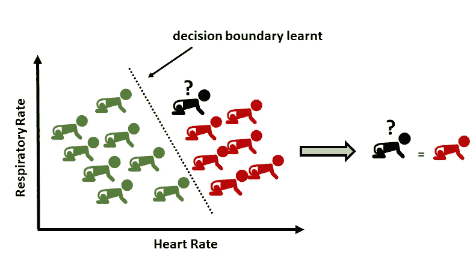
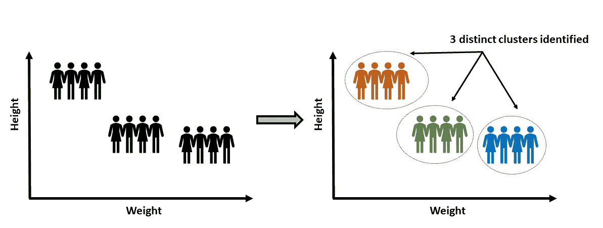
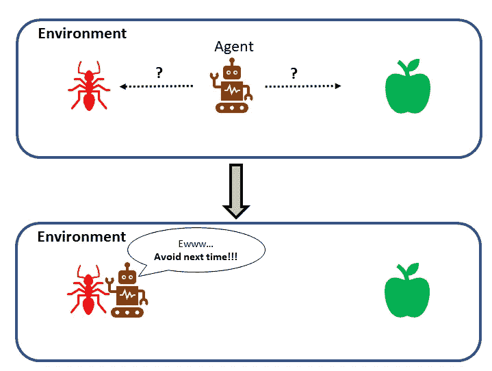

# 从数据中学习:鸟瞰

> 原文：<https://towardsdatascience.com/learning-from-data-a-birds-eye-view-4e47bd53be8f?source=collection_archive---------58----------------------->

## **什么是数据科学？什么是机器学习？穴居人、艾萨克·牛顿和数据科学家讨论从数据中学习的本质:从史前学会生火到 21 世纪的数据科学**

照片由[merit Thomas](https://unsplash.com/@merittthomas?utm_source=unsplash&utm_medium=referral&utm_content=creditCopyText)在 [Unsplash](https://unsplash.com/s/photos/bonfire?utm_source=unsplash&utm_medium=referral&utm_content=creditCopyText) 上拍摄

著名的哈佛教授 Joseph Blitzstein 在他的《概率》一书中指出了新手和专家之间的区别:

新手努力记住大量看似不相关的事实和公式，而专家看到的是一个统一的结构，其中一些原则和想法将这些事实连贯起来

换句话说，专家可以毫不费力地看到全局，即该领域的鸟瞰图。Blitzstein 教授用上面引用的话中蕴含的精神在哈佛和更广阔的世界讲授概率和统计。本文将本着 Blitzstein 的引用精神，为您提供从数据中学习的鸟瞰图，以及它与数据科学和机器学习的关系。我将保持这篇文章相当高的水平，这样任何在这个领域开始的人，或者只是好奇的人，都会发现它很有用。有经验的数据科学家也会发现这篇文章很有用，并对数据科学和机器学习的本质有了新的看法。

为了做好铺垫，我们先来讲一个在这个宇宙中很可能没有发生的跨代篝火会的故事。篝火会议有 3 位特别嘉宾讨论数据科学领域。这三个人是:

一个史前时期的穴居人，艾萨克·牛顿爵士(17 世纪的著名科学家)，一个数据科学家(21 世纪)。会议期间，数据科学家开始向牛顿和穴居人解释数据科学:

**数据科学家:** *数据科学是一个广阔的领域，但简言之，它就是使用模型从数据中学习，并交流这些结果。*

艾萨克·牛顿爵士:这听起来很像我们科学家做的事情。我们通过收集数据来观察世界，然后我们试图用一个假设来解释数据背后的现象。这个假设是我们解释我们观察到的现象的模型。然后，该模型帮助我们进一步构建事物并提供解决方案。

穴居人: *我原以为我会完全不合时宜，但我想补充一些东西。我的祖父告诉我，我们的祖先过去住在茂密的森林里，他们观察到野火，但不知道如何生火或控制火。然后我们观察到摩擦可以生火，这就是我们发明弓钻(* [*一种史前手动工具，用于通过摩擦生火*](https://en.wikipedia.org/wiki/Bow_drill) *)帮助我们生火的原因。我想我们那时在做数据科学。我们观察(生火)，形成我们的模型(摩擦生火)，把那个知识交流提炼出来解决一个问题(如何生火，如何控火)。*

每个人似乎都学到了一些东西，并分享了一些信息:

> ***穴居人:*** *人类已经取得了巨大的进步，虽然他们已经想出了很酷的名字(科学/数据科学)，但他们所做的本质上与我们过去所做的一样(观察、构建、交流)。*
> 
> 牛顿: *这门科学现在是真正的主流，尽管他们现在有了新的名称。*
> 
> ***数据科学家:*** *我从来没有意识到数据科学其实和人类本身一样古老！*

正如序言试图断言的那样，我们人类从数据中学习的想法并不新鲜。自从我们在这个星球上存在以来，我们一直在这样做。我们观察(收集数据)，总结那些观察结果(用一个模型或假设)，然后用那个模型解决问题(例如，预测)。多年来，各种学科已经开发了工具和技术来准确地做到这一点:从数据中学习(一些例子是计算机视觉、数字信号处理、统计信号处理、自适应信号处理、数据挖掘、系统识别、模式识别等)。).所有这一切意味着，所开发的技术和工具的主体已经存在(并在不断发展)很长时间了，而该领域本身(数据科学或机器学习)并不新鲜。然而，与其他术语不同，机器学习(以及现在的数据科学)已经获得了广泛的普及。本质上，它们是一个总括术语，指的是帮助我们从数据中学习的各种工具和技术。

> 所开发的技术和工具已经存在了很长时间(并在不断发展),该领域本身(数据科学或机器学习)并不新鲜。然而，与其他术语不同，机器学习(以及现在的数据科学)已经获得了广泛的普及。本质上，它们是一个总括术语，指的是帮助我们从数据中学习的各种工具和技术。

理解该领域的一个很好的起点是使用文氏图来说明该领域的跨学科性质(这首先由 Drew Conway 提出，多年来已经提出了几个变体):

数据科学维恩图(最初由[德鲁·康威](http://drewconway.com/zia/2013/3/26/the-data-science-venn-diagram)构思，略有改编版本)，图片由作者提供

现在从数据中学习需要的两个重要组成部分是计算机科学(在 Drew Conway 的原始图表中称为黑客技能)和数学与统计。这两个领域共同构成了机器学习的基础，机器学习涉及从数据中学习的工具和技术。当机器学习的知识与该领域的知识相结合来帮助解决问题时(然后作为解决问题途径的一部分进行交流)，这就是数据科学。用简单的英语来说:数据科学就是拥有足够的计算机科学技能来运行可以处理数据的软件代码，足够的数学和统计知识来理解对数据使用什么模型，以及足够的领域专业知识来提出正确的问题和解决问题。

> 用简单的英语来说:数据科学就是拥有足够的计算机科学技能来运行可以处理数据的软件代码，足够的数学和统计知识来理解对数据使用什么模型，以及足够的领域专业知识来提出正确的问题和解决问题。

## 既然你对什么是数据科学有了一个概念，一个有效的问题是:如果数据科学已经存在了很长时间，为什么它现在还受欢迎？

> 数据科学受欢迎的两个关键原因是计算能力和我们现在生成的数据量。

我们现在产生了前所未有的大量数据。据《福布斯》报道，我们仅在两年前就收集了全球超过 90%的数据，而那篇文章现在已经发表两年了！)我们生成的数据量与日俱增。这些数字令人难以置信。[估计有 45 亿人在线(截至 2019 年 6 月)，谷歌、脸书、Youtube 产生了大量数据。据估计，到 2025 年，将有 750 亿台物联网(IoT)设备。](https://seedscientific.com/how-much-data-is-created-every-day/)我想我不需要说服你，我们现在正在产生大量的数据，完全是前所未有的。如果没有别的，想想你每天使用的智能手机(以及你通过数字媒体阅读这篇文章的事实，当你阅读这句话时，它会产生一些关于浏览量和阅读时间的数据)。现在把这个比例扩大到你在 24 小时内的每一次互动，然后扩大到你周围的所有人，你很快就会发现，这些数字是可以理解的，令人难以置信的。

除了数据之外，计算能力也有了惊人的增长(存储、GPU、云计算的成本，以及工具可用性和可访问性的相应提高)。[这是一个很好的资源，可以通过各种数字和图表来更好地了解指数级进展(以及摩尔定律在起作用)。](https://ourworldindata.org/technological-progress)

让我们更深入地了解从数据中学习的概念。划分学习类型的一种方法(也是最流行的方法)是根据可用的反馈类型。使用这种方法的三种学习类型是监督学习、非监督学习和强化学习。

> 三种类型的学习是:监督学习，无监督学习和强化学习。

在**监督学习**中，我们知道输入和输出，我们试图找到一个模型，可以最好地总结输入和输出之间的关系。例如(见下图)，假设我们想要构建一个模型，该模型可以使用婴儿的心率和呼吸频率(即婴儿呼吸的快慢)来告诉我们婴儿是健康的(显示为绿色)还是生病的(显示为红色)。我们使用我们拥有的所有婴儿的所有现有数据，并将其提供给学习模型，包括关于他们是否健康或生病的信息。学习模型然后使用该数据来寻找决策边界。这个决策边界然后帮助我们找出已知心率和呼吸率(但未知健康状态)的婴儿(新数据实例)是生病还是健康。

监督学习:使用现有数据(学习过程中使用的输入和输出)学习决策边界，由作者创建图像

在**无监督学习**中，我们只有用于学习的输入数据，在学习阶段没有提供明确的反馈。无监督学习最常见的应用是聚类。举个例子，假设我们有很多人的身高和体重信息，我们想把他们分成不同的组。我们将使用无监督学习方法来发现数据中的自然分组。

无监督学习:仅使用输入数据识别聚类(在学习阶段没有明确的反馈/输出)，按作者分类的图像

在**强化学习**中，反馈以奖励或惩罚的形式提供，代理学习找到最合适的行动。代理人是一个学习系统，它存在于一个环境中，通过采取行动并因此受到奖励或惩罚而与之互动。

强化学习:代理在环境中采取行动，并根据收到的反馈进行学习。收到的反馈要么是奖励，要么是惩罚

在我结束之前，关于我概述的学习方法有一点需要注意:从特定的数据点学习模型(或函数)是归纳学习(一种自下而上的方法)。一种不同的学习方法是演绎学习(从模型到数据)。将学习类型分为有监督、无监督和强化是机器学习社区在引入该领域时最常用的方法。然而在实践中，迭代方法是典型的，在那里你建立一个模型，看看模型如何执行，然后根据反馈再次做出改变([参见我在数据科学文章中关于咨询的顶级技巧，以了解在实施数据科学项目时更实际的一面](/top-tips-for-consultancy-in-data-science-a-roadmap-6295080a565b))。实际上，这是结合了自下而上的方法(归纳学习)和自上而下的方法(演绎学习)。数据科学实际上是一个迭代过程，因此在解决问题时会使用这两种方法。

总之，这篇文章断言数据科学不是一个新领域，并且(几乎)与我们人类一样古老，给出了该领域现在变得广泛流行的两个最重要的原因(计算能力和现在产生的数据量，这两者在我们的历史上都是前所未有的)，并给出了从数据中学习的类型的鸟瞰图(有监督的、无监督的和强化学习)。我希望你在阅读这篇文章时感到愉快:)。

<https://ahmarshah.medium.com/membership> 