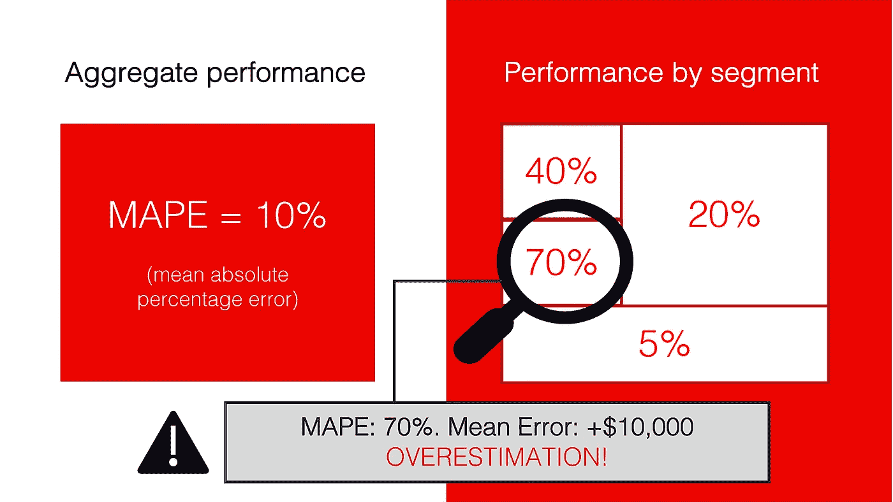
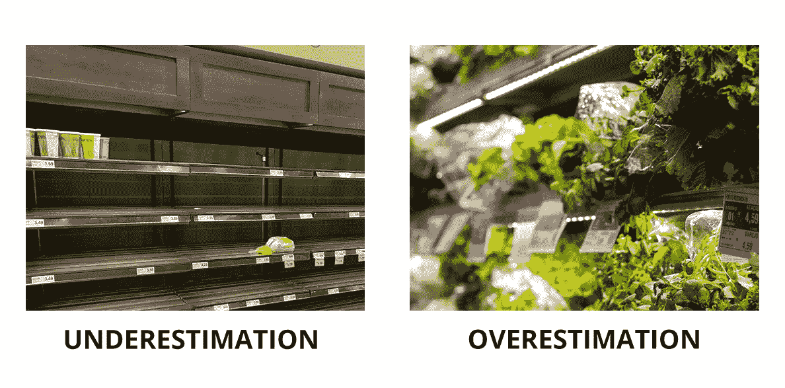
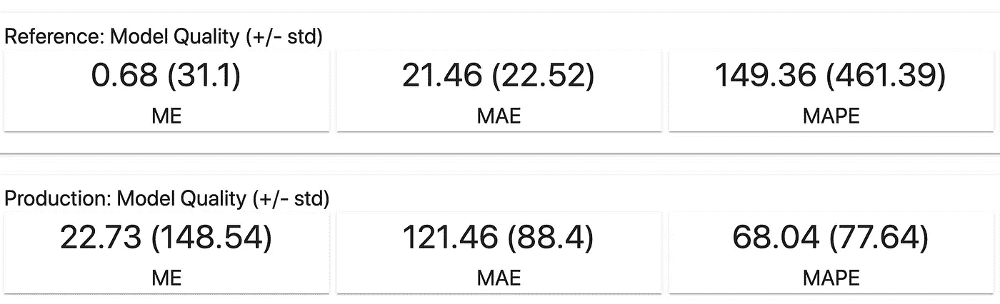
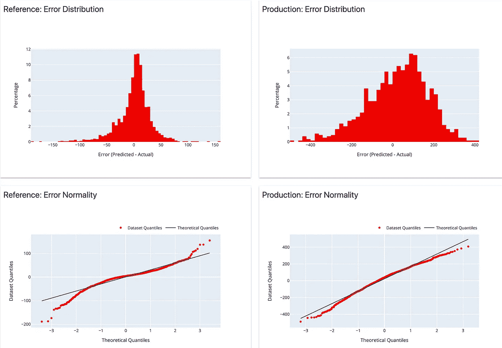
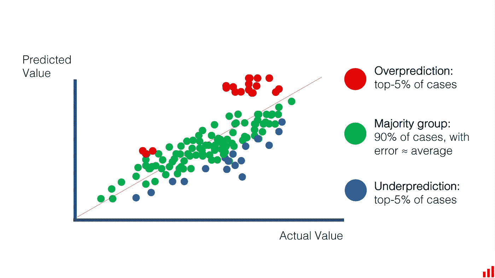
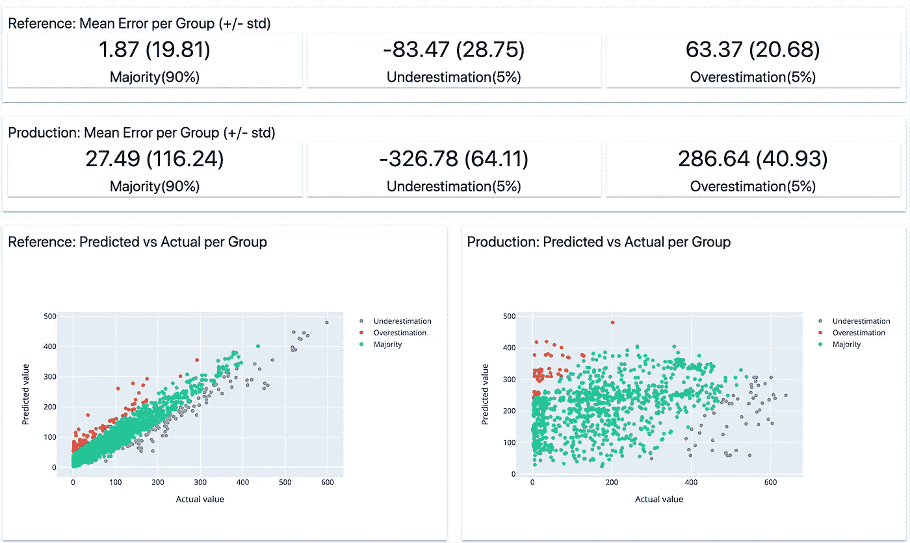
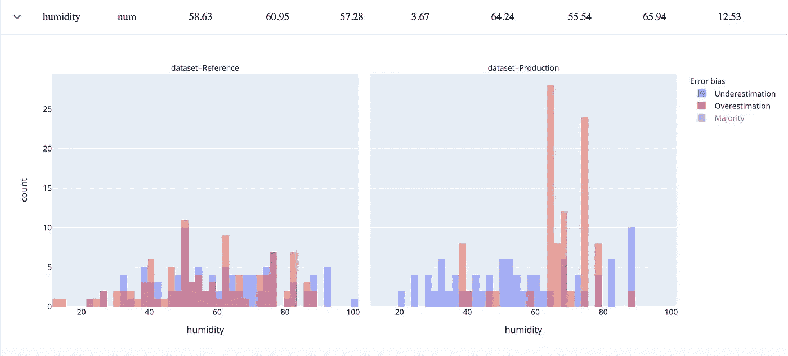
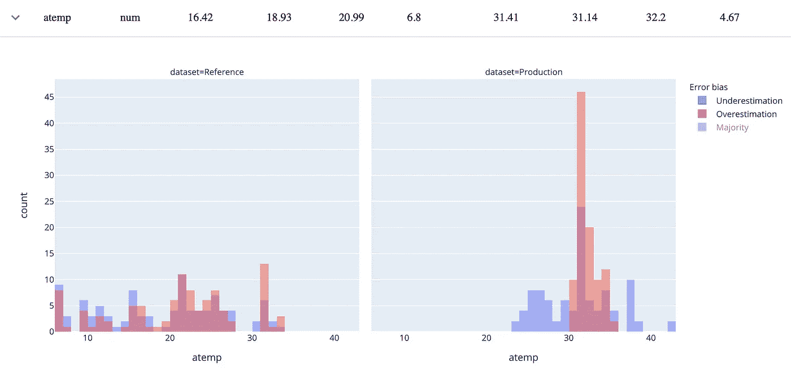
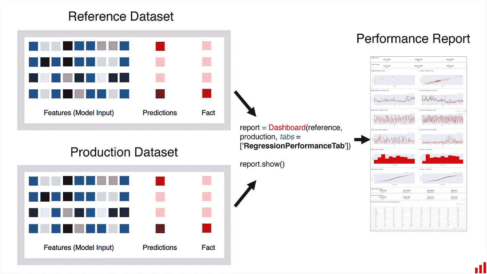

# 从机器学习错误中学习

> 原文：<https://towardsdatascience.com/learning-from-machine-learning-mistakes-how-to-find-weak-spots-of-a-regression-model-2cf3e91306b9?source=collection_archive---------14----------------------->

## [入门](https://towardsdatascience.com/tagged/getting-started)

## 如何找到回归模型的弱点

作者图片

当我们分析机器学习模型性能时，我们通常会关注单个质量指标。对于回归问题，这可能是梅，MAPE，RMSE，或任何最适合问题领域的。

在训练实验中，针对单个指标进行优化绝对有意义。这样，我们可以比较不同的模型运行，并可以选择最好的一个。

**但是当涉及到解决一个真正的商业问题并将模型投入生产时，我们可能需要知道更多一点。**该模型在不同用户群中的表现如何？它会犯什么类型的错误？

在这篇文章中，我将更详细地介绍一种评估回归模型性能的方法。

# 回归误差:太多还是太少？

当我们预测一个连续变量(如价格、需求等)时，误差的常识性定义很简单:我们希望模型预测尽可能接近实际。

实际上，我们可能不仅关心绝对误差值，还关心其他标准。例如，我们捕捉趋势的能力有多强，预测值和实际值之间是否存在相关性，以及我们的错误到底是什么。

**低估和高估目标价值可能会有不同的商业含义。**尤其是在模型输出之上有一些业务逻辑的时候。

假设您正在为一家连锁杂货店做需求预测。一些产品容易腐烂，根据错误的预测交付太多会导致浪费。高估显然要考虑成本因素。

图片作者。来源于 Unsplash 的图片: [1](https://unsplash.com/photos/7n6hNFagvhg) ， [2](https://unsplash.com/photos/gXnvxmqG2lE) 。

**除了经典的误差分析，我们可能想要跟踪这种误差偏斜**(高估或低估的趋势)以及它如何随时间变化。在验证和生产监控过程中分析模型质量时，这是有意义的。

为了解释这个分析误差偏差的概念，我们来看一个例子。

# 评估模型性能

假设我们有一个预测城市自行车租赁需求的模型。(如果你想玩这个用例，这个[自行车需求预测数据集](https://www.kaggle.com/c/bike-sharing-demand/data)是公开可用的)。

我们训练了一个模型，模拟了部署，并将它在“生产”中的性能与它在训练集上的表现进行了比较。

在实践中，我们需要知道这方面的基本事实。一旦我们了解了实际需求，我们就可以计算模型的质量，并估计我们的预测有多远。

**在这里，我们可以看到培训中的参考绩效和当前生产绩效之间的误差**大幅增加。

截图来自[显然是](https://github.com/evidentlyai/evidently)的报道。

**为了更好地理解质量，我们可以看看误差分布。**它证实了我们已经知道的:误差增加了。也有一些高估的偏见。

截图来自[显然是](https://github.com/evidentlyai/evidently)的报道。

事情看起来并不理想，我们想更深入地了解正在发生的事情。我们的业务利益相关者也是如此。为什么会出现这些错误？具体在哪里？再培训是否有助于我们提高质量？我们需要设计新的功能或创建进一步的后处理吗？

这里有一个如何探索它的想法。

# 观察边缘

总体质量指标向我们展示了平均性能。然而，这些都是极端的情况，往往可以给我们提供有用的信息。让我们直接看那里！

**我们可以将我们有高误差的预测分组，并从中学习一些有用的东西。**

我们如何实现这种方法？

让我们来计算每个预测的误差。然后，我们根据错误类型创建两组:

*   **高估。**模型预测值高于实际值的情况。
*   **低估。**模型预测值低于实际值的情况。

让我们通过选择误差最大的 5%的最极端的例子来限制每个组的大小。这样，我们就有了模型高估的前 5%预测和模型低估的前 5%预测。

其余 90%的预测是“大多数”这组的误差应该接近平均值。

这就是我们如何可视化建议的部分。这是我们希望看到的一种情况:大多数预测都接近实际值。分析异常值可以带来有意义的洞察力。

图片作者。

怎么可能有用？

**让我们举一个时间序列的例子。**如果我们建立了一个伟大的模型，并从数据中“学习”了所有的信号，那么误差应该是随机的。应该没有模式。除了少数可能的异常值，误差将接近所有组的平均值。有时稍大，有时小。但平均来说，差不多。

如果数据中有一些有用的信号可以解释错误，情况可能会有所不同。特定群体可能存在较大误差。也可能存在明显的低估或高估倾向。

**在这些情况下，误差可能依赖于特定的特征值。**如果我们能找到并描述比平时更高的情况会怎样？这正是我们想要调查的！

# 发现缺陷

在我们的例子中，我们可以看到，高估和低估组的误差明显高于“多数”组的误差。

截图来自[显然是](https://github.com/evidentlyai/evidently)的报道。

然后我们可以尝试调查和探索新的模式。

为此，我们查看两个 5%组中的对象，并查看它们对应的特征值。如果可以的话，一个特征接一个特征。

**我们的目标是确定特定特征值和高误差之间是否存在关系。为了获得更深的洞察力，我们还区分高估或低估。**

想象一下，我们预测医疗保健成本，并一直高估某些人口统计数据的患者的价格？或者，误差是无偏的但很大，我们的模型在特定的段上失败了？这是我们想要找到的一种洞察力。

图片作者。

我们可以制定一个复杂的(计算量大的)算法来搜索性能不佳的片段。作为一种合理的替代，我们可以逐个特性地进行分析。

我们怎样才能做到呢？让我们画出特征分布和我们的目标需求，并用颜色标记我们犯高错误的例子。

在我们的自行车需求预测用例中，我们已经可以获得一些见解。如果我们绘制“湿度”特征，我们可以注意到，当湿度值在 60 和 80 之间(绘制在右侧)时，我们的模型现在明显高估了需求。

我们在训练数据集中看到了这些值(绘制在左侧)，但是误差是无偏的，并且在整个范围内是相似的。

截图来自[显然是](https://github.com/evidentlyai/evidently)报道。

我们也可以注意到其他模式。例如，温度。该模型还高估了温度高于 30℃时的需求

截图来自[显然是](https://github.com/evidentlyai/evidently)的报道。

我们现在可以怀疑天气发生了变化，新的相关模式出现了。实际上，我们只使用一年中寒冷月份的数据来训练模型。当它进入“生产”阶段时，夏天才刚刚开始。随着新的天气出现了新的季节模式，这是该模型之前未能把握的。

好消息是，通过观察这些图，我们可以看到数据中似乎有一些有用的信号。根据新数据重新训练我们的模型可能会有所帮助。

# 如何对我的模型进行同样的操作？

显然，我们在[开源库中实现了这种方法。要使用它，您应该将模型应用程序数据准备为 pandas 数据框架，包括模型特征、预测和实际(目标)值。](https://github.com/evidentlyai/evidently)

如果您想要将模型在生产中的性能与您的训练数据或过去某个时期的数据进行比较，该库将使用一个或两个数据框架。

图片作者。

回归性能报告将生成一组模型性能图和一个误差偏差表。该表有助于探究特征值与错误类型和大小之间的关系。

您还可以快速对要素进行排序，以找到那些“极端”群体与“大多数”群体看起来不同的要素它有助于识别最感兴趣的片段，而无需逐个手动查看每个特征。

你可以在 [Github](https://github.com/evidentlyai/evidently) 上阅读完整文档。

# 这个什么时候有用？

我们相信这种分析在您的模型生命周期中会有不止一次的帮助。您可以使用它:

1.  **对模型测试的结果进行分析**。例如，一旦您在离线测试中或者在 A/B 测试或影子部署之后验证了您的模型。
2.  **对生产中的模型进行持续监控。**您可以在每次运行批处理模型时这样做，或者将其安排为常规作业。
3.  **决定模特再培训。查看报告，您可以确定是时候更新模型了，还是重新培训会有所帮助。**
4.  **在生产中调试模型。**如果模型质量不合格，您可以找出模型表现不佳的部分，并决定如何解决它们。例如，您可以为表现不佳的细分市场提供更多数据，重建您的模型或在其上添加业务规则。

如果想要一个实际的例子，这里有一个[教程](/how-to-break-a-model-in-20-days-a-tutorial-on-production-model-analytics-25497e2eab9c)关于调试机器学习模型在生产中的性能:“如何在 20 天内攻破一个模型”。