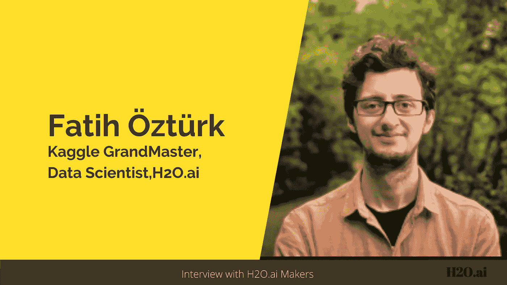
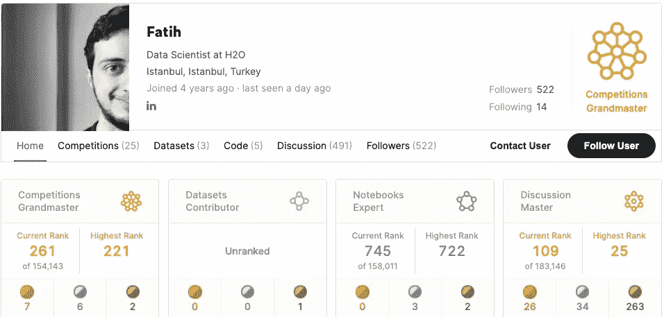
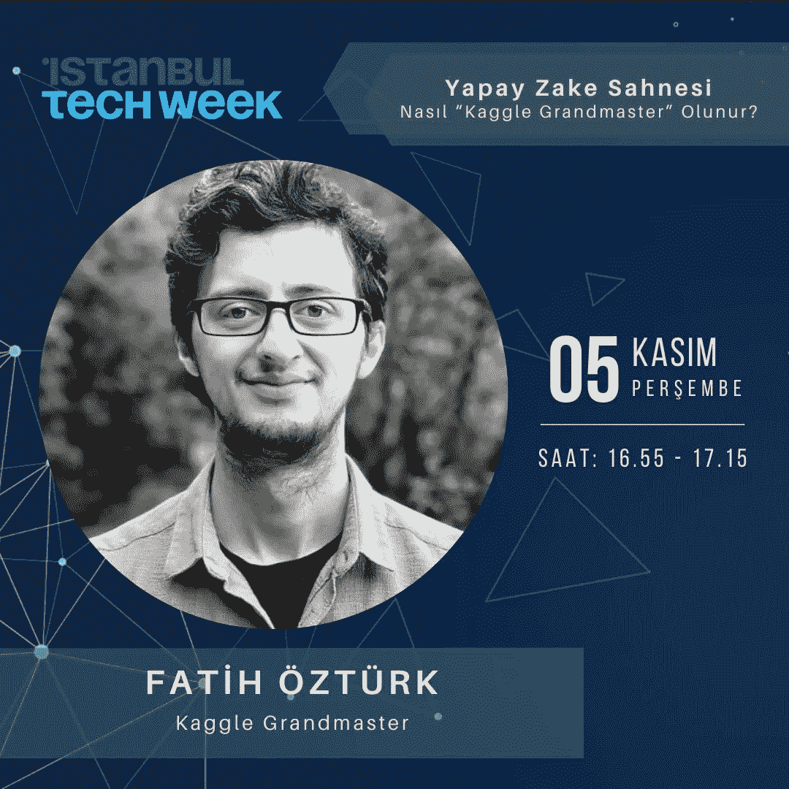
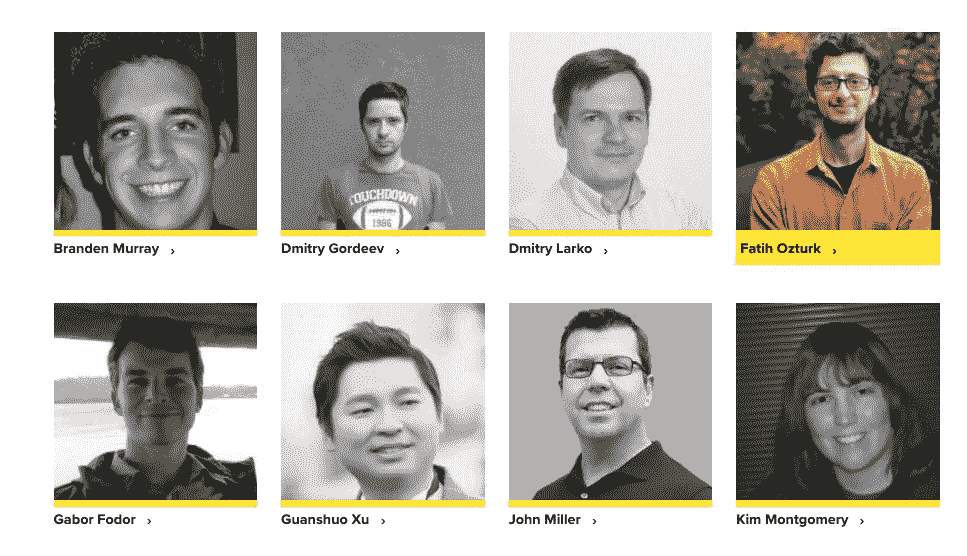
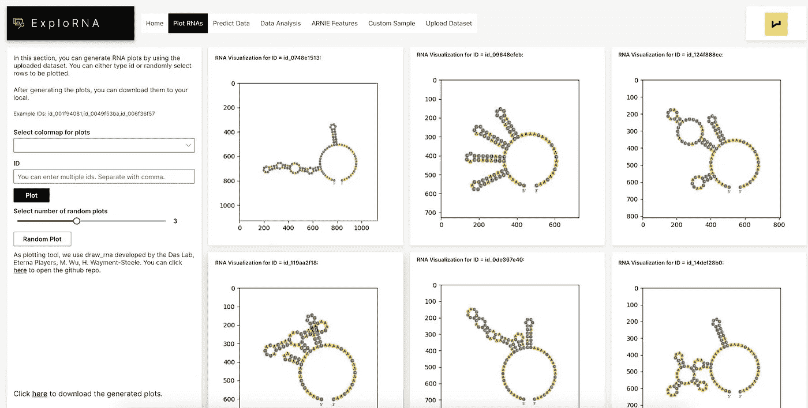

# 这位土耳其大师说，在 Kaggle 上，向他人学习是成功的必要条件

> 原文：<https://towardsdatascience.com/learning-from-others-is-imperative-to-success-on-kaggle-says-this-turkish-grandmaster-d8b5bf28ac87?source=collection_archive---------24----------------------->

## 与 Fatih oz Turk 的对话:数据科学家和 Kaggle 竞赛大师。

作者图片

在这一系列采访中，我在 [H2O.ai](https://www.h2o.ai/) 展示了一些知名数据科学家和 Kaggle 大师的故事，他们分享了自己的旅程、灵感和成就。这些采访旨在激励和鼓励那些想了解成为一名 Kaggle 特级大师的人。

在这次采访中，我将分享我与**法提赫·厄兹图尔克的互动。**他是 **Kaggle 竞赛的‘特级大师**和**数据科学家**at[H2O . ai。Fatih 以优异成绩获得伊斯坦布尔](https://www.h2o.ai/)[博阿齐齐大学](http://www.boun.edu.tr/)工业工程学士学位。在加入 H2O.ai 之前，他在 UrbanStat 担任数据科学家。Fatih 大约四年前加入 Kaggle，并赢得了七枚金牌，包括一枚单人金牌。他也是讨论层的主要成员。

*在这次采访中，我们将更多地了解他的学术背景、他对 Kaggle 的热情以及他作为数据科学家的工作。以下是我与 Fatih 对话的摘录:*

你有工业工程的背景。是什么促使你选择数据科学作为职业？

*:我在工业工程领域的主要工作是运筹学、供应链和统计学。除了这些主课，我们还可以根据自己的兴趣选择具体的选修课。在我最后一个学期，我选修了“数据挖掘”这门课。选择这个选项的原因之一是它的受欢迎程度。在学习数据挖掘的时候，我第一次接触到随机森林、分类、预测事物等概念。我发现这很有趣，类似于玩一些竞技游戏。我意识到我的激情在于数据分析领域，我立即知道我毕业后必须从事什么领域。*

*你和 Kaggle 的幽会是如何开始的，是什么让你在你的大师之旅中一直保持动力？*

**

*[法蒂赫的卡格尔轮廓](https://www.kaggle.com/fatihozturk)*

****法提赫*** :我的第一份工作是在一家科技初创公司做**的初级数据科学家**。我是那里唯一的数据科学家，我们只为那里的保险相关公司工作。加入公司几个月后，我的老板在 kaggle 上发现了 [**Porto Seguro 竞赛**](https://www.kaggle.com/c/porto-seguro-safe-driver-prediction) ，他问我是否可以看看，因为这是一个保险用例。我对我在比赛中的发现很满意，因为我看到人们分享了很多。所以在那场比赛中，我意识到两件主要的事情:*

*   *当我在内核和讨论的时候，我的学习率要高得多。*
*   *我好胜的一面被触发了，我了解到我非常喜欢竞争。*

*在 kaggle 上竞争和学习是齐头并进的。这是我参加任何比赛的主要动机。成为大师或特级大师只是这个过程的自然结果。*

***能告诉我们一点你最喜欢的 Kaggle 比赛吗？***

****Fatih*** :我喜欢 [**房屋信用违约风险**](https://www.kaggle.com/c/home-credit-default-risk) 比赛。数据集没有完全匿名，因此有很大的空间进行特征工程。试图理解竞争的领域，然后能够生成有用的功能是有趣的。此外，我们的团队有一个很好的验证策略，最终在私人排行榜上非常成功。我们从公共排行榜的第 29 位上升到了私人排行榜的第 10 位。*

*你通常如何处理一个难题？*

****Fatih* :** 对于任何比赛，我的第一个尝试总是有一个可靠的验证方案在我这边。有一个良好的相关 CV-LB 关系就是一切。那么如何实现这个呢？这主要取决于正确的探索性数据分析(EDA)。弄清楚测试集与训练集有什么不同(如果有)，然后在您的验证方案中模仿这一点是一个很好的起点。除了用图和数字做 EDA，我还检查这方面的对抗性验证分数。*

*有了一个好的验证策略后，我会专注于寻找没有在公共论坛上分享的有用的东西，因为拥有不同的技巧对于最终获得好的排名至关重要。*

> *对于任何竞争，我的第一个尝试总是有一个可靠的验证方案在我这边。有一个良好的相关 CV-LB 关系就是一切*

*你能让我们先睹为快吗，比如你最喜欢的编程语言、IDE、算法等等*

****法提赫* :** 我使用 Python，并且大部分时间都在使用 JupyterLab。我也有一个 [Google Colab pro](https://colab.research.google.com/signup) 账号来访问 GPU，因为我没有本地账号。我发现这是一项不错的投资，因为我们在 Kaggle 笔记本上每周的 GPU 时间有限。*

*我最喜欢的建模算法是 Lightgbm。我仍然认为这是一个非常有效和生产友好的算法，因为它很容易调整，也能很快得到足够好的分数。*

*你经常在 meetup 活动中发言。土耳其及其周边地区的数据科学前景如何？*

**

*Fatih 是伊斯坦布尔技术周活动的发言人之一*

****Fatih*** :我发现在土耳其人们对数据科学的兴趣相当值得注意，而且每天都在增加。越来越多的学生选择计算机科学作为他们的专业，而不是其他工程专业。这种流行的主要原因是数据科学在每个行业的整体采用。*

*我在 kaggle 比赛中遇到的土耳其人的数量也在快速增长。这是温暖人心的，因为几年前不是这样。类似的情况也反映在 meetup 社区中。活动的数量和参与的学生人数也在迅速增加。最近，很多土耳其公司开始在 Kaggle 上举办同类比赛。*

***作为 H2O.ai 的数据科学家，你的角色是什么，你在哪些具体领域工作？***

**

*Fatih 和 H2O.ai 的其他 kaggle 大师们*

****Fatih* :** 我参与了 POCs 和其他客户相关的项目，帮助他们从[无人驾驶 AI](https://www.h2o.ai/products/h2o-driverless-ai/) 中受益更多。此外，我通过 [Wave 框架](https://www.h2o.ai/hybrid-cloud/consume/)开发新应用，并用新数据集测试无人驾驶人工智能。*

**

*由 Fatih 创建的 ExploRNA wave 应用程序。你可以在这里阅读更多关于 app [的内容。](https://www.kaggle.com/c/stanford-covid-vaccine/discussion/215120)*

***数据科学领域正在快速发展。你是如何设法跟上所有最新发展的？***

****Fatih*** :我认为社交网络是其中的关键。仅仅靠你自己是几乎不可能保持最新的。然而，如果你有合适的空闲频道，并且有一个有意义的 LinkedIn feed，那么关注新闻就更容易了。。除此之外，参加 kaggle 竞赛和定期关注竞赛论坛是另一个有用的资源。*

*2021 年你打算如何度过在 kaggle 的时光？你想达到什么特殊的里程碑？*

****法提赫* :** 我想参加 2021 年的计算机视觉比赛。我很高兴能在这些比赛中作为单人选手进入前 50 名。当然，作为一个团队获得金牌也是很棒的。😃*

***对于刚刚开始或希望开始数据科学之旅的数据科学有志者，有什么建议吗？***

**:我建议不要太担心诸如从哪里开始、学习哪些课程、学习哪些工具等问题。与其一开始就处理所有这些问题，不如直接投入到一个数据科学项目或竞赛中，学习他人的代码。这是我早期通过弄脏自己的手来提高自己的方法。分析其他人的代码，并提出类似这样的问题——这段代码在这里是做什么的？作者为什么这样编码？它对这个项目/比赛有什么帮助？等等是让我磨练技能的一些方法。下一个任务是回答这些问题。人们既可以在网上寻找答案，也可以利用论坛。**

**Fatih 的 Kaggle 的成就反映了他对解决问题的热情和对努力工作的一贯爱好。他如何从工业工程过渡到数据科学，然后在两年内获得 Kaggle 特级大师的头衔，这是值得称赞的。**

# **阅读本系列的其他采访:**

*   **[*Rohan Rao:数据科学家从数独到 Kaggle 的旅程*](/a-data-scientists-journey-from-sudoku-to-kaggle-120876b7fa33)**
*   **[*Shivam Bansal:数据科学家，负责 Kaggle 上的“有益的数据科学”竞赛。*](/the-data-scientist-who-rules-the-data-science-for-good-competitions-on-kaggle-ab436595a29f)**
*   **[*见见 Yauhen:第一位也是唯一一位来自白俄罗斯的 Kaggle 特级大师。*](/meet-yauhen-the-first-and-the-only-kaggle-grandmaster-from-belarus-ee6ae3c86c65)**
*   **[*苏达莱·拉杰库马尔:对数字的热情是如何将这位机械工程师变成了一位围棋大师*](/how-a-passion-for-numbers-turned-this-mechanical-engineer-into-a-kaggle-grandmaster-8b1ae218afc)**
*   **[*加博·福多尔:卡格尔世界“白鲸”的励志之旅🐋*](/the-inspiring-journey-of-the-beluga-of-kaggle-world-5409e740a21b?sk=a500e2014feb175eae520931ff43b419)**
*   **[*在 Kaggle*](/meet-the-data-scientist-who-just-cannot-stop-winning-on-kaggle-dfc0e6fe88f8?sk=bd58ca871ab26ab13917b338020c4a0c) 上遇见无法停止胜利的数据科学家**