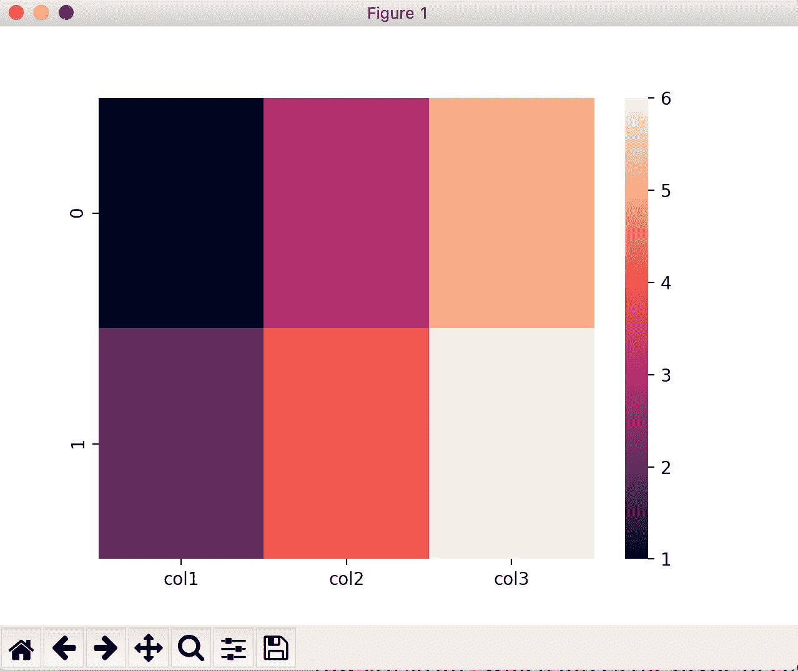
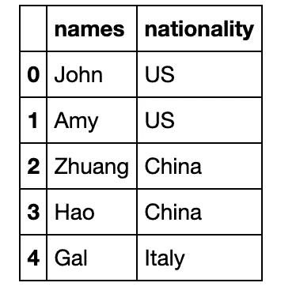
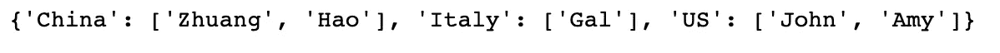
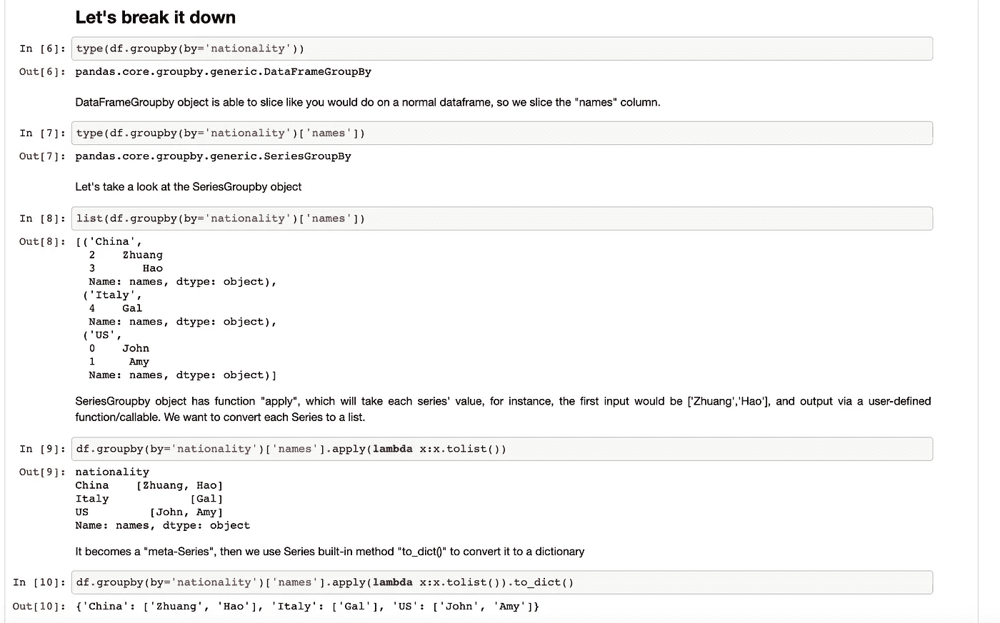

# 通过例子学习熊猫

> 原文：<https://towardsdatascience.com/learning-pandas-by-examples-8105771c723c?source=collection_archive---------19----------------------->

## Python 熊猫库的有用、有趣、鼓舞人心的用法概要


由[托尔加·乌尔坎](https://unsplash.com/@tolga__?utm_source=medium&utm_medium=referral)在 [Unsplash](https://unsplash.com?utm_source=medium&utm_medium=referral) 拍摄的照片

来说说熊猫套餐吧。

当你浏览 Stackoverflow 或者阅读《走向数据科学》上的博客时，**你有没有遇到过一些超级优雅的解决方案(可能只有一行)，可以代替你的几十行代码(对于循环、函数)**？

我经常遇到这种情况，我经常想，“哇，我不知道这个功能可以这样使用，真是太神奇了！”不同的人肯定会有不同的兴奋点，但我敢打赌，如果你曾经在应用数据科学领域工作过，这些时刻一定会发生在你身上。

然而，令我困惑的一件事是，没有一个地方或储存库来存储和记录这些鼓舞人心的时刻和相关的现实世界的例子。**这就是为什么我想主动构建一个 GitHub 知识库，专注于收集这些有趣/令人印象深刻的用法/例子，特别是在 Pandas 库中，让你想大声喊出来**！

以下是存储库的链接:

[https://github.com/frankligy/pandas_by_examples](https://github.com/frankligy/pandas_by_examples)

现在我将向您展示发生在我生活中的两个具体例子，以及为什么我认为拥有这样一个知识库会有所帮助。

# 我的熊猫 60%的编码错误归因于忽略了“dtype”

`dtype`是一个特殊的对象，即每个熊猫数据框的列、系列和索引对象的属性，它通常是自动确定的，所以我通常会忘记这个隐藏属性的存在，这导致了很多意想不到的错误。

例如，让我们创建一个数据框:

```
df = pd.DataFrame({'col1':[1,2,'first'],
                   'col2': [3,4,'second'],
                   'col3': [5,6,'third']})
```

然后我删除了第三行，因为它们都是字符串，我只需要数值来绘制热图。

```
df = df.iloc[:-1,:]
```

现在，我可以使用`df`数据框绘制热图:

```
import seaborn as sns
sns.heatmap(df)
```

我们得到了一个错误:

```
TypeError: ufunc 'isnan' not supported for the input types, and the inputs could not be safely coerced to any supported types according to the casting rule ''safe''
```

你可能想知道这是为什么？我们来看看`df`的`dtype`:

```
df['col1].dtype# dtype('O')
```

它是“object”类型，而不是“int ”,即使该数据框中的所有值都是整数。**原因是 dtype 是从原始数据框中推断出来的(第三行是一个字符串，强制每一列的 dtype 变成“object”)，你去掉最后一行，但是 dtype 不会自动改变**。

我们将 dtype 更改为 int 并再次绘制热图，

```
df = df.astype('int')
```



输入数据框列应为数字

所以我推测这是一个容易陷入的陷阱，值得在某个地方强调一下，我创建了一个[的例子](https://github.com/frankligy/pandas_by_examples/blob/main/examples/3_Learning_dtype.ipynb)来告诉你在使用熊猫时指定`dtype`的重要性。这只是一个超级基本的例子，但包含了关注`dtype`变量的关键思想。

[https://github . com/frank ligy/pandas _ by _ examples/blob/main/examples/3 _ Learning _ dtype . ipynb](https://github.com/frankligy/pandas_by_examples/blob/main/examples/3_Learning_dtype.ipynb)

让我们看另一个例子:

# 如何将两列转换成一个字典？

这是我最近遇到的一个真实世界的例子，在这里我把这个问题简化了一点。想象我们有一个这样的数据框:



我们拥有的数据框架

我想要一个像这样的 python 字典:



我想要的 Python 字典

为了描述这个问题，在真实环境中，它实际上是一个有几十万行的巨型数据帧，因此我们肯定希望有一个自动解决方案来实现这一点。

您只需使用一行代码就可以实现:

```
df.groupby(by='nationality')['names'].apply(
**lambda** x:x.tolist()).to_dict()
```

它是如何工作的？我在我的 [GitHub 示例](https://github.com/frankligy/pandas_by_examples/blob/main/examples/5_columns2dict.ipynb)中有一个逐步说明，

[https://github . com/frank ligy/pandas _ by _ examples/blob/main/examples/5 _ columns 2 dict . ipynb](https://github.com/frankligy/pandas_by_examples/blob/main/examples/5_columns2dict.ipynb)

我把它粘贴在这里:



将两列转换为字典

# 结论

这篇文章的真正目的是让你明白为什么我要创建这样一个[库](https://github.com/frankligy/pandas_by_examples)来存储 Python Pandas 库中那些令人印象深刻的用例。我会不断更新和添加我在日常工作中遇到的例子。如果您同意我的倡议，如果您也愿意为此做出贡献，我将不胜感激，只需简单地提交一个 pull 请求，这样我就可以将您的示例合并到存储库中。我希望这个知识库能够成为编程初学者和中级数据科学家每天都喜欢查看的地方，并能给他们带来方便。

存储库链接:

[https://github.com/frankligy/pandas_by_examples](https://github.com/frankligy/pandas_by_examples)

感谢阅读！如果你喜欢这篇文章，请在 medium 上关注我，非常感谢你的支持。在我的 [Twitter](https://twitter.com/FrankLI55917967) 或 [LinkedIn](https://www.linkedin.com/in/guangyuan-li-399617173/) 上联系我，也请让我知道你是否有任何问题或你希望在未来看到什么样的熊猫教程！