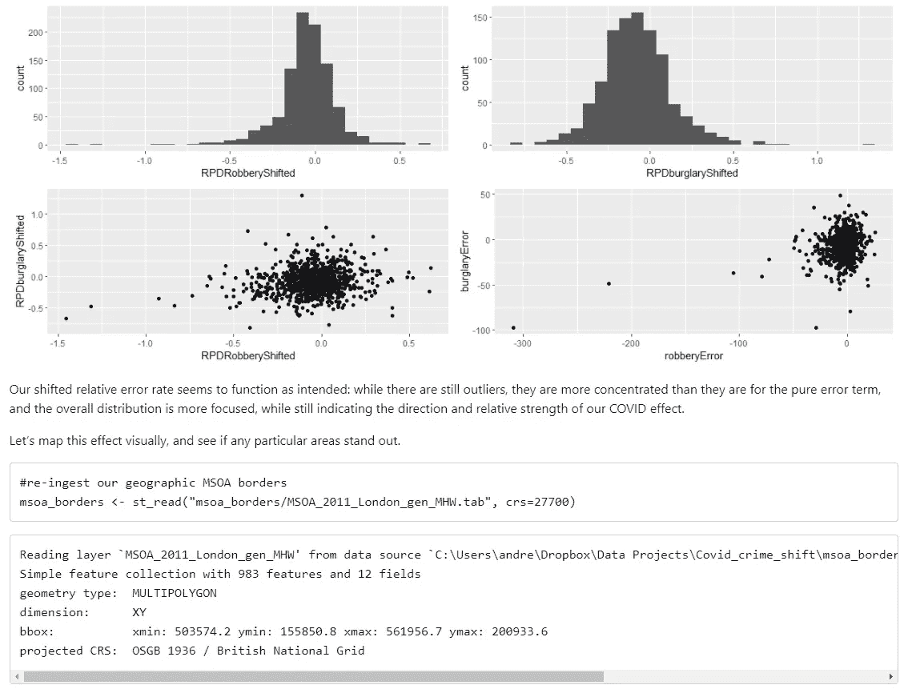

# 从 Python 中学习 R——我希望一周前就知道的 5 课

> 原文：<https://towardsdatascience.com/learning-r-from-python-5-lessons-i-wish-i-knew-a-week-ago-78e312aca37a?source=collection_archive---------7----------------------->

## (或者，为什么我希望我读过这些文件)

经过很多很多的抗争，上周我终于决定是时候完全停止使用 Python 了，并且弄清楚我一直听到的这些 R 废话。关于哪一个最好的文章数不胜数，所以我不会在这里重复——足以说你不能在两者中做任何事情——但是有一些小问题，我希望我在开始之前就已经知道了。相反，我做的是一头扎进去，写了一些非常非常乱的代码，探索在伦敦 COVID 封锁下入室盗窃和抢劫是如何转移的。

记住这一点，下面是我希望在开始编码之前知道的 5 件事。希望你会发现它很有用，不会像我一样对其中一些感到沮丧。

由[凯利·西克玛](https://unsplash.com/@kellysikkema)在 [Unsplash](https://unsplash.com/photos/tQPgM1k6EbQ) 上拍摄的照片

# 1.Python 是宽泛的，R 是“专注的”——所以使用核心工具，不要担心

Python 是所有人的一切——它是一种语言的庞大生态系统，可以做任何事情，从训练你的神经网络到托管你的网站到驱动你的机器人。

r 是*而不是*那个。虽然它可以通过正确的推动来建立你的网站，但它首先是一个研究和分析的工具……这意味着你在探索 Python 时面临的许多选择在 r 中是不存在的。这是一个*祝福*。你将和其他人一样使用同样的工具，而他们*只是工作*。

你见过多少没完没了的帖子问什么是最好的 Python IDE？你应该用康达还是皮普？蟒蛇核心还是康达锻造？有一百万个问题，很少有一个“正确”的答案，因为这取决于你在做什么。

在 R 中，没有这些:您将下载现成的 R(有一个例外，我稍后会谈到)，并且您将运行 R studio。一切都会好的，而且会很棒。当你导入一个库时——有一个图形界面和一切——你将全局导入。90%的情况下，你会没事的。

r 笔记本使代码和漂亮的可视化结合变得容易(图片由作者提供)

R 中的核心工具集是主动维护的、免费的、为研究而构建的，非常棒。从那里开始就可以了。

## 2.你可以在 Python 中搜索任何东西——你可能需要更广泛地搜索 r。

如果你和我一样，你会在谷歌上搜索很多你知道应该存在的函数*、*，但是你不太记得它的代码。“只删除第一个重复的行”、“删除列名中的空白”……你知道，你可能*应该*只需要弄清楚，但是从第一个堆栈溢出帖子中抓取一些快速代码更容易。在 Python 中，会有 100 个帖子符合你的确切需求。R 中可能没有 100，有时你可能根本找不到。

很难衡量这一点——[毕竟，R 的栈溢出问题几乎是熊猫的两倍](https://stackoverflow.com/questions/tagged/r)——但我发现快速获得非正式答案比我想象的要难得多。对于教程来说也是如此:在 Python 中有数以千计的中型帖子带你通过[训练随机森林，而在 R 中则少得多(尽管这部分归因于搜索单个字母有多难)。](https://medium.com/search?q=random%20forests%20Python)

我怀疑这反映了人们的学习方式:R 是由学者和统计学家教授的，而 Pandas 是由像我这样的半程序员黑客爱好者选择的(无意冒犯任何一方)。后者生活在谷歌上，前者有图书馆、教室和课本。

好消息是，这些教科书通常是免费的，在线的，并且管理和策划得很好——事实上，甚至有完整的课程可以使用它们的内容，有些还可以作为互动教程。因此，花一个小时，浏览一遍教程，并考虑*在深入研究堆栈溢出问题之前阅读一本真正的书*。你可能不会后悔。我在下面留下了一个很棒的资源列表。

## 3.哦对了， [Tidyverse](https://www.tidyverse.org/)

我知道，我知道…我说过你不需要担心工具集，但是我撒了一个小小的谎:Tidyverse 是证明规则的例外。

Tidyverse 是一个精心管理、维护良好的库生态系统，用于数据科学和 R 中的操作。事实上，如果您正在任何地方学习 R，您可能已经在学习 Tidyverse 了——最著名的 R 工具，如 ggplot2、dplyr 和 tibble，它们使数据操作和华丽的可视化变得轻而易举，都在 Tidyverse 中，所以不用太担心。如果你来自 Python，你可能想知道这些是否值得学习…不要担心。Tidyverse 很棒，它是必不可少的，而且你可能正在学习它。

## 4.笔记本还是很牛逼，但是有点不一样了

记得我说过你会喜欢 RStudio 吗？如果你在 Jupyter 笔记本上工作，那就更是如此了，因为 R Markdown 太棒了，稍加调整，RStudio 就是 Jupyter Lab 的绝佳竞争对手。

一旦你让 r studio[打开一个笔记本，并在窗口](https://rmarkdown.rstudio.com/lesson-10.html)中设置预览，你可能会发现一个非常熟悉的界面。你可以在 Markdown 中写笔记，添加图片，等式，每个单元格执行…你在 Jupyter 中做的任何事情都可以很好地翻译。您甚至可以在其中安装一个方便的文档查看器(这是我推荐的)。

有一些差异需要一些时间来适应。r 接受各种各样的格式，有些会在最后把你的文档“编织”在一起——可以随意选择，但是默认的 html_notebook 可能就可以了。被执行的代码也比我希望的更容易被删除，这需要一些时间来适应。根据您的需要，您可能想要探索缓存选项。

在某些方面，它也比*好得多*。R markdown 使得[隐藏单元格的特定位](https://bookdown.org/yihui/rmarkdown/html-document.html#code-folding)，添加目录，以及生成漂亮的 HTML 或 PDF 文档变得如此容易。甚至还有一些很好的仪表板和网站功能。

在这种事情上，R 再次奖励一点耐心。阅读 RMarkdown 文档，了解更多选项，享受您的笔记本电脑。添加目录和一些参考资料。是*可爱的*。

## 5.如果你只是一头扎进去，那也很好

尽管我遇到了很多麻烦，但从功能和结构的角度来看，R 和 Pandas 非常相似。敲击 Ctrl+Shift+Enter 和 Ctrl+Enter 永远不会让我停止困惑，当我发现决定“%>%”应该是一个基本代码段的人时，我可能不得不扔给他们一些东西——这到底意味着什么——但是如果你对 Python 很熟悉，你所知道的所有基本工作流和原则将会很好地翻译*preeetty*……当他们不喜欢时，去阅读文档。

希望至少其中一些是有用的！我当然不会为了日常的数据争论而转到 R，但是学习一个我觉得不再那么陌生的完整的 near 工具集非常有趣。愿你的笔记本编织得比我的快！

下面我整理了一些我发现并依赖的资源。如果你觉得它们有用，请看看作者/买他们的书/给他们发一封漂亮的电子邮件——它们都是非常宝贵的。

# 我觉得很棒的资源

## 普通 R 和犯罪

[R 代表数据科学](https://r4ds.had.co.nz/index.html) - *Garrett Grolemund 和 Hadley Wickham*

[R 代表犯罪学家](https://maczokni.github.io/R-for-Criminologists/) - *瑞卡·索利莫希*

[RStats-Ed 回购](https://github.com/rstudio-education/rstats-ed)

[数据营替代方案](https://delabj.github.io/datacamp_alternatives/)

## 制图和空间建模

[数据科学家的空间建模- *Francisco Rowe 和 Dani Arribas-Bel*](https://gdsl-ul.github.io/san/)

[犯罪地图在 R - *雷卡·索利莫希和胡安乔·麦地那*](https://maczokni.github.io/crime_mapping_textbook/)

[犯罪绘图课程- *马特·阿什比*](https://github.com/mpjashby/crimemapping/)