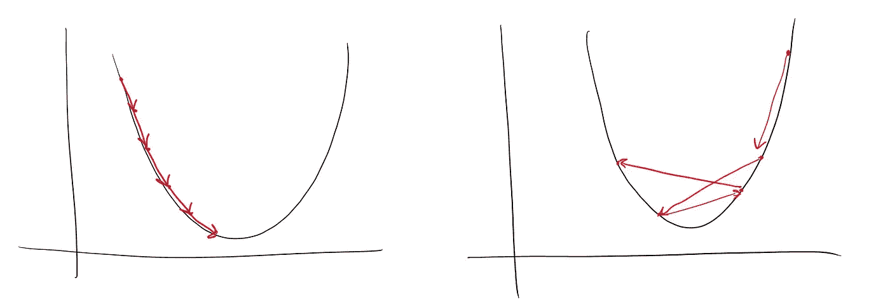
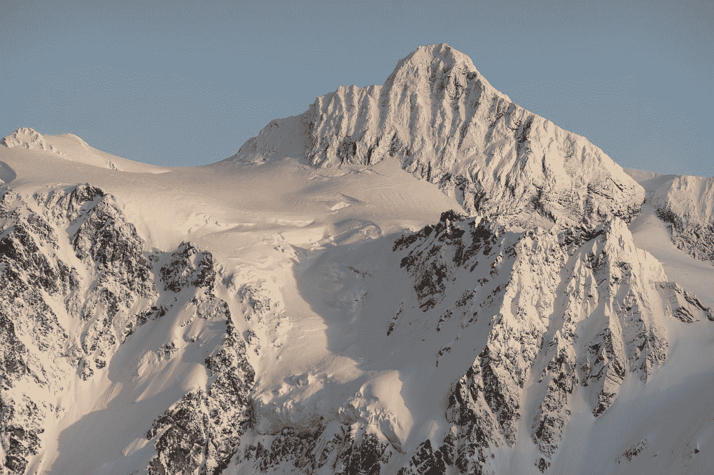
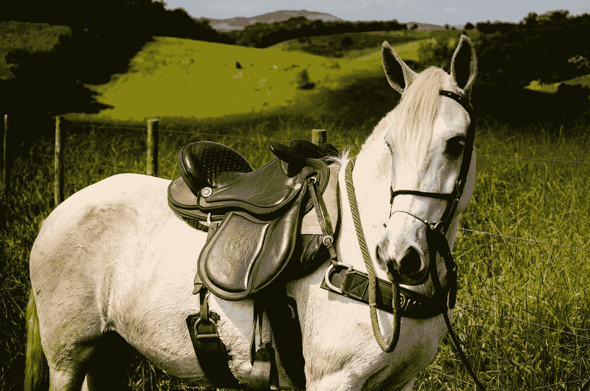

# 深度学习模型的学习率

> 原文：<https://towardsdatascience.com/learning-rates-for-deep-learning-models-e500efe09f2e?source=collection_archive---------14----------------------->

## [实践教程](https://towardsdatascience.com/tagged/hands-on-tutorials)

## 如何通过优化让好的模型变得伟大

照片由[斯蒂芬·彼得森](https://unsplash.com/@stephencpedersen?utm_source=medium&utm_medium=referral)在 [Unsplash](https://unsplash.com?utm_source=medium&utm_medium=referral) 上拍摄

eep 学习模式非常灵活，但要使其有效，还需要大量的关注。学习速度的选择至关重要。

*本文是关于微调深度学习模型系列文章的第一篇。*

本文将讨论学习率对深度学习模型的收敛性和性能的影响。使用的模型是一个简单的神经网络来展示学习率和学习计划之间的差异。

**本文涵盖的主题:**

*   不同学习率和优化问题背后的直觉。
*   指数衰减学习调度器。
*   循环学习率调度程序。
*   自定义学习率计划程序。

尽管深度学习模型很灵活，但要创建一个健壮的模型，你需要考虑你将如何训练模型。例如，一个灵活的、动态的模型可能具有非凡的性能，但是如果没有适当的时间和关注，结果是无法实现的。

有许多可能的方法来改进深度学习模型。其中包括激活函数、学习速率、优化器、批量大小、权重初始化的选择，以及深度学习模型的许多其他方面。

虽然每个选择对整个模型都至关重要，但这里只关注学习速率的选择。

# 学习率

通常，在讨论学习率时，您会看到如下图像。

学习率(好—左)和(太大—右)(作者照片)

函数是这个完美的抛物线，事情要么很好地收敛，要么疯狂地失去控制。不幸的是，这个例子太简单了，不能让你理解优化问题所面临的问题。

相反，让我们从没有学习率的数学表示开始。相反，想象你在山腰上。你的目标，找到最高山的最高点。

## 优化作为一种景观

问题是雾多得令人难以置信。你看不到山峰。你甚至不知道你在半山腰的什么地方。你只知道你站在哪里。寻找山峰最直接的方法是继续向上攀登。只要有可能，就继续向更高的地方走。

但是如果雾太浓，你甚至不能确定哪条路是向上的。这种方向性的缺乏就是优化技术使用梯度的原因。坡度给出了你所站位置的坡度。所以现在，尽管有雾，你知道哪条路是向上的。

带着你对前进方向的新认识，你想要朝那个方向前进。但是你应该迈出多大的一步。一个大跳跃？或者你的脚有点乱？记住，雾太大了，你不知道你会在哪里着陆。你只知道你现在所处位置的斜率。

## 决定如何迈步

但是你很自信你了解这个山坡。所以你跳了。突然，你发现自己在一个裂缝的底部。你刚刚走下悬崖，进入一个深深的裂缝。离山顶如此之远。

更谨慎的读者可能会想，“我们慢慢来，这样就不会发生这种事了。”。你避开了裂缝。但是你迈出的每一步都让你一事无成。所以你拖着脚步，花了很长时间才到达山顶。你甚至可能会中途放弃。

假设你坚持在每一步都进行大的跳跃。但是在这种情况下，没有大的裂缝。相反，你在创纪录的时间内迅速跃上山顶，大大减少了到达山顶所需的时间。

这些问题代表了小学习率和大学习率之间的权衡。你是想冒险掉下山坡，还是想冒险永远到达山顶？当然，这两种选择都有风险，但你可以选择。

迪伦·鲁德在 [Unsplash](https://unsplash.com?utm_source=medium&utm_medium=referral) 上的照片

## 山上的问题

然后，甚至有这样的场景，你正在爬山，你发现自己在山上的一个凸起处，一个小峰，这让事情变得更糟。步子迈得太小意味着你认为你已经找到了最高点。当你来回穿梭时，你的周围没有更高的点，所以据你所知，这是最高峰。迈出更大的步伐会让你摆脱这个小颠簸，帮助你探索更多的山峰。

但是，虽然大步帮助你走出较低的峰值(局部最优)，大步在最高峰也有同样的效果。他们把你直接送上最高点。所以你发现自己在山顶上来回跳跃，但速度永远不够慢，无法停留在最高点。

现在，山脉是深度学习中优化的简化表示。但是这个类比揭示了优化的另一个问题。这个问题越来越有可能出现，因为我们从三维的真实世界中挣脱出来，试图优化具有潜在无穷维度的深度学习模型。

## 环形鞍座

这个问题就是鞍点。想象一下马背上的马鞍。在山上，这看起来像是山的平坦部分，向两边下降。问题在于梯度。当你在这些部分看斜率时，斜率是零或接近零。没有坡度。所以你没有办法给自己定位。你被困住了。

威格勒·戈多伊在 [Unsplash](https://unsplash.com?utm_source=medium&utm_medium=referral) 上的照片

这种缺乏斜率或接近零的斜率就是鞍点的问题。结果就是你没有办法进步。幸运的是，完全平坦的区域在山脉和深度学习优化中并不常见。幸运的是，现实是通常存在某种程度的倾斜。但是当你到达这个区域时，进展是有限的。

所以这些鞍点会导致寻找最高山峰的优化过程停止。虽然这些区域在低维中不太常见，但当维度增加时，这些鞍点越来越有可能出现。所以你很有可能在你的几个 n 维之间遇到一个鞍点，这会导致学习停滞。但是，有一些方法可以减轻这种情况。

# 选择学习率

这些问题给我们带来了学习率的替代方法。在前面的部分中，你可能一直在想，“为什么不使用一个可调整的学习率”？有时候想迈一大步，有时候又想迈一小步。这种策略是一种改进。

其余部分将讨论不同学习速度的选项。这些选项有助于缓解前面提到的问题。然而，正如您将在以后的文章中看到的，优化器的选择也起着巨大的作用。许多优化器选项支持利用二阶导数，这有助于将动量等概念融入到模型的收敛中。

## 那么什么是模型优化的学习率呢？

学习率是步长，即模型学习的程度。较大的速率训练模型更快，但是不允许模型有效地收敛到更健壮的解决方案。相反，较低的速率会减慢学习，但会让你的深度学习模型更接近最佳配置。

优化需要一个学习率。但是学习率本身就涉及到优化。没有放之四海而皆准的方法，选择可以影响模型的整体性能。

幸运的是，对于像 TensorFlow 这样的机器学习包，已经有很多可用的功能，使您可以非常容易地在您的模型中测试不同的变化和实现不同的学习率。

本文的剩余部分将讨论固定学习率的一些替代方案。虽然以固定的速率开始或者简单地尝试几个不同的值是好的，但是更灵活的解决方案有助于防止前面讨论的一些问题场景。

## 实验设置

对于这个例子，我在公共领域许可下使用 diamonds 数据集。这个数据集由分类变量和数字变量的组合组成。对于本文，我已经删除了分类特性。

<https://www.kaggle.com/shivam2503/diamonds>  

该数据集提供了许多要素的大量数据。因此，损失函数的空间是完全凸的可能性不大。因此，创造了一个有许多小峰、奇怪的突起和突然下降的山脉的场景。理想情况下，用于比较不同学习速率的收敛性。

数据加载和缩放(由作者编写代码)

使用的模型是在 TensorFlow 中设计的简单多层神经网络。但由于深度学习模型依赖于相同类型的优化，这些实验将在其他深度学习模型中保持一致。

目标输出是连续的，损失设置为平均绝对误差。激活是一个 ReLU。最终模型有两个完全连接的层，每层有 50 个节点。

创建模型和参数初始化(由作者编写代码)

为了可视化实验的结果，我使用了库 Plotly。我过去广泛使用过这个包。复制文章中的情节的代码来自下面的代码。关于 Plotly 的细节可以在链接文章中找到。

</automated-interactive-reports-with-plotly-and-python-88dbe3aae5>  

情节训练与验证损失(作者代码)

## 基线模型

第一个模型作为基线。学习率是固定的。尽管如此，这里的学习率已经相对较低。注意学习率是如何在优化器 Adam 中设置的。

恒定的学习速率(由作者编码)

培训与验证损失对比如下所示。该模型稳定地收敛，但经过了许多时代。优化可能受益于更高的学习速率和快速收敛，尤其是在给定更多数据的情况下。

持续学习率(作者提供的数据)

# 灵活的学习速率和调度程序

以下实验使用不同的学习调度器。要在 TensorFlow 中应用这些可变学习率，请直接在优化器中使用学习计划程序。TensorFlow 中的每个优化器都支持学习率调度程序，而不是恒定的学习率。非常适合优化深度学习模型。

## 指数式衰减

所示的第一种选择是指数衰减。在训练模型的早期阶段，模型是非常不适合的。所以最初，大的学习率对于权重的调整是理想的。该模型将很快适应数据，但一开始可能预测得很笼统。该模型将保持高水平的偏差。

但是，随着训练的进行，步数越来越小。这种收缩策略通过山脉表现出来。你已经找到了一个高地，你正在慢慢地绕着顶峰转。随着台阶越来越小，你跳过最高点的几率也就越来越小。

以这种方式将学习速率设置为衰减允许模型很好地进入最终状态。它在大步骤和小步骤之间提供了一个很好的平衡，大步骤可以节省你的训练时间和更少的迭代，小步骤可以挤出你的深度学习模型的最后一点性能。

## 指数衰减代码

指数衰减是 TensorFlow 中预打包的调度程序。所需要的只是指定初始学习率、衰减率和衰减的步数。然后，整个调度器对象作为学习率被传递。

指数学习率衰减(作者代码)

## 实验

虽然结果与恒定汇率相似，但您可以看到，该模型在回顾时停留在稍低的低点。这种变化正在从相同的数据和模型中挤出更多的性能。只有学习率在训练过程中是变化的。

指数衰减——学习率(作者提供的数据)

## 循环调度程序

虽然步长的逐渐减少提供了快速学习和有效收敛之间的折衷，但是仍然存在局部最优的问题。让你的深度学习模型停留在一个局部最优，而更高的局部最优接近意味着你会留下一些性能。

想象一群紧密聚集在一起的山峰。当然，最高峰在混音中，但你只是选择了你遇到的第一个。

相反，循环学习率方法试图破坏优化过程的收敛。

该策略包括从低学习率开始，慢慢增加，然后跳回到低学习率，然后再增加。

如果你的深度学习模型已经处于一个稳定的最佳点，那么这些优化后期的大步骤将不会有什么效果。如果最优解是不稳定的，意味着在它周围还有其他最优解。那么这些大步骤将有助于优化方法探索这些。

## 循环调度程序的代码

循环调度器是 TensorFlow-Addons 包的一部分。一个必须知道的包是你在 TensorFlow 中建立深度学习模型。值一整篇文章。

循环学习率(作者代码)

## 实验

有了这个新的学习计划，这个模型改进得更多。当学习率跳跃时，训练中也有不同的点。这些点是损失的突然下降，整体上改善了模型。

周期性学习率(作者提供的数字)

## 自定义计划程序

尽管有不同的选项可用于调整学习率，但您可能希望对优化进行更多的控制。

幸运的是，有一些选项可以创建您想要的精确的学习计划。

对于标准指数衰减学习调度器，学习速率的降低速率是一致的。但是，您可能不希望衰减一致地收敛。因此，在训练深度学习模型时，随着模型的稳定，较小的学习速率可能更合适。

在这些情况下，从深度学习模型中挤出最后一点性能涉及到仅在最后几次迭代和训练时期对权重的微小调整。

## 自定义计划程序代码

对于自定义调度程序，设置略有不同。与前面的方法相比，在训练期间使用回调来完成定制的学习速率改变。回调接受时期和学习率作为参数，并进行定制调整。

对于这个例子，我根据时期手动覆盖学习率。这些变化是任意的，但是显示了模型的丢失将如何在不同的学习速率下起作用。

自定义学习率(作者代码)

## 实验

奇怪的是，自定义学习率产生了损失最低的模型。此外，它也显示了学习率过高的问题。

当学习率设置为最低时，模型显示出最佳性能。然而，在这个阶段，验证损失波动更大。这些变化显示了这种最佳状态的一些不稳定性。

当学习率回升时，直接的劣势是显而易见的。该模型的表现比以前差得多，即使经历更多的时代也无法收敛。

自定义学习率(作者提供的数据)

借助自定义计划程序的灵活性，您可以进一步提高指数衰减计划程序或循环计划程序的优势。一种选择是应用相同的循环方法，但是随着模型在更多时期上的进展，更新最大和初始速率。

## 方法比较

我包含了这些方法的并列比较，供您回顾。为了重新创建情节，运行下面的代码。

Plot 多个深度学习模型收敛(作者代码)

在 y 轴刻度相同的情况下，模型的细微差异更加明显。

虽然这些余量相对较小，但在大型深度学习模型中，这些微小的变化可能意味着模型有效性的重大变化。

学习率调度器比较(图由作者提供)

# 结论

学习率是训练深度学习模型的一个重要方面。深度学习和机器学习的所有变体都是基于这种优化的概念。

标准优化方法的核心是学习率。

太多时候，模型开发人员依赖于固定的学习率，错过了更好的模型。尝试几个不同的学习速度是一个微小的进步，但这仍然是有限的，尤其是当你考虑到所有可能发生的问题时。

花时间观察你的深度学习模型如何学习，它们的性能如何在多次迭代中变化，并亲自看看如何通过智能设计选择获得更多。

花时间了解不同的学习率对你的深度学习模型意味着什么，以及你的表现如何因此而改变。

如果你有兴趣阅读关于新颖的数据科学工具和理解机器学习算法的文章，可以考虑在 medium 上关注我。我总是在我的文章中包含代码，您可以将其应用到您的工作中！

*如果你对我的写作感兴趣，想直接支持我，请通过以下链接订阅。这个链接确保我会收到你的会员费的一部分。*

<https://zjwarnes.medium.com/membership> 