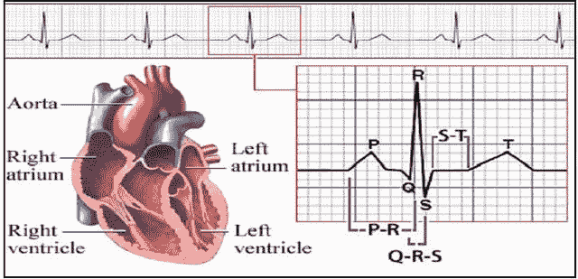
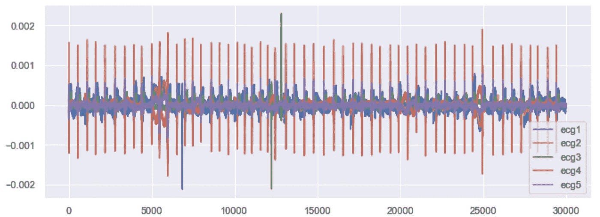
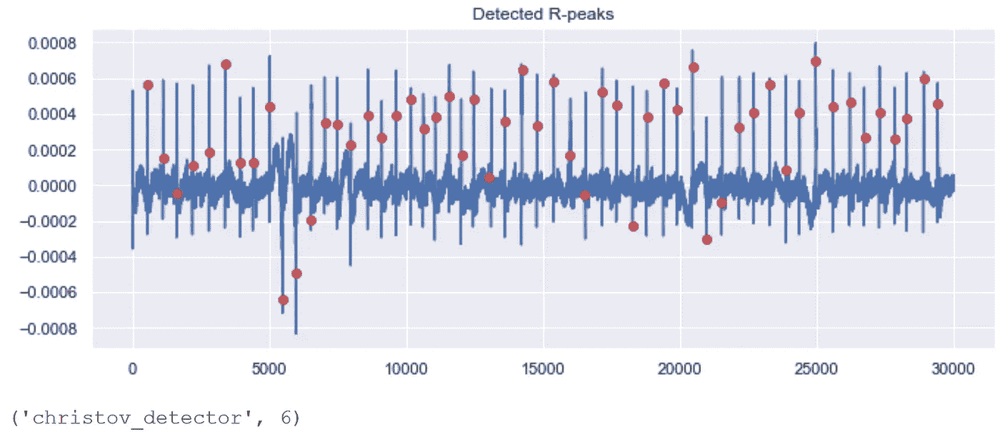
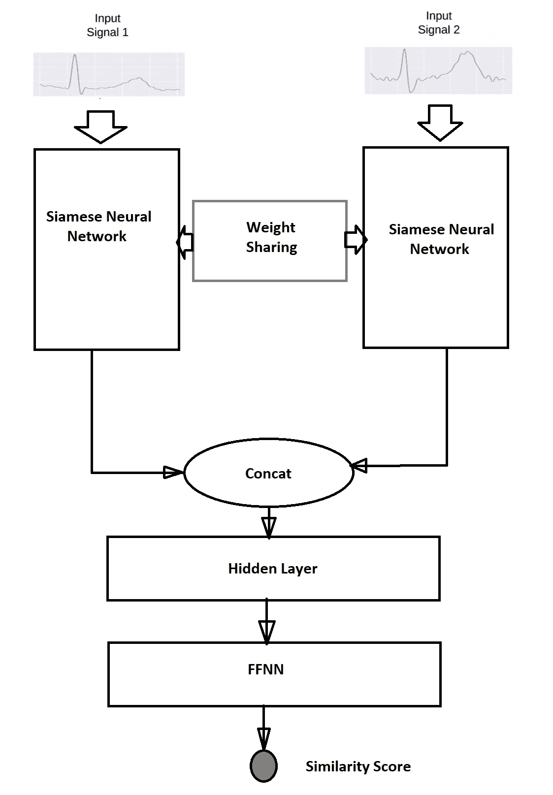
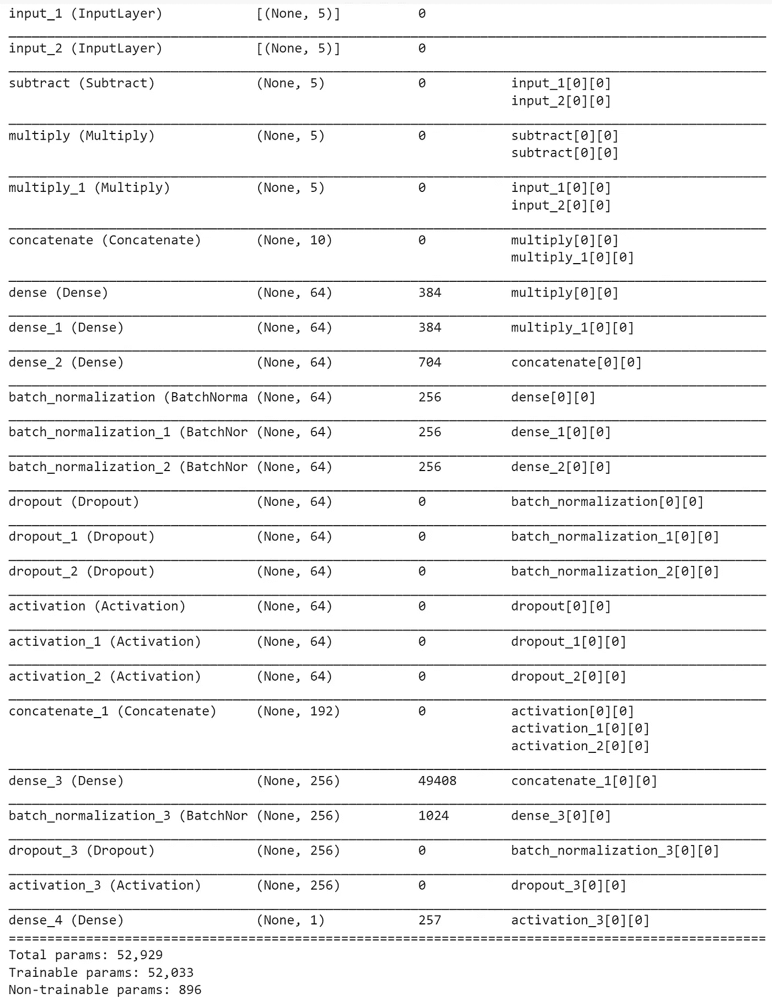

# 用深度连体网络学习生物医学信号的相似性

> 原文：<https://towardsdatascience.com/learning-similarities-between-biomedical-signals-with-deep-siamese-network-7684648e2ba0?source=collection_archive---------17----------------------->

## 一个**自动神经网络框架**用于 ***信号匹配*** 问题

[***TL；DR:全码***](https://colab.research.google.com/drive/1goe6oDy21o8itXsVfbvXD4D-2OzY2lWS?usp=sharing)

嗨，朋友们。

今天，我将带您浏览心电图(ECG)生物医学信号数据，目的是了解两个记录的信号数据事件之间的相似性表示。ECG 是人类医疗记录中最常见的信号数据类型之一。因此，让我们先简单了解一下什么是"**信号"**通俗地说，**什么是 ECG 信号**，**为什么需要它**，**什么是连体神经网络**，**它如何有助于比较两个向量**，最后我们将看到一个用例，从 ECG 数据分析开始，包括单变量/多变量绘图、滚动窗口和绘图、数据分析、过滤异常值、检测 r 信号到信号

**信号**

代表某种信息的基本量，用简单的工程术语叫做“**信号**”。而在数学世界的上下文中，信号只是一个简单地传达一些信息的 ***函数*** ，其中信息可以是时间的函数**【y = y(t)】**，或者可以是空间坐标的函数**【y = y(x，y)】**，或者可以是与源的距离的函数**【y = y(r)】**等等。举个例子。

**医疗信号**(心电、脑电、EOG、肌电图等。)

生物医学信号基本上是以非侵入的方式从我们的人体中收集的电信号。例如心电图(ECG)、脑电图(EEG)、眼电图(EOG)、肌电图(EMG)、表面肌电图(sEMG)等。是最常见的。这些信号非常有用&有非常大的价值，因为它可以进一步用于诊断目的。

**心电图**(心电图或 EKG)

心电图(ECG 或 EKG)测量**心脏的电导率**用于诊断目的，以测试我们心脏的功能，并确定是否有任何问题。它有助于描绘心跳的速率和规律性，心脏腔室的大小和位置，以及是否有任何损伤等等。心跳通常由一个小录音机来监测，录音机贴在贴在我们胸部的叫做“T2 电极”的标签上。

下图描绘了一个 [**QRS 复合波**](https://en.wikipedia.org/wiki/QRS_complex)**正常心电信号**轨迹的示意图。顾名思义， **QRS 复合体**包括 **Q 波**、 **R 波**和 **S 波**。这三种波通常快速连续出现。组成心电图的不同波形代表**心房和心室的去极化和复极化序列**。心电图以 25 毫米/秒(5 个大方块/秒)的速度记录，电压校准为垂直方向 1 毫伏= 10 毫米(2 个大方块)。QRS 复合波代表通过心室传播的电脉冲，并指示心室去极化。与 P 波一样，QRS 复合波恰好在心室收缩之前开始。

人体心脏图和正常 ECG 轨迹示例—图像版权[ [N. H. Kamarudin](https://www.semanticscholar.org/author/N.-H.-Kamarudin/39779693) 等人]

**连体神经网络**

[**暹罗神经网络**](https://proceedings.neurips.cc/paper/1993/file/288cc0ff022877bd3df94bc9360b9c5d-Paper.pdf) 或**暹罗网络**是由简·布罗姆利在贝尔实验室&的**和团队早在 1993 年开发的。它包括**双同神经网络**，这些网络**中的**单元**共享它们的权重**。这些网络接受不同的输入，输出通过简单的比较能量函数组合。能量函数可以是**距离函数**，最常见的是**欧几里德**距离。这种类型的网络将高维输入映射到目标空间，并使用能量函数来比较难以定义的&解释输出空间的语义特征。**

# 动手演示

现在，我们已经了解了一些关于 ECG 信号和连体网络的基本理论，让我们通过一个示例快速入门。在这里，我们将使用我从一家领先的智能服装和纺织品公司获得的数据，该公司为健身爱好者生产**运动红外性能和康复运动服**，旨在监测 altheles 的性能。提供的数据包括受试者/参与者穿着运动夹克进行不同活动(如坐、走、站等)的心电图记录。

**请注意** :-出于数据隐私和安全的原因，我希望保持实际数据源的匿名性，并且也将只为读者提供来自整个数据集的实际数据(样本数据)的子集，只是为了跟随本教程。

我们将看到" [**Deep-XF**](https://github.com/ajayarunachalam/Deep_XF) "一个 python 库也可以直观地用于学习信号相似性。为了快速介绍&，所有其他由 **deep-xf** 包支持的用例应用程序都在这篇博文[中列出。另外，看看**预测、临近预报**博客，其中有来自](https://ajay-arunachalam08.medium.com/introduction-to-deepxf-e90ce7c2858c) [**此处**](https://ajay-arunachalam08.medium.com/building-explainable-forecasting-models-with-state-of-the-art-deep-neural-networks-using-a-ad3fa5844fef)**&**[**此处**](/interpretable-nowcasting-with-deepxf-using-minimal-code-6b16a76ca52f) 的实际演示教程，这些都是在同一个服务包中提供的服务。如果热衷于从原始信号数据集中滤除噪声，请点击此处的博客<https://ajay-arunachalam08.medium.com/denoising-ecg-signals-with-ensemble-of-filters-65919d15afe9>**。**

**对于库安装遵循以下步骤 [**此处**](https://github.com/ajayarunachalam/Deep_XF#installation) &对于手动先决条件安装检查 [**此处**](https://github.com/ajayarunachalam/Deep_XF#requirements) 。**

****数据分析****

**让我们非常清楚地了解一件事，在我们谈论 AI 或任何机器学习的东西之前，**数据分析**在整个**数据科学工作流程**中起着非常重要的关键作用。事实上，它占用了整个管道中的大部分时间。**

****探索性数据分析(EDA)** 是工作流程的初始和重要阶段。它有助于初步了解数据，并帮助生成相关假设和决定后续步骤。然而，EDA 过程在大多数时候可能是一个麻烦。**

**下面给出的代码片段用于 EDA，具有用于检查缺失值、绘制原始信号、滚动窗口 sumplots、分析数据和生成相应报告、移除异常值、使用可用检测器类型检测 R 信号到信号峰值(R 峰值)的实用函数，例如 [swt 检测器](https://en.wikipedia.org/wiki/Stationary_wavelet_transform)、 [christov 检测器](https://pubmed.ncbi.nlm.nih.gov/15333132/)、二平均值检测器、engzee 检测器、hamilton 检测器[、pan tompkins 检测器](https://en.wikipedia.org/wiki/Pan%E2%80%93Tompkins_algorithm)、匹配滤波器检测器等。**

****

**图片作者:ECG1 — ECG5 原始信号图**

****

**作者图片:ECG1 — ECG5 信号的滚动窗口图**

****

**作者提供的图片:使用 Christov 检测器作为输入参数，在原始信号中绘制检测到的 R 峰**

****信号相似性比较****

**下图直观地展示了如何使用连体神经网络为我们的信号匹配用例获得相似性得分。如下图所示，它包括**双相同的神经网络**，并且这些网络**中的**单元**共享它们的权重**。输出最终导出的相似性得分，其估计输入向量之间的匹配。**

****

**作者图片:SigSimNet 架构**

****Siamese_Model** 函数采用具有多个特征的输入向量&执行一系列数学运算，然后通过前馈网络架构进行连接，以获得所需的输出分数，如下面给定的代码片段所示。**

**接下来，我们使用 **Siamese_Model** 函数创建 Siamese 网络架构，将输入特征的**数量**作为参数，然后使用“**均方误差**作为我们的**损失函数**，如下面给定的片段所示，使用[**Adam optimizer**](https://machinelearningmastery.com/adam-optimization-algorithm-for-deep-learning/#:~:text=Adam%20is%20a%20replacement%20optimization,sparse%20gradients%20on%20noisy%20problems.)&不同的评估指标，如均方误差(MSE)、平均绝对误差(MAE)、平均绝对百分比误差(MAPE)和余弦相似性。最终输出每个信号实例的估计相似性得分，其将两个输入向量作为自变量。下图显示了我们的暹罗模型摘要和后续信息。**

****

**作者图片:模型摘要**

****结论****

**通过这篇文章，我们看到了**连体神经网络**模型(又名**双神经网络**)如何对我们的信号匹配问题示例有用。这当然可以推广到任何上下文(图像/视频/文本/点云等)。)与任何相应的网络架构的构建类似(暹罗 CNN/RNN/点云/等。)，作为这些人工神经网络背后的原理，它简单地使用相同的权重，同时对两个不同的输入向量并行工作，以计算可比较的输出向量。我们还简要讨论了生物医学信号，并使用一系列不同的效用函数进行数据分析，如检测 R 峰、分析、去除异常值、可视化图等。我们看到了软件包 [**deep-xf**](https://github.com/ajayarunachalam/Deep_XF) 如何在探索性数据分析、预处理、学习表示、过滤等方面为信号数据带来便利。**

# **让我们连接起来**

**通过 [Linkedin](https://www.linkedin.com/in/ajay-arunachalam-4744581a/) 联系；或者，你也可以打电话到*ajay.arunachalam08@gmail.com*找我**

****关于作者****

**我是 **AWS 认证的机器学习专家&云解决方案架构师**。根据我处理现实世界问题的经验，我完全承认，找到良好的表示是设计系统的关键，该系统可以解决有趣的挑战性现实世界问题，超越人类水平的智能，并最终为我们解释我们不理解的复杂数据。为了实现这一点，我设想学习算法可以从未标记和标记的数据中学习特征表示，在有和/或没有人类交互的情况下被引导，并且在不同的抽象级别上，以便弥合低级数据和高级抽象概念之间的差距。我也确实相信人工智能系统的不透明性是当前的需要。考虑到这一点，我一直努力使人工智能民主化，并且更倾向于建立可解释的模型。我的兴趣是建立实时人工智能解决方案，大规模的机器学习/深度学习，生产可解释的模型，深度强化学习，计算机视觉和自然语言处理，特别是学习良好的表示。**

****参考文献****

**<https://www.nhs.uk/conditions/electrocardiogram/>  <https://en.wikipedia.org/wiki/Electrocardiography>  <https://www.ncbi.nlm.nih.gov/pmc/articles/PMC6412424/>      <https://scipy.org/>  <https://www.sciencedirect.com/topics/engineering/biological-signal>  <https://en.wikipedia.org/wiki/QRS_complex>  <https://www.aclsmedicaltraining.com/basics-of-ecg/>  <https://www.cvphysiology.com/Arrhythmias/A009>  <https://kidshealth.org/en/parents/ekg.html>    <https://github.com/berndporr/py-ecg-detectors> **