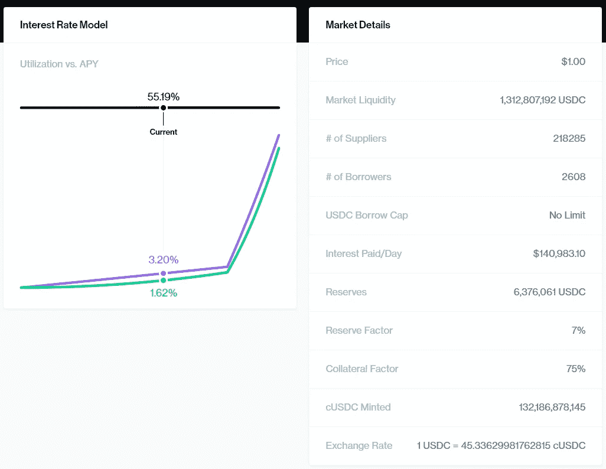
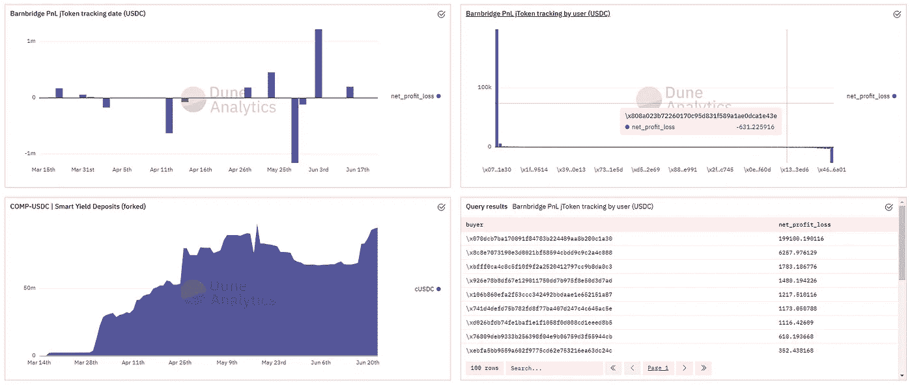
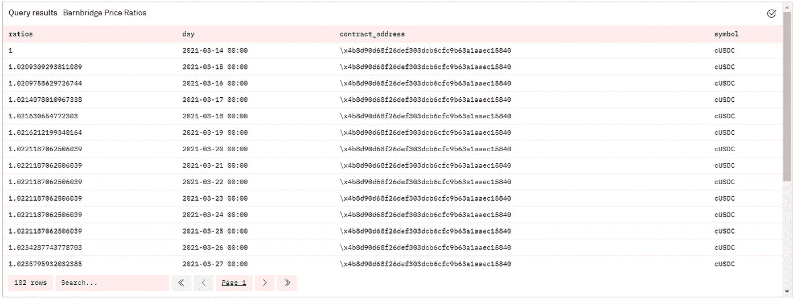
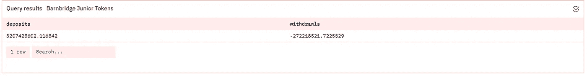
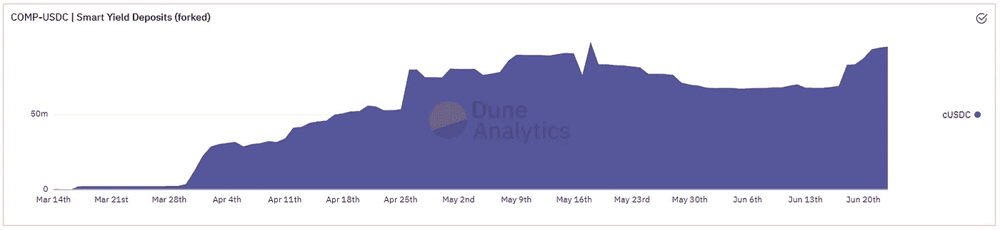
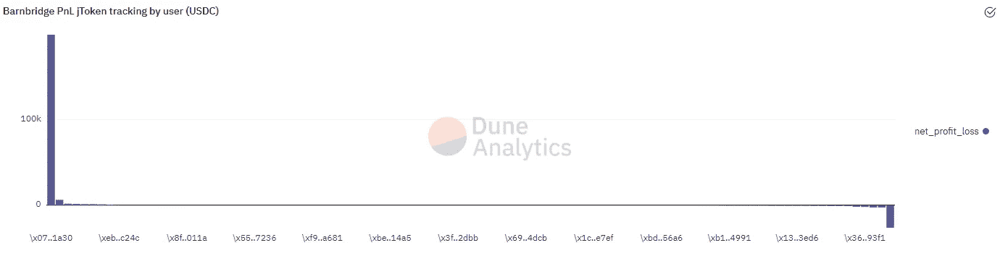
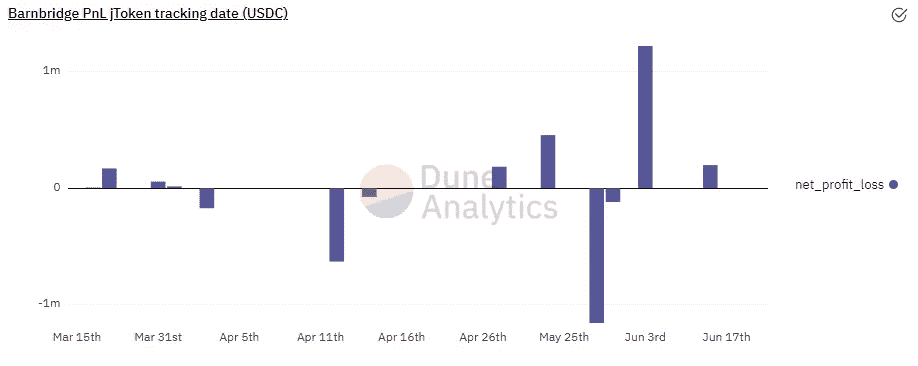

# 学习 SQL 和以太坊(第 3 部分)

> 原文：<https://towardsdatascience.com/learning-sql-and-ethereum-part-3-5422f080ad36?source=collection_archive---------15----------------------->

## 实践教程

## 让我们看看 Barnbridge(一种信贷份额协议)的合同和对锁定总价值和用户利润的查询。


由 [Unsplash](https://unsplash.com/s/photos/risk?utm_source=unsplash&utm_medium=referral&utm_content=creditCopyText) 上的 [Loic Leray](https://unsplash.com/@loicleray?utm_source=unsplash&utm_medium=referral&utm_content=creditCopyText) 拍摄的照片

> 我将在解释以太坊的基本概念时创建更多的小型查询细目，**这是我写的** [**初级**](/your-guide-to-basic-sql-while-learning-ethereum-at-the-same-time-9eac17a05929) **和** [**中级**](/your-guide-to-intermediate-sql-while-learning-ethereum-at-the-same-time-7b25119ef1e2) **指南**的延续。
> 
> 这篇文章是与我的朋友 0x 九龙合作写的，请去看看他对 barn bridge 的可靠性架构的深入研究，以更好地理解该协议的来龙去脉。

我们之前已经研究过资产证券化，你必须在一项资产中存入一定数量的抵押品(比如瑞士联邦理工学院)，才能借入另一项资产中 75%的抵押品价值(比如 USDC)。就像在传统的金融系统中一样，你可以赚取固定或可变的利息，除了在 DeFi 中，这个利率通常由你存入或借入的资产的“利用率”决定。

让我们以复合(类似于 Aave 的协议)为例来看看 USDC:



[https://compound.finance/markets/USDC](https://compound.finance/markets/USDC)

重要的图表在左边，黑线表示 USDC 的当前利用率(借入的 USDC 总额/存入的 USDC 总额)，绿线和紫线分别表示支付的可变利率和固定利率。你会注意到有一个点，利率的斜率会突然上升，通常设定在 80%左右，这是为了避免资产池被 100%利用(借入)。

现在，如果你是存款人，愿意放弃你获得的任何额外回报，以换取总是在某个固定利率上获得全部回报，会怎么样？例如，假设你和另一个投资者都存可变利率 USDC。你想每年获得 2%的回报。其他投资者已经同意从他们的存款(本金)中支付给你，以弥补差额，如果可变利率在一段时间内低于 2%(差额*你的本金*time_under_2%)。作为交换，如果可变利率超过 2%，那么你就支付他们额外的收益(差额*你的本金*时间 _ 高于 _2%)。这就是巴恩布里奇和他们的 SmartYield 产品的基本运作方式，有数百名投资者在安全(2%有保证)和高风险(2%以上/以下)部分之间进行选择。

然而，如果巴恩布里奇推出自己的存款和借款资产池，那么他们将不得不从头开始增加市场的流动性。自举流动性可能会很困难，并导致利用率大幅波动，进而导致利率波动。这就是金钱概念的重要性所在——本质上，BarnBridge 可以构建一种产品，在这种产品中，你从其资产池中借入或存入的资产将直接存入 Compound 或 Aave。通过这种方式，巴恩布里奇可以处理智能合约中的双重份额逻辑，同时利用复合或 Aave 市场的稳定性。如果你想更多地了解这个金钱乐高结构，我推荐阅读[我的 Web3 产品讲解者](https://medium.com/coinmonks/crypto-and-web-3-0-are-the-future-of-product-and-work-3d19e3733181)。

现在我们可以进入数据分析了。这就是我们想要的:



【https://duneanalytics.com/ilemi/Barnbridge-PnL 

为此，我们需要知道用户在智能合约上进行的主要事务(函数调用和发出的事件)。请记住，SQL 表是基于每个智能合约的**交易数据。用户可以进入或离开风险较高的部分(次级代币/债券)，也可以进入或离开较安全的部分(高级债券)，因此我们有四个主要操作。在“离开风险部分”的过程中有一点需要注意的地方，但是我们稍后会解决这个问题。**

让我们从将**“锁定的总价值”**(指存入的总资产)放入协议**开始。这意味着我们需要加上总存款，减去初级和高级部分的总提款。**

将 USDC 存入初级部分与存入 Aave 不同，因为初级部分的回报取决于他们从高级部分欠下(或获得)多少。这意味着，如果你在发行后加入这一部分，它不会是基础资产(USDC)和你作为回报获得的代币(bb_USDC)的 1:1 存款。同样，当你出售时，价格也不是 1:1。

我们用以下公式计算比率:

```
SELECT  date_trunc('day', evt_block_time) as day,
                contract_address,
                "underlyingIn"-fee, 
                "tokensOut",
                ("underlyingIn"-fee)/"tokensOut" as ratios
        FROM barnbridge."smartYield_evt_BuyTokens" 

UNION ALL

SELECT  date_trunc('day', evt_block_time) as day,
                contract_address,
                "underlyingOut", 
                "tokensIn",
                "underlyingOut"/"tokensIn" as ratios
        FROM barnbridge."smartYield_evt_SellTokens"
        where "tokensIn" != 0
```

我们正在查询 Barnbridge 初级阶段的表中的`BuyTokens`和`SellTokens`事件。因为该部分中有许多类型的令牌(如、戴、)，所以我们需要保留`contract_address`列，以便稍后进行过滤。`tokensOut`代表为用户制造的令牌，而`underlyingIn`是存放在协议中的资产。`underlying/tokens`的比值给了我们两者之间的汇率。我们将在用`total barnbridge tokens in pool * ratio`锁定的总价值中使用这一比率计算，以回到总基础资产的价值。

`day`将只返回交易发生的日期，因此在没有人从 BarnBridge 存款或取款的日子可能会有间隔。这将导致非常不连贯或扭曲的时间序列图，因此我们将使用`generate_series`表填充所有缺失的日期。

```
SELECT generate_series('2021-03-14'::timestamp, date_trunc('day', NOW()), '1 day') AS day 
```

接下来，我们将计算第二天(在数据的最后一天之后)作为系列的终点:

```
SELECT  ratios,
                contract_address,
                day,
                lead(day, 1, now()) OVER (ORDER BY day) AS next_day 
        FROM ratioavg
```

这看起来有点复杂，但本质上是创建一个常量值列`next_day`作为时间序列中的最后一天。

我们可以用一个连接把它们放在一起:

```
SELECT  ratios, 
                d.day,
                a.contract_address,
                symbol
        FROM days d
        left join ratio_with_lead_day a on a.day <= d.day AND d.day < a.next_day
        left join dune_user_generated.smartyield_token_mapping u on u.contract_address= a.contract_address
```

这样就完成了在没有事务的日子里包含行的时间序列(在时间序列图中显示为 0 ),并在`next_day`结束。我们还加入了一个表，该表将`contract_address`映射到底层资产的令牌符号，以便以后阅读和过滤。

所有这些返回下表



完整查询此处[https://duneanalytics.com/queries/67210](https://duneanalytics.com/queries/67210)

既然这个问题已经解决了，我们可以看看初级份额代币的存款和取款总额。这从两个查询开始:

```
SELECT  buyer,
        evt_tx_hash,
        contract_address,
        "tokensOut" as deposit,
        date_trunc('day', evt_block_time) as day

FROM barnbridge."smartYield_evt_BuyTokens"
```

和

```
SELECT  seller as buyer,
        evt_tx_hash,
        contract_address,
        -"tokensIn" as deposit,
        date_trunc('day', evt_block_time) as day

FROM barnbridge."smartYield_evt_SellTokens"
```

我认为这两个不需要太多的解释，因为列是不言自明的，我们在这里做了同样的日期填充，但是使用了 contract_address 分区。

```
SELECT
        buyer,
        contract_address,
        deposit, 
        day,
        lead(day, 1, now()) OVER (partition by evt_tx_hash, contract_address ORDER BY day) AS next_day 
FROM redeemjbonds
```

我们用这个看起来有些混乱的查询将所有这些放在一起:

```
SELECT
sum(((d.deposit + coalesce(r.deposit,0))/10^u.u_decimals)*ratios) as deposits,
sum(coalesce(r.deposit,0)/10^u.u_decimals*ratios) as withdrawlsFROM
depositfinal dLEFT JOIN redeemfinal r  on d.day = r.day and d.buyer = r.buyer and r.contract_address = d.contract_address LEFT JOIN ratioq q on d.day = q.day and q.contract_address = d.contract_addressLEFT JOIN dune_user_generated.smartyield_token_mapping u on u.contract_address= q.contract_addressWHERE((d.deposit + coalesce(r.deposit,0))*ratios)/10^u.u_decimals > 0
AND u."symbol"='cUSDC'
```

我们将每个用户的总存款(`depositfinal`)和总取款(`redeemfinal`)以及资产(`contract_address`)连接起来。我们在这个连接中也保持日期一致。接下来，我们加入从第一次查询到日期的`ratioq`(记住，随着利息和高级部分付款/奖励的增加，比率每天都在变化)。最后，我们将`contract_address` 上的映射加入到资产符号中，并只过滤复合 USDC 存款(`cUSDC`)。至于我们选择的内容，我们用存款总额减去取款总额(`COALESCE`在这里用于涵盖用户没有提取任何东西并且值为 null 的情况，我们希望用 0 来代替——把它想象成一个`if null then value (0)` 函数)。然后我们将总和除以资产的小数(由于你在 solidity 中没有小数，我们必须在前端进行转换)。最后，我们用比率乘以这个存款，因为这个存款用 BarnBridge 代币表示，我们需要它来显示 USDC 值。如果这不是使用像 USDC 这样的稳定货币资产，那么我们将使用另一个连接(在连接`symbol`和`date`时添加价格列)将它乘以每个日期的价格。

这为我们提供了下表:



[https://duneanalytics.com/queries/67226](https://duneanalytics.com/queries/67226)

我们将对 select 查询稍加修改，以添加高级令牌，但过程几乎完全相同(只是没有比率)。

完整的 TVL 查询可以在[这里](https://duneanalytics.com/queries/67051/134549)找到，并给出了如下图表:



[https://duneanalytics.com/queries/67051/134549](https://duneanalytics.com/queries/67051/134549)

现在我们唯一需要计算的是每个用户和日期的利润和损失。我们想要检查已经进入和完全退出池的用户获得或丧失了多少利息(即`deposit-withdrawals=0`)。我之前提到的额外警告是，当有人退出初级部分时，他们需要补偿高级部分的任何利息损失。在典型的[证券化式结构](https://www.investopedia.com/terms/a/asset-backedsecurity.asp)中，份额被锁定发行，任何人都不能随心所欲地退出或进入(至少不能以改变主要发行的方式)。在 BarnBridge 案中，提前提款的补偿有两种形式:要么是没收，要么是考虑到所欠利息的加权平均到期日的次级债券。

计算方法如下:

```
SELECT date_trunc('day',buy."evt_block_time") as date, buy."buyer", buy."tokensIn", redeem."underlyingOut", buy."maturesAt", true as did_redeem
        FROM barnbridge."smartYield_evt_BuyJuniorBond" buy
        INNER JOIN barnbridge."smartYield_evt_RedeemJuniorBond" redeem ON buy."juniorBondId" = redeem."juniorBondId" AND buy."buyer" = redeem."owner"
        INNER JOIN dune_user_generated."smartyield_token_mapping" map ON buy."contract_address"=map."contract_address"
        WHERE map."u_symbol"='USDC'
```

这里我只考虑那些既购买了债券(`BuyJuniorBond`)又赎回了债券(`RedeemJuniorBond`)的买家。连接在买方地址和次级债券 ID 上(以防他们有多个不同到期日和金额的债券)。我创建了一列作为`did_redeem`的`true`值，用于以后的健全性检查。

然后，我们将这些赎回与初级部分存款和取款查询结合起来(表`jtokens_t`是我们原始查询的修改版本):

```
SELECT "date","buyer","underlyingOut","underlyingIn","tokensOut","tokensIn", false as "did_redeem"
        FROM jtokens_t
        UNION 
        SELECT "date","buyer","underlyingOut", 0 as "underlyingIn", 0 as "tokensOut","tokensIn", "did_redeem"
        FROM  SELECT "date","buyer","underlyingOut","underlyingIn","tokensOut","tokensIn", false as "did_redeem"
        FROM jtokens_t
        UNION 
        SELECT "date","buyer","underlyingOut", 0 as "underlyingIn", 0 as "tokensOut","tokensIn", "did_redeem"
        FROM junior_bond_redemptions
```

请注意，`junior_bond_redemptions`没有`underlyingIn`或`tokensOut`列，所以我用常量值`0`创建了它们，以便 UNION 函数按预期工作。

最后，我们将选择查询放在一起:

```
SELECT union_by_date."buyer", sum("underlyingOut" - "underlyingIn")/1e6 as net_profit_loss
FROM union_by_date
INNER JOIN
    (SELECT "buyer" 
    FROM buyer_pivot
    WHERE "out" - "in" = 0) as exit_buyers
ON union_by_date."buyer" = exit_buyers."buyer" 
GROUP BY 1
ORDER BY 2 DESC
```

这里，我用`sum(“underlyingOut” — “underlyingIn”)/1e6`来表示已经完全退出的买家子集的 PnL。我通过子查询`exit_buyers`上的内部连接来实现这一点，然后除以 USDC 的六位小数。最后是一个`GROUP BY`，因为我使用了一个聚合函数和一个`ORDER BY`来使图表更漂亮。

这给了我们这个:



[https://duneanalytics.com/queries/66812](https://duneanalytics.com/queries/66812)

它显然有点倾斜(有人肯定是条鲸鱼)，这就是为什么我也在仪表板中包含了表格视图。对于 PnL 的日期版本，我对最终的选择查询做了一点调整，但在其他方面没有变化。总的来说，它看起来相当均匀，损失可能是由一般的加密市场压力造成的。



[https://duneanalytics.com/queries/65891](https://duneanalytics.com/queries/65891)

如果您对仪表板本身感到好奇，它只是查询的拖放，所以没有什么复杂的解释。Dune 使这一部分变得非常简单，不需要在 Python Plotly Dash 或 Bokeh 中摆弄来获得正确的可视化效果，也不需要担心部署。

这个简短的讲解到此结束，希望你学到了一些以太坊和/或 SQL 的知识！