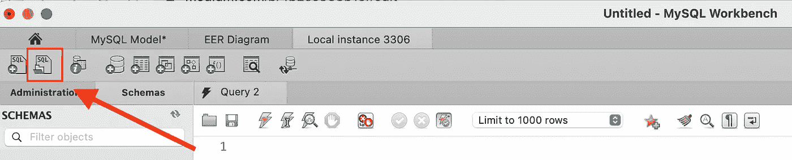
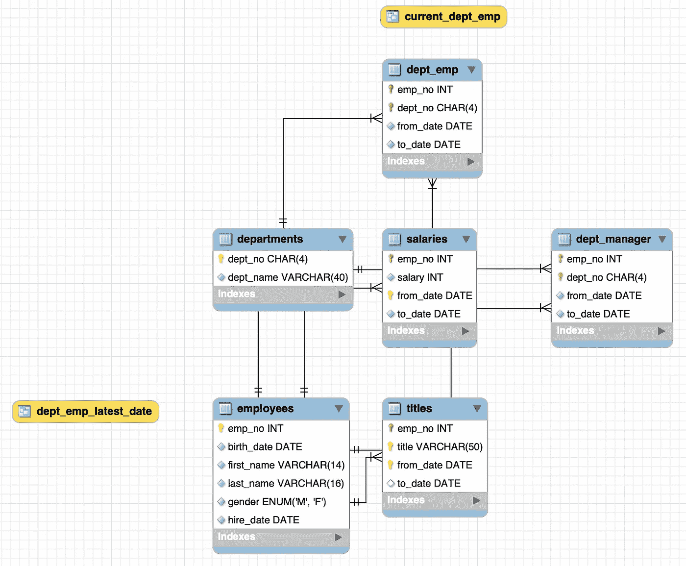

# 学习 SQL？了解如何使用复杂的数据库练习 SQL

> 原文：<https://towardsdatascience.com/learning-sql-learn-how-to-practice-sql-with-a-complex-database-4b2ce933b1ef?source=collection_archive---------23----------------------->

## 结构化查询语言

## 了解如何找到并开始使用复杂的数据库来练习 SQL

图像由卡斯帕卡米尔鲁宾。来源: [Unsplash](https://unsplash.com/photos/fPkvU7RDmCo)

如今，SQL 已经成为专业人士的顶级技能之一。每天，越来越多的公司开始使用关系数据库。出于这个原因，希望在职业生涯中成长的专业人士明白学习 SQL 是必须的。即使是使用 SQL 几年的专业人员(像我一样)也可能会对所有的 SQL 命令感到困惑，并且知道他们需要练习。另一个场景问题是多个关系数据库管理系统和许多基本命令并不相同。

问题来了。有数百种在线课程可以教授如何使用 SQL。然而，他们中的大多数使用学生在课程中创建的简单数据库。有些课程可能会用到你可以下载的数据库，但它们通常都是一些基础的。这里的事实是，这些数据库与现实相差甚远。您将不会在专业领域中使用基本数据库。因此，即使您每天练习 SQL，如果它是一个简单的数据库，您也不会理解 SQL 的全部潜力。

幸运的是，有人让世界变得更美好，并提供了雇员数据库。Employees 数据库是奠定 SQL 基础的最佳选择。它的复杂性提供了具有挑战性的任务和所有你需要提高你的技能。

这些员工可以在 GitHub 上的[这个链接](https://github.com/datacharmer/test_db/blob/master/employees.sql)中找到。然而，来自 365 DataScience 的家伙们在[这个链接](https://www.dropbox.com/s/znmjrtlae6vt4zi/employees.sql?dl=0)的一个易于下载的文件中提供了这个数据库。数据库大约有 89 MB，从大小上看，我们可以看到我们正在处理一个巨大的数据集。

现在，您需要将数据库添加到 RDBMS 中。如果您正在使用 MySQL Benchwork，您可以点击下面显示的图标并按照步骤操作。我应该和其他 RDBMSs 一样简单。现在，您已经准备好像专业人士一样练习 SQL 了。让我们稍微探索一下数据库。

作者图片

首先，让我们看一下数据库图表。要在 MySQL Benchwork 上找到图，只需要进入`database` > `reverse engineer...`按照步骤操作即可。

好了，我们有多个表要探索。我们有关于雇员、部门、薪水、经理、头衔等信息的表格。我们可以通过键入`SELECT COUNT(*) FROM employees;`来检查数据库包含多少行。

作者图片

超过 30 万行。令人印象深刻！基本上可以用这种规模的数据库做任何查询。最棒的是，即使对于使用 SQL 多年的专业人员来说，它也足够复杂。来自 w3resource 的牛人创造了 114 个问题，让你用雇员数据库练习 SQL。你可以在[这个链接](https://www.w3resource.com/sql-exercises/employee-database-exercise/index.php)上找到它们。

现在，您已经具备了成为专业 SQL 用户的所有条件。干杯！