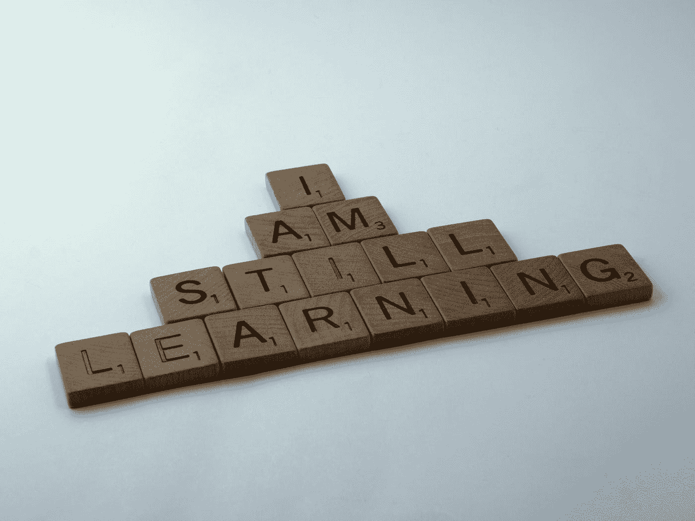

# 在 30 多岁的时候学习编码

> 原文：<https://towardsdatascience.com/learning-to-code-in-your-30s-24b5b8cce5de?source=collection_archive---------2----------------------->

## 关于如何踏上旅程的几点见解

布雷特·乔丹在 [Unsplash](https://unsplash.com?utm_source=medium&utm_medium=referral) 上的照片

如果你在 30 岁的时候开始写第一行代码，很容易感觉为时已晚。有很多有才华的程序员比你年轻得多，很难不被淹没。

我在 29 岁时写了第一行有用的代码。虽然我在方法上犯了很多错误，但我发现了一些有用的见解，可能对处于相同位置的任何人都有用。

# 不要为了把它写进简历而学习如何编码

奇怪的是，求职者在简历中列出 Python，却什么都不会，这是多么常见的事情。完成高级 Python MOOC 并不意味着你就是高级 Python 用户。它最多让你成为一个初学者。我理解处于职业生涯中期并试图寻找提升技能的方法是什么感觉，但你最好专注于自己的优势，而不是假装自己是程序员。

学习如何编码，因为你喜欢构建东西。不要纯粹为了在面试过程中脱颖而出而去做。除非你有能力解决真正的问题，否则它很可能帮不了你。

# 不要担心该学哪种语言

我第一次对编程感兴趣的时候是 24 岁，但我不确定该学哪种语言。我阅读了无数的留言板，并开始随机购买关于 C++、C#和 VBA 的书籍。我花了很多时间阅读如何编码，但我几乎没有花时间写代码。寻找完美的编程语言让我精疲力尽，我放弃了。

虽然一定量的研究是必要的，但它会很快变成拖延。读到你的目标可能会让你感到满足，但是你并没有在工作。

我担心我会把时间浪费在学习错误的语言上，而且一无所获。这是错误的思考方式。每种语言都会给你一些有用的东西，应用到你将来可能需要的任何语言中。

你不应该需要超过一个小时的研究来决定一种语言。如果你已经迟到了，你没有时间浪费在这上面。

许多开发人员告诉你从学习 c 开始。这对许多人来说可能是有意义的，但我不认为这是职业生涯中期开始的人的最佳途径。你应该瞄准一门能帮助你今天开始解决问题的语言，这就是为什么我建议从 Python 或 Javascript 开始。这些语言物有所值，因为它们将为您提供快速解决各种问题的工具。

# 尝试很多学习方法

在学和做之间取得平衡是很重要的。有时候我太专注于疯狂地构建东西，而其他时候我则陷入了教程的循环中。

我通过重做已经在 Excel 中完成的工作来学习 R，这种方法有利有弊。这很好，因为这是现实世界的问题解决方案，你已经知道答案应该是什么。然而，我发现边做边学的方法会在你的知识中留下巨大的漏洞。

用教程、书籍、竞争性编码、Kaggle 等来补充项目是很重要的。这有助于保持事情的趣味性，你会学到像算法和数据结构这样的基础知识。我还发现教程有助于你专注于使用库，这会让你的生活更轻松。

请记住，你应该做多少教程是有限度的。你必须确保你正在尝试将你在教程中学到的东西应用到实际问题中。

# 找到在日常生活中使用代码的方法

我是从看一本 C#的书开始的。在我完成所有的练习后，我不知道该如何处理这些新知识。我只是缺乏世界观，无法理解编程可以解决什么类型的问题。

我很幸运地加入了一个使用 R 进行统计分析的团队。如何将代码融入到我的工作中突然变得有意义了，我开始学习如何用 R 做通常会在 Excel 中做的事情。这最终导致我每天都在使用 Python、R 和 SQL。

如果可能的话，试着让编码成为你当前工作的一部分。考虑可以自动化的任务或可以更好地维护和可视化的数据。如果你能从小处着手，让你的团队对你的项目感兴趣，你就能把你的角色转变成你想要的角色。

# 不要只写代码，也要读代码

如果你不花时间阅读开源项目，那你就做错了。这是学习软件开发的最佳资源之一。在 Github 中搜索您使用的项目，看看开发人员是如何构建这些工具的。

简单的项目和教程可以帮助你学习编程的基础，但是软件开发对风格非常固执己见。当你阅读流行的开源库时，你会开始有一种项目应该如何组织的感觉。

# 记住如何成为一个初学者

随着年龄的增长，大多数人投入学习的时间越来越少。一旦你到了 30 岁，就开始专注于其他事情，这是很常见的。重新开始很难，尤其是当你想学习一些有挑战性的东西的时候。

我认为初学者的能力是一项重要的技能。我见过有人很难捡起编程和数据科学，因为他们无法接受再次成为新手。他们从解决过于复杂的问题开始，最终放弃。你必须丢掉自我，从一些容易处理的事情开始。

# 冷静点。人生漫漫。

感觉自己已经过了巅峰很容易，但是一年能学到多少东西就很疯狂了。如果你今天已经 30 多岁了，你还有很多事业要做。不要担心错过的机会，去创造一些东西。

# 结论

这概述了我在以后学习如何编码时收集的一些见解。我想象有很多人在同一条船上，我希望这有所帮助。