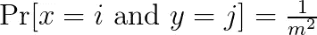
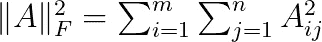

# 学习散列

> 原文：<https://towardsdatascience.com/learning-to-hash-36367b9814f1?source=collection_archive---------13----------------------->

将书籍摆放到书架的不同位置。照片由[西格蒙德](https://unsplash.com/@sigmund?utm_source=unsplash&utm_medium=referral&utm_content=creditCopyText)在 [Unsplash](https://unsplash.com/s/photos/encyclopedia?utm_source=unsplash&utm_medium=referral&utm_content=creditCopyText) 上拍摄

## [小窍门](https://towardsdatascience.com/tagged/tips-and-tricks)

## 如何设计应用于快速检索任务的数据表示技术

哈希是数据管理中最基本的操作之一。它允许使用少量内存快速检索数据项。哈希也是一种基本的算法操作，具有严格理解的理论属性。事实上，所有高级编程语言都提供了用于在哈希表中添加和检索项目的库。

最近，散列法已经成为一种强大的相似性搜索工具。这里的目标不是精确检索，而是快速检测彼此相似的对象。例如，对于不同的相似性概念，同一物品的不同图像应该具有相似的散列码，并且我们应该能够快速搜索这种相似的散列码。

最近的一个研究趋势是设计特定于数据的散列函数。不同于传统的散列算法，其中散列函数是通用的并且不依赖于底层数据分布，*学习散列*方法基于这样的前提，即可以通过发现数据中的隐藏模式来设计最佳散列函数。

在这篇文章中，我将讨论设计特定于数据的散列函数及其应用的机器学习技术。

# 数据分布散列法

这是标准的散列法，例如 Python 中的字典，我们在其中存储键、值对。这些键被映射到唯一的散列码，如果一个键出现在我们的散列表或字典中，我们可以在常量时间内进行检索。

## 数据独立(传统)散列法

我们假设项目或密钥由整数表示。(不可变的数据类型，如字符串、浮点或元组，可以表示为整数。)

标准的散列方法是将项目 x 映射到 f(x ),其中 f(x)只能取 m 个不同值中的一个。重要的是 f(x)值尽可能随机，即我们想要的

这样，我们就不太可能发生*碰撞*，i *。* e，f(x)=f(y)。通常通过创建一个列表来处理冲突，该列表包含散列到给定地址的所有项目。如果列表太长，检索会变得很慢，因为我们需要遍历列表。

为了避免冲突，哈希函数应该是独立的:

对于所有输入，0 ≤ i，j ≤ m-1。

上述条件被称为*双向独立性*，因为我们只考虑成对输入项的独立性。如果我们有三个项目，我们将有 3 个方面的独立性，一般来说，k 个方面的独立性。k 越高，函数越随机。

对散列函数的一个主要要求是它们可以被有效地评估。一个典型的例子是线性散列函数，如

其中 *a* 和 *b* 为随机选取的素数。可以证明这个函数是双向独立的。诸如高阶多项式的更复杂的函数产生 k > 2 的 k 方向独立性。代价是更复杂的函数计算起来也更慢。我参考[这些课堂讲稿](https://www.cs.cmu.edu/afs/cs/project/pscico-guyb/realworld/www/slidesF15/hashing.pdf)来了解更多关于散列的细节。

## 使用机器学习的数据相关散列

在数据无关哈希中，为了避免很多冲突，我们需要一个“足够随机”的哈希函数和足够大的哈希表容量 m，参数 m 取决于数据中唯一项的数量。最先进的方法实现了恒定的检索时间结果，使用

*m = 2 *唯一项目数*。

然而，想象一下我们的数据是从具有已知参数的正态分布生成的特殊情况，假设平均值为 0，标准偏差为 1。那么我们实际上不需要随机分配物品。我们可以简单地创建覆盖不同时间间隔的存储桶。我们需要在 0 附近有许多短的间隔，但是我们离 0 越远，间隔应该变得越大。显然，在区间[0，0.1]中我们会有很多值，但几乎没有大于 10 的值。

图一。x 轴上的标签给出了散列值的容器。图片作者。

这是将机器学习方法应用于哈希的直觉。通过了解数据的分布，我们可以以最佳方式将物品分配到箱中。这是数据独立哈希无法实现的。

2017 年，谷歌的研究人员因声称他们能够改进最著名的哈希算法而成为头条新闻[2]。

# 相似性保持散列

## 数据独立方法

已经设计了不同的方法，使得对于不同的相似性概念，散列码保持对象之间的相似性。位置敏感哈希(LSH)是一系列哈希算法，保留对象之间的不同度量，如欧几里德距离或集合重叠。让我们考虑一个估算矢量间夹角的具体例子。

假设我们的输入数据是 d 维向量。我们选择 k 个随机 d 维向量 w_i，其中每个条目选自标准正态分布 N(0，1)。

图二。绿色向量是分离超平面。图片作者。

随机向量被堆叠成矩阵 w。散列码然后被计算为

上面说我们计算 x 和每个随机向量 w 的内积，并把符号作为哈希码。你可以把每个 d 维随机向量想象成 d 维空间中的一个随机超平面。符号表示向量 x 位于超平面的每一边。参见图 2 中的二维示例。因此，如果两个向量之间的角度很小，它们很可能在超平面的同一侧，即它们将有很大的重叠。LSH 的主要结果是

其中θ(x，y)表示矢量 x 和 y 之间的角度。

## 为什么是位向量？

目标是创建由单个比特组成的散列码。位向量非常紧凑，因此即使是大型数据集也可以在主存中处理。此外，位向量的算术运算非常高效。对位向量的相似性穷举搜索比对具有连续值的向量的穷举搜索更有效。原因是位向量可以在快速 CPU 缓存中加载和处理。因此，通过对两个比特向量进行 XOR(计算相同比特的数量)来代替一般向量的向量内积 u^T*v，产生了显著的计算优势。

## 用于相似性搜索的无监督哈希学习

最初提出的算法之一是基于 [PCA 分解](https://en.wikipedia.org/wiki/Principal_component_analysis)。我们找到协方差矩阵中方差最大的 k 个方向

然后我们使用 d-乘以-k 的投影矩阵 W，将数据 X 投影到 *k ≤ d* 个主特征向量上，即对应于 *k* 个最大特征值的特征向量:

注意它成立:

在上面的λ是由最大特征值组成的对角 k 乘 k 矩阵，W 包含相应的特征向量。

哈希码计算如下

一个明显的缺点是，这样所有方向都被平等对待。但我们需要更加关注方差较高的方向。研究人员提出了不同的技术，将更多的比特分配给方差较大的方向。

## 监督学习散列相似性搜索

这是一个我们已经标记了数据的设置。例如，用不同类别标记的 n 个图像的数据库。在这里，我们可以创建图像之间的相似性得分，并将它们存储在 n 乘 n 矩阵 S 中。例如，条目 S_{i，j}表示两幅图像基于它们的标签有多相似，例如两组标签之间的 Jaccard 相似性。(当然，相似性是一个非常通用的概念，不同的度量是可能的。)

我们要求条目 S_{i，j}是介于-1 和 1 之间的值，因此对于具有[0，1]中的值的相似性度量 sim(i，j ),我们设置

目标是解决下面的优化问题。

矩阵 B 包含 n 个对象的散列码。请注意，我们将相似性矩阵乘以 k，因为 BB^T 中的值介于-k 和 k 之间。在上面的内容中，下标 f 表示矩阵的 Frobenius 范数:

上面的优化问题很难解决，因为我们要求 B 中的值要么是-1，要么是 1。放松版由下式给出

然后，通过取 b 中每个条目的符号，将解转换为位向量。

## 学习排名

另一个被广泛研究的问题是可以用来保持元素秩的散列码的设计。设置如下。对于查询 q，有一个按降序排序的相关性分数列表

项目 I 的等级由下式给出

让我们用来自{-1，1}的条目来定义两个二元向量之间的距离:

设 *I* 为二元指示函数，使得 I(E) = 1 当且仅当事件 E 为真。使用距离函数和二进制码的排序可以写成

然而，该指标导致了一个难以优化的问题。因此，我们使用 sigmoid 函数将其替换为概率表达式:

为了学习二元向量，我们使用一个带有可学习参数的矩阵。

然而，使用符号函数又会导致一个难以优化的问题。因此，我们去掉符号，得到下面的概率表达式

这可以用于排名的表达式中，即

一旦我们有了一个学习排名参数的表达式，我们就可以将其插入到一个损失函数中，如[归一化贴现累积收益(NDCG)](https://en.wikipedia.org/wiki/Discounted_cumulative_gain) 。我请读者查阅[4]以了解更多细节。

# 讨论

人们应该永远记住，学习散列函数是一个机器学习问题。因此，它带来了机器学习的优点和缺点。它可能会导致卓越的性能和接近最佳的散列码。而且，获得散列码可能很慢，容易出错，并且容易过度拟合。学习哈希代码时，建议使用具有众所周知的属性的数据独立哈希函数作为基线。事实上，像[布谷鸟哈希](https://en.wikipedia.org/wiki/Cuckoo_hashing)这样的高级数据独立哈希方法可以获得与【2】中报告的结果相当的结果。

## 参考

[1]学习大数据哈希:教程。李武军。在[https://cs.nju.edu.cn/lwj/slides/L2H.pdf](https://cs.nju.edu.cn/lwj/slides/L2H.pdf)上市

[2]学习指数结构的情况。蒂姆·菲利普·克拉斯卡，亚历克斯·比特尔，埃德·h·齐，杰弗里·迪恩，尼奥科利斯·波利佐蒂斯。在[https://arxiv.org/pdf/1712.01208.pdf](https://arxiv.org/pdf/1712.01208.pdf)有售

[3]一个关于学习 Hash 的调查。王京东，，宋京宽，Nicu Sebe 和沈。IEEE 模式分析与机器智能汇刊(TPAMI) 2017。可在[https://arxiv.org/abs/1606.00185](https://arxiv.org/abs/1606.00185)买到

[4]用于快速相似性搜索的排序保持散列法。王启帆、张志伟和洛斯。IJCAI 2015。地点:【https://www.ijcai.org/Proceedings/15/Papers/549.pdf 