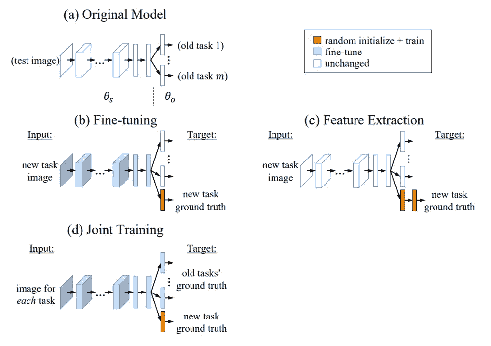
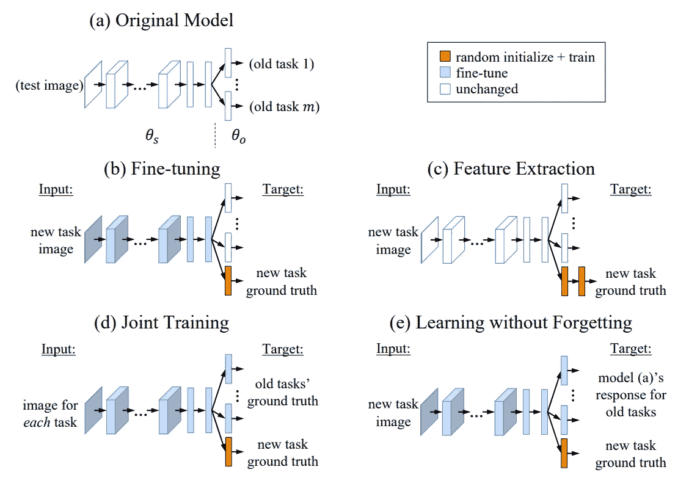
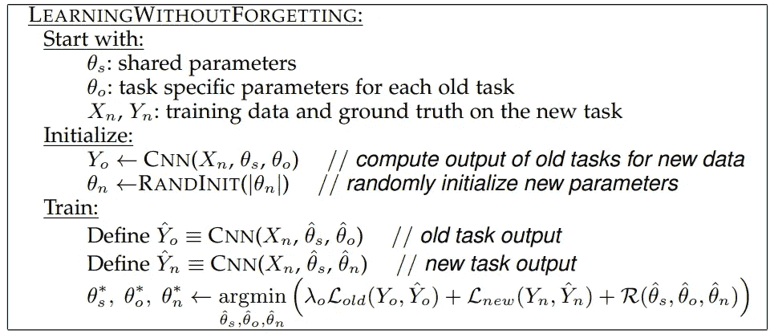
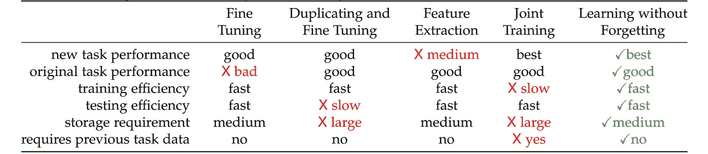
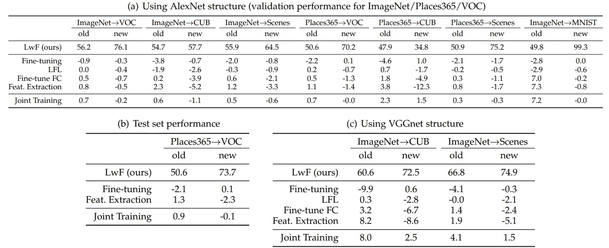
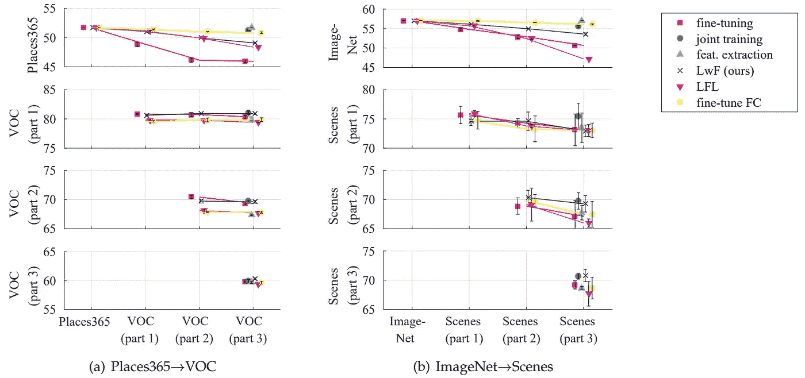

# 学而不忘简化了

> 原文：<https://towardsdatascience.com/learning-without-forgetting-simplified-33243bd0485a?source=collection_archive---------10----------------------->

## 永远学一次

艾萨克·温德兰在 [Unsplash](https://unsplash.com?utm_source=medium&utm_medium=referral) 上的照片

D 得益于卷积神经网络(CNN)，eep 学习最近已经成为计算机视觉任务中的一种主导方法。CNN 在被部署到真实世界的应用之前必须被很好地训练，然而不幸的是，足够的训练数据并不总是可用的。在这个意义上，迁移学习是为了利用预训练模型的知识而发明的，该模型是在足够的数据库上训练的，以解决其他相关问题。然而，迁移学习通常不考虑模型在先前任务中的表现，换句话说，当现在的知识转移到另一个任务中时，细胞神经网络可能会忘记他们以前所学的知识。例如，已经被训练来分类车辆类型的预训练 CNN 分类器被用于使用转移学习来执行汽车类型分类，事实是该模型现在可以很好地识别汽车类型，但是它在车辆类型分类中的表现不如过去。那个例子说明了迁移学习的最大缺点。为了解决这个问题，[学习而不遗忘](https://arxiv.org/abs/1606.09282)已经被提出，据报道它能够在新任务上很好地工作，同时在旧任务上保持相同的性能。

# 多任务学习

图片改编自论文[ [来源](https://arxiv.org/abs/1606.09282) ]

上图是常见的多任务学习方法的工作原理。假设我们有一个预先训练好的模型(a ),其中有 m 个旧任务，我们想向这个预先训练好的模型添加一个新任务。

## 微调

微调方法为新任务添加一个分支(头),然后使用非常小的学习速率重新训练主干和新的头，希望新学习的权重将收敛于新的“好的”局部最小值，该最小值不会离原始值太远。然而，微调的缺点是它降低了模型在旧任务上的性能，因为共享参数是在没有旧任务参数指导的情况下更新的。

## 特征抽出

特征提取方法不是像微调一样重新训练预训练网络的主干，而是在新任务分支中进一步增加更多层，并且只训练这个分支。然而，这种方法有一个主要缺点，即它通常在新任务上表现不佳，因为主干的参数没有被优化来表示新任务数据的区别特征。

## 联合训练

与前面提到的两种方法不同，联合训练方法为新的任务增加了一个新的分支，并对整个网络进行再训练。就准确性而言，联合训练可以被视为最有效的方法。然而，联合训练在训练中变得很麻烦，并且在旧任务训练数据不可用的情况下可能不合适。

这些方法的更多细节可以在[论文](https://arxiv.org/abs/1606.09282)中找到。

# 学而不忘

无遗忘学习(LwF)的目的是学习一个网络，当只有新任务数据时，该网络可以在旧任务和新任务上都表现良好。下图显示了 LwF (e)与其他多任务学习方法(b、c、d)相比的工作原理。

图片来自报纸[ [来源](https://arxiv.org/abs/1606.09282)

如上图所述，LwF 为新任务添加了一个新分支，然后训练所有参数来优化旧任务和新任务。这听起来非常类似于联合训练，然而，这里的区别是旧任务数据不被认为是在训练中使用的。

LwF 的核心理念受到知识蒸馏的启发(如果你不了解知识蒸馏，你可以在这里阅读我的简介[)。我为什么这样说呢？当你看到如下的 LwF 算法的伪代码时，你就知道了:](https://pub.towardsai.net/a-gentle-introduction-to-knowledge-distillation-6240bf8eb8ea)

图片来自纸张[ [来源](https://arxiv.org/abs/1606.09282)

现在你可能明白 LwF 背后的想法了。在[论文](https://arxiv.org/abs/1606.09282)中，作者对图像分类问题进行了实验，所以我想将这个分类问题的算法简化为 2 个步骤，如下:

*   步骤 1:计算每个新任务图像上的预训练模型的输出(概率),并将响应视为新任务数据的“伪标签”。
*   步骤 2:使用旧任务的伪标签和新任务的真标签来训练整个网络以优化所有任务(旧任务和新任务)。

请注意，我给你的是 LwF 的核心思想。阅读全文将为你提供关于算法的更多细节，你会发现尽管这个想法很简单，但它是多么令人惊讶。下表展示了与其他多任务学习方法相比，LwF 的有效性。

图片来自纸张[ [来源](https://arxiv.org/abs/1606.09282)

# 实验

## 单一新任务场景

该实验涉及向预训练模型添加一个新任务。为了直观比较，报告了其他方法与 LwF 相比的性能差异，负值表示 LwF 产生更好的结果，反之亦然。如下表所示，LwF 在新任务上的表现几乎优于所有其他方法，在旧任务上的表现与其他方法不相上下。进一步的分析可以在[的论文](https://arxiv.org/abs/1606.09282)中找到。

图片来自报纸[ [来源](https://arxiv.org/abs/1606.09282)

## 多个新任务场景

第二个实验是将每一个新任务逐渐添加到预先训练好的模型中。当添加新任务数据时，伪标签被重新计算。下图显示了当逐渐添加新任务时，这些方法在每个任务上的性能。就所有任务的整体表现而言，除了联合训练法，LwF 优于所有其他方法。这是可以理解的，因为联合训练需要旧任务和新任务的训练数据，而 LwF 只利用新任务的数据。进一步的分析可以在[论文](https://arxiv.org/abs/1606.09282)中找到。

图片来自纸张[ [来源](https://arxiv.org/abs/1606.09282) ]

# 结论

在这篇文章中，我简要回顾了学习而不遗忘，这是一种 CNN 的多任务学习方法，它帮助 CNN 在新任务中取得良好的表现，同时保持他们在旧任务中的表现。不忘学习可以被认为是微调和知识蒸馏方法的混合(你可以在这里找到我关于知识蒸馏和提示学习的帖子)。无遗忘学习的有效性已经在各种分类问题上得到验证，实验结果表明，无遗忘学习优于几乎其他现代多任务学习方法。

欢迎读者访问我的脸书粉丝页面，分享关于机器学习的事情:[深入机器学习](https://www.facebook.com/diveintomachinelearning)。更多值得注意的帖子可以在这里找到:

*   [约洛夫 4–5D 评论](/yolov4-5d-an-enhancement-of-yolov4-for-autonomous-driving-2827a566be4a)
*   [达克拉斯](/darkeras-execute-yolov3-yolov4-object-detection-on-keras-with-darknet-pre-trained-weights-5e8428b959e2)
*   [EFPN](/efpn-extended-feature-pyramid-network-for-small-object-detection-980af794a093)
*   [数据增强](/data-augmentation-compilation-with-python-and-opencv-b76b1cd500e0)
*   [雾霾数据合成](/synthesize-hazy-foggy-image-using-monodepth-and-atmospheric-scattering-model-9850c721b74e)

感谢您抽出时间！