# 为雅达利游戏复制 DQN 的启示

> 原文：<https://towardsdatascience.com/learnings-from-reproducing-dqn-for-atari-games-1630d35f01a9?source=collection_archive---------18----------------------->

## 从零开始实现这种强化学习算法的真实写照

深度学习研究人员倾向于说，获得更好理解和实践的最快和最有效的方法之一是复制关键论文的结果。我决定试一试，从谷歌 DeepMind 的开创性论文[“通过深度强化学习实现人类水平的控制”](https://www.nature.com/articles/nature14236)开始，谷歌 Deep mind 的深度 Q 网络(DQN)算法在人类甚至超人的水平上玩经典的 Atari 游戏(如 Pong 和 Breakout)。更令人惊讶的是，它的性能推广到大约 50 个 Atari 游戏，使用相同的算法和相同的超参数！

在这里，我展示了我的过程、学习和结果的总结，特别是列出了我遇到的所有错误(甚至是愚蠢的或非常具体的错误！)—我的目的是展示这个项目的原始、真实的写照，这是过去的我在开始时会欣赏的。我还在 GitHub 上开源了我的项目，对于那些对具体实现好奇的人来说:【https://github.com/dennischenfeng/dqn。快速声明:这不是一个操作指南。在为 Atari 游戏构建 DQN 方面，有很多好的指南；我只是想分享我的经历。

在完成这个项目后，我认为它并不像我最初预期的那样令人生畏(它只是需要持续的坚持)，我希望像你一样的读者在阅读后会有同样的感觉！举个例子，我有编写软件的专业经验，但我只是在过去几个月里才真正投入到深度强化学习的研究和实践中。

# 内容

1.  [介绍材料](#8cd3)
2.  [第 1 部分:实现代码初稿](#11cf)
3.  [第 2 部分:简易基准测试](#00cf)
4.  [第 3 部分:Atari 环境下的测试](#1c85)
5.  [第 4 部分:简易基准测试(重温)](#df0c)
6.  [第 5 部分:Atari 环境下的测试(重访)](#cbf6)
7.  [结论](#6239)
8.  [附录:我遇到的其他 bug](#6fcf)

# 介绍材料

在我开始这个项目之前，我已经做了一些阅读和免费的在线课程。为此，我建议:

*   [fast.ai 的《程序员实用深度学习》课程](https://course.fast.ai/)
*   [OpenAI Spinning Up 的短短 3 页《RL 入门》系列](https://spinningup.openai.com/en/latest/spinningup/rl_intro.html)
*   [加州大学柏克莱分校“CS 285:深度强化学习”视频讲座](https://www.youtube.com/playlist?list=PL_iWQOsE6TfURIIhCrlt-wj9ByIVpbfGc)

激励我开始这个项目的其他优秀资源:

*   [马修·拉兹的《经验教训再现深度强化学习论文》](http://amid.fish/reproducing-deep-rl)。关于他从实现一个比我在这里做的更广泛的算法中学到的东西的精彩阅读。
*   [约翰·舒尔曼的“深度 RL 研究的具体细节”视频](https://www.youtube.com/watch?v=8EcdaCk9KaQ)。关于深度 RL 的好建议和直觉，甚至给出了一些具体实现 DQN 的技巧。

# 第 1 部分:实现代码的初稿

在阅读了[论文](https://www.nature.com/articles/nature14236)(尤其是包含伪代码和使用的超参数的补充信息部分)之后，我首先将论文的伪代码翻译成代码。下面是 DQN 算法的一个粗略的概念性分解(遵循本文中的伪代码):

1.  在环境中执行一个动作(雅达利游戏)。用概率ε (epsilon)随机选择动作。否则，选择“最佳”行动，即我们选择基于当前行动价值估计值 q 的最大化价值(回报)的行动。注意，ε在训练过程中缓慢减少(退火),以减少训练后期的探索量(通过随机行动表现出来)。
2.  接收观察(游戏屏幕图像快照)和奖励(游戏分数的增值)并将数据存储在“重放存储器”中为了更新 Q，我们将重复地从重放记忆中取样，类似于我们作为人如何从记忆中学习和改进我们的决策。
3.  从重放记忆中采样数据，粗略地把它当作带标签的训练数据(观察和动作是输入，奖励是标签)，并采取梯度下降步骤来更新 q。
4.  重复一遍。

在我编写代码的时候，将独立的部分模块化，将它们的实现从主算法中分离出来是至关重要的。例如，对于退火的 epsilon(通过训练减少探索)、重放存储器(回放过去转换的存储容器)和观察的预处理(跳帧、灰度、裁剪、堆叠帧)，我为其中的每一个创建了独立的函数/模块，以减少 DQN 实现中的交互和复杂性。

此外，为每个重要的部分和功能编写单元测试，最终在整个项目中为我节省了大量调试时间(如预期的那样),所以这也是值得的。

# 第 2 部分:简单基准测试

为了测试代码，我试图在 CartPole 环境(env)上训练模型，从 [OpenAI 的](https://gym.openai.com/) `[gym](https://gym.openai.com/)`。

然后经过一些学习率的调整，我开始看到一些生命的迹象:剧集回归是在 100 到 200 的数量级上，而最大值是 500。

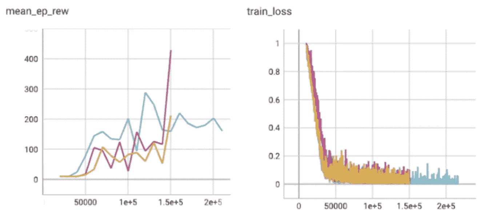

在横竿环境下进行三次训练。(左)X 轴是包络步骤的数量，y 轴是 10 次评估发作的平均发作回报(得分)。注意:横竿最高每集收益为 500。(右)X 轴也是包络步数，y 轴是训练损耗。(图片来源:作者)

仅仅通过手动运行一些不同的超参数迭代，我无法实现达到 500 的训练模型，所以我转向使用 [Optuna](https://optuna.readthedocs.io/en/stable/) 进行通宵自动化 100 次试验超参数研究。它似乎找到了达到最高分的超参数配置，所以我很满意，并进入下一步。**(可惜后来才发现这是侥幸；参见** [**第四部分**](#df0c) **)。**

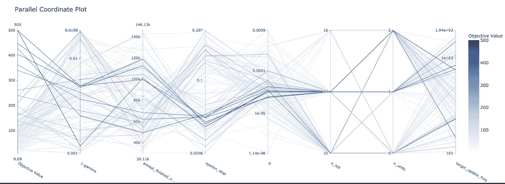

平行坐标图(由 Optuna 生成),用于 100 次具有不同超参数的训练运行。从左到右的每条曲线代表一次训练，与纵轴的交点表示该次训练中每个超参数的选定值。如颜色条所示，深蓝色曲线表示目标值较高(剧集回归)。(图片来源:作者)

# 第 3 部分:Atari 环境下的测试

通过查看 DQN 在各种雅达利环境下的训练曲线(参见[彩虹 DQN 论文](https://arxiv.org/pdf/1710.02298.pdf)的附录)，我选择了 Pong 和 Breakout 作为开始，因为它们在训练早期具有明显的正斜率，也因为我在年轻时玩它们时最了解它们。

*【Bug】在我第一次运行突围的时候，我的评估步骤是拖延进度→原来突围需要你按下“开火”按钮来产生球，否则游戏会闲置！最初，我创建了一个按“FIRE”启动的包装器 env，但后来我创建了一个在空闲后终止游戏的包装器 env(因为我希望模型学习像按“FIRE”这样重要的东西)。*

在这一点上，我的模型实际上是在训练，但它是以蜗牛的速度训练的——大约每小时 100k 步。为了给出背景，原始论文为每个模型训练 200 米环境步骤(4⨉50 米更新步骤)！显然我需要加快速度；有理由相信我的代码中隐藏着一些低效之处。我求助于`CProfile`，这是一个方便的内置 python 包，可以分析函数/方法调用的运行时。

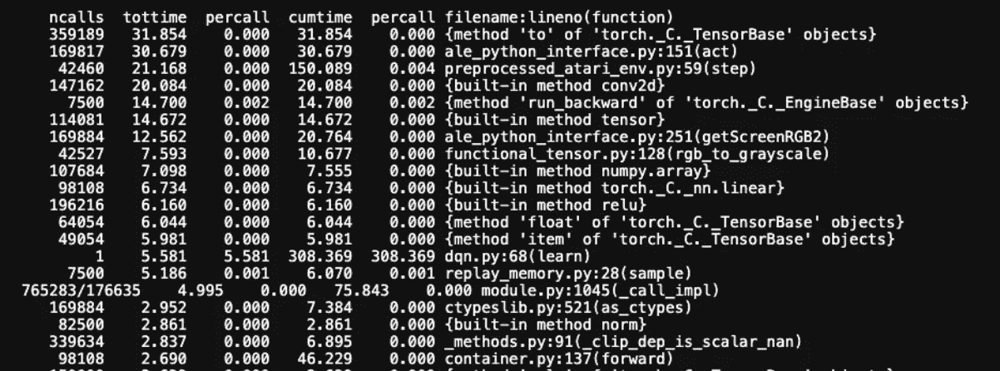

训练运行的 CProfile 输出示例。“tottime”列显示了最后一列中指定的特定函数的计算持续时间(以秒为单位)。(图片来源:作者)

*【Bug】使用* `*Cprofile*` *，我发现了一个令人费解的怪癖，将一个大型 numpy 数组列表转换成 pytorch 张量的效率很低→在转换成 pytorch 张量之前先转换成 numpy 数组要快得多。*

有一段时间，我没有取得太大的性能增益。我试图通过在每一步给它一个参数化的固定奖励来使 env 变得更容易(就像在 CartPole 中)，我增加了 minibatch 的大小以减少随机性，并且我试图通过重复保存模型并在下一次直接培训课程开始时加载它来训练更多的 env 步骤(我必须这样做，因为我的培训课程仅限于给定的小时数)。

尽管如此，性能并不比随机好多少，即使在 5 到 10M 包络步长之后。有点沮丧，但这意味着我可能在某个地方犯了一个至关重要的错误，所以我回到了更简单的环境，通过更快的反馈循环来分析性能。

# 第 4 部分:简单基准测试(重温)

啊哦。我使用之前“优化”的超参数在 CartPole 上进行了 3 次重复训练，得到了以下结果:

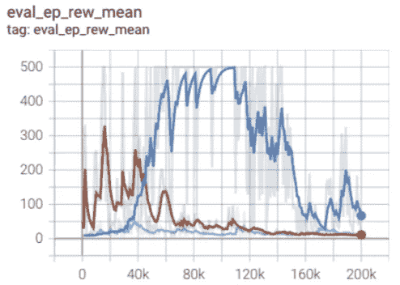

三次(平稳的)横撑训练。x 轴是包络步骤的数量，y 轴是 10 次评估发作的平均发作回报。(图片来源:作者)

看起来每次运行的方差太高了；有时候，在整个训练过程中，剧集回报率都低于 50，这是非常糟糕的。原来我早期的基准测试是侥幸的！

***【大错】在我最初的基准测试中，我跳过了重复性/方差研究，因为我太兴奋了，以至于无法继续进行 Atari envs。这花费了我几个星期的努力。***

通过仔细检查我的代码，大量使用`Cprofile`来识别效率低下的地方，并与一个已知良好的 DQN 开源实现(来自[稳定基线 3](https://github.com/DLR-RM/stable-baselines3) )进行比较，我消除了一些错误。

*【Bug】我的损失函数里有一个因子 2 错了，因为我实现平滑不正确→我最后用了 pytorch* [*的*](https://pytorch.org/docs/stable/generated/torch.nn.SmoothL1Loss.html) `[*smooth_l1_loss*](https://pytorch.org/docs/stable/generated/torch.nn.SmoothL1Loss.html)` *。*

*【Bug】我在用* `*np.random.choice*` *(带替换)对重放内存进行采样，* `*Cprofile*` *告诉我效率相当低→用* `*np.random.randint*` *显著降低了运行时间。*

*【Bug】不小心对每一个梯度步长运行了一个通过目标网络的反向传播(应该长期保持不变)！→在目标网络操作过程中使用* `*torch.no_grad*` *(抑制梯度计算)消除了不必要的反向通道。*

*【Bug】一个 showstopper bug:我不小心把* `*done*` *写成了* `*(1 — done)*` *，其中* `*done*` *不是 0 就是 1，有效地给了 Q 更新一集是否终止的完整相反信息。哦。*

最后，在排除了所有这些错误之后，模型可以可靠地求解 CartPole:

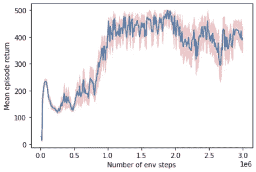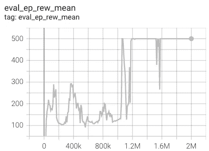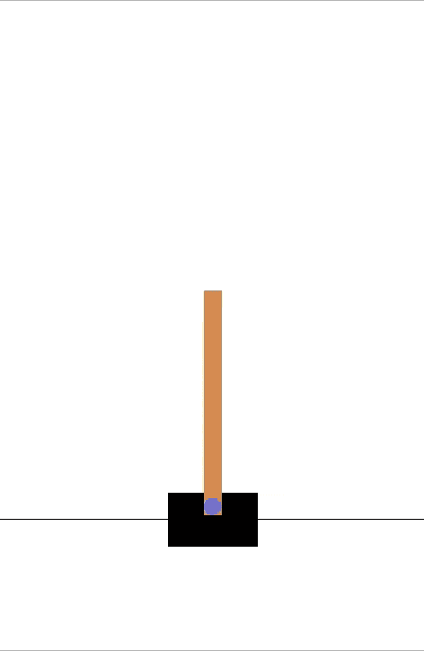

(左)10 次横撑训练的平均值。指示 1 个标准误差的误差带为红色。(中间)代表训练运行，其中 x 轴是包络步数，y 轴是超过 100 个评估集的平均集返回。(右)一个训练有素的代理人的游戏，他的目标是移动手推车，使杆子保持平衡而不倾倒。(图片和 gif 来源:作者)

当代理可以在连续 100 集内达到 475 或更高的平均集回报率时，我们的模型可以稳健地实现这一点(每次运行在培训的某个点达到 500)，则认为 CartPole 环境(`Cartpole-v1`)已经解决。

我从 CartPole 上的 DQN 基准测试中学到的一件事是:不要太担心最初不稳定的性能下降，因为只要有足够的训练，它仍然能够解决环境问题。挑剔的性能下降可能是由于在训练期间发生的分布变化，例如，在模型快速学习的早期，观察值(测试分布)将偏离训练分布。

为了多样化，我也在 FrozenLake 上测试:

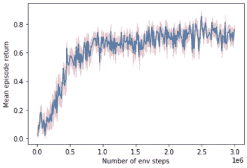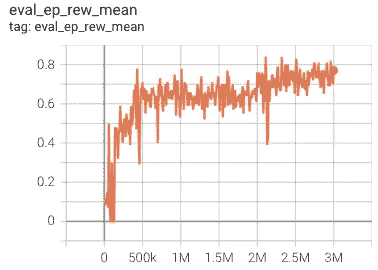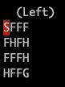

(左)FrozenLake 上 10 次训练跑步的平均值。指示 1 个标准误差的误差带为红色。(中间)代表训练运行，其中 x 轴是包络步数，y 轴是超过 100 个评估集的平均集返回。(右)一个完全训练有素的代理的游戏性，其目标是通过走过冻结的空间 F 从开始位置 S 导航到目标位置 G，而不会掉进洞空间 h。问题是地板很滑，实际的迈步方向可以从预定方向随机旋转 90°。屏幕顶部会显示代理每一步的输入方向。(图片和 gif 来源:作者)

当代理人的平均回报阈值超过 0.78 时，认为 FrozenLake ( `FrozenLake-v0`)已解决。看起来我们的模型也达到了这一点(在训练过程中的某个时刻超过阈值)！

# 第 5 部分:Atari 环境下的测试(重温)

通过 Pong、Breakout 和 Freeway(另一款 Atari 游戏，其训练曲线的初始斜率非常正)进行测试，我欣喜地发现，该模型终于能够学习智能游戏了！

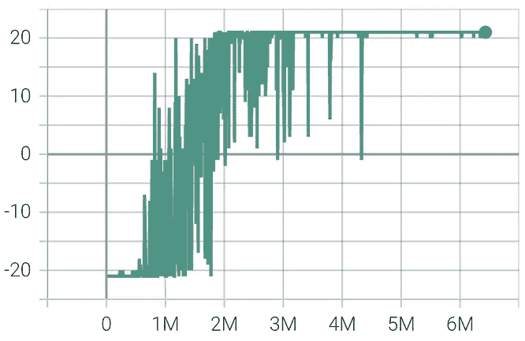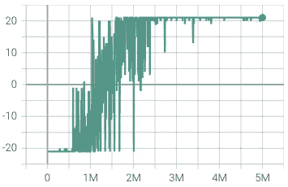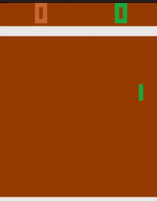

(上图)在 Pong 上运行三次训练，其中 x 轴是包络步数，y 轴是单个评估集的集返回。(下图)完全训练有素的代理人(绿色玩家)的游戏性，其目标是将球击过对手的球拍。在这里，我添加了少量的随机性(10%的随机行动机会)来显示代理如何处理更多样的场景。没有额外的随机性，代理每次都以非常相似的方式击败对手。(图片和 gif 来源:作者)

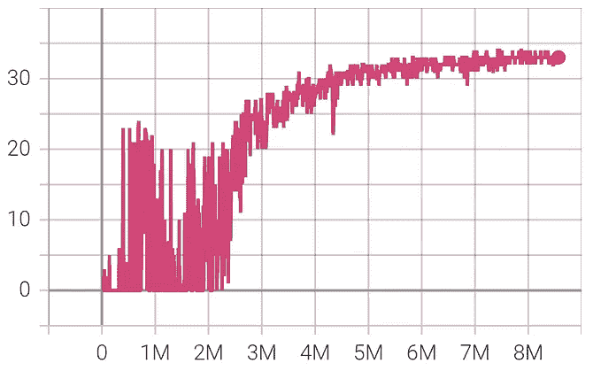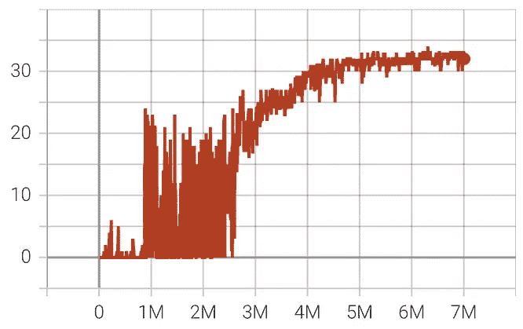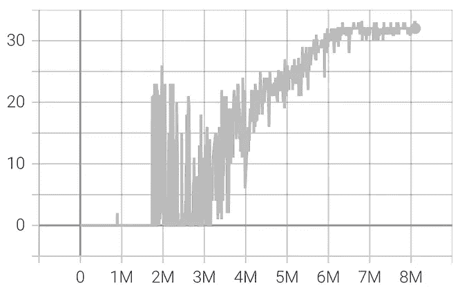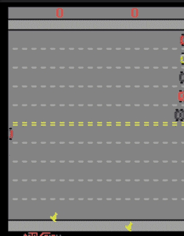

(上图)在 Freeway 上运行三次训练，其中 x 轴是环境步数，y 轴是单次评估剧集的剧集返回。(下图)完全训练有素的代理(左侧玩家)的游戏性，其目标是在避开汽车的同时，尽可能快地引导小鸡穿过马路。(图片和 gif 来源:作者)

至于突破，训练曲线显示它的学习超越了随机行为，但它似乎需要比 Pong 和 Freeway 更多的步骤才能达到人类的表现。我目前正在使用云计算(谷歌计算引擎)来启动更长的运行，我计划在完成后更新这篇文章或开始一个新的！

# 结论

总的来说，这绝对是一个有趣的兼职项目，我会把它推荐给那些对强化学习的本质工程感兴趣的人，因为我自己在做这件事的时候也学到了很多。感谢阅读！

# 附录:我遇到的其他错误

为了完整起见，我在这里展示了我遇到的其他 bug，这些 bug 对我自己的经验来说可能更具体一些，对读者来说可能不太通用。

*【Bug】对于我的第一次运行，即使在 200k env 步骤之后,(训练)集返回几乎没有增加→我发现我忘记增加更新目标 Q 网络的计数器。*

*[Bug]在这个过程的早期，我注意到我的内存使用量达到了最高点，比预期的重放内存字节数高出了大约 10 倍！→啊哈，* `*numpy*` *数组默认使用数据类型* `*float64*` *，而不是预期的* `*uint8*` *。*

*[Bug]在第 3 部分中，为了让 env 更容易学习，我意识到我正在训练一个完整的突围游戏(5 次生命)→重读这篇论文，我发现在 1 次生命后终止是正确的方法。*

*【Bug】一个相当明显的:我了解到我需要手动将网络参数和输入张量发送到 GPU，以便利用它—* `*to(torch.device("cuda"))*` *。此外，我还通过在 GPU 上运行图像预处理(重新缩放、灰度、裁剪)发现了一个加速。*