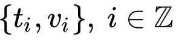
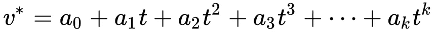
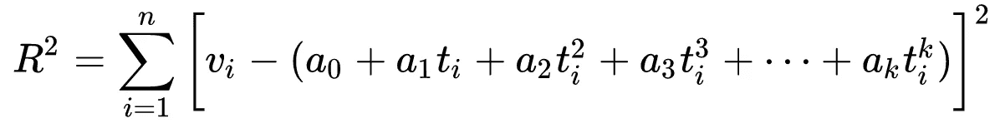
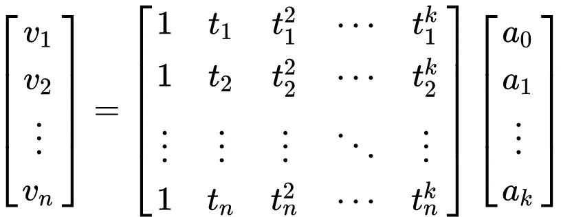
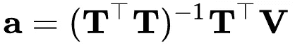
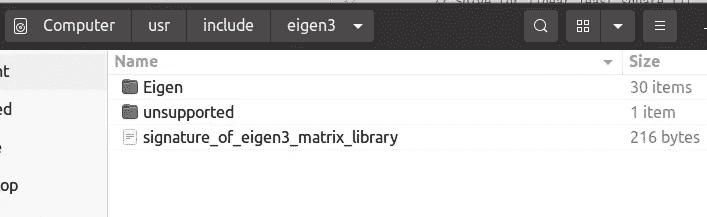
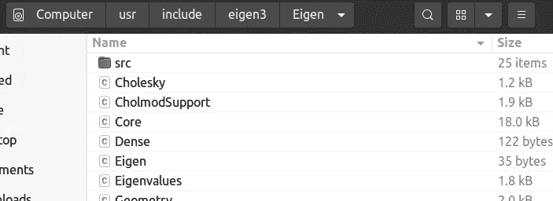
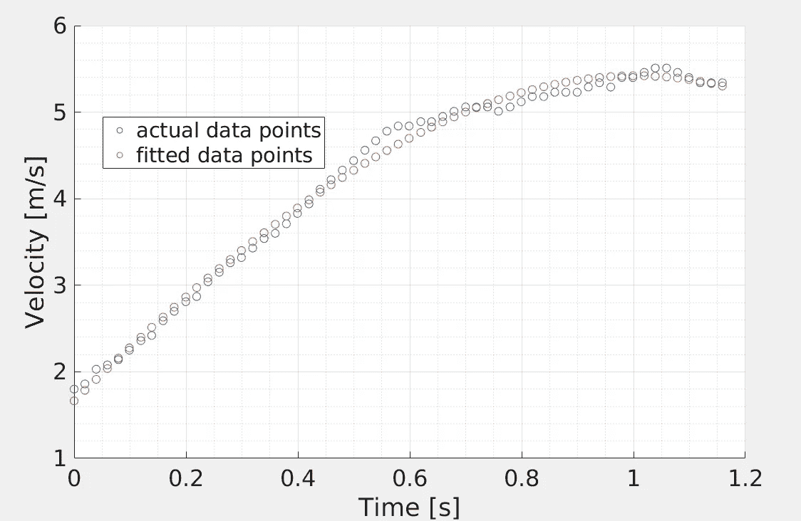

# 用 C++特征包进行最小二乘多项式拟合

> 原文：<https://towardsdatascience.com/least-square-polynomial-fitting-using-c-eigen-package-c0673728bd01?source=collection_archive---------5----------------------->

## 如何快速进行矩阵运算


图片版权:作者

通常，在处理传感器数据(或信号)时，我们会发现数据往往不干净，并表现出大量的噪声。这种噪声使得更难进行进一步的数学运算，例如微分、积分、卷积等。此外，如果我们打算将这种信号用于实时操作，如控制自动驾驶汽车、机械臂或工厂，这种噪声会带来巨大的挑战，因为噪声往往会在任何下游数学运算中放大。

在这种情况下，一种通用的方法是平滑数据以去除噪声。我们寻求以实时方式平滑这些数据，以应用于控制工程，例如自动车辆或机器人的智能控制。已经开发了许多方法来以实时方式平滑信号，例如，**卡尔曼滤波器**、**扩展卡尔曼滤波器、**以及它们的变体。然而，设计卡尔曼滤波器需要系统动力学知识，这些知识可能是已知的，也可能是未知的。在这种情况下，更简单的方法是对接收的最后`n`个数据点执行**最小二乘多项式拟合**。

最小二乘多项式拟合的数学非常简单。考虑一组 ***n*** 数据点



在这种情况下，`k`阶的多项式拟合可以写成:



**等式 1**

这种情况下的残差由下式给出



**等式 2**

最小平方多项式拟合的目的是最小化 ***R*** 。通常的方法是对系数 ***a*** 取等式 2 的偏导数，并使其等于零。这就引出了一个系统的 ***k*** 方程组。这样一个方程组就是[范德蒙矩阵](https://mathworld.wolfram.com/VandermondeMatrix.html)方程组，可以简化并写成如下:



等式 3

在矩阵符号中，我们可以将等式 3 写成


**方程式 4**

方程 4 可以通过预乘 **T** 的转置来求解，因此解向量为



**方程式 5**

# 最小二乘多项式拟合的实现

正如开头所说，这里关注的应用是一个实时系统，它可能必须处理自动驾驶汽车和机械臂等安全关键系统。对于这样的系统，当目标通常是嵌入式系统时，实现的速度很重要。因此，这是用 C++实现的编程语言的常见选择。在本文中，我们使用 C++编写的特征包来求解方程 5。

对于从客车速度曲线获得的样本数据点，下面提供了实现代码。我只是拟合了一个三次多项式。注意，拟合更高次的多项式是计算昂贵的，并且可能根本不需要。

## 编译并运行上述程序

上面的代码是用脑子里的 Linux 系统写的。编译的先决条件是有一个 **g++** 编译器，最好是 **g++ 8** 或更高版本，C++ standard 11 或更高版本。此外，我们假设系统中安装了 Eigen 包。感兴趣的用户可以从[https://eigen.tuxfamily.org/dox/](https://eigen.tuxfamily.org/dox/)下载 Eigen 包，版本 3 tarball，并将其解压到所需的文件夹中。在我的例子中，Eigen 包在`/usr/include/eigen3`处，其目录结构如图 1 和图 2 所示。特征包允许非常快速地执行矩阵数学，这是实时系统所期望的。



**图 1**



**图 2**

一旦你设置了你的 Eigen 包，你可以通过 g++命令编译 [eigen_polyfit.cpp](https://gist.github.com/rahulbhadani/4f7d76e2a69f89ac0940c44adf5efbc9#file-eigen_polyfit-cpp) 程序并执行它

```
g++ -I /usr/include/eigen3 eigen_polyfit.cpp && ./a.out
```

为了可视化，我创建了一个散点图如下所示:



**图 3**

正如你所看到的，与原始数据点相比，拟合的数据点更加平滑，我们可以期待它的导数也更加平滑。

# **参考文献**

1.  [https://web . archive . org/web/20180527223004/http://dovgalecs . com:80/blog/eigen-how-to-get-in-out-data-from-eigen-matrix/](https://web.archive.org/web/20180527223004/http://dovgalecs.com:80/blog/eigen-how-to-get-in-and-out-data-from-eigen-matrix/)
2.  [https://stack overflow . com/questions/8443102/convert-eigen-matrix-to-c-array/29865019](https://stackoverflow.com/questions/8443102/convert-eigen-matrix-to-c-array/29865019)
3.  [https://iamfaisalkhan . com/matrix-manipulations-using-eigen-cplusplus/](https://iamfaisalkhan.com/matrix-manipulations-using-eigen-cplusplus/)
4.  [https://mathworld . wolfram . com/leastsquaresfittingpolynomial . html](https://mathworld.wolfram.com/LeastSquaresFittingPolynomial.html)
5.  [https://eigen . tux family . org/DOX/group _ _ tutorial linear algebra . html](https://eigen.tuxfamily.org/dox/group__TutorialLinearAlgebra.html)
6.  [https://stack overflow . com/questions/40510135/map-two-dimensional-array-to-eigen matrix](https://stackoverflow.com/questions/40510135/map-two-dimensional-array-to-eigenmatrix)