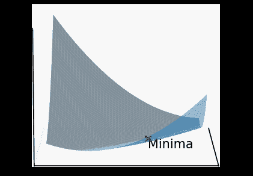
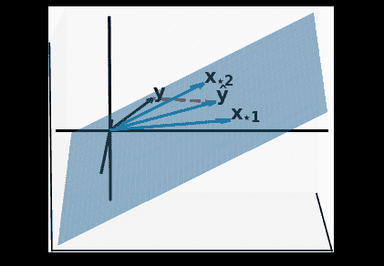
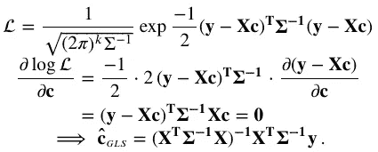

# 线性最小二乘法的不同图像

> 原文：<https://towardsdatascience.com/least-squares-6ee18abfea24?source=collection_archive---------27----------------------->

## 了解微积分图片、线性代数图片和概率图片

当呈现一组点并被要求拟合一条曲线时，我们通常从用一些参数定义一个模型开始。例如，对于一维输入，当自变量(输入)和因变量(输出)具有强线性关系时，熟悉的方程 *y = m x + c* 是合适的模型。在这个方程中，斜率 *m* 和 y 截距 *c* 是需要估计的参数。在统计学中，寻找最优模型参数的过程被称为*回归*。当模型的输出与参数呈线性关系时，我们称之为*线性回归*。给定一个新的输入 *xₙ* ，一个具有最佳参数的精选模型允许我们做出准确的预测 *y* 。

假设模型的输出是参数的线性函数，使我们能够通过*最小二乘法*推导出参数的闭合形式近似。一个很好的特性是，即使对于高维输入，这些近似的封闭形式的性质仍然存在。在这篇文章中，我们将探索线性最小二乘近似的家族，并看看不同的数学分支如何使用完全不同的图片来处理这个问题。

## 数据

让我们从一个具体的例子开始，这个例子来自线性(在参数中)最小二乘法的第一个有记录的应用[2]。在十八世纪晚期，数学家们正忙着试图拟合一个模型来捕捉地球曲率随纬度增加的变化。他们假设在大地纬度 *λ* 的子午线的弧δ*λ*的长度δ*s*采用以下形式


注意，由于 sin 项，该函数在输入中不是线性的，但在参数中继续是线性的。他们的工作使用了几年前在遥远的地方进行的一系列法国调查的数据，样本范围从赤道到北极地区。这里有一个表格，详细列出了一些位置，以及一个常规的散点图。


18 世纪早期法国调查收集的数据。所有长度均为双角度(1/0.256537 米)和角度(2π/400)。虽然这种关系不是严格的线性关系，但我们将进行线性回归。

线性回归旨在基于此类训练数据来估计线性模型的参数。回归的标准方法是计算并最小化模型预测和实际值之间的误差。一个流行的选择是所有平方差的总和。虽然这不是唯一可行的误差函数，但它是最常用的函数，在本文中我们将坚持使用误差平方和。

## 微积分图片

大地测量模型只有两个参数 *c₀* 和 *c₁* 。将训练数据中的每个数据点表示为 *(xᵢ,yᵢ)* ，高中微积分得出参数的最优值。这里 *i* 是上表中的行索引，要最小化的误差函数是误差平方和，


然后我们对误差函数 w.r.t .对每个参数进行微分，并使其等于 0。联立方程的结果系统包含与参数一样多的方程，并使用高斯消去法求解以获得


其中 *x̅* 和 *y̅* 分别为平均输入和输出。我们得到的实际上是线性系统的普通最小二乘(OLS)近似。正如我们将看到的，还存在其他近似。对于简单的低维系统，我们可以把误差函数的表面形象化。

```
%%capture
import numpy as np
import matplotlib.pyplot as plt
from plot_utils import *

x, y, _, _ = get_linear_system('survey_data')
c_0 = np.linspace(25000, 26000)
c_1 = np.linspace(-1000, 1000)
c_0_xx, c_1_yy = np.meshgrid(c_0, c_1)

errs = y[np.newaxis, np.newaxis, :] - c_0_xx[..., np.newaxis] - c_1_yy[..., np.newaxis]*x[np.newaxis, np.newaxis, :]
sum_sq_errs = np.sum(errs**2, axis=-1)
ax = plt.subplot(projection='3d')
ax.plot_surface(c_0_xx, c_1_yy, sum_sq_errs, alpha=0.5)

# Ordinary least squares
x_bar, y_bar = x.mean(), y.mean()
c_1_ols = ((x - x_bar) * (y - y_bar)).sum() \
          / ((x - x_bar)**2).sum()
c_0_ols = y_bar - c_1_ols * x_bar
c_ols = [c_0_ols, c_1_ols, np.sum((y - c_0_ols[..., np.newaxis] - c_1_ols*x)**2)]
ax.scatter(*c_ols, color='r', marker='x')
c_ols[2] -= 1000
ax.text(*c_ols, 'Minima', va='top')
ax.set_xticks([]), ax.set_yticks([]), ax.set_zticks([])

save_animation(ax, 'images/loss.gif')
```



线性系统误差平方和的曲面。对应于表面最小值的 OLS 近似用红叉表示。这可能看起来不像是唯一的最小值，但我请你相信数学！

## 加权最小二乘法

所有可用的数据点可能并不同样可靠，我们可能有证据认为总和中的一些误差应该比其他误差更重要。由于忽略了这些额外的信息，我们最终得到了次优的近似值，这些近似值会受到异常值的强烈影响。在上面的例子中，也许调查者承认在一些地区收集准确的数据是有挑战性的，例如秘鲁的赤道雨林或开普半岛。在拉普兰，也许大雪造成了很大的困难，导致了更糟糕的测量。

有了这些额外的信息，我们用误差平方和的加权和来代替误差函数，并像前面一样进行偏微分。最小二乘近似需要一个小的修改，导致加权最小二乘(WLS)近似。你应该试着自己推导这个公式。让我们对受雪影响的拉普兰地区使用 0.25 的权重，对略有误差的测量使用 0.5 的权重，对其他地区坚持使用 1 的权重。

```
x, y, w, labels = get_linear_system('survey_data')

# Ordinary least squares
x_bar, y_bar = x.mean(), y.mean()
c_1_ols = ((x - x_bar) * (y - y_bar)).sum() \
          / ((x - x_bar)**2).sum()
c_0_ols = y_bar - c_1_ols * x_bar
print(c_0_ols, c_1_ols)

# Weighted least squares
x_w_bar, y_w_bar = (w * x).sum() / w.sum(), (w * y).sum() / w.sum()
c_1_wls = (w * (x - x_w_bar) * (y - y_w_bar)).sum() \
          / (w * (x - x_w_bar)**2).sum()
c_0_wls = y_w_bar - c_1_ols * x_w_bar

x_continuous = np.linspace(0, 1)
y_ols = c_0_ols + c_1_ols * x_continuous
y_wls = c_0_wls + c_1_wls * x_continuous

_, ax = plt.subplots()
ax.plot(x_continuous, y_ols, '--', label='OLS')
ax.plot(x_continuous, y_wls, '--', label='WLS')
ax.scatter(x, y, color='g');
for loc, x_i, y_i in zip(labels, x, y):
    ax.annotate(loc, (x_i, y_i + 6), ha='center', va='bottom')

labels_2d(ax, legend=True)
```


大地测量数据的 OLS 和 WLS 近似法。所获得的参数是不同的，因为我们假设一些观测值比另一些更可靠。因此，在计算误差函数时，它们应该具有更高的权重。

## 线性代数图片

转到每个输入的多个属性或特征，使用向量和矩阵变得势在必行。您可以继续使用相同的图片并使用多变量微积分，但有些人更喜欢不同的几何视图-线性代数图片。让我们用向量矩阵表示法(粗体大写字母表示矩阵，粗体小写字母表示向量)来表示我们的由 *k* 个输入特征和 *n* 个方程(每个数据点一个)组成的线性系统: **X c = y** ，或者


Gilbert Strang 在他的[18–06](https://ocw.mit.edu/courses/mathematics/18-06-linear-algebra-spring-2010/)线性代数课程中引入了矩阵乘法的列空间图，并假设求解任何线性系统都等价于寻找系数来将 **y** 表示为 **X** 的列的线性组合或加权平均。现实世界的过约束系统的问题是 **y** 位于 **X** 的列空间之外，即 **X** 的列的线性组合不会精确地产生 **y** 。最小二乘近似就是向量 **y** 在由 **X** 的列所跨越的子空间上的投影。直观上，这个投影 **ŷ** 是列空间中的向量，根据某种误差度量，该向量最接近 y、。

不幸的是，像我们这样普通的三维生物能够想象线性代数图像的唯一方法是考虑一个由三个带两个参数的方程组成的平凡系统。让我们使用表中的秘鲁、意大利和拉普兰，看看输出向量，以及它在列空间上的投影。此外，为了更好地看到图片，我们将稍微改变输出向量，并考虑一个单位向量系统。

```
%%capture
X, y, _, labels = get_filtered_linear_system('survey_data')

# Normal to the column space plane
normal = np.cross(X[:,0], X[:,1])
xx, yy = np.meshgrid(np.linspace(-.2, 1), np.linspace(-.2, 1))
z = (-normal[0]*xx -normal[1]*yy) / normal[2]

# Project y to the subspace
y_hat = X @ np.linalg.inv(X.transpose() @ X) @ X.transpose() @ y

ax = plt.subplot(projection='3d')
ax.quiver(*np.zeros(3), *X[:,0], arrow_length_ratio=0.1)
ax.quiver(*np.zeros(3), *X[:,1], arrow_length_ratio=0.1)
ax.quiver(*np.zeros(3), *y, arrow_length_ratio=0.1, color='g')
ax.quiver(*np.zeros(3), *y_hat, arrow_length_ratio=0.1, color='c')
ax.plot(*[(c1, c2) for c1, c2 in zip(y_hat, y)], color='r', linestyle='--')
ax.plot_surface(xx, yy, z, alpha=0.5)

ax.text(*y, '$\mathbf{y}$')
ax.text(*y_hat, '$\mathbf{\hat{y}}$')
ax.text(*X[:,0], '$\mathbf{x_{\star 1}}$')
ax.text(*X[:,1], '$\mathbf{x_{\star 2}}$')

labels_3d(ax)
save_animation(ax, 'images/projection.gif')
```



描述过约束线性系统的列空间(蓝色平面)的线性代数图。因为绿色输出向量 **y** 位于列空间之外，所以不可能有精确的解。误差最小的最佳近似值由其投影 **ŷ** (青色矢量)给出。这可以表示为 **X** 的列的线性组合。最后，红色虚线是 **y** 和 **ŷ** 之间的误差。

由于投影 **ŷ** 作为 **y** 的近似值，因此产生的误差就是它们之间的差， **e** = **y** - **ŷ** (红色虚线)。实际上， **e** 垂直于 **X** 的列空间中的每一个向量，准确地说，是其[左零空间](https://www.math.utah.edu/~zwick/Classes/Fall2012_2270/Lectures/Lecture19_with_Examples.pdf)的成员。这样，内积⟨ **Xᵀ** ， **e** ⟩就是 **0** 向量


这相当于早先获得的 OLS 近似。这里很重要的一步是**xᵀx**的[反转，要求 **X** 的列是独立的。有了这张图，OLS 近似的易处理性和唯一性都变得明显了。](https://math.stackexchange.com/questions/691812/proof-of-when-is-a-xtx-invertible)

## 重量呢？

将权重重新排列成对角矩阵，几何线性代数图甚至适用于 WLS 近似。我们用加权内积代替前面推导的内积[1]


这个表达式是广义最小二乘法的一个特例。然而，为了获得更好的直觉，我们需要从概率的角度来看待这个问题。

## 概率图

当处理包含测量误差的数据时，依赖概率论是很自然的，概率论是专门为此目的而发展的数学分支。关于概率机器学习的文本，如 Christopher Bishop 的优秀 [PRML](https://www.microsoft.com/en-us/research/people/cmbishop/prml-book/) 通常以线性(在参数中)最小二乘的观点开始。为了产生与我们早期图片一致的结果，我们将假设每个数据点中的误差是一个[独立同分布(IID)](https://en.wikipedia.org/wiki/Independent_and_identically_distributed_random_variables) 随机变量，该随机变量来自方差σ未知的零均值高斯分布。每个观察值可以表示为


假设每个样本都是独立的，我们可以将观察数据的联合分布表示为各个密度的乘积。这被称为数据的*可能性*，我们最大化该数据以获得最佳参数。最大似然估计(MLE)产生了熟悉的 OLS 表达式，


上面的推导中有相当多的东西需要解开。对数函数的单调性首先将密度的乘积转化为更易于管理的对数密度之和。由于最大化是 w.r.t 对参数 **c** ，有些项(像σ-0.5 log 2**π**σ**)**是常数，可以忽略。最后，我们通过乘以-1 来翻转符号，并将最大化转换为负对数似然的*最小化。*

原来计算欧几里德误差并使其平方和最小化，在高斯噪声不变的假设下，等价于 MLE！对于真实系统来说，这是一个合理的假设，因为误差是来自潜在的许多不同来源的干扰的副产品，如本帖中的[所述。因此，*中心极限定理*验证了高斯作为加性噪声的合适模型。](http://gregorygundersen.com/blog/2019/02/01/clt/)

微积分推导中不同的误差函数对应着线性代数推导中不同的内积定义和概率推导中不同的似然性。例如，计算机视觉中的论文使用*绝对差*作为误差函数，这可以在加性噪声遵循拉普拉斯分布的假设下导出。

## 加权广义最小二乘

一个自然的延伸是看看如果每个误差不再局限于从相同的高斯分布中提取会发生什么。样本仍然是独立的，但不再是相同的分布，并弹出 WLS 公式。概率图也使我们能够推断误差相关的可能性。这是广义最小二乘法的设置，其中所有误差均来自均值为 0 且协方差矩阵为σ的 k 维多元高斯分布。继续 MLE，我们以下面的多元最小化结束，



如果你觉得这很难理解，参考这本[多元微积分食谱](https://www.math.uwaterloo.ca/~hwolkowi/matrixcookbook.pdf)。注意 WLS 近似和 GLS 近似的相似之处。如前所述，WLS 方法是 GLS 的特殊情况，协方差矩阵是对角的。当然，这些条件对 GLS 来说都不是必要的。

## 结论

其设置和公式的简单性使线性回归成为许多社区的一个有吸引力的问题。因此，随着时间的推移，已经开发了各种各样的方法，通常使用不同的图片。本文比较了线性最小二乘法的几种不同观点，这些观点最终产生了相同的闭合形式表达式，尽管图片非常不同。

[1]法内贝克，贡纳。[用于方位和运动估计的多项式展开。](https://www.ida.liu.se/ext/WITAS-ev/Computer_Vision_Technologies/PaperInfo/farneback02.html) (2002 年)，瑞典林雪平大学

[2]伊夫·尼韦尔格特。[最小二乘法在天文学和测地学中的应用教程。](https://www.sciencedirect.com/science/article/pii/S0377042700003435) (2001)，数值分析:20 世纪的历史发展