# 勒贝格测度和积分指南

> 原文：<https://towardsdatascience.com/lebesgue-measure-and-integration-64f5c45d7888?source=collection_archive---------2----------------------->

## 为严格的概率做好准备

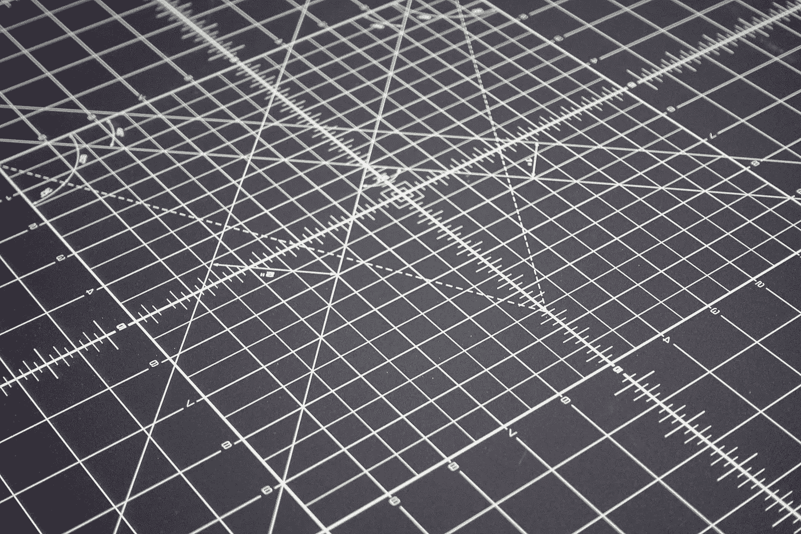

来自[unsprash](https://unsplash.com/photos/xm48Od1W5Ss)的图像

当我们更深入地研究数学时，我们会发现直觉知识逐渐变得不足，例如，当我们遇到更棘手的问题并开始思考什么可以整合时，“区域”的常识就不再适用了。然后“措施”开始发挥作用。勒贝格测度以法国数学家亨利·勒贝格的名字命名，是给几何对象赋值的标准方法。但是这个领域严格的数学计算令人沮丧。本文试图尽可能直观、易懂地介绍勒贝格测度和积分。这篇文章不包括概率论，但是理解测度理论是第一步，对此，我希望这篇文章会有所帮助。

旅程从黎曼积分开始，这是最简单、最直观的积分。简单固然好，但有时不够强大。很快我们就会看到，在这种情况下，黎曼积分完全失败了。

# 黎曼积分——最直接的积分方法

我们用积分来解决区间[a，b]上有界的函数 f 给出的曲线下面积的问题。为了解决这个问题，黎曼和给了我们一个直观的概念。如图 1.1 所示，我们使用矩形来近似曲线。有两种方法，一种是取下黎曼和，如(B)所示，另一种是取上黎曼和，如(A)所示。

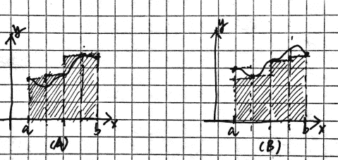

图 1.1 上、下黎曼和。作者的形象

首先，我们把域分成 n 个部分，如果我们想从 a 到 b 积分，那么每个部分的长度是(b-a)/n。取下黎曼和，在每个长度为(b-a)/n 的区间中，我们选择给定函数的下确界。为了计算上黎曼和，我们选择了上确界。更正式一点说，上确界和上确界的定义是

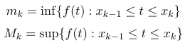

等式 1.1 给定分区中的上确界，等式 1.2 给定分区中的上确界

因此，上、下黎曼和自然由下式给出

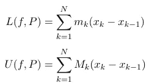

等式 1.3 下黎曼和等式[上]上黎曼和

其中 P = {x₀，x₁，…，xₙ}是一组分割的断点。分割越精细(这意味着矩形变得越细)，近似就越精确。给定面积的积分被定义为当 n(矩形的个数)无穷大时黎曼和的极限。

我们之所以同时定义上下黎曼和，是为了引入以下概念——黎曼可积性。一个函数要可积，就不能爆炸，也就是说，在给定的区间内，函数的积分应该“小于无穷大”。对于黎曼可积的函数，上黎曼和的下确界与下黎曼和的上确界应该相同。这不应该太令人惊讶，因为从图 1.1 中很容易想象。当矩形变得更薄时，近似变得更接近实际曲线，这意味着下黎曼和变得更大，上黎曼和变得更小。

从黎曼可积的定义可以看出，一个连续的(不一定可微，允许有尖峰)函数总是黎曼可积的。

# **勒贝格积分——一种更一般的积分方式**

当一个函数不是黎曼可积的时候该怎么办？一个更强大的工具是勒贝格积分，它是黎曼积分的推广。“概括”实际上是划分的方式。

> 黎曼积分使我们能够将区域划分为连续的等长区间，但勒贝格积分划分给定函数的值域，也划分区域，但方式更灵活。

在[维基百科](https://www.wikiwand.com/en/Lebesgue_integration#:~:text=intuition%20about%20the%20different%20approaches%20to%20integration)上，有一段关于黎曼积分和勒贝格积分区别的生动描述，它是以一座山的海拔为例，在 3D 空间中。图 2.1 显示了两种不同的方法。

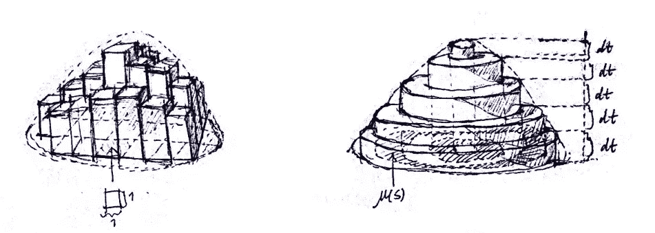

图 2.1 黎曼-达布(左)和勒贝格(右)方法。作者绘制的图像。

我们还知道，由于勒贝格积分是黎曼积分**的推广，如果一个函数是黎曼可积的，那么它就是勒贝格可积的**。形式上，勒贝格积分被定义为(可能是无限的)量

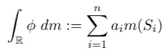

方程 2.1 勒贝格积分的形式定义

其中ϕ是一个勒贝格可测函数，并且该函数的定义域被划分成集合 S₁，S₂，…，Sₙ，m(Sᵢ)是集合 Sᵢ.的测度而 a₁，a₂，…，aₙ都在[0，∞]里。使用勒贝格方法，给定函数使用简单函数*近似。等式 2.1 中给出的ϕ就是这样一个简单的函数**。简单函数是可以想象成如下图所示的阶跃函数的函数***

**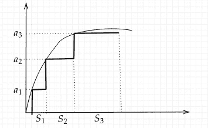**

**图 2.2 简单函数。作者图片**

**这是对函数的非负部分的积分，负部分以同样的方式处理。**

**勒贝格可积但黎曼不可积的函数的一个著名例子是*狄利克雷函数*。我们试图在[0，1]上整合它。其被定义为指示函数，使得当且仅当输入是有理数时，它输出 1，否则它输出 0(它指示一个数是否是有理数)。**

**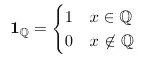**

**等式 2.2 狄利克雷函数**

***为什么不是黎曼可积的？*利用黎曼方法，我们将定义域划分为等长的子区间，由于函数在每个子区间内不连续，那么每个子区间内的上确界总是 1，上黎曼和的下确界也是，每个子区间内的下确界总是 0，下黎曼和的上确界也是。所以 L(f，P) = 0 ≠ 1 = U(f，P)。这不是黎曼积分。那么*为什么它是勒贝格可积的？*为了回答这个问题，我们需要使用下面的定理:**

> **定理 1。每个可数集都有测度 0。**

**这个定理的证明并不太难，但是相当有技术含量。为了直观地理解它，我们可以这样想:真的有很多实数——实数的集合比所有有理数或自然数的集合有更大的基数，这一点由[康托尔](https://www.wikiwand.com/en/Cantor%27s_diagonal_argument)证明。因此，实数的一个区间是非常密集的。如果我们把这个区间以外的有理数都拿出来，区间的大小不变。就像从水中拿走溶解的物质并不会真正改变体积。**

****

**图 2.3 就像一些物质在溶液中扩散，总体积并没有真正改变。图片来自 [Unsplash](https://unsplash.com/photos/SmGEGZCtSgo)**

**有了定理 1，狄利克雷函数的积分就很容易了，就是 1∙S₁ + 0∙S₂，其中 S₁是[0，1]上所有无理数的集合，而 S₂是[0，1]上所有有理数的集合。我们知道 S₂是可数的，因此 S₂ μ(S₂的测度= 0。显然，μ([0，1]) = 1，S₁和 S₂是不相交的，因此μ(S₁) = μ([0，1])-μ(s₂)= 1–0 = 1。因此，[0，1]上的狄利克雷函数的勒贝格积分为 1。**

# **勒贝格可积性**

**上面的讨论给我们带来了一个问题:什么函数是*勒贝格可积的*？答案是，首先函数应该是非负的(对于任意函数，我们可以将负部分和正部分分开，然后减去负部分)可测的，然后如果函数的勒贝格积分不爆炸，我们称此函数为在可测集 E 上关于测度μ可积的函数*【7】(**勒贝格可积的**)***

***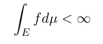***

***方程 3.1 有限函数 f 的勒贝格积分的形式描述***

***文献[5]中基于函数逼近的勒贝格可积性的一个等价定义是，一个函数是勒贝格可积的，当且仅当存在一系列简单函数{fₙ}(我们以前已经探讨过这一点——作为提醒，它们可以被理解为阶跃函数)，使得***

***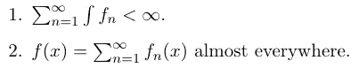***

***方程 3.2 简单函数的条件***

***条件一。对应于勒贝格可积函数应该具有有限的勒贝格积分的事实。第二种情况。提到了一个有趣的术语“几乎无处不在”。它看起来不是很精确，作为一个数学术语应该是这样。然而事实上，它确实有一个精确的含义——如果一个陈述在几乎所有地方都为真，那么它适用于所有具有非零测度的集合。如果该语句在某些元素上失败，则它们包含在度量值为零的集合中。***

***简而言之(也不是很负责任的定义)，勒贝格可测函数是勒贝格可积的，但这个还没说太多。关于勒贝格可积性，我们还需要进一步澄清——我们还需要了解以下概念:勒贝格测度、可测集、可测函数。***

# ***可测量性的定义***

***这里我们添加一些关于符号的注释和一些关于测度空间的基础知识。我们采用了[8]中提到的符号，一对(x，𝔉)表示一个**可测空间**(𝔉是一个σ-代数，它由可测集组成，稍后我们将看到这是基于σ-代数的性质)，三对(x，𝔉，μ)表示**测度空间**(一个其上定义了测度的可测空间)。***

***学习测度论时，了解什么是σ-代数是基础。定义在集合 x 上的σ-代数𝔉是 x 的子集的集合，这些子集在集合补和*可数*并下是闭的(如果它只在有限并下是闭的，它就是一个代数，注意*所有的σ-代数都是代数*，反之则不是)。根据德摩根定律，σ-代数在可数集交下也是闭的。***

***σ-代数的一个重要例子是**Borelσ-代数**(由𝓑表示)，它是利用可数并和相对补数的运算，从沿着实数直线的所有开区间中生成的。这是可能的，因为*扩展定理*(关于这个话题有很多要谈，但我不打算在这里详述)，在这种情况下，它将概率度量扩展到ℝ.的幂集更简洁地说:***

> ***拓扑空间(在我们的上下文中，实轴ℝ)上的𝓑是包含所有开集的最小σ-代数。***

## ***数学中的 Measure 与 measure 的常见用法非常相似***

***在讨论可测量性之前，我们首先来看一下**测量**。测度是将一个实数(我们也称之为测度)赋给一个集合的函数。更精确和正式地，测量函数映射从σ-代数(它是一组可测量的集合)到*扩展*线实数线。扩展意味着正无穷和负无穷都包括在内(ℝ∪{-∞，∞})。这个规范不是多余的。虽然在实数行上我们可以选择一个任意大的数，但是“任意大”和“无限”是不同的，因为∞的行为不同于任何数。测量应满足的条件是***

1.  ***μ(A)在[0，∞]范围内(包括闭区间，∞)。***
2.  ***μ(∅) = 0.空集的测度为零。***
3.  ***可数可加性规则，其形式化为***

***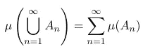***

***等式 4.1 可数可加性***

***其中 A₁，A₂，…，Aₙ是不相交的集合，它们是σ-代数𝔉.的元素因为我们知道它们是σ代数的元素，所以没有必要指定方程 4.1 中的并是可数并。***

***设μ⃰是一个**勒贝格** **外测度**(后面我们会用“外测度”来指代同一事物)，定义为***

***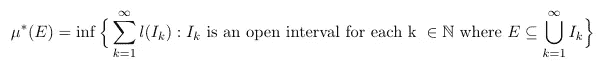***

***等式 4.2 外部度量的定义***

***外测度定义为集合 E 的测度是覆盖集合 E 的开区间的测度并的下确界。这个定义将在后面的可测集一节中再讨论。直觉如图 4.1 所示。外部度量是根据覆盖定义的。有无限多种方法来覆盖给定的区域。当覆盖变得越来越精细时，近似变得越来越精确。***

***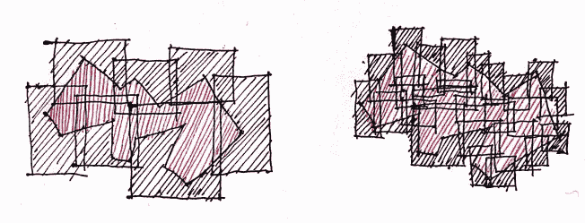***

***图 4.1 外部测量的图示。作者绘制的图像。***

***值得注意的是，由于μ⃰是为实数的所有子集定义的，*它不是一个测度*，即不满足可数可加性。勒贝格测度与外测度有什么关系？**勒贝格测度**是*外部测度*的一个限制——它被限制在(仅定义在)*可测集*上，这意味着，对于可测集，勒贝格测度和外部测度是相同的东西。虽然我们还没有引入可测集，但我们现在知道了勒贝格测度和外部测度之间的关系——勒贝格测度的*域*是外部测度的子集。***

***还是挺抽象的。我们对**勒贝格测度**了解多少？在一维、二维和三维欧几里得空间中，勒贝格测度与长度、面积和列相同。在 n 维空间中，其中 n 大于 2，测度定义如下，我们称之为 n 体积。[6]它是沿着ℝ线从勒贝格山延伸出来的***

***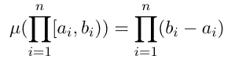***

***等式 4.3 勒贝格测度***

***可以定义满足上述属性的不同度量。勒贝格测度就是这些测度中的一种，它在实分析中具有重要的意义。再比如*概率测度*，被认为是现代概率论的基础。***

***现在我们有三个不同的 n 维空间ℝⁿ子集的集合，它们是 Borelσ-代数(𝓑ₙ)、勒贝格σ-代数(𝓛ₙ)和ℝⁿ.的幂集它们之间的关系如下所示***

***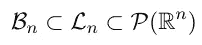***

***Borelσ-代数、lebesgueσ-代数与ℝⁿ幂集之间的关系***

***为什么会这样呢？验证集合 x 是否是真集 y 的典型技巧是在 y 中找到不在 x 中出现的元素。我们以ℝ为例(n=1)，第一个包含为真，因为 Borel 集合是从所有开区间生成的，这些开区间是紧的。有些集合在勒贝格勒贝格σ-代数中，但不在 Borelσ-代数中，它们的测度为零。一个非常简单的例子是单例集:{x}，其中 x 是一个实数。第二个包含是真的，ℝ的子集*不可测量*。(维塔利集就是一个例子)***

## ***可测量的集合——大部分时间我们都在处理可测量的集合，但是很多集合是不可测量的***

***不久将介绍定义可测集的两种不同方法，这两种方法都使用方程 4.2 中定义的勒贝格外测度。集合 A ⊂ X 称为μ⃰-measurable，如果它满足[4]***

***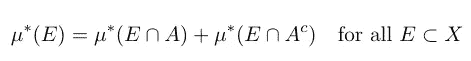***

***等式 4.4 集合 A 可测的条件***

***这也被称为**卡拉思·奥多里准则**。但在一些文献中，可测性被定义为*a 的内测度(μ⁎)和外测度(μ⃰)相等。*(【3】)。***

***使用诱导外测度定义了**内测度**，这意味着我们使用外测度来逼近 E 的*真子集* *子集*，并且该外测度的上确界将是 E 的内测度***

***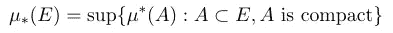***

***等式 4.5 内部度量的定义***

***其中紧致意味着 A 是闭的(不是开集)有界的(不趋向无穷或负无穷)。***

***所有可测集的族是丰富的，几乎所有能被明确定义的集都是可测的，例如，从零到一的区间(不管是开的还是闭的)是可测的并且有测度一，测度一就是它的长度。如前所述，有不可测量的，它可能看起来只有几个，但事实上，有很多。*不可测集的集合的基数和可测集的基数*一样大，也和𝓟(ℝ的基数一样(实数的所有子集的集合)。***

***有趣的事实是，我们无法真正构造一个不可测的集合，存在与否取决于选择公理(AC)。而 AC 本身就是一个有问题的东西。尽管是有用的，AC 只是陈述了一个选择的存在，而不是它的可能构造。因此，它使得一些奇怪的陈述成为可能，比如实数集上有一个全序(AC 等价于良序定理)，但是没有人知道这种有序是如何实现的。***

## ***从可测函数到勒贝格可测函数***

***首先，我们将澄清一些关于函数的混淆术语，即定义域、余定义域、值域、原像和像。我们将通过一个具体的例子 f 来阐明它们:ℝℝ，并被定义为 f(x) = x。该函数的**域**将是为该函数定义的元素的最大集合，在这种情况下，它是整个ℝ，因为 f(x)是为所有实数定义的。**余域**给定为ℝ，我们知道变换 f(x)在ℝ.内**范围**是定义域的子集，它是定义域被 f 映射到的整个集合，在这种情况下，它是[0，∞]。**图像**是共域的任意子集，例如【4，16】，**原像**是图像映射到的集合，如果图像是【4，16】，则原像是【2，4】。***

***可测函数的定义有几种不同的版本。无论定义如何公式化，*一个* **可测函数** *是一个保持集合*拓扑结构的函数(非常类似于同态的思想)。考虑度量空间(x，𝔉，μ)(下面两个不同定义的讨论可以在这里找到，但是我们采用与本文中使用的相同的符号)***

***第一个定义陈述如下[8]:***

> ***函数 f:xℝ被称为可测的，如果 f⁻ (B)是 x 的可测子集，无论何时ℝ的 Borel 子集(快速提醒:Borel 子集是区间生成的σ场)。***

***根据[这个](https://cpb-us-w2.wpmucdn.com/sites.wustl.edu/dist/4/2002/files/2019/07/Lecture2.pdf)的另一个定义:***

> ***函数 f:xℝ被称为所有α ∈ ℝ的可测函数，{x | f(x) > α} ∈ 𝔉，这意味着(α，∞)的原像在σ代数𝔉.中***

***第二个定义也认为𝔉是 Borelσ-代数，在这种情况下，这两个定义是重要的。无论如何，从这些定义中，我们可以看到，可测函数将σ-代数中的一个集合(回想一下，σ-代数是集合的集合)映射到σ-代数中的另一个集合——这两个集合都是可测的(从可测空间)。从 x 到 y 的函数的一个更一般的定义引入了(𝓜，𝓝)-measurable)的概念，它推广到所有的定义域和余定义域[4]***

> ***设 f:x y 是两个集合之间的函数，(x，𝓜)，(y，𝓝)是可测空间。f 被称为(𝓜，𝓝)-measurable(或仅当𝓜和𝓝在上下文中被理解时可测)，如果 f⁻ (E) ∈ 𝓜对所有 E ∈ 𝓝.***

***另外，**勒贝格可测函数**是可测函数 f:ℝℂ，其中(ℝ，𝓛)和(ℂ，𝓑꜀)是可测空间，𝓛是勒贝格可测集的σ-代数，𝓑꜀是复数上的 Borel 代数。这些函数是可以在比黎曼积分更广的意义上被积分(勒贝格可积)的函数。***

***我们可以看到，函数是否可测取决于 X，Y 和σ代数。现在让我们看两个关于相应σ-代数的可测和不可测函数的例子。[10]***

***找到可测函数很简单——常数函数 f(x) = c 是可测的。因为对于任何开集 D ⊆ ℝ，f⁻ (D)不是(c ∈ D)就是整个ℝ (c ∉ D)。***

***什么时候函数是不可测的？考虑 x 是区间[0，1]和定义在 x 上的σ代数，𝒜= { 0，1/2 }，[1/2，1]，[0，1]}，函数 f: [0，1]ℝ定义为 f(x)= x。f 不是𝒜-measurable，因为 G = (0，1)是开放区间，而是 f⁻ (D) ∉ 𝒜.***

****总结****

***在这篇文章中，我们介绍了测度论中的一些重要概念——测度、可测集和可测函数，重点介绍了在数学分析中非常重要的勒贝格测度。我们从黎曼积分开始，看看它如何在一些棘手的函数上失败，然后我们介绍勒贝格积分，它把我们带到可测性和相关的概念。这篇文章的内容为严格的概率论铺平了道路。***

***资源:***

***[1] [*黎曼积分*](https://math.fel.cvut.cz/mt/mtold/txtd/1/txe3da1a.htm) ，2021 年 9 月 6 日获取***

***[2]约翰·纳克巴(2017)。[基本勒贝格积分 。华盛顿大学。](https://cpb-us-w2.wpmucdn.com/sites.wustl.edu/dist/3/2139/files/2019/09/integration.pdf)***

***[3]弗朗西斯·j·纳乔维奇(2014 年)。 [*勒贝格积分的注记*](https://www.math.tamu.edu/~fnarc/m641/m641_notes/lebesgue_integral.pdf) 。***

***[4]福兰德，G. B. (1999 年)。 [*真题解析:现代技术及其应用*(第 40 卷)](https://books.google.cz/books?hl=cs&lr=&id=N8jVDwAAQBAJ&oi=fnd&pg=PA1&dq=Real+analysis:+modern+techniques+and+their+applications+(Vol.+40)&ots=qeDMf0HhBS&sig=wRYcdKa3ZNh62akxjMBW1JvsxNA&redir_esc=y#v=onepage&q=Real%20analysis%3A%20modern%20techniques%20and%20their%20applications%20(Vol.%2040)&f=false)。约翰·威利的儿子们。***

***[5]约翰·伦茨。[T5【勒贝格可积】T6](https://mathworld.wolfram.com/LebesgueIntegrable.html)。来自 MathWorld——一个 Wolfram 网络资源，由 Eric W. Weisstein 创建。***

***[6] Kesavan S. (2019) [*勒贝格测度*](https://link.springer.com/chapter/10.1007%2F978-981-13-6678-9_2) 。在:测量和集成。数学课本和阅读材料。新加坡斯普林格。***

***[7]罗伊登，H. L .，&菲茨帕特里克出版社(1988 年)。 [*真实分析*](https://d1wqtxts1xzle7.cloudfront.net/52294021/royden-fitzpatrick-with-cover-page-v2.pdf?Expires=1631470382&Signature=H4e0qO07NWAjinatgPEO~bu89imKdAOjcxj4lz5RG30~DJn17y5Jp0jQ8pynzGH5pA3W6NL8lGgite4GhmloRU9my5OFOrVrV6exMAPpbidS1uKX-YxLomg-1iWMS9vUMR3K6~3fkkCkqcBhrR2mlTRl~WpZM1bbzRA9gdFvX7khrGnHl40FQzcjxpO9tzNDv~IAzEvFC3TJUBo6DzVCuOwLndtFxTeAY-zMX8m~6m3ScLG18VF~jM6vWaCXbA8QxpilTrMelRFmg-V~9csxF6q48y~H3gaVG0oamXuvyjHt7jdVl1U7ZTIfBqSJYsmdGN~t5pYMMcUcjqjrjkSN1A__&Key-Pair-Id=APKAJLOHF5GGSLRBV4ZA) (第 32 卷)。纽约:麦克米伦。***

***[8]斯特里查茨，R. S. (2000 年)。<https://books.google.cz/books?hl=cs&lr=&id=Yix09oVvI1IC&oi=fnd&pg=PR13&dq=The+way+of+analysis&ots=6OdIBgu6SM&sig=F62O3ccoHVjy7VwtfCvrOl1ZOgE&redir_esc=y#v=onepage&q=The%20way%20of%20analysis&f=false>*的分析之道。琼斯&巴特利特学习。****

****[9]何塞·a·费森达·阿吉雷，弗朗西斯科·j·弗雷尼切(2004 年)。 [*勒贝格测度的一种构造*](https://personal.us.es/facenda/lebesguefinal.pdf) 。****

****[10]彼得罗瓦伊博士(2019 年)。[*不可测勒贝格函数的一些例子*](https://www.sciencedirect.com/science/article/pii/S2351978919302999) 。Procedia 制造公司，640–642。****

****[11] [扩张定理:一个构造测度的工具](https://ocw.mit.edu/courses/mathematics/18-175-theory-of-probability-spring-2014/lecture-slides/MIT18_175S14_Lecture2.pdf)。于 2022 年 1 月 25 日访问。****

****变更日志:****

****(1)更恰当地解释了 Borelσ-代数，补充了文献[11]。****

****(2)“…的变化意味着下黎曼和变得**更大**，上黎曼和变得**更小**写的是反面。****