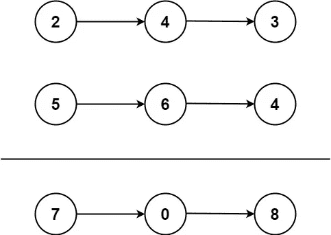

# LeetCode 问题 2:用 Python 添加两个数的解决方案

> 原文：<https://towardsdatascience.com/leetcode-problem-2-python-1c59efdf3367?source=collection_archive---------3----------------------->

## [面试问题](https://towardsdatascience.com/tagged/interview-questions)

## 理解如何用 Python 中的链表高效地解决两个数相加问题


照片由[丹尼尔·弗兰奇](https://unsplash.com/@daniele_franchi?utm_source=unsplash&utm_medium=referral&utm_content=creditCopyText)在 [Unsplash](https://unsplash.com/s/photos/problem?utm_source=unsplash&utm_medium=referral&utm_content=creditCopyText) 上拍摄

## 介绍

当谈到技术面试准备时，最有用的平台之一是 LeetCode，它给你提供了数千个不同难度的问题。

在今天的指南中，我们将介绍平台上第二个问题的解决方案，名为将两个数字相加，涉及链表，难度中等。这个问题可能出现在任何工程和 ML 职位的技术面试中。

请注意，如果您还没有尝试解决这个问题，我强烈建议您在查看解决方案之前尝试一下，该解决方案将在本文接下来的几个部分中详细介绍。

## 问题是

> 给你两个非空的**链表，代表两个非负整数。数字以逆序存储在**中**，它们的每个节点包含一个数字。将两个数相加，并以链表的形式返回总和。**
> 
> 您可以假设这两个数字不包含任何前导零，除了数字 0 本身。

**例 1:**



```
**Input:** l1 = [2,4,3], l2 = [5,6,4]
**Output:** [7,0,8]
**Explanation:** 342 + 465 = 807.
```

**例 2:**

```
**Input:** l1 = [0], l2 = [0]
**Output:** [0]
```

**例 3:**

```
**Input:** l1 = [9,9,9,9,9,9,9], l2 = [9,9,9,9]
**Output:** [8,9,9,9,0,0,0,1]
```

> 约束 **:**
> 
> 每个链表中的节点数在范围`[1, 100]`内。
> 
> `0 <= Node.val <= 9`
> 
> 保证该列表表示一个没有前导零的数字。

来源: [LeetCode](https://leetcode.com/problems/add-two-numbers/)

## 解决方案演练

首先，我们需要确保我们将**利用问题描述中**提供的所有信息和细节。对于这个特定的例子，这些细节是:

*   两个非空的链表
*   表示**非负**整数
*   数字以相反的顺序存储在**中**

前两点实质上缩小了问题的范围，因为处理空链表或表示负和/或正整数的链表可能会更棘手一些。

现在，最后一点信息也很重要，我们实际上可以利用它。由于链表所表示的数字是逆序的，这实际上可以帮助我们在将两个数字相加时进行进位运算。

现在让我们开始研究我们的算法，它最终会给出问题的正确解决方案。

首先，我们需要初始化 3 个变量。第一个将保存在每一步将被转发的进位，第二个将是一个表示最终结果的链表(最初设置为值 0)，第三个将是我们的指针，它将被用来在每次迭代中移动到下一个节点。

```
**carry = 0
result = ListNode(0)
pointer = result**
```

此时，您可能需要回忆一下 Python 中共享引用的工作方式，因为`pointer`中的任何更新都会对`result`产生直接影响，而且这两个变量共享同一个对象引用。

现在我们已经初始化了这些变量，我们可以开始遍历链表了。本质上，我们需要不断迭代，直到两个列表中不再有节点，并且不再有额外的单元。因此，一个具有如下所示条件的`while`循环应该可以完成这个任务:

```
carry = 0
result = ListNode(0)
pointer = result**while (l1 or l2 or carry):**
```

然后我们需要从单个节点中检索数字。由于链表可以有不同的大小(或者甚至到达两个链表的末尾，但是仍然有一个单元)，我们还需要处理节点的值为 None 的情况。

```
carry = 0
result = ListNode(0)
pointer = resultwhile (l1 or l2 or carry): **first_num = l1.val if l1.val else 0
    second_num = l2.val if l2.val else 0**
```

然后我们需要执行加法，看看这是否会有任何影响。为此，我们首先将这两个数字以及`carry`相加。然后，我们通过取总和与数字`10`之间的模来计算解的下一位数字，然后通过执行总和与数字`10`之间的地板除法来计算`carry`。

例如，如果两位数之和为`12`，则`num`变量将被设置为`2`(因为`12 % 10 = 2`)，进位将为`1`(因为`12 // 10 = 1`)。

```
carry = 0
result = ListNode(0)
pointer = resultwhile (l1 or l2 or carry): first_num = l1.val if l1.val else 0
    second_num = l2.val if l2.val else 0 **summation = first_num + second_num + carry
    num = summation % 10
    carry = summation // 10**
```

最后，我们将结果存储到指针(这也将更新`result`，因为这两个变量共享对同一对象的引用)并将指针移动到下一个节点(如果有):

```
carry = 0
result = ListNode(0)
pointer = resultwhile (l1 or l2 or carry): first_num = l1.val if l1.val else 0
    second_num = l2.val if l2.val else 0 summation = first_num + second_num + carry
    num = summation % 10
    carry = summation // 10 **pointer.next = ListNode(num)

    pointer = pointer.next
    l1 = l1.next if l1 else None
    l2 = l2.next if l2 else None**
```

最后，我们返回`result.next`，因为结果的初始节点实际上是一个`0`。

```
carry = 0
result = ListNode(0)
pointer = resultwhile (l1 or l2 or carry): first_num = l1.val if l1.val else 0
    second_num = l2.val if l2.val else 0 summation = first_num + second_num + carry
    num = summation % 10
    carry = summation // 10 pointer.next = ListNode(num)

    pointer = pointer.next
    l1 = l1.next if l1 else None
    l2 = l2.next if l2 else None**return result.next**
```

## 解决方案的完整代码

```
class Solution:
    def addTwoNumbers(self, l1: Optional[ListNode], l2: Optional[ListNode]) -> Optional[ListNode]:
        carry = 0
        result = ListNode(0)
        pointer = result

        while (l1 or l2 or carry):

            first_num = l1.val if l1.val else 0
            second_num = l2.val if l2.val else 0

            summation = first_num + second_num + carry

            num = summation % 10
            carry = summation // 10

            pointer.next = ListNode(num)

            pointer = pointer.next
            l1 = l1.next if l1 else None
            l2 = l2.next if l2 else None

        return result.next
```

## 时间复杂度

算法开发中最重要的一个方面是时间复杂度，在评估解决方案作为技术访谈的一部分时也要考虑到这一点。

假设`l1`链表的长度是`m`而`l2`链表的长度是`n`，那么我们最多迭代`m`或`n`次，这取决于两者中谁的节点更多。因此算法的时间复杂度为`O(max(m, n))`。

## 最后的想法

在今天的文章中，我们讨论了关于 LeetCode 的一个颇具挑战性的问题，这是第二个问题，叫做“两个数相加”，它涉及到最基本的数据结构之一，即链表。

请注意，这个问题可能有其他解决方案。请随时留下任何潜在改进的评论，我非常乐意讨论您的意见！

[**成为会员**](https://gmyrianthous.medium.com/membership) **阅读介质上的每一个故事。你的会员费直接支持我和你看的其他作家。你也可以在媒体上看到所有的故事。**

[](https://gmyrianthous.medium.com/membership) [## 通过我的推荐链接加入 Medium-Giorgos Myrianthous

### 作为一个媒体会员，你的会员费的一部分会给你阅读的作家，你可以完全接触到每一个故事…

gmyrianthous.medium.com](https://gmyrianthous.medium.com/membership) 

**你可能也会喜欢**

[](/leetcode-problem-1-python-ec6cba23c20f) [## Python 中的 LeetCode 问题 1 解决方案

### 讨论了 LeetCode 中两个和问题的最优解的方法

towardsdatascience.com](/leetcode-problem-1-python-ec6cba23c20f)