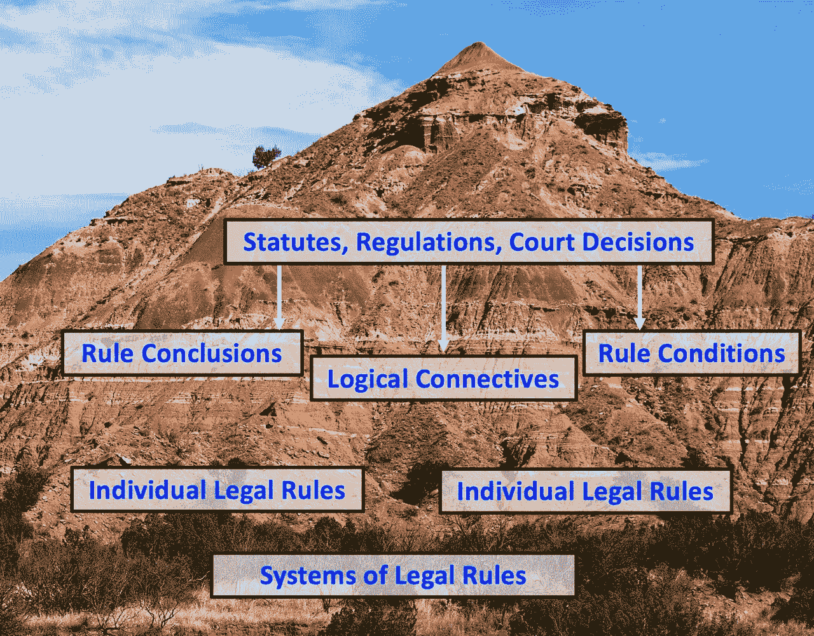
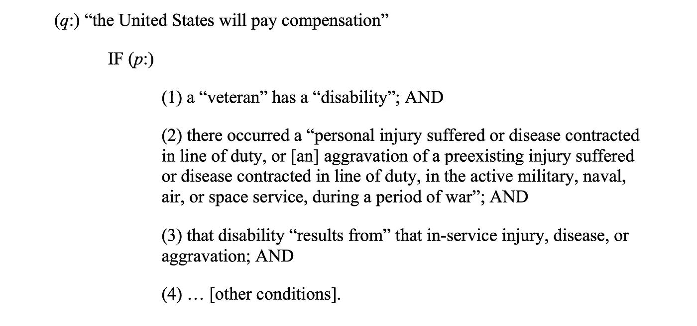
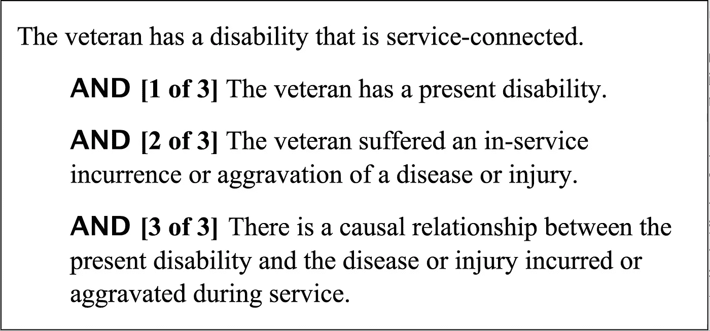
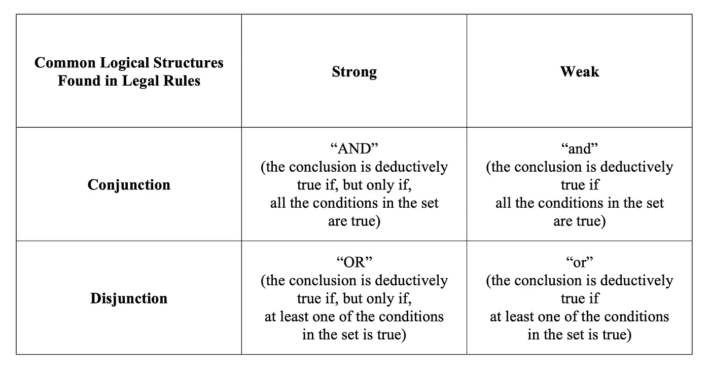
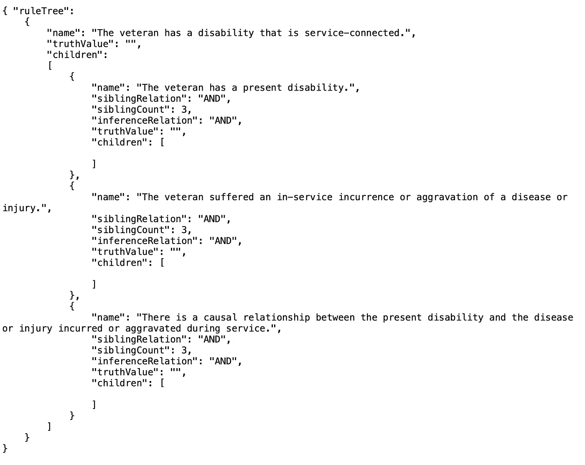

# 法律规则构成了法律文件中的推理

> 原文：<https://towardsdatascience.com/legal-rules-structure-the-reasoning-in-legal-documents-fbd59c67a17b?source=collection_archive---------30----------------------->

## 为什么获取法律规则对于使法律可计算至关重要

维恩·R·沃克的图片，[迈克尔·泽兹奇](https://unsplash.com/@lazycreekimages?utm_source=unsplash&utm_medium=referral&utm_content=creditCopyText)在 [Unsplash](https://unsplash.com/s/photos/mountain-soil-layers?utm_source=unsplash&utm_medium=referral&utm_content=creditCopyText) 上的照片

除非我们让法律规则可计算，否则我们无法让法律可计算。[数据科学在法律领域面临的一个巨大挑战是以可计算的格式捕获监管法律规则](/7-challenges-for-argument-mining-in-law-fb98a6df7b0c)。什么是法律规则？它们陈述了触发法律的条件，确定了在法律诉讼中需要证明的问题，并构建了证明过程本身。我们在哪里能找到他们？他们如何约束法律推理？单个的规则组合成规则系统了吗？我们如何以数字方式存储这样的系统，用于计算？在这篇文章中，我提供了这些问题的答案。

# 什么是法律规则？

作为一名律师，我总是识别约束我论点的法律规则。法律规则是一种特殊的条件命题。(详见我的文章[《法律事实认定的默认逻辑范式》(2007)47*juri metrics*193](https://sites.hofstra.edu/vern-walker/2019/12/04/default-logicparadigmlegalfact-finding/)。)一个**条件命题**是当 *p* 为真时，则 *q* 也为真的陈述，其逻辑形式为“ *if p，then q* ”变量“ *p* ”(称为“规则条件”)代表触发规则应用的任何命题。变量“ *q* ”代表另一个命题，规则的结论。它声明某些事件状态为真或为假(出于法律目的)，并且它可能要求、禁止或允许某些人或实体的某些行为。我们说 *p* 隐含或陈述了 *q* 的逻辑充分条件。

当然，并不是每一个条件命题都是*法律*规则。如果我走进雨里，我会淋湿的。要成为一个**法律规则**，条件命题必须被法律权威采纳并具有法律效力。它在相关法律管辖范围内普遍适用。我们律师说，由法律规则授权的推理遵循“作为法律问题”事实上，在雨中行走会让我淋湿。没有人立法规定——这是自然发生的。法律推理是由法律权威所保证的，这与由常识、物理或数学所保证的推理截然不同。

# **法律规则的来源(1):法规和规章**

法令和规章是法律规则的主要来源。在法规和规章中，几乎每一句话都建立了一个或多个法律规则。这些句子往往语法复杂，逻辑严密，因为它们的主要功能是尽可能精确地陈述复杂的法律条款。法治要求一个司法管辖区的实在法尽可能精确和透明。

例如，下面的一句话确立了向美国退伍军人发放伤残福利金的基本规则:

> 对于在战争期间在现役陆军、海军、空军或航天部队中因公受伤或患病导致的残疾，或因先前受伤或患病加重而导致的残疾，美国将向任何因公受伤或患病退伍的退伍军人支付赔偿金， 或先前存在的损伤或疾病加重，则按本分章规定给予赔偿，但如果残疾是由退伍军人自己的故意不当行为或滥用酒精或药物造成的，则不予赔偿。

这句话出现在《美国法典》第 38 篇第 1110 节(38 U.S.C. 1110)。在战争时期以外，也有类似的现役规定(《美国法典》第 38 卷第 1131 节)。

这和数据科学有什么关系？对于律师来说，正确地捕捉这一句话所表达的所有复杂性已经足够具有挑战性了，更不用说软件了。我们可以从这句法定语句中提取出以下法律规则:

图片由 Vern R. Walker， [CC BY 4.0](https://creativecommons.org/licenses/by/4.0/) 。

一个困难是在法规文本中确定结论及其条件。另一个困难是确定我们什么时候已经确定了*所有*得出结论的条件。一个单独的法律条款可能规定一些规则条件，但其他规则条件可能出现在其他法律条款或行政法规或上诉法院的判决中。

# **法律规则的来源(2):上诉法院案例**

上诉案件中的法院判决是法律规则的额外来源。上诉法院在运用法律规则来裁决案件时，通常会解释法令或规章语言的含义。例如，美国联邦巡回上诉法院在 *Shedden 诉 Principi* ，381 F.3d 1163，1166–67(Fed。Cir。2004)，写下了这句与我上面开始摘录的法律规则相关的话:

> 退伍军人索赔上诉法院正确地指出，为了确定目前残疾的服役关系或服役关系恶化，退伍军人必须证明:(1)目前残疾的存在；(2)在职期间疾病或伤害的发生或加重；(3)目前的残疾与服役期间发生或加重的疾病或伤害之间的因果关系。

但是与我上面的法定规则版本不同的是，这个来自上诉法院判决的判决创造了一个法律规则，对法院管辖范围内的案件具有约束力。

繁忙的法院倾向于以实用的方式制定他们的法律规则。来自 *Shedden* 的这句话提供了一个清晰的、可操作的规则，我在下图中表示了这个规则。规则结论(待证明)在最上面，规则条件列在(缩进)结论下面。

图片由 Vern R. Walker 拍摄， [CC BY 4.0](https://creativecommons.org/licenses/by/4.0/) 。

我想指出四个逻辑特征，它们使法院的法律规则与我早先从规约中提取的规则有所不同。

首先，法院的规则结论是关于存在与服务相关的残疾，但法规得出了关于支付的结论(“美国将支付赔偿”)。法院提出了一个在索赔中需要证明的问题，即存在“与服务相关的”残疾

其次，这允许法院将条件限制在三个。此外，这三个条件被解释为*共同足以*证明退伍军人有与服役有关的残疾。这在法院的语言中并不明确，但很可能是含蓄的，我们在其他权威的基础上确认这一解释。如果退伍军人确实证明了这三个条件，那么退伍军人证明了与服役相关的残疾。

第三，法院在规则中增加了形式必要性:“老兵*必须*出现。”因此，我们将列出的三个条件分别解释为*和共同解释为* *必要条件*。如果*但仅当*退伍军人证明所有三个列出的条件，退伍军人证明与服务相关的残疾。如果不能证明这三个条件中的任何一个，老兵的论点就站不住脚了。在我的规则图中，你应该把“AND [x of 3]”理解为当且仅当所有三个列出的条件都被证明时，结论才成立。我们也可以说，这三种情况合起来就是我们所说的“与服务相关的残疾”的法律概念

第四，法院的裁决明确将这三个条件的举证责任放在老兵身上。如果老兵不能证明这些条件中的任何一个，那么老兵就输了。

这种模式并不罕见。立法机关制定的法规包含了经过仔细协商后达成的复杂的法律条款。行政机构可能会发布规定，提供更详细的实施细则。上诉法院在将法规和规章应用于案件时，创造了更有针对性和可操作性的规则。

# **法律规则约束法律中的论点和推理**

法律案件的当事人以及法院或法庭本身都必须遵守法律规则。法律规则规定了当事人可以或必须争论的问题，以及他们如何进行争论。法律规则也限制了法庭可以采用的推理，以及它可以或必须遵循的程序。

一些法律规则规定了在法律诉讼中需要证明的问题(例如在退伍军人伤残津贴的索赔中)。这些被称为**实体法规则**。上面的 *Shedden* 规则是一个实体法规则。

其他法律规则为**流程法律规则**。它们规定了法律证明过程的各个方面，包括要遵循的程序。一个例子是将举证责任放在老兵身上的“取消 T21”规则。

为了在法律诉讼中获胜，原告或请愿人或索赔人通常必须满足所有实质性和程序性要求。

# **代表个别法律规则**

在我研究如何充分捕捉法律文件中的法律规则时，我发现需要八种逻辑结构。(参见 [Walker 等，计算法律推理的语义类型(2017)](https://sites.hofstra.edu/vern-walker/2019/12/04/propositional-connectives-sentence-roles/) 。)你可以在我上面的图中看到一个例子。每个结构包含一个规则结论(在顶部)，一个或多个规则条件，以及将条件链接到结论的逻辑连接词，并且通常将条件相互链接。在上面的例子中，逻辑连接词是“AND”。这意味着一个强有力的连接，我将在下一段描述。

为了便于说明，我在下表中展示了四种常见的逻辑结构，并对每种结构进行了简要描述。它们是强连接和弱连接，以及强分离和弱分离。

图像由弗恩 r .沃克， [CC 由 4.0](https://creativecommons.org/licenses/by/4.0/) 。

一般来说，如果一个合取或析取抓住了证明结论的唯一方法，那么它就是强的，如果有其他方法可以证明，那么它就是弱的。就本文的目的而言，这四个逻辑结构为我的观点提供了一个很好的思路。关于这些和其他逻辑结构的细节和例子，可以参见我的论文 [Walker 等人的《计算法律推理的语义类型》(2017)](https://sites.hofstra.edu/vern-walker/2019/12/04/propositional-connectives-sentence-roles/) 。

# **法律规则体系**

但是制定个别的法律规则不足以代表法律的全部逻辑。法律规则相互联系，形成规则体系。当一项规则的条件成为另一项规则的结论，或者当一项规则的结论成为另一项规则的条件时，法律规则的**系统**就形成了。单个规则链接在一起，形成逻辑系统。在我们的例子中，术语“退伍军人”或“残疾”可能有法律定义(规则)，为应用这些术语提供了条件。

我们可以将任何法律规则体系描述为一棵倒置的逻辑“树”每个规则结论都有其嵌套为“分支”的规则条件，并且这些规则条件中的每一个都可以有其自身为真的规则条件。我称这个结构为**规则树**，规则树是计算性的。如果同一集合内的条件使用逻辑连接词(例如，合取或析取)彼此连接，并且一组条件使用逻辑连接词(例如，演绎蕴涵)连接到其结论，则规则树变得可计算。它可以作为推理框架，在这个框架上我们可以悬挂事实结论、证据和具体案例的推理。

挖掘法律规则是一项艰巨的任务。我们需要自然语言处理来识别法律文档中文本的适当范围，将它们提取并制定成单独的规则，并将它们组合成规则系统(规则树)。生成的规则树必须准确地整合法令、法规和适用的上诉法院判决。此外，法律规则体系通常会随着时间的推移而变化，如立法机关修改法规，行政机关发布新的法规，或法院发布新的判决。律师必须专业化，这样他们才能掌握单一法律领域的法律规则。自动参数挖掘面临的挑战是随着时间的推移提取和维护规则树。目标是从法令、法规和上诉法院判决中提取相关规则，以便我们可以在一个数据对象中制定与每个命题相关的所有条件，并且我们可以随着时间的推移更新该数据对象。

# **表示和存储法律规则**

为了有效地存储和交换法律规则，我使用了法律语义 JSON(“LSJson”)表示。下面的代码存储了证明与服务相关的残疾的法律规则。

图像由弗恩 r .沃克， [CC 由 4.0](https://creativecommons.org/licenses/by/4.0/) 。

请注意，LSJson 表示将条件(子元素)存储在一个数组中，如果条件是一个集合的成员(“siblingCount”)，它将存储兄弟命题的数量，以及集合成员之间的逻辑连接(“siblingRelation”)。它还记录了从条件到结论的逻辑关系(“推理关系”)。虽然在本例中，逻辑结构“AND”指定了两个逻辑连接词，但在某些情况下，我们必须分别指定这两个连接词。

每个命题对象也存储一个“真值”当法律程序开始时，每个命题节点的真值是不确定的。当当事人规定了一些事实，或者法庭评估了证据并对具体规则条件作出了事实认定时，相关规则条件的真值就发生了变化。然后，规则树本身的逻辑向上传播适当的真值，从较低级的条件到最终的结论。

# 摘要

总之，法律规则构建并约束法律推理，正确制定法律规则对于使法律可计算至关重要。法律规则确定了需要证明的问题，并构建了证明过程本身。对于律师和法官来说，提取和制定法律规则体系，然后通过监控所有可能的新规则来源来维护这些体系已经够困难的了。对于自动化挖掘软件来说，执行这样的任务极具挑战性。但实际上，我们别无选择。挖掘法律论据，并使法律推理具有计算性，需要对管理法律规则的准确表示。