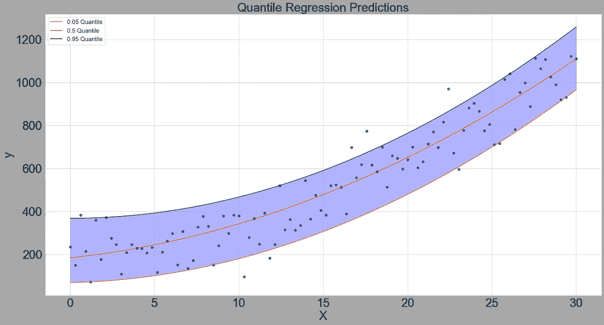
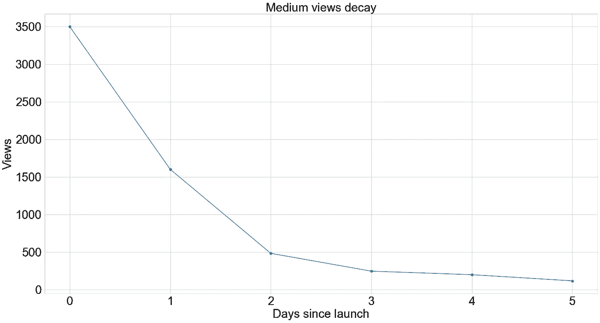
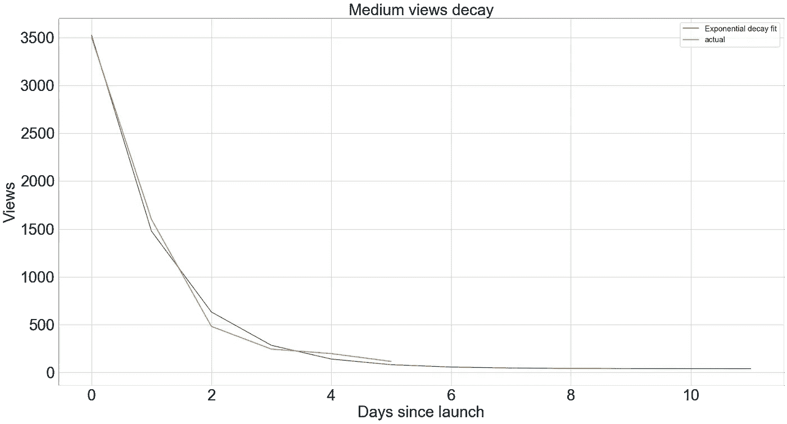
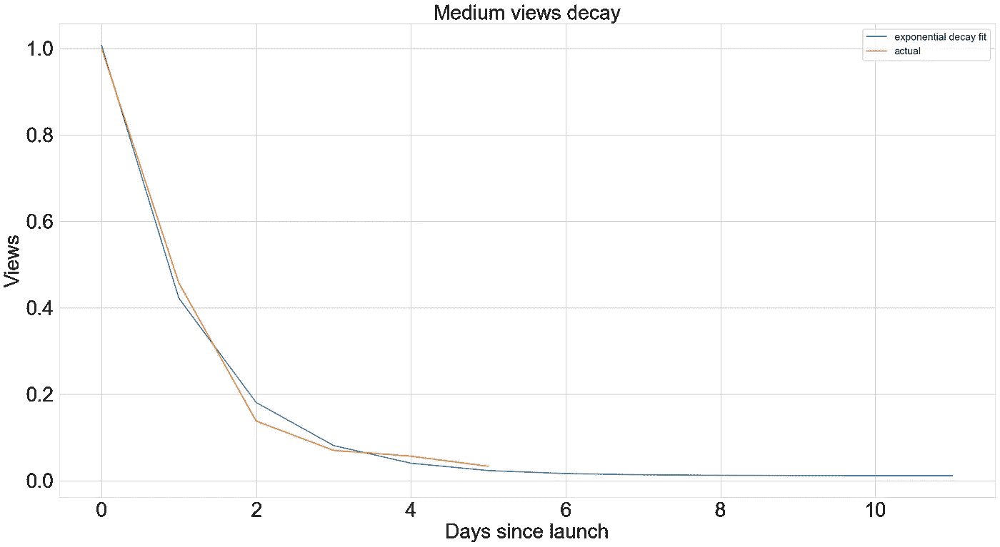

# 应该添加到您的工具包中的鲜为人知的数据科学技术

> 原文：<https://towardsdatascience.com/lesser-known-data-science-techniques-you-should-add-to-your-toolkit-a96578113350?source=collection_archive---------16----------------------->


米利安·耶西耶在 [Unsplash](https://unsplash.com?utm_source=medium&utm_medium=referral) 上拍摄的照片

成为一名高效的数据科学家通常意味着能够为特定问题找到正确的解决方案。在这篇文章中，我想讨论三种技术，它们使我能够在多种环境中解决棘手的问题，但并没有被广泛使用。这三种技术是**分位数回归**、**指数衰减回归**和**树嵌入逻辑回归**。对于每种技术，我将提供一个激励性的例子来说明为什么我认为值得将它添加到您的工具包中，并且还将把每种技术包装在一个定制的 sklearn 模型中，以便您可以轻松地将它应用到您自己的问题中。

这篇文章的所有代码可以在这里找到。

## 分位数回归

分位数回归是经典线性回归模型的变体。关键区别在于，分位数回归模型针对特定分位数的误差进行优化，而线性回归模型针对均方误差进行优化。实际上，这意味着线性回归模型的偏差应该等于零(即残差的平均值应该为零，模型高估和低估实际值的概率相等)。但是，分位数回归误差可能有偏差(由分位数决定)。具体来说，**分位数回归可以偏置过度预测或预测不足**，这取决于对于特定问题什么是更可取的。但是，*为什么要这样做呢？*


照片由 [Edge2Edge 媒体](https://unsplash.com/@edge2edgemedia?utm_source=medium&utm_medium=referral)在 [Unsplash](https://unsplash.com?utm_source=medium&utm_medium=referral) 上拍摄

你可能要解决一个预测问题，低估实际的成本比高估 T21 的成本要大得多。例如，如果您预测在高峰时间托管一个网站所需的服务器数量，低估实际需求的成本可能会导致网站崩溃，而高估的成本则是在不必要的服务器上的多余支出。虽然这两种结果都是不可取的，但后者(网站崩溃)比前者(支出增加)是一个更大的问题。

还可能希望显示预测的**置信范围。我们可以通过分位数回归来实现这一点，方法是估计几个具有不同分位数的模型，例如，第 5 个、第 50 个(中间值)和第 95 个百分位数。相应的预测可以解释为:**

1.  实际值低于预测值的概率为 5%，高于预测值的概率为 95%
2.  实际值低于预测值的概率为 50%，高于预测值的概率为 50%
3.  实际值低于预测值的概率为 95%，高于预测值的概率为 5%

您可以提取任意分位数的这些预测。sklearn 中没有实现分位数回归，但是可以很容易地将 StatsModels 实现包装在 sklearn 自定义类中，以便它可以像其他 sklearn 转换器和模型一样使用:

然后，我们可以设置一些数据并拟合模型:

```
# generate data
n = 100
X = np.linspace(0, 30, n) 
y = 150 + 0.3*X + 1*X**2 + np.random.normal(loc=50, scale=100, size=n)
X = X[:, np.newaxis]# instantiate models 
qr_05 = QuantileRegression(.05)
qr_50 = QuantileRegression(quantile=.5)
qr_95 = QuantileRegression(quantile=.95)# structure data for model
model_input = np.c_[X, X**2]# fit models
qr_05.fit(model_input, y)
qr_50.fit(model_input, y)
qr_95.fit(model_input, y)
```

下图显示了我生成的数据的第 5(黄线)、第 50(红线)和第 95(绿线)百分位预测。



作者图片

## 指数衰减曲线

衰变是许多过程的特征。例如，对新产品的参与通常以指数衰减为特征，开始时非常兴奋，随着兴趣的消退而迅速减弱。这也是我在 Medium 上发表的文章中观察到的东西——例如，以我最近发布的关于[渐变增强](/gradient-boosting-is-one-of-the-most-effective-ml-techniques-out-there-af6bfd0df342)的这篇相对受欢迎的文章为例。这篇文章前六天的浏览次数如下图所示。



帖子在第一天(第 0 天)达到顶峰，但从那以后就明显衰退了。我们在这里看到的模式是指数衰减，这是一个我们可以用指数衰减回归模型拟合的过程。下面我将指数衰减回归器包装在一个 sklearn 自定义类中:

然后，我们可以根据数据拟合模型，并预测未来几天的情况，如下所示:

```
medium_post_views = np.array([3500, 1600, 482, 245, 198, 116])
days_since_launch = np.arange(medium_post_views.shape[0])
xd = ExponentialDecayRegressor()
xd.fit(days_since_launch, medium_post_views)days_since_launch_plus_future = np.arange(12)
xd_preds = xd.predict(days_since_launch_pred)
```



作者图片

你可以看到指数衰减模型与博客帖子浏览量的实际衰减非常吻合，并且浏览量预计会非常平稳。指数衰减曲线对预测非常有用，而且拟合起来非常简单快速。一旦你有了特定产品/服务/内容类别(等等)的训练衰减曲线。)一旦你知道(或者可以可靠地预测)它的起始值，你就可以预测它将如何在其生命周期中发展。

通常情况下，您将归一化 *y* 值，以便衰减从 1 开始并按比例衰减(见下图)。这使得衰减回归比例不变——例如，我可以将我上一篇帖子的指数衰减曲线应用到这篇帖子的第一天参与度，以便预测总的终身参与度！



作者图片

## 嵌入树的逻辑回归

嵌入树的逻辑回归是我第一次在脸书的论文[中了解到的，但是从那以后在实践中使用了很多次。这个想法是建立一个两阶段模型。在第一阶段，对数据拟合基于树的集合模型，在第二阶段，对基于拟合的树的集合结构的输入特征的变换应用线性模型。](https://research.fb.com/wp-content/uploads/2016/11/practical-lessons-from-predicting-clicks-on-ads-at-facebook.pdf)


照片由周在 [Unsplash](https://unsplash.com?utm_source=medium&utm_medium=referral)

树嵌入通过将每一行编码为向量来变换原始特征空间，其中每一列代表一棵树，并且每一列中的值代表样本被分割成的树的叶节点。例如，如果有 500 个样本，使用 100 棵树，那么树嵌入的形状将是 500 x 100。这种嵌入然后被进一步转换成二进制向量(这可以产生相当稀疏的矩阵)。*你为什么想这么做？*

首先，树嵌入将原始特征空间投影到非线性特征空间，这**将使得线性模型能够处理 X 和 y 之间的非线性关系**。第二，除了仅使用基于树的模型之外，使用这种方法，您经常(尽管不总是)可以看到不错的性能增益。最后。可以说，其中一个关键的好处是，i **t 校准预测概率的方式将更好地反映目标发生的概率**。例如，当预测概率等于 0.9 时，希望对应于样本为真阳性的概率为 90%。换句话说，对于所有有 90%概率为阳性的样本，10 个样本中有 9 个应该是真阳性。但是，基于树的模型通常不能以这种方式很好地校准。这是一个重要的话题，我很快会写一篇关于它的文章，但是在构建和部署基于树的模型时，你应该意识到这一点。也就是说，逻辑回归模型得到了很好的校准。因此，通过使用树模型来创建非线性特征空间，并使用线性模型来校准概率，您可以获得两个世界的最佳结果。

下面是使用 sklearn 自定义类的两阶段模型的简单实现:

## 摘要

我在这篇文章中讨论的三种技术是我经常使用的，它们帮助我解决了许多跨多种环境的应用数据科学问题。希望你能在自己的工作中看到使用这些方法的机会。如果您有任何意见、问题或其他有趣的事情想让我写下来，请联系下面。

一如既往，感谢您抽出时间阅读！