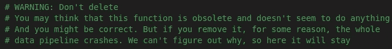
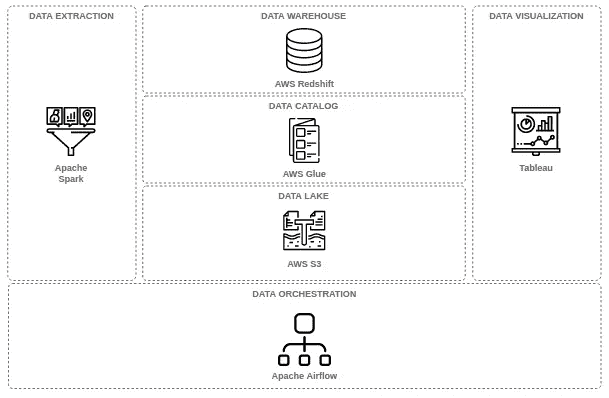
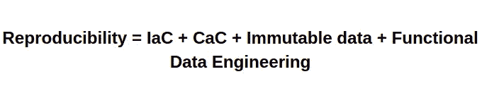

# 构建高重现性数据仓库的经验教训

> 原文：<https://towardsdatascience.com/lessons-from-building-a-highly-reproducible-data-warehouse-3900da6cb1d1?source=collection_archive---------18----------------------->

## [数据仓库管道:基本概念&路线图](/building-a-data-warehouse-pipeline-basic-concepts-roadmap-d14032890ab6)

## 我们如何提高数据仓库的可再现性和可维护性

[阿德里安·奥利雄](https://unsplash.com/@adrienolichon?utm_source=medium&utm_medium=referral)在 [Unsplash](https://unsplash.com?utm_source=medium&utm_medium=referral) 上的照片

[可再现性](https://en.wikipedia.org/wiki/Reproducibility)和[可维护性](https://en.wikipedia.org/wiki/Maintainability) **是构建数据仓库管道时经常被忽视的特性**。

如果你忽略了这些特征，你会遇到几个问题。例如，如果**重新处理过去的数据不容易做到。**或者如果**给你的数据管道引入新的变化是一件令人头疼的事情，你可能忽略了它们。**

特别是，忽略可再现性和可维护性是一个容易犯的错误。尤其是，**如果你不知道它意味着什么或者你没有为此做足够的**计划。

在这篇文章中，我想和你分享一些我的团队在试图解决这些问题时学到的原则和经验。另外，我想和你们分享我们这样做的好处。

> **TL；这是一个很长的帖子。如果你不想看，我理解你。这是里面的内容。我和我的团队建立了一个数据仓库。我们梦想制造高度可复制的。为此，我们遵循了一些原则。一路上，我们犯了一些错误，也吸取了一些教训。**
> 
> 我们想与你分享的三个经验是:建立一个高度可复制的数据管道的一个关键方面是将一切都作为代码，学习如何使用软件设计模式，以及学习何时自动化事情
> 就是这样。再见；)

# 语境

根据《牛津英语词典》的定义，再现性是指重复实验时获得一致结果的程度。”

在数据管道的背景下，再现性是指**构建每次运行都能产生一致结果的流程的能力**。

另一方面，[可维护性](https://en.wikipedia.org/wiki/Maintainability)可以定义为向数据管道引入新变化并轻松修复故障部件的能力。

为了说明忽视这些特征会如何影响你，让我们假设两种情况。

在第一个场景中，让我们假设您必须**重新处理过去的数据。**为此，您必须重新运行几个月前运行过的流程。但是，现在，在该过程运行之后，您意识到您无法再现与以前相同的结果。你开始探索为什么会发生这种情况。然后，你意识到没有明显的原因。所以，你开始到处调整，看看你是否能修复它。但是，似乎什么都不管用。几个小时后，终于有东西起作用了。你不知道它为什么会工作，但现在它神奇地被修复了！

现在想象一下你每天都要这样做。你能想象如果你不得不经常做这件事会有多累吗？

重现性问题让你的团队疲于解决。此外，你应该记住再现性是建立数据可信度的关键。**如果每次重新运行一个流程都会得到不同的结果，那么您就无法赢得对数据的信任**。

另一方面，可维护性问题和再现性问题一样令人疲惫不堪。

让我们假设另一个简单的场景。您必须为您的数据管道引入一些新的功能。在您开始修改之后，您意识到您必须将相同的代码复制并粘贴到 14 个文件中。所以，你开始怀疑这是否有意义。但是，在花了几个小时审查代码之后，您意识到它没有任何意义。因此，您做一些“重构”并部署更改。

一旦完成，一切都开始失败。你不知道为什么。但是，如果您撤消更改，一切又会开始工作。所以，由于你不明白发生了什么，并且你厌倦了审查为别人写的代码，你屈服于这个过程，最终在代码中写了一些注释，就像这样…

不要删除作者来自 [Reddit](https://www.reddit.com/r/ProgrammerHumor/comments/b61snk/that_famous_function/) 的代码-插图适配器中的注释

尽管这看起来很有趣，但这在现实生活中确实发生了。当一个系统存在一段时间后，人们开始忘记事物是如何工作的，以及为什么要做出某些决定。这通常是因为我们没有为某些事情做足够的计划。我们开始到处复制和粘贴一些代码。最后，我们得到了一个由 StackOverflow 代码组成的弗兰肯斯坦。

不管怎样，闲聊到此为止。让我们深入细节！

# 高层架构

我们数据管道的[架构](/what-is-a-data-warehouse-basic-architecture-ea2cd12c9bb0)包含六个基本层。下一张图展示了数据管道的高级架构。

数据仓库体系结构——作者举例说明

我们使用 Spark 从一些特定的来源提取数据，并将它们加载到数据湖(AWS S3)中。

然后，我们将数据映射到我们的数据目录中(AWS Glue)。从那里，它可以用于数据仓库中的转换(AWS 红移)。然后，我们使用 [DBT](https://www.getdbt.com/) 应用一些基于 SQL 的转换。最后，我们使用 Tableau 通过一些可视化展示数据。

所有流程都是使用 Apache Airflow 进行编排的，它运行在 Kubernetes 之上。

现在，您已经了解了高层架构，我想深入探讨一下塑造这种架构的原则。我希望它们能帮助你理解我们为什么使用某些工具，以及它们背后的好处。

</a-data-warehouse-implementation-on-aws-a96d0e251abd>  

# 原则

解决可再现性和可维护性需要一个系统的方法。这就是为什么我们坚持一些基本原则来帮助我们改善这些特性。

## 一切如代码(EaC)

一切作为代码基本上意味着你做的一切，通过编码来做。在这个[帖子](https://hackernoon.com/everything-as-code-explained-0ibg32a3)中查看更多信息。

我们遵循这一原则的主要原因之一是因为它使一切都变得可重用、可移植和可扩展。实现良好可维护性的关键点。

遵循这一原则的一些实践是**基础设施作为代码(IaC)，配置作为代码(CaC)，数据管道作为代码**。

将我们的基础设施实现为代码使我们能够在 2 到 3 个小时内从零开始构建整个数据管道。如果我们想在其他地方部署管道，我们只需简单地获取代码并在其他地方执行它。

此外，它允许我们在进一步的实现中重用组件。我们取几行代码，放在另一个地方，然后部署组件。

与代码相同的事情也发生在[数据管道上。如果你有数据管道作为代码，你会得到我之前提到的所有好处。](https://www.youtube.com/watch?v=N6xiU3ptKAY&ab_channel=Astronomer)

特别是，我们已经使用这种实践来改进我们从数据源中提取数据的方式。我们构建了一个框架，使用配置文件来完成这项工作，而不是一个接一个地集成源代码。我们写一个 YAML 文件，然后框架自动生成气流 Dag，允许我们整合所有的资源。

</generalizing-data-load-processes-with-airflow-a4931788a61f>  

简而言之，通过让 ***一切都像代码*一样，你允许更容易维护**。例如，引入新的更改可能就像更改几行代码一样简单。通过这样做，您还将显著减少需要花费大量时间和精力的手动流程的情况。

此外，基于代码操作数据管道要容易得多。因为没有隐藏的配置，所以您可以看到您所看到的。

## 不可变数据

数据不变性是我们遵循的另一个原则。我们通过实现一个不可变的暂存区域来实现它，*，也就是说，*一个保存来自数据源的数据的区域。此阶段没有数据转换。

您应该将原始数据与转换后的数据分开。这是因为转换通常基于业务逻辑。业务逻辑会随着时间的推移而改变。**如果没有原始数据，基于新的业务逻辑重新处理过去的数据**可能会很困难。

我们已经使用 ELT 方法实现了这一实践。当数据进入数据湖的原始区域时，我们加载数据。如果需要进一步的预处理，我们编写一些转换，并将结果放入数据湖的细化区域。最后，我们通过使用 SQL 在 DBT 上对业务逻辑进行编码，在数据仓库级别应用业务逻辑。

如果我们想改变业务逻辑，**我们改变 SQL 查询。我们影响数据转换的方式，而不是数据。通过这种方式，我们保证数据保持**不变**，并确保**的再现性。****

## 功能数据工程

功能数据工程背后的想法是基于*纯任务*定义数据过程。根据 [Maxime Beauchemin](https://medium.com/u/9f4d525c99e2?source=post_page-----3900da6cb1d1--------------------------------) ，

> “一个纯任务应该是[确定性的](https://en.wikipedia.org/wiki/Deterministic_algorithm)和[幂等的](https://en.wikipedia.org/wiki/Idempotence)，这意味着它每次运行或重新运行都会产生相同的结果”

这是保证**再现性**的关键原则。基本上，您构建的每个流程都应该保证每次运行时都会产生相同的结果，而不会产生副作用。

以一个提取过程为例，每次运行它都会在 AWS S3 上上传一个文件。如果你运行 3 次，你会得到 3 个文件。如果你说的是用户，你就是把你的用户翻了三倍。这可能会导致不良的副作用。

例如，一个纯粹的任务应该保证这不会发生。例如，解决这个问题的一种方法是通过实现覆盖方法。因此，每次该进程运行时，它都会覆盖 S3 上的文件。

要了解更多关于函数式数据工程的知识，请查看 Maxime Beauchemin 写的这篇文章，他对此谈了更多。

<https://maximebeauchemin.medium.com/functional-data-engineering-a-modern-paradigm-for-batch-data-processing-2327ec32c42a>  

# 课程

## 1.构建高度可复制的数据管道的一个关键方面是将一切都作为代码

具有高度可再现的数据流水线寻址并保证再现性和可维护性等特征。

您应该实现像基础设施作为代码和配置作为代码这样的实践来提高数据管道的可维护性。

此外，这使您能够为灾难恢复场景做好准备。此外，它允许更快地部署和复制环境。

一旦基础设施到位，保持数据不变，并封装纯任务的业务逻辑。这样，您就遵循了功能数据工程方法。

最后，使用**数据管道作为代码**，将您的基础设施、数据和转换放在一起。这是使用基于代码的 orchestrator(如 Apache Airflow)的主要好处之一！

**底线:**

再现性的关键——作者的插图

## 2.了解如何使用软件设计模式

软件设计模式可以帮助你优化你的数据仓库管道。

维基百科对设计模式的定义是

> “在软件工程中，**软件设计模式**是一种通用的、可重用的解决方案，用于解决软件设计中给定上下文中经常出现的问题。”

这个定义中的关键是单词**可重用**。构建可以帮助您重用代码并将其扩展到多个用例的东西。通过这种方式，你可以节省时间，并且提高代码的可维护性。

这是一个容易犯的错误。你开始建造一件东西。然后你构建另一个东西，你发现自己复制并粘贴了一些代码。但是，“只是一次性的事情”。然后，几个星期后，您意识到您正在为另一个“一次性的事情”复制和粘贴相同的代码过了一段时间，你会发现到处都是相同的代码，这时问题就出现了。

举个例子，几周前当我们从 Airflow 1.10 迁移到 2.0 时发生了一些事情。

几乎我们所有的 DAG 任务都是使用 [KubernetesPodOperator](https://airflow.apache.org/docs/apache-airflow-providers-cncf-kubernetes/stable/operators.html) 构建的。在这个新版本的气流中，[对 KubernetesPodOperator 进行了新的改动](https://airflow.apache.org/docs/apache-airflow/stable/upgrading-to-2.html#changed-parameters-for-the-kubernetespodoperator)。

你猜怎么着？我们不得不在很多文件中修改同一行代码。这让我们花了很多时间去做。这启发我们计划重构我们的框架。我们找到答案的第一个地方是 [GoF 设计模式](https://springframework.guru/gang-of-four-design-patterns/)。

底线:使用设计模式来构建可重用和易于维护的代码。这将在未来为您节省大量时间。

## 3.学习什么时候自动化事情

尽管我反复强调自动化和通过编码做每件事，但有些时候你不应该这样做。

有时候，自动化解决方案可能会带来更多的麻烦。就拿我们几个月前开始的一个小项目来说吧，但是在那之后，我们意识到现在不值得继续下去。

我们希望自动管理 AWS 红移、*即*、用户创建、数据库创建、模式创建等。因此，我们开始建立一个小框架来做这件事。它本该是一件小事。但是，在我们建造它的时候，它的增长超过了我们的预期。然后，我们意识到建造它可能会花费我们两周的时间。此外，这将导致更多的代码需要维护，不值得麻烦。

**底线:**虽然自动化是一件有趣的事情，但有时不值得花力气。

# 最后的想法

我很高兴你坚持到了最后。这是一篇很长的文章。

感谢您的阅读。

下期帖子再见！

*如果你想随时更新我的作品，* ***请加入我的*** [***通迅***](https://metadatacommunity.substack.com/) ***！偶尔，我会和我的读者分享一些东西。如果你加入我会很感激:)***