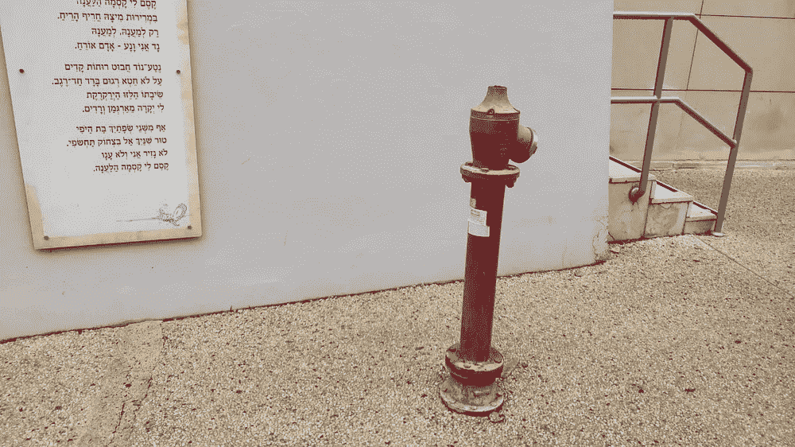
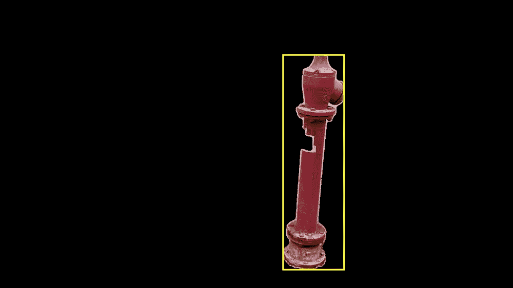
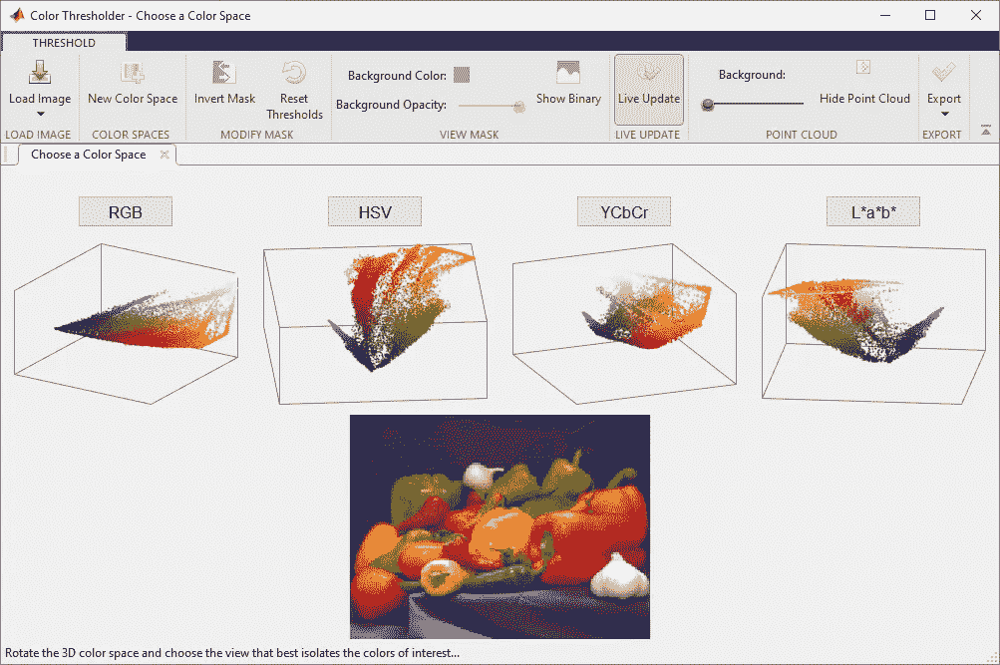
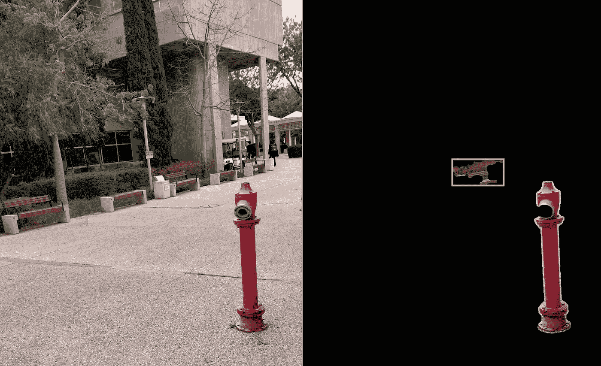
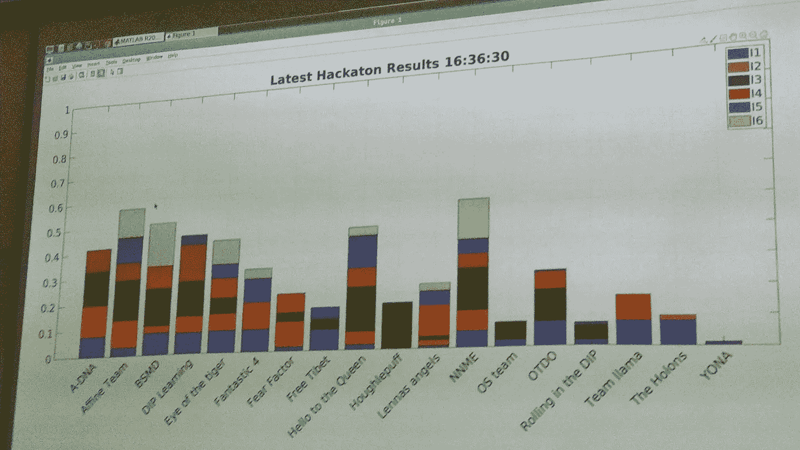

# 我第一次图像处理黑客马拉松的 4 个教训

> 原文：<https://towardsdatascience.com/lessons-i-learnt-from-my-first-image-processing-hackathon-f3f8ae6ae748?source=collection_archive---------37----------------------->

## 一场 4 小时的 MATLAB 分割竞赛如何教会我不仅仅是图像处理

格伦·卡斯滕斯-彼得斯在 [Unsplash](https://unsplash.com?utm_source=medium&utm_medium=referral) 上拍摄的照片

编辑:我最初写这篇文章是在一年多前，但是由于无休止的拖延，它在时间中丢失了，现在才被再次发现。

在 BGU 攻读电子工程学士学位的第四年，我选修了一门图像处理的课程。我从中学到了很多东西，我相信它将成为进入计算机视觉世界的巨大敲门砖，但现在我希望专注于课程的一个特定部分——4 小时的迷你黑客马拉松。

# 等等，什么是迷你黑客马拉松？

好问题。在我深入学习之前，让我们先试着理解发生了什么。

我的整个班级被分成 4 个小组，并接受了一个看似简单的任务——给定一组 6 个对象，我们要编写一个 MATLAB 脚本，以 2 种不同的方式将每个对象从背景中分割出来:

1.  边界框:定义一个矩形框，将整个对象包含在里面，背景尽可能少(如果你愿意，可以紧密配合)。
2.  逐像素分割:创建一个二元蒙版，其中属于对象的像素为白色(逻辑 1)，背景为黑色(逻辑 0)。

例如，我们需要分割的对象之一是举行黑客马拉松的地方外面的消防栓:

示例图像—原始结果(左)和理想结果(右)。作者照片

棘手的部分是——我们没有得到测试代码的图片。它们可能是从任何角度，在一天中的任何时间，在不同的背景下拍摄的。我们只被允许使用我们自己拍摄的物品的图像。有趣的是，在黑客马拉松的前几分钟，我们主要是在校园里跑来跑去，给各种各样的物体拍照(你不是每天都能在白天看到 ee 学生)。

该事件还出现在[系统博客](https://www.systematics.co.il/matlab-simulink-blog/hackathon-matlab-bgu/)(MATLAB 和其他 MathWorks 产品的以色列分销商)上。

到目前为止，我相信你已经明白了这一点——6 个物体和 4 个小时的时间比其他团队更好地分割它们。现在让我们深入了解我学到的东西:

# 1.注重结果

这听起来可能有点琐碎，但这可能是我的团队在黑客马拉松中成功的最大因素。虽然设计复杂的算法来为每个问题提供理想的解决方案是很诱人的，但我们很快意识到我们必须寻求一种更实际的方法。

在团队成员之间分配 6 件物品时，我决定从最容易的开始，以便让我们尽快登上排行榜。这让我可以在黑客马拉松开始后几分钟内为我的团队提供初步的结果。这种方法允许我们在简单的解决方案足够好的时候满足于它们，并且在我们能够测试它们之前更好地定义更复杂的解决方案。

实际上，即使是使用彩色过滤器的最简单的分割实现也获得了很高的分数，覆盖了超过 80%的对象。与 MATLAB 的颜色阈值应用程序一起，它为提取二进制遮罩和边界框提供了一个很好的起点。

MATLAB Color Thresholder 应用程序——一个很棒的工具，可以可视化不同空间中的像素分布，并通过阈值处理来创建遮罩(图片来自 MathWorks 网站

# 2.测试，测试，然后再测试一些

获得更好结果的最好方法是依靠高质量的反馈。黑客马拉松组织者给我们的唯一可用反馈是测试集的分数。没有输出图像审查和没有地面真相。

这意味着我们需要创建自己的测试管道来评估我们的性能，并检查我们的分割遮罩和边界框。为此，我写了一个简短的脚本，允许批量应用我们不同的分割算法，并生成我们可以用于评估和调试的输出图像。

回家边界框，你喝醉了(作者照片)

一旦测试脚本启动并运行，整个团队就能够使用它并了解他们的算法。上面的图像提供了一个我们遇到的真实问题的例子，我们的像素遮罩非常好，但是由于图像的不同区域中的噪声像素，边界框偏离了很远。一旦我们在我们的测试脚本(我们在自己的照片上运行)中看到这一点，我们就添加了一个斑点分析层，以在二进制遮罩中最大的斑点上应用边界框。这提供了一个伟大而简单的方法来过滤掉噪声像素。

# 3.尽可能共享和重用

另一个节省时间的好方法是重用代码并在团队成员之间共享。没有必要对每个新任务都重新发明轮子。许多我最初认为只对我有用的代码最终被整个团队共享。

一旦我们建立了一个共享的工作环境，我们的 R&D 工作变得更快，我们可以很容易地分享想法和代码。

# 4.冒险

在黑客马拉松的最后 10 分钟，我的团队处于第二位，遥遥领先于其他团队，但为了获得第一名，仍然错过了一个小的差距。

在这一点上，我们正在努力工作的最后一个算法，分割所有 6 个最棘手的对象。我们知道由于时间的限制，我们的解决方案远非完美，但我们认为这比屈居第二要好。

我们尽可能快地编码，在最后一分钟提交了最后一次尝试，并抱着最好的希望。

不幸的是，我们的最后提交降低了我们的总得分，我们最终在第四名。尽管如此，我也不会改变我做过的事情。真是千钧一发，我们决定全力以赴，这比固步自封有趣多了。

我的团队(DIP Learning)在最终排行榜上排名第四。作者照片

# 结论

总而言之，迷你黑客马拉松是一次令人敬畏的经历，也是图像处理、原型制作、团队合作和时间管理方面的一堂精彩课程。

黑客马拉松只是我在 BGU 大学期间上过的可能是最好的课程的一小部分:“数字图像处理入门”(查看[网站](http://www.ee.bgu.ac.il/~rrtammy/DIP/DIP))，由*教授塔米·里克林·拉维夫(Tammy Riklin Raviv)主讲。*

希望我能找到时间来写我的最终项目，它涉及的不仅仅是颜色过滤器和斑点分析。