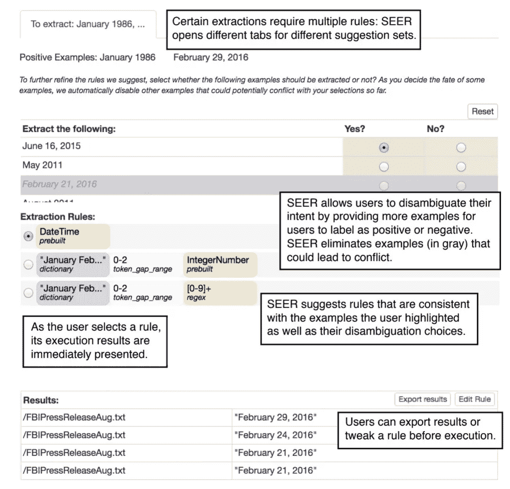
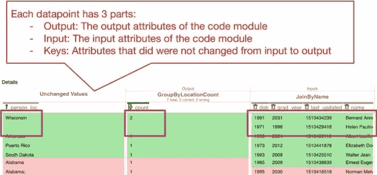
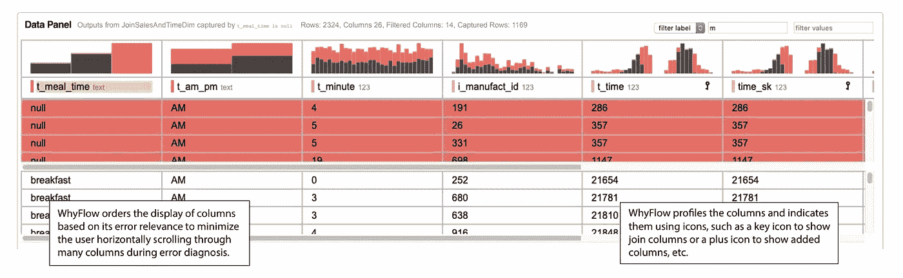
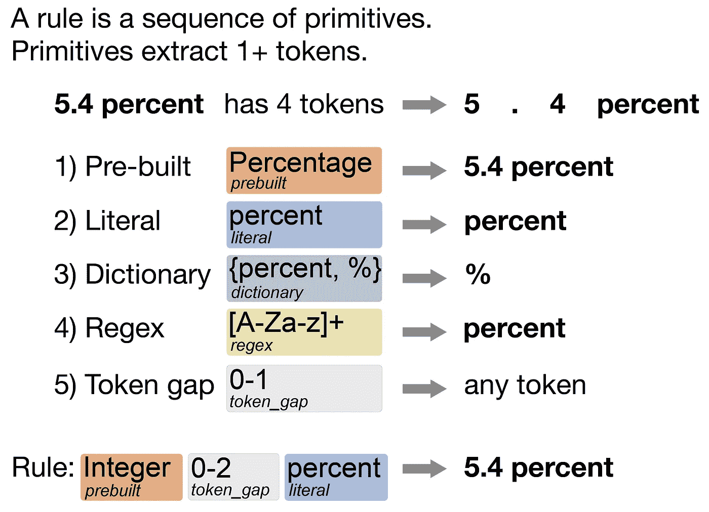
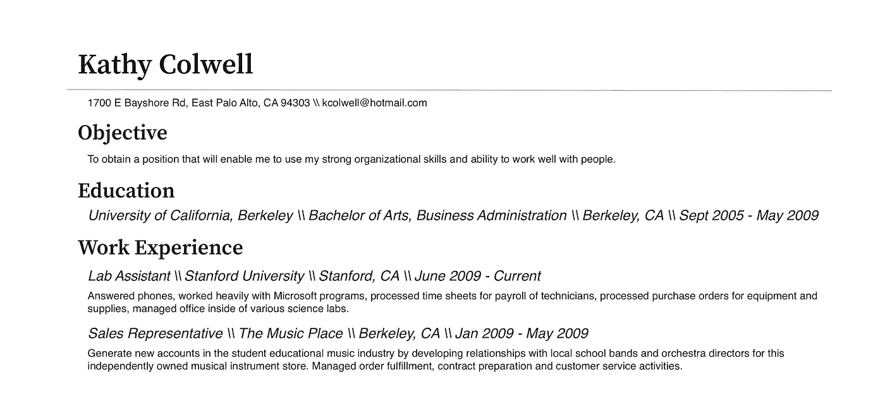
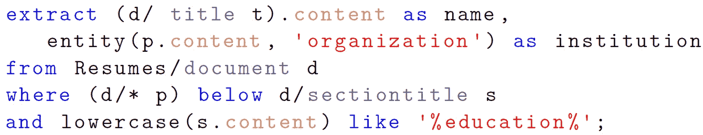

# 从整合人员进行数据分析中获得的经验教训

> 原文：<https://towardsdatascience.com/lessons-learned-from-integrating-the-human-for-data-analytics-9784200d09ce?source=collection_archive---------38----------------------->

## [行业笔记](https://towardsdatascience.com/tagged/notes-from-industry)

## 六年开发人在回路(HITL)工具的反思

对于大多数技术人员来说，编写代码很容易。如果你对某个工具不满意，你可以毫不费力地自己动手做一个。如果要提取数据，可以快速写出一些正则表达式。如果您想将一些 CSV 文件组合在一起，您可以为此快速创建 Python 脚本。如果你需要调试一个程序，你知道工具和调试工具的来龙去脉，以便能够诊断你的程序的错误。

这些技术人员通常也是开发许多软件给*终端用户*使用的人。最终用户不一定受过编码方面的技术培训。但是他们面临着技术人员面临的同样的挑战，没有编码专业知识。最终用户在他们的电子表格中使用函数，但是可能要花双倍的精力来调试它们。最终用户也需要清理和转换他们的数据，但可能需要经历学习 Python 的艰难过程。

在过去的 6 年里，我一直在开发以最终用户为中心的用户友好的数据分析工具。我想从开发*人在回路(HITL)* 工具中提取我所学到的经验，希望人们在围绕他们工具中的人的部分进行设计时也会用到它们。

## 第一课:在保持系统结果准确性的同时，必须最大限度地减少用户获得预期结果的时间和精力。

用户的时间和精力是宝贵的。我们的设计必须反映这些价值观。

这样做的一个例子是很好地集成到目标用户的工作流程中。我们注意到，当用户想要指出感兴趣的数据时，他们喜欢突出显示数据。突出显示文本以表示某种形式的操作的想法并不新鲜，就像在[微软 Excel](https://www.microsoft.com/en-us/research/publication/flashextract-framework-data-extraction-examples/) 中看到的那样。所以，我们创造了这个叫做 SEER 的工具。SEER 自动从用户高亮显示的文本中提取数据。

SEER 中的文档面板。图片作者。

这里，用户希望从新闻发布的数据集中提取日期。用户只需突出显示文本。然后 bam，SEER 以可视化的方式建议提取规则。这些提取规则基本上完成了提取用户想要提取的其余数据的工作。

SEER 的界面显示了用户如何从新闻稿中提取日期。图片由作者提供(同样取自[此处](https://www.proquest.com/docview/2428045206))。

现在，用户可能想要提取非常具体的日期。或者用户可能想要一个提取不同格式的所有日期的提取脚本。为了适应用户可能具有的不同意图，SEER 显示了不同特定级别的提取规则。用户不会浪费时间编程和构建提取脚本。

SEER 还允许用户直接快速预览文档中每个摘录脚本的摘录，以快速评估哪个脚本是合适的。用户可以通过突出显示更多的示例文本或者甚至提供不提取的文本示例来容易地更新建议的脚本。用户看到与他们的最终目标相关的脚本。

通过这种设计，用户的时间和精力被最小化，同时保持结果的准确性。只有几个突出显示的用户文本示例，SEER 通过自动生成提取脚本来快速执行目标提取任务。[我们的用户研究](https://www.proquest.com/docview/2428045206)已经证明，用户能够快速准确地完成各自的任务。

## 第二课:交互功能和数据可视化很重要，但设计时不要让终端用户从手头的任务中分心，也不要用完成任务不需要的信息让终端用户负担过重。

虽然在工具中设计花哨、好看的可视化效果很诱人，但是评估您选择的可视化效果也很重要。可视化不仅要看起来漂亮；他们必须帮助用户完成他的目标任务。如果用户的任务是调试大型数据集中的错误，那么将帮助用户的工具将具有可视化和特征，以帮助用户快速识别大型数据集中的哪些数据点导致了错误。

我制作的一个帮助用户调试错误的工具叫做 WhyFlow。WhyFlow 帮助用户调试数据处理模块的输入和输出。我们希望不太熟悉代码操作具体细节的用户通过首先理解输入和输出数据点之间发生的操作来诊断和解释这些错误的原因。

在 WhyFlow 的初始版本中，表格可视化显示了输入和输出数据点之间的关系。每行保留一个输出数据点，在其右侧显示输入数据点。红色行是不应该出现的错误输出，绿色行是正确的输出。

WhyFlow 的初始可视化，用于显示输出及其贡献输入数据点。带有“Alabama”的行是不正确的，因为这些行应该合并为一个“Alabama”行。该错误是由于其中一个“Alabama”后面有一个符号“；”在它之后，它不应该在那里。图片作者(同样来自[此处](https://youtu.be/IleJCaihAk0))。

在此图中，按计数分组操作的输出与构成每个输出的输入一起显示。任何从输入到输出没有变化的值都被认为是键值，放在表的最左边。

我们要求用户使用这种可视化来解释输入和输出之间发生了什么。我们还询问用户他们认为错误(红色)输出出现的原因是什么。

我们了解到，这种可视化并没有真正帮助他们解释输出中的错误。然而，许多用户确实表示，很容易指出哪些列从输入到输出没有变化。可视化不一定能帮助用户找到与输出中的错误相关的列(“person_loc”和“count”列)。我们看到用户必须水平滚动来查看他们正在检查的其他列。特别是在有 50+列作为输入的情况下，水平滚动对用户来说变得明显令人讨厌。

因此，我们修改了可视化，而是根据列与错误输出的相关程度对列进行排序。

WhyFlow 改进了可视化效果，根据列与输出错误(红色行)的相关程度来显示列。这是为了减少用户的水平滚动。这种可视化使得“t_meal_time”显然与错误相关。图片作者(也来自[此处](https://drive.google.com/file/d/1EROo3fYk8E1fnX5vBtB1TYtfs_PWsX-N/view?usp=sharing))。

WhyFlow 根据列与错误的相关性对列进行排序。彩色直方图有助于用户了解哪些特定误差值对输出有影响。在这里，您可以看到被涉众预先标记为错误的输出数据点在 *t_meal_time* 列中也出现了许多空值。彩色直方图还清楚地表明，某个特定值应该进一步检查，并且是错误的原因。

当设计 HITL 工具的可视化时，我们必须决定它是否与手头的任务相关，同时不要用不必要的信息分散用户的注意力或使用户超载。虽然诸如列操作的信息在*验证*代码模块的操作中很重要，但在*调试和分析与错误相关的*列的任务中，它不足以帮助用户。

## 第 3 课:简单易懂的模型允许最终用户轻松地解释系统的逻辑，同时允许系统交互响应。

基于规则的可视化模型，可捕获文本中的模式。图片作者。

我在很多工具中使用的一个东西是基于规则的模型。他们将学到的东西以简单明了的规则的形式编码在某个特定领域的语言中。例如，SEER 学习了一种基于规则的数据提取模型，[【可视化标注查询语言(VAQL)](https://dl.acm.org/doi/abs/10.1145/1989323.1989479) 。

规则描述了要捕获的文本的特征，由*原语组成。*原语捕获某些令牌。例如，*预构建的原语*捕获实体类型，如百分比、大学、人名、公司名等。一个*文字原语*捕获一个精确的字符串。*字典原语*捕获出现在其预设字典中的文本。其余的原语见上图。将这些原语组合成一个序列描述了应该被捕获的文本的特征。

SEER 以可视化的方式显示这些规则。SEER 中的许多用户表示，视觉提取规则简单易懂，有助于缩短完成相应任务的持续时间。

## 经验 4:挑战性的问题可以被分解成更小的问题，允许一个人确定可以由系统自动完成或由最终用户完成的子任务。

简历示例。我们希望提取所有候选人都上过的大学，但不包括在他们的工作经历部分列出的大学。图片作者(同样来自[此处](https://www.proquest.com/docview/2428045206))。

我处理的最具挑战性的问题之一是从 PDF 文档中提取文本。PDF 文档很难处理，因为它们的格式各不相同。烹饪说明通常有配料清单，后面跟着几段说明。简历更难，因为它们总是有教育背景部分，但即使这样，内容可能是一个列表或一组简单的段落，甚至可能是一个组合。但即便如此，不同简历的格式也大相径庭，可能有些只有一栏，有些有两栏。这使得在 pdf 上自动提取文本具有挑战性。

我们开发了一个叫做[纹理](https://dl.acm.org/doi/abs/10.1145/3328519.3329131)的工具，这是一个处理 PDF 文档提取的框架。纹理将 PDF 提取问题分解为两个部分:

1.  识别*结构*，这些结构是由空白和上下文可视分割的文本/图形区域，如列表、图形、段落、标题、页脚和页眉等。
2.  根据上一节确定的这些结构，用户可以使用它们来描述感兴趣的文本应该从 PDF 中的什么地方提取。Texture 带有一种特定于领域的语言，允许用户在提取文本时利用这些结构。

Texture 中的提取规则，指定如何从简历的教育部分提取大学。图片作者(也来自[此处](https://www.proquest.com/docview/2428045206))。

这种通过 pdf 提取数据的两步框架允许我们找出哪些部分可以自动化。我们可以像在 SEER 中一样，自动执行用户在纹理中编写提取规则的部分，在 SEER 中，我们自动为用户生成数据提取规则。点击阅读更多关于从 pdf 文件中提取文本的信息[。](https://maeda-han.medium.com/how-to-extract-text-from-pdfs-844958ec5e39)

## 教训 5: HITL 工具应该在维护最终用户的自主性和尽可能利用自动化之间取得平衡。

最后，我构建的许多工具都集成了 [*混合主动性接口*](https://dl.acm.org/doi/10.1145/302979.303030) *的原则。*在混合主动性界面中，无论是最终用户还是系统都会尽可能地参与任务。为了在这些工具中支持自动化，我们使用了 [*程序合成*](https://dl.acm.org/doi/10.1145/1836089.1836091#:~:text=This%20paper%20describes%20three%20key,search%2C%20and%20the%20search%20technique.) 中的技术，该技术能够根据用户指定的程序行为自动生成程序。

SEER、Texture 和 WhyFlow 使用混合主动性界面，这些界面保留了最终用户的自主性:最终用户选择系统何时参与任务以及最终用户何时执行任务。例如，在 SEER 中，用户可以选择通过更新示例或直接编辑规则来更新合成规则。SEER 的基于规则的模型为系统和最终用户提供了一个共享空间来进行协作，而不是像全自动方法通常寻求的那样，一方完全取代另一方。

# 最后的想法

这 5 课涵盖了我在过去 6 年中开发 HITL 工具时的许多想法。当我们重新设计我们当前的许多流程以实现全自动时，通过整合人工智能和机器学习，我们还需要记住设计中的人的因素。

用户需要理解决策背后的系统逻辑。用户需要信任系统。用户需要知道，它没有拾取系统正在学习的数据的“偏差”。用户通常没有被训练成像工程师一样用技术的方式思考。我们需要以人为中心设计框架。我希望我所概述的经验教训能成为这方面的指导方针。让我知道你的想法！