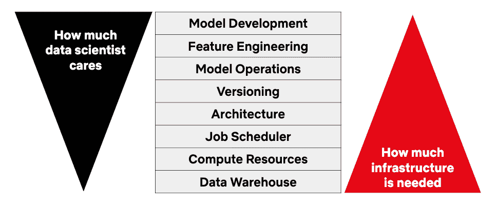
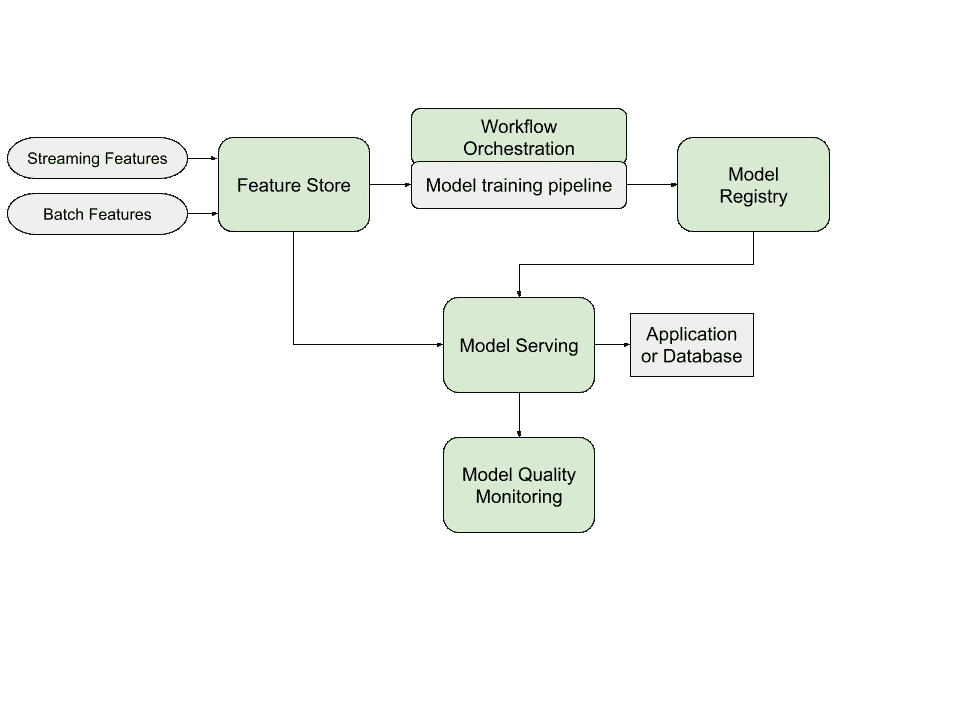
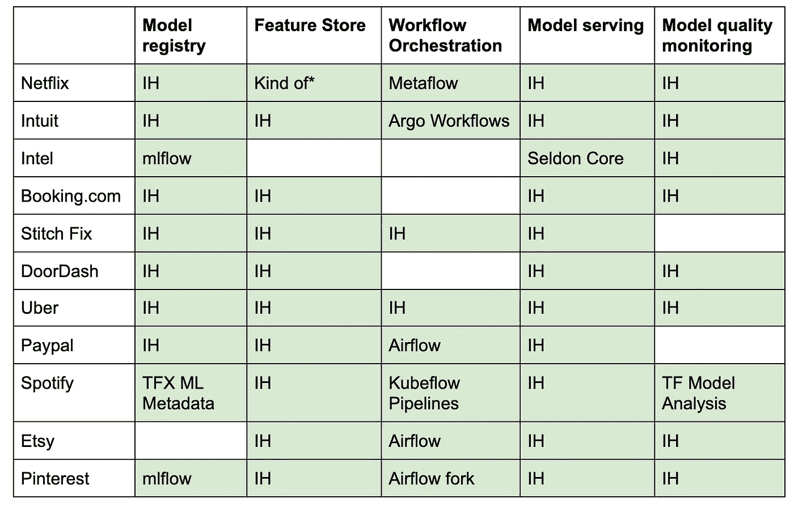

# ML 平台上的课程——来自网飞、DoorDash、Spotify 等等

> 原文：<https://towardsdatascience.com/lessons-on-ml-platforms-from-netflix-doordash-spotify-and-more-f455400115c7?source=collection_archive---------2----------------------->

## [行业笔记](https://towardsdatascience.com/tagged/notes-from-industry)

您的数据科学家产生了奇妙的模型，但是只有当模型集成到您的生产系统中时，他们才能提供价值。你如何让数据科学家轻松地反复*交付价值？您构建什么，购买什么，需要什么工具来具体解决您组织的问题？*

*许多在 ML 方面做得很好的公司已经投资了 ML 平台，以使数据科学家能够更快地交付价值。这些平台解决了许多 ML 任务中常见的问题，并使数据科学家能够专注于他们可以独特地增加价值的地方。Metaflow 项目的这个图表恰当地总结了平台的目标。*

**

*来源:https://docs.metaflow.org/introduction/what-is-metaflow*

*我们可以从成功的科技公司的 ML 平台中学习，为我们的组织提供信息。正如李小龙所说:*

> *吸收有用的东西，抛弃无用的东西，加入你自己特有的东西*

*通过搜索过去几年的会议谈话和博客帖子，我记录了 11 家大型科技公司的 ML 平台的通用组件和功能。*

*这篇文章包含:*

*   *通用 ML 平台组件的高级概述*
*   *每个公司使用的工具表*
*   *关于组件的观察*
*   *平台用户体验*
*   *某些公司特有功能的总结*

# *通用 ML 平台组件*

*概括地说，五个 ML 平台组件非常突出，如下图中的绿框所示。*

**

*ML 平台中的常见组件。作者图解*

*常见组件说明:*

*   *要素存储:存储批处理和流要素并提供离线和在线使用的要素的服务。特性存储通常支持低延迟服务，保证离线和在线特性的一致性，并允许跨团队贡献和访问特性。如果你想了解更多关于特色商店的信息，请阅读尤金·严的[特色商店——需求层次](https://eugeneyan.com/writing/feature-stores/)。*
*   *工作流编排:模型训练工作经常被表示为有向无环图(DAG ),需要一个工具来编排任务的执行。DAG 的范围可以从简单的两步 DAG(模型训练)->(模型验证)到涉及超参数调整和多个模型的复杂结构。我不会作为一个组件进入模型训练管道，因为通常情况下，平台处理编排，模型训练中发生的事情取决于数据科学家。*
*   *模型注册:经过训练的模型存储在这里。还记录了关于训练集、超参数、性能指标等的模型元数据。通常有一个 UI 供用户检查他们的模型。*
*   *模型服务:该系统从模型注册中心检索模型，从特性存储中获取特性，并输出预测。预测被发送到另一个生产系统(如产品推荐服务)，或者在批量评分的情况下存储在数据库中。或者，有时模型被嵌入到生产服务中以最小化延迟，并且没有单独的模型服务。*
*   *模型质量监控:一旦部署，模型的生命就开始了。为了确保它过着有意义的生活，你需要监控它在实时数据上的表现。图中没有显示，监控系统可以将指标反馈给模型注册中心或一些 UI，并连接到一个警报系统。*

# *每个公司使用的工具*

*下表说明了每个公司针对上述五个组成部分的工具。如果一个细胞不见了，并不意味着他们没有那个成分，只是我找不到关于它的信息。*

*IH 的意思是他们在内部构建组件，命名工具是开源的。*

**

*11 家公司中每一家公司的通用 ML 平台组件所使用的工具。按作者分类的表格。*

**网飞使用特征编码器，这是可以在训练和评分时调用的转换代码。*

*警告:这是一个有偏见的样本。这些公司大多是大型 B2C 公司，总部设在美国，有大量的机会获得 ML 解决方案。他们对 ML 系统的要求可能与您的组织不匹配。这就是说你可能不需要他们所有的组件。*

# *上表的注释*

## *每个人都有一个模型注册表*

*为什么？您需要知道在您的生产系统中部署了什么。像代码工件的图像注册一样，模型注册管理您的模型工件。模型需要专用系统，因为它们的行为不仅由代码决定，还由训练数据和超参数决定。这三个方面应该与工件联系起来，还有关于保留数据的性能的度量。所有这些信息对于再现性、调试和通知模型改进都是有用的。*

## *2021 年:FOMO 特色商店年*

*特色商店公司 Tecton 的首席执行官称 2021 年为特色商店年。对我们很多人来说，今年是特色商店 FOMO 年，如上表所示。几乎每个公司都有一个功能商店。它们都是内部构建的，这是有道理的，因为直到最近才出现许多商业或开源功能商店产品。更重要的是，定制的功能商店可以根据特定的需求进行定制，这对于这些公司来说包括大规模的生产流量。*

*建立一个特色商店不是在公园散步。这个[系列文章](https://farmi.medium.com/ml-feature-stores-a-casual-tour-fc45a25b446a)提供了一个特色商店之旅，以及对一个组织何时需要特色商店的洞察。需要要素库的一个标准是您的模型需要来自大量数据源的数据。我建议你去阅读其他因素的帖子。仅仅因为看起来其他人都有一个功能商店并不意味着你需要一个！*

## *工作流程编排*

*这个专栏展示了开源工具的最高使用率。Github 上有大量的工作流编排工具，其中包括成熟且经过实战考验的框架，如 Airflow 和 Argo。很有可能，这些工具中的一个会适合你公司的需要。*

## *模型服务*

*我认为大多数服务系统都是内部构建的，原因与功能商店类似——直到最近才出现许多服务工具，这些公司有严格的生产要求。*

*模型服务的一个常见模式是为模型部署提供多条铺设的路径，每条路径都有不同的权衡。*

*Booking.com 考虑了 2D 平面的灵活性和健壮性，他们的四个部署选项中的每一个都在该平面上做出了不同的权衡。一种稳健但不灵活的方法是预计算所有可能输入的模型输出，并将预测存储在快速查找表中。此选项不灵活，因为它仅在输入空间很小并且可以提供批量预测的情况下才有效。但是，它的性能很好，为模型服务也很简单。*

*Pinterest 支持三个选项。一是带来提供模型预测的服务。第二种是将模型嵌入到现有的产品服务中。第三是将模型部署在平台管理的服务上，该服务处理特征检索、缓存并支持每秒大量的请求。*

*在优步，用户可以部署基于 Python 的模型，这种模型更适合小规模应用或快速尝试新想法。大多数数据科学家更容易使用这个选项。或者，用户可以使用基于 JVM 的服务系统来满足更大规模的需求。*

## *模型质量监控*

*像培训服务偏差、概念漂移和上游数据问题这样的问题会导致客户体验下降，而不会引发任何生产警报。通过监控模型质量，您可以减少静默故障事件并提供及时的补救。*

*平台提供的一些模型质量监控功能:*

*   *跟踪模型输入和输出随时间的分布。DoorDash、Booking.com 和优步都有这种能力。当预测出错时，通过可视化变化的分布，可以更容易地确定是否是数据问题，以及哪个(哪些)输入导致了问题。此功能还支持功能分布变化的警报。*
*   *概念漂移检测。漂移可能触发对较新数据集的模型再训练。*
*   *标签可用时计算模型预测性能。一些平台提供对预定义指标(如 AUC 和精度/召回率)的计算和监控。*

*虽然监控操作指标，如延迟和每秒查询数，可能与 ML 问题无关，但监控模型质量通常是特定于上下文的。许多平台为前者提供内置监控，为后者提供可定制的工具。在网飞，数据科学家可以安排他们自己的笔记本来监控部署的模型。Intuit 有一项服务，允许数据科学家通过配置文件定义监控管道。*

# *平台用户体验*

*本节涵盖了平台用户的体验，他们往往是数据科学家或 ML 工程师。*

## *用户如何与平台互动*

*用户倾向于通过以下方式与组件交互:*

*   *用户界面*
*   *配置文件*
*   *APIs 库*

*光滑的**用户界面**提供了诸如一键模型部署、模型性能和输入特性视图、模型版本跟踪和数据沿袭跟踪等功能。像网飞和优步这样的公司提供了非常全面的用户界面，但是由于需要工程上的努力，这还不是标准。*

***配置文件**简化了某些任务。例如，Intuit 的平台用户可以在 YAML 配置中定义模型训练作业，并指定训练数据源、验证数据源和计算资源等参数。英特尔的平台允许用户在 YAML 中将模型推理图定义为 Seldon Core 上的抽象。*

***API/库**的一个显著用途是简化特性访问。多个要素存储的共同点是能够通过一行更改从批量要素切换到在线要素。例如`client.get_batch_features`到`client.get_online_features`。作为库的另一个例子，Spotify 有一个 CLI，可以帮助用户为 Kubeflow Pipelines 组件构建 Docker 映像。用户很少需要编写 Docker 文件。*

## *数据科学家拥有端到端的 ML 问题*

*ML 平台的一个共同目标是让数据科学家拥有从研究到生产的 ML 问题。理想情况下，数据科学家不会将模型交给工程师重新实现。当数据科学家可以接近问题时，他们可以更容易地解决建模问题或设计建模改进。*

## *Python 模型支持*

*Python 是数据科学的通用语言，公司最终意识到他们需要提供一种部署 Python 模型的方法。优步和 Booking.com 的生态系统最初是基于 JVM 的，但他们扩展到支持 Python 模型/脚本。Spotify 在其平台的第一次迭代中大量使用了 Scala，直到他们收到如下反馈:*

> *一些 ML 工程师永远不会考虑将 Scala 添加到他们基于 Python 的工作流程中。*

# *独特的平台功能*

*本节涵盖了十一家公司中一两家公司独有的平台功能。*

## *简单的性能测试和计算资源建议*

*数据科学家不一定知道模型服务器需要什么资源配置来满足 SLA。Intuit 的平台允许用户定义他们部署的模型的要求，例如每秒请求数和延迟。然后，该平台将尝试各种资源配置，如计算实例类型，并建议满足要求的设置。*

## *追踪下游消费者*

*谷歌的论文“机器学习系统中隐藏的技术债务”说明了未声明的下游消费者的问题——这些系统在不告诉你的情况下消费了你的模型的输出。引用一下:*

> *它们创建了模型 mₐ到堆栈其他部分的隐藏的紧密耦合。对 mₐ的改变很可能会影响其他部分，可能是意想不到的、不为人知的、有害的。*

*软件工程中的一个相关问题是 API 合同变更。一旦你的服务有多个消费者，你必须非常小心不要以向后不兼容的方式改变你的 API。对于 ML 模型，什么构成了“向后不兼容”的数据变更并不清楚。输入定义的细微变化(比如出现空值时)会导致意外的行为。*

*网飞的模型管理平台 Runway 允许用户找到所有使用特定输入功能的已部署模型，以及所有为所选模型提供输入的上游模型。用户还可以看到哪些服务使用了已部署模型的输出。所有的消费者都是自动声明的，用户可以理解建模变化会影响什么。*

## *鼓励等幂*

*Stitch Fix 的[演讲](https://www.infoq.com/presentations/data-ml-pipelines-stitchfix/)强调了幂等作业的重要性——你应该能够多次运行相同的作业并得到相同的结果。有了幂等性，您可以重试管道，而不用担心意外的副作用。Stitch fix 实现了保护栏，就像代码模板一样，鼓励幂等逻辑。*

## *记录在线模型的输入和输出*

*如果你曾经在一种新的语言中学习了一个短语，但是当一个以英语为母语的人说同样的短语时，你没有理解，你就遇到了训练服务偏差。你的听力理解能力不是根据母语人士的实际说话方式训练出来的。*

*在 ML 中，基于离线指标看起来很强的模型在在线环境中可能会由于训练服务偏差而变得无用。为了防止这种偏差，DoorDash 和 Etsy 等公司在*在线*预测时间记录各种数据，如模型输入特征、模型输出和来自相关生产系统的数据点。*

*这种方法确保了记录数据的时间点正确性。数据科学家可以根据这些数据训练模型，并对测试集结果充满信心。然而，一个代价是很难确保在线设置中没有捕获的数据的正确性。数据科学家可能想尝试一种依赖于非捕获数据的新功能。他们需要为在线捕获系统创建一个新的特征定义，并等待几个月来为模型训练积累足够的数据。*

## *模型组成*

*在 Paypal，ML 的一个主要用例是防止欺诈，这需要模型的灵活组合。例如，一个模型可以检测用户的异常 IP 地址，另一个可以检测特定类型的商家欺诈，并且多个专用模型被组合以输出欺诈确定。*

*Paypal 的推理引擎支持模型的灵活组合。例如，模型 A 输入模型 B，根据输出，调用模型 C 或 D。另一种方案是对相同的数据运行不同的模型来比较性能。英特尔使用的 Seldon Core 提供了类似的模型合成功能。*

# *结论*

*这篇文章涵盖了广泛的 ML 平台主题——从常见的 ML 组件到流行的实践，再到独特的功能。我希望它有助于您的 ML 系统开发之旅。如果您想更深入地了解特定类型的组件，请告诉我！*

# *参考*

*   *贝尔、乔希和塞缪尔·恩加哈尼。"通过 Tensorflow Extended 和 Kubeflow 实现更好的机器学习基础设施的曲折道路."Spotify Engineering，Spotify，2020 年 7 月 6 日，Engineering . atsspotify . com/2019/12/13/the-winding-road-to-better-machine-learning-infra structure-through-tensor flow-extended-and-kube flow。*
*   *伯纳迪卢卡斯。"生产中的机器学习:Booking.Com 方法."中，2019 年 11 月 18 日，booking . ai/https-booking-ai-machine-learning-production-3 ee 8 Fe 943 c 70。*
*   *坎奇，斯里瓦桑和托拜厄斯·文泽尔。“OpML’20—管理 ML 模型@ Scale — Intuit 的 ML 平台。“YouTube，由 www.youtube.com/watch?v=OVysmLWo3pM USENIX 上传，2020 年 7 月 17 日，[&feature = emb _ title。](http://www.youtube.com/watch?v=OVysmLWo3pM&feature=emb_title.)*
*   *Chintalapani、Sriharsha 和 Sandeep Karmakar。"无代码工作流程编排器，用于大规模构建批处理和流管道."eng.uber.com/no-code-workflow-orchestrator.优步工程博客，2020 年 12 月 11 日*
*   *法尔西纳、卢卡和布拉默特·奥滕斯。"用 H2O 苏打水和功能商店在 Booking.Com 缩放机器学习."Vimeo，由 Databricks 上传，2018 年 6 月 6 日，vimeo.com/274397355.*
*   *莫提法尼亚。“使人工智能模型的按钮产品化。”YouTube，由 Databricks 上传，2020 年 7 月 10 日，[www.youtube.com/watch?v=GhatQC6o3J8.](http://www.youtube.com/watch?v=GhatQC6o3J8.)*
*   *赫尔曼杰里米。“米开朗基罗——机器学习@优步。”InfoQ，由 InfoQ 上传，2019 年 3 月 23 日，www.infoq.com/presentations/uber-ml-michelangelo.*
*   *胡、希拉和艾卡什·萨巴瓦尔。" Apply()会议 2021 |迈向统一的实时 ML 数据管道，从培训到服务."由泰克顿上传，2021 年 5 月 11 日，www.youtube.com/watch?v=s1DyAppdNmQ[&t = 214s。](http://www.youtube.com/watch?v=s1DyAppdNmQ&t=214s.)*
*   *可汗，阿曼。“应用()大会 2021 | Spotify 的特色商店:构建和扩展一个集中的平台。”由泰克顿上传，2021 年 5 月 10 日，[www.youtube.com/watch?v=mItriAtSrgs.](http://www.youtube.com/watch?v=mItriAtSrgs.)*
*   *米哈伊尔·库尔詹斯基。"用于实时欺诈防范的 ML 数据管道@PayPal . "InfoQ，由 InfoQ 上传，2018 年 8 月 22 日，[www.infoq.com/presentations/paypal-ml-fraud-prevention-2018](http://www.infoq.com/presentations/paypal-ml-fraud-prevention-2018)。*
*   *科劳兹克斯特凡。" '免费部署':消除了在修补时编写模型部署代码的需要."Slideshare，2021 年 4 月 29 日，[www . slide share . net/StefanKrawczyk/deployment-for-free-remove-the-need-to-write-model-deployment-code-at-stitch-fix。](http://www.slideshare.net/StefanKrawczyk/deployment-for-free-removing-the-need-to-write-model-deployment-code-at-stitch-fix.)*
*   *李，，等，“Pinterest 的下一代工作流系统——气流”YouTube，由 Apache Airflow 上传，2020 年 7 月 24 日，[www.youtube.com/watch?v=KpCPfooD5hM.](http://www.youtube.com/watch?v=KpCPfooD5hM.)*
*   *刘，大卫。" Apply()会议 2021 | Pinterest ML 平台的发展和统一."YouTube，由泰克顿上传，2021 年 5 月 7 日，[www.youtube.com/watch?v=8Swp9xM-rLY.](http://www.youtube.com/watch?v=8Swp9xM-rLY.)*
*   *Luu，Hien 和 Arbaz Khan。" Apply() Conference 2021 |扩展在线 ML 预测以满足 DoorDash 增长."由泰克顿上传，2021 年 5 月 5 日，[www.youtube.com/watch?v=_iipJI4HKf0.](http://www.youtube.com/watch?v=_iipJI4HKf0.)*
*   *张蓝艺玛丽娜。"贝宝以 ML 为中心的软件工程|贝宝人工智能."Medium，2021 年 1 月 30 日，medium . com/paypal-ai/ml-centric-software-engineering-83a 97331488 c。*
*   *马格努松杰夫。"开发数据和 ML 管线在缝合固定."InfoQ，由 InfoQ 上传，2018 年 5 月 15 日，【www.infoq.com/presentations/data-ml-pipelines-stitchfix. *
*   *麦克黑尔，凯文和凯文·麦克哈尔。"边界层:说明性气流工作流程."Code as Craft，2018 . 11 . 14，code as Craft . com/2018/11/14/boundary-layer % E2 % 80% 89-declarative-air flow-workflows。*
*   *梅塔，罗米特。“由 Jupyter 支持的 PayPal 笔记本电脑:大规模培养下一代数据科学家。”Medium，2018 年 9 月 19 日 medium . com/paypal-tech/paypal-notebooks-powered-by-jupyter-FD 0067 BD 00 b 0。*
*   *彭、黎平和欧根·切波伊。“OpML’20—跑道—网飞的模型生命周期管理。“YouTube，由 www.youtube.com/watch?v=kvl4lCIMqio USENIX 上传，2020 年 7 月 17 日，[feature = emb _ title。](http://www.youtube.com/watch?v=kvl4lCIMqio&feature=emb_title.)*
*   *拉梅什，拉格夫。"实时预测工程系统@DoorDash . "InfoQ，由 InfoQ 上传，2018 年 8 月 22 日，[www.infoq.com/presentations/doordash-real-time-predictions.](http://www.infoq.com/presentations/doordash-real-time-predictions.)*
*   *图洛斯，维尔。“以人为中心的机器学习基础设施@网飞。”InfoQ，由 InfoQ 上传，2018 年 12 月 19 日，[www.infoq.com/presentations/netflix-ml-infrastructure.](http://www.infoq.com/presentations/netflix-ml-infrastructure.)*
*   *文卡塔苏拜亚、苏曼特和胡青波。" Intuit 如何使用 Apache Spark 来大规模监控生产中的机器学习模型."YouTube，由 Databricks 上传，2020 年 8 月 21 日，www.youtube.com/watch?v=woVFk1Imvu8。*
*   *斯卡利，霍尔特，加里，戈洛文，丹尼尔，达维多夫，尤金，菲利普斯，托德，埃布纳，迪特马尔，乔德里，维奈，杨，迈克尔，克雷斯波，江泽龙和丹尼森，丹。“机器学习系统中隐藏的技术债务。”在 2015 年第 28 届国际神经信息处理系统会议(NIPS)上发表的论文。*