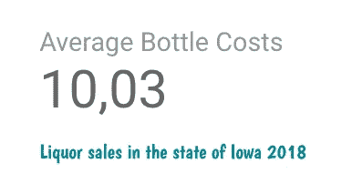
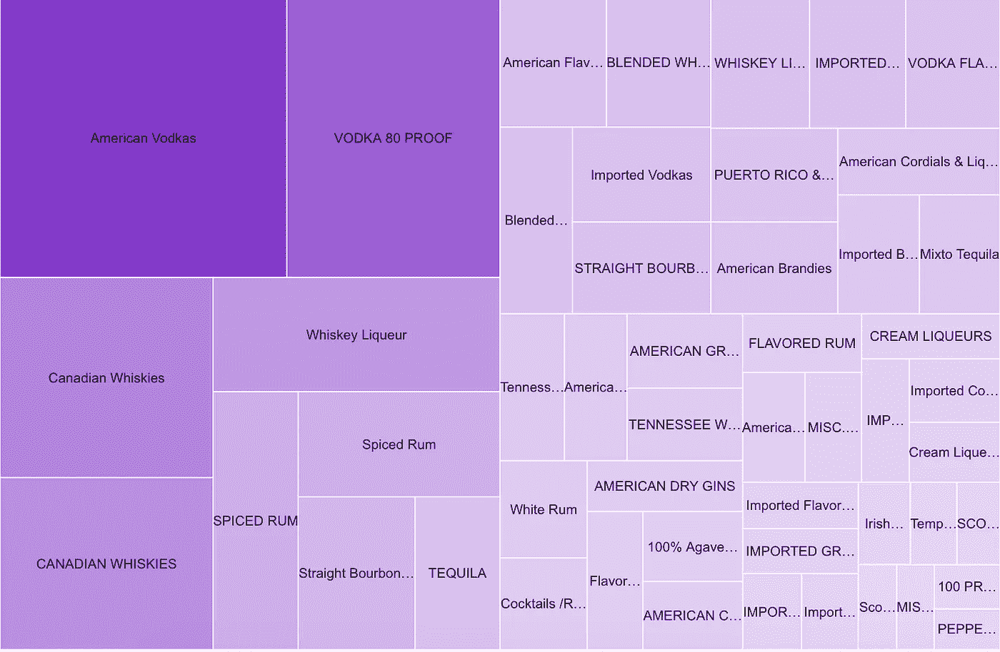
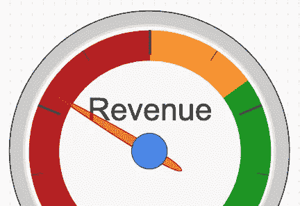
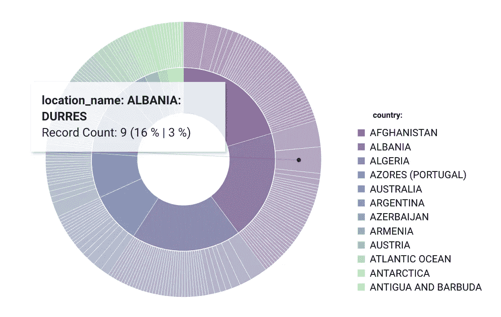

# 让您的仪表盘熠熠生辉

> 原文：<https://towardsdatascience.com/let-your-dashboards-shine-57ca09bab2c1?source=collection_archive---------32----------------------->

## 如何使用现代可视化技术使你的报告易于理解

照片由 [Chor 曾](https://unsplash.com/@chortsang?utm_source=unsplash&utm_medium=referral&utm_content=creditCopyText)在 [Unsplash](https://unsplash.com/s/photos/california?utm_source=unsplash&utm_medium=referral&utm_content=creditCopyText) 拍摄

除了通常已知的带有线条、条形图或简单表格的图表之外，许多新的图形表示变得越来越流行。最受欢迎的 BI 工具，如 Google Data Studio、MS Power BI 和其他工具已经提供了其中的大部分，或者通过他们的社区提供[1]。对于下面的例子，我使用了 Google Data Studio——你可以免费使用它。

## 可能性 1:简单的文本

当你只有几个数字要展示时，你可以用一段简单的文字让你的陈述更加精彩。

简单文本—作者提供的图像

这使得受众可以将注意力集中在重要的 KPI 上。这里不需要虚饰。

## 可能性 2:客户评论

当然，主要从像谷歌或亚马逊这样的商店了解，这个功能可以特别用于评级。既然大家都知道，那么对于观者来说就很容易解读了。

客户评论—作者图片

但是除了客户评论，这个特性还可以用于其他用例，比如空气或水的质量——我最近用它进行了过程质量分析。

## **可能性三:树状图**

树形图或平铺图用于可视化由嵌套矩形表示的分层结构。这样，通过选择与要显示的数据单元的尺寸成比例的矩形面积，可以生动地显示尺寸比。

树状图示例—按作者分类的图像

在这里，我可视化了自 2012 年 1 月 1 日起，零售商在爱荷华州批发购买酒类并出售给个人的情况。这个例子再次显示了这种图表是如何完美地显示大小关系的。

## 可能性 4:仪表图

规范图可以很好地表示状态，状态有不同的评价，要用颜色来表示。这个图表是基于一个简单的饼图。仪表图特别适合于测量关键数字、客户满意度或质量测量的目标/实际比较。

仪表图—图片由作者提供

这里，举例来说，一家公司的销售额与整体平均水平的关系如图所示。

## **可能性五:旭日图**

旭日图非常适合显示分层数据。层次结构的每个级别都由一个环或圆来表示，最里面的圆表示层次结构的顶级。具有多个类别级别的旭日图显示了外环与内环的关系。旭日图特别有助于显示一个环是如何被分成不同的组成部分的，而另一种类型的图，即树形图，特别有助于比较相对大小[4]。

旭日东升——作者图片

**其他有用的可视化方法:** 当然还有其他常用的图表可以使用，例如:

*   热图
*   单词云
*   符号地图
*   系统树图
*   网络模型

## 摘要

随着大量数据的出现，相应的可视化出现了新的挑战。因此，需要不同的技术和图表，而不是通常使用的可视化，如表格、条形图等。在最好的情况下，有可能创建一个简单明了的可视化，并且仍然不会让任何信息落到桌面下。在本文中，我展示了一些例子和一个很好的工具集，从 BigQuery 和 Data Studio 开始。无论如何，这些新的基于云的技术是处理如此大量数据的先决条件。我不想说那些经过实践检验的真正的图形不再被使用，但是为了更简单、更清晰的展示，这些工具肯定是有用的。在最好的情况下，这些方法也简单地互相补充，因为有了仪表板，无论如何你都可以从简单的 KPI 到细节。因此，例如，采用更新更简单的图表并使第一页清晰是一个好主意。如果用户随后想了解更多细节，可以在报告的后续页面中以表格或折线图的形式显示数据。

## 资料来源和进一步阅读

[1]Data Studio， [Data Studio 报告与社区可视化](https://datastudio.google.com/gallery?category=visualization) (2021)

[2]数据工作室，[概述](https://datastudio.google.com/overview) (2021)

[3]Cole Nussbaumer，《用数据讲故事》第 38–39 页(2015 年)

[4]微软公司，2021 年