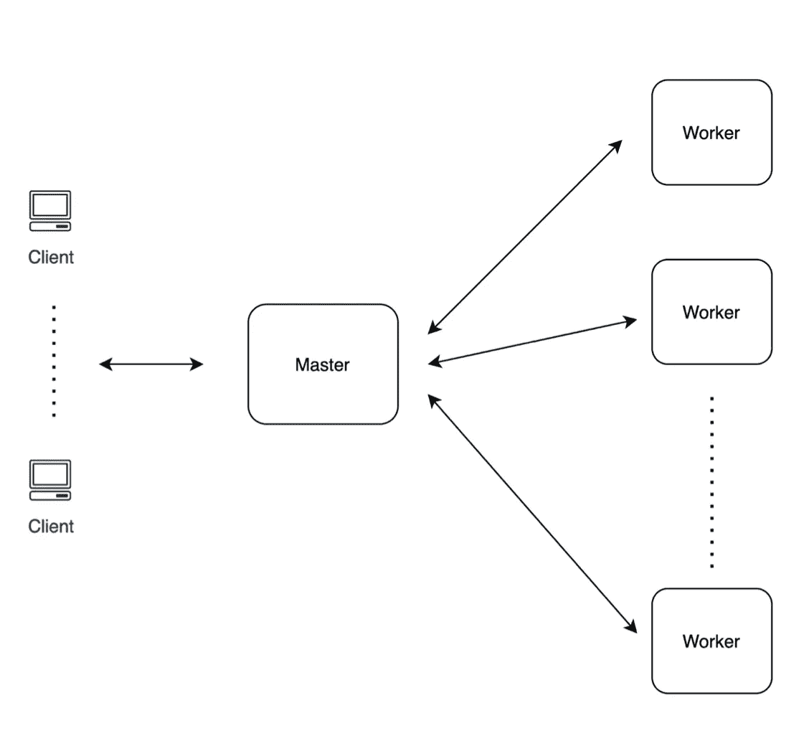
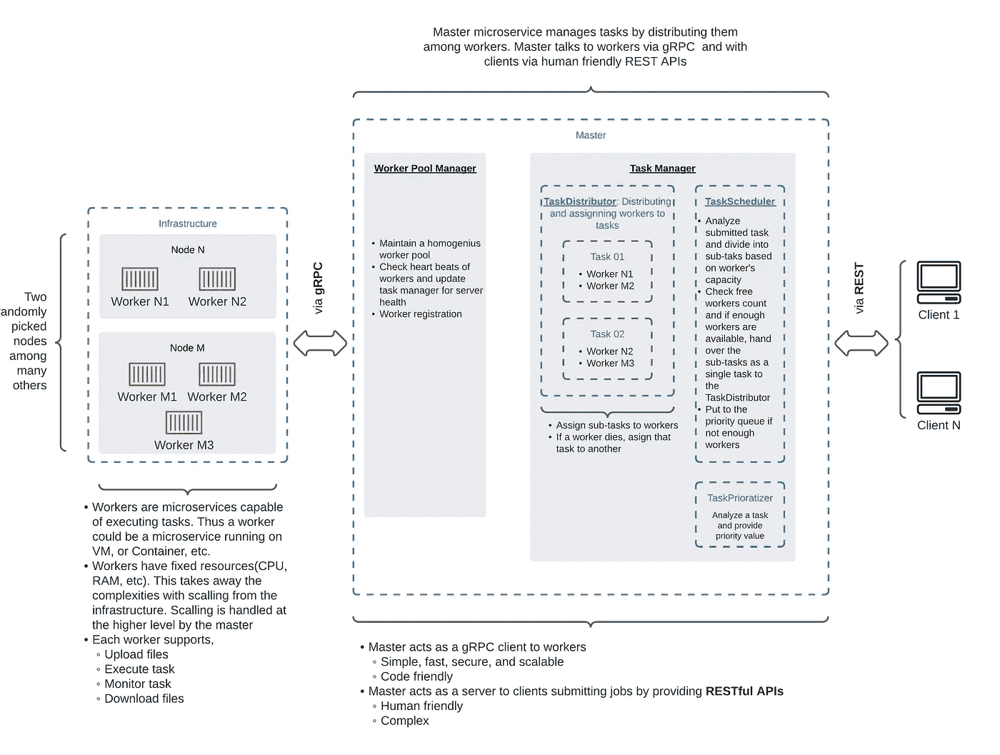
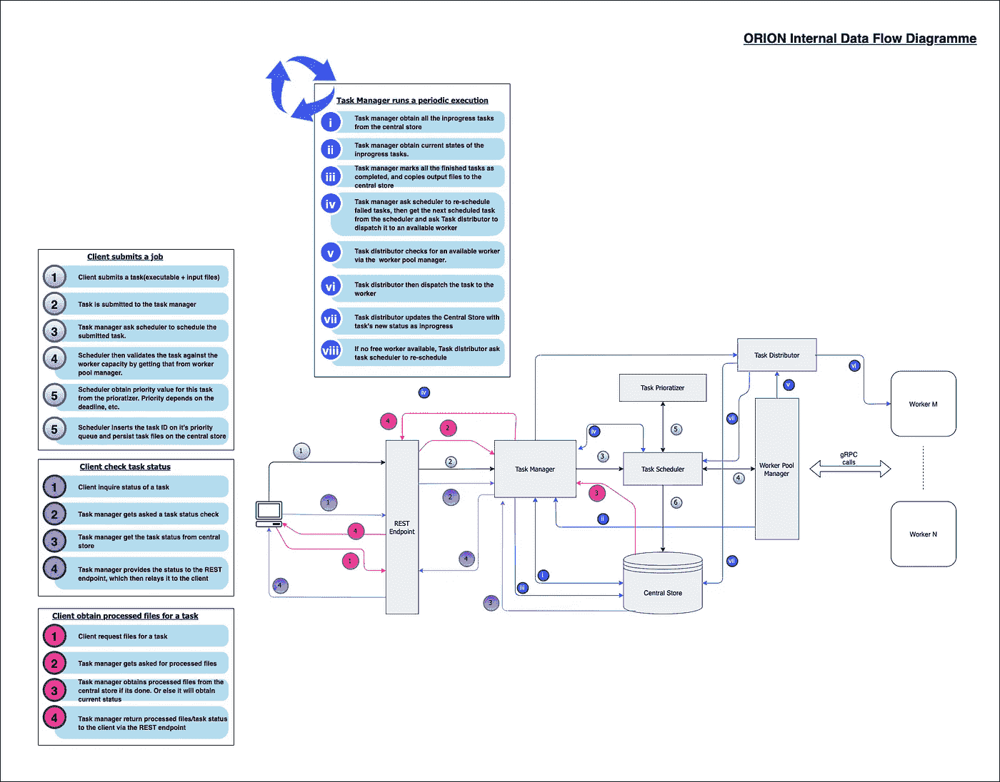
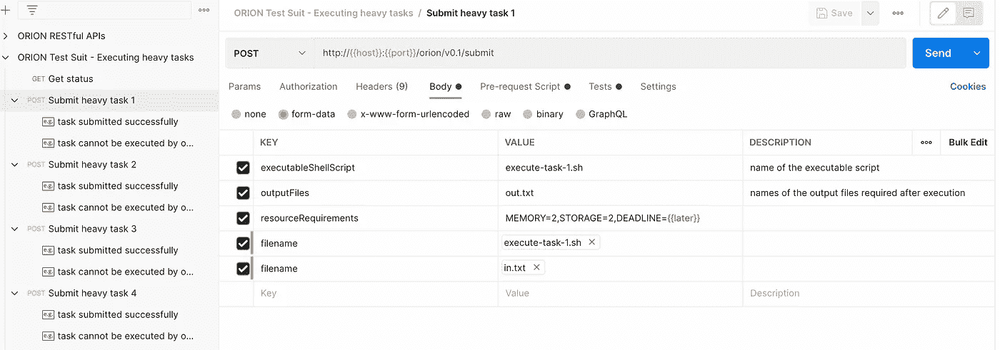
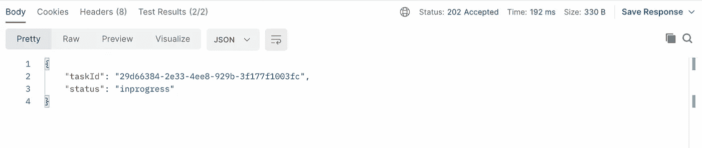

# 让我们为现代云构建一个简单的分布式计算系统

> 原文：<https://towardsdatascience.com/lets-build-a-simple-distributed-computing-system-for-modern-cloud-part-one-e2b745126211?source=collection_archive---------6----------------------->

## 从头开始设计、开发和测试全新的分布式计算框架，同时注重简单、现代和可扩展


“创造新事物的快乐”——https://unsplash.com/photos/nGwyaWKFRVI?utm_source=unsplash UTM _ medium = referral&UTM _ content = creditShareLink

现在写软件的方式已经大不一样了。成为云原生的是几乎所有软件系统架构的关键目标之一。

在本文中，我们将探索如何构建一个**简单**和**可扩展**的分布式计算框架，为**现代云**量身定制。我们将从头开始设计、构建和测试一个全新的框架，同时讨论关键的设计决策。

本文为理解分布式系统如何工作，以及实现针对现代云基础设施的可扩展系统提供了很好的指导。

## 好了，这是我们的分布式计算系统。



高层建筑

概括地说，这个系统有三个主要组件。

1.  **客户端** — *提交作业的实际用户或用户代理*
2.  **Master** — *接受客户的作业，协调系统并执行作业，最后将预期结果返回给客户*
3.  **工人** — *接受一项工作，执行它，并提供预期的结果。*

总的来说，客户机向主任务提交任务，主任务调度并让可用的工人执行这些任务，最后将任务结果返回给客户机。

## 深入系统设计之前的三个关键因素

我们正在以社区优先的方式为现代云开发这个系统。因此，在整个设计过程中，我们将始终遵循以下三点。

1.  简单的——简单的系统易于实施和诊断
2.  现代——运行在最新基础设施上的系统利用最新的技术，通常更快、更高效，而且显然是最新的。
3.  **可扩展的** —可扩展的系统对于社区来说至关重要，因为不同用例的需求是不同的，因此允许开发人员避免实现通用组件，重用和实现最少实现的用例。

## 系统结构

这是分布式计算框架的系统架构。



我们的分布式计算框架的系统架构

上面的图像是不言自明的。为了解释它的一些关键元素，

*   **职工微服务**

一个工人有一个自我隔离的工作空间，这允许他被封闭起来并独立行动。此外，系统期望所有工人在资源能力方面都是相同的。即固定的 CPU 功率、RAM、存储等。换句话说，工人没有规模。

这使得工人变得简单，从而更容易管理。根据默认实现，Workers 实际上是 gRPC 服务器。但是它也是**可扩展的**，因此可以用任何框架实现，甚至从头开始。

默认的 **gRPC** 实现确保主-工人通信通过 RPC(远程过程调用)进行。与另一种流行的方法 RESTful APIs 相比，这消除了所有的复杂性。此外，gRPC 还是可伸缩的、代码友好的、快速的(比 RESTful APIs 快 7 倍)。

*   **主微服务**

主人与客户交谈，与工人谈判。它充当工作人员的 gRPC 客户机，以及为客户机提供 RESTful APIs 的服务器。RESTful APIs 构建在 **Spring Boot 框架** + **开放 API 3 代码生成器**之上，采用 **API 优先开发**的方式。

RESTful APIs 对人类更加友好，因此更适合主客户端通信。此外，这些 API 调用不需要非常快，因为它们并不频繁。

预计 Master 还将在自己的自隔离环境中运行，因此非常适合集装箱运输。

主服务器由几个松散耦合的组件组成。这些组件中的每一个都有自己的职责，并且就它们所做的工作而言是独立的。这使得主控本身更容易理解。此外，每个组件都是可扩展的，这使得主组件的行为可以在更细粒度的级别上进行修改和扩展。



系统的内部组件和数据流方案。这个框架被命名为猎户座。

1.  任务管理器 —协调组件之间的数据流。它包括一个定期运行的任务，该任务检查和复制来自工人服务的已完成的作业，并随后分派计划的作业。
2.  任务调度器(Task Scheduler)—将任务保留在优先级队列中，直到它们被分派给工作人员。
3.  **任务优先级** —根据工作的不同属性，如截止日期等，分配优先级值。默认实现实现了“最早截止日期优先”的方法。
4.  **任务分配器** —与工人池通信，并将任务分派给自由工人。如果没有空闲的工作线程，那么它会将任务重新调度。
5.  **工人池管理**r——管理与工人服务的通信。
6.  **中央存储** —存储作业数据，直到它们完成，并被客户端获取。默认实现使用基于本地存储的存储，其中任务存储在给定隔离工作区中创建的文件夹中。

如前所述，任何人都可以插入他们自己的上述任何组件的实现，从而通过设计使系统**可扩展**。

## 履行

在我们开始之前，我们到目前为止讨论的系统的完整实现可以在下面的链接中找到。它是在 Apache 2.0 许可下发布的开源项目。

<https://github.com/crunchycookie/orion>  

我们刚刚设计的系统，被命名为**猎户座**。这个项目有四个主要部分。

*   **Master** —包含基于实现 Master 微服务的**Spring boot**+**Open API 3**+**gRPC 客户端代码**。这是一个纯粹的 **JAVA** 模块。
*   **Worker** —包含基于 **gRPC 服务器**的 Worker 微服务实现。这也是一个纯粹的 JAVA 模块。
*   **Monitor App** —包含基于 ORION monitoring SPA(单页应用程序)的**React**+**Material UI**。这是一个纯粹的 **JavaScript** 模块。
*   **集成** —包含测试脚本，以及配置测试环境的测试资源。脚本是**邮差测试集合**，测试资源包括执行集合所需的数据。

**配置和运行测试套件**

我们将使用 ORION 的 v0.1 版本进行我们的测试场景。

*   下载 **v0.1** 发布工件并解压两个压缩文件。
*   为测试工作区创建一个空文件夹。姑且称之为`workspace`。
*   打开以下文件，

```
<downloaded-artifacts>/integration/environment/init-setup.sh
```

使用正确的文件路径编辑以下变量。

```
WORKER_JAR_PATH=<path to the orion-v0.1-worker.jar file>MASTER_JAR_PATH=<path to the orion-v0.1-master.jar file>WORKSPACE=<path to the workspace directory>
```

保存更改。

*   打开以下文件。

```
<downloaded-artifacts>/integration/environment/stop-setup.sh
```

使用正确的文件路径编辑以下变量。

```
WORKSPACE=<path to the workspace directory>
```

保存更改。

*   现在我们准备启动猎户座系统。打开一个终端窗口，执行以下命令来运行 **init-setup.sh** 脚本。

```
cd <downloaded-artifacts>/integration/environment
sh init-setup.sh
```

这会将相关文件复制到工作区目录，并为主服务器和两个工作服务器启动三个微服务。

如果观察工作区目录，会创建以下文件夹。

*   **主动进程** —三个服务的 PID。
*   **日志** —来自三个服务的日志文件。
*   **主** —与主服务相关的工件。
*   **worker-1** —与第一个 worker 服务相关的工件。
*   **worker-2** —与第二个 worker 服务相关的工件。

执行以下命令来观察主日志。

```
tail -f <workspace>/logs/master.log
```

如果服务成功启动，应该会出现以下跟踪日志。

```
...2021-06-25 02:14:22.022  INFO 10125 --- [           main] o.c.orion.master.RESTfulEndpoint         : Started RESTfulEndpoint in 1.194 seconds (JVM running for 1.658)
```

同样，可以使用相同文件夹中的正确文件名，以相同的方式跟踪工作服务的日志。

*   现在启动 Postman 并导入下面的测试脚本集合。

```
<downloaded-artifacts>/integration/test-scripts/ORION Test Suit - Executing heavy tasks.postman_collection
```

这个集合中有四个任务提交 API 调用。您需要为它们中的每一个设置可执行的 shell 脚本和输入文本文件(这些文件作为多部分表单数据提交)。相关的工件可以在相应的文件夹中找到。

```
<downloaded-artifacts>/integration/test-scripts/task-files/task-<number>
```

我们在这个测试中使用的任务只不过是一个 shell 脚本和一个输入文件。以下是其中一个脚本。

```
...
sleep 50cat in.txt > out.txt 2>&1
```

它等待一段时间，然后创建一个名为 **out.txt** 的新文件，并将所有内容从 **in.txt** 复制到 **out.txt** 。这是为了模拟一个需要一些时间来处理的任务，包括输入和输出文件。



Postman 测试套件 API 集合

*   我们现在几乎准备好执行测试套装了。但在此之前，让我们启动监控应用程序。

在终端中执行以下命令(此时需要安装 npm)。

```
cd <downloaded-artifacts>/sd
npm i
npm start
```

这应该会启动监控应用程序。


监控应用的初始外观

一旦任务被提交，这将显示它们如何首先被插入到队列中，发送给工作人员执行，并最终在完成时存储在中央存储中。

*   让我们开始测试。在 postman 集合中，提交所有四个任务。您应该会收到以下响应，说明每个任务都在 ORION 中执行。



提交响应

现在打开监控应用程序窗口，观察已提交作业的生命周期！


提交任务并通过 monitor 应用程序对其进行监控

对于每项任务，进度及其唯一的 id 都会显示出来。

*   最后，通过执行以下命令来停止 ORION 系统。

```
cd <downloaded-artifacts>/integration/environment
sh stop-setup.sh
```

## 总结我们的工作…

在本文中，我们逐步开发了一个为现代云量身定制的分布式计算系统。我们开始设计架构，重点是简单、现代、可扩展和可扩展。然后我们开始测试实现的系统，并成功运行了测试套件，观察提交的任务是如何处理的。

谢谢你一直呆到这篇文章结束。非常感谢您对这项工作的想法、建议和问题。