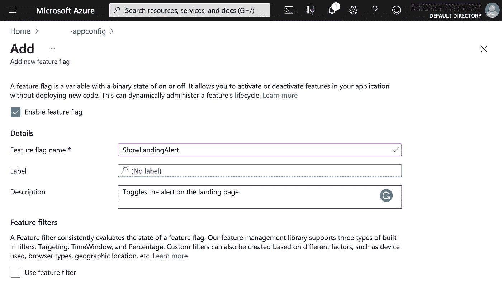
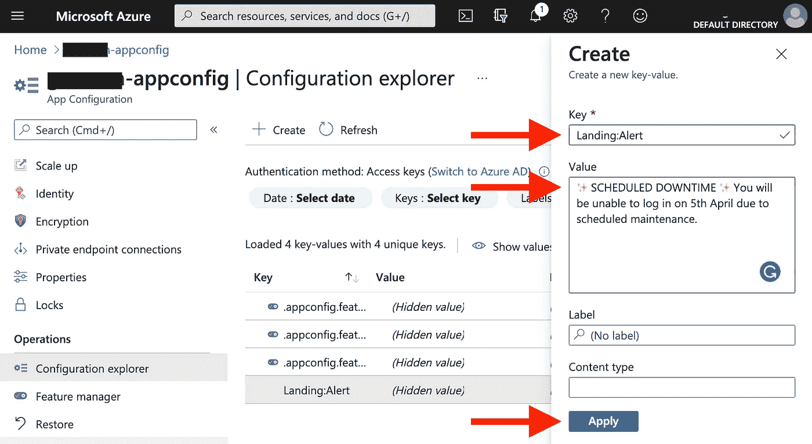

# 让我们为 React 和 Azure 应用程序配置构建功能标志挂钩

> 原文：<https://towardsdatascience.com/lets-build-feature-flag-hooks-for-react-azure-app-configuration-bc7417f24e94?source=collection_archive---------13----------------------->

## 连接 React 到 Azure 应用配置的自定义挂钩，以访问功能标志和动态配置。


尼古拉·约翰尼·米尔科维奇在 [Unsplash](https://unsplash.com?utm_source=medium&utm_medium=referral) 上的照片

有两样东西我很喜欢，[微软 Azure](https://azure.microsoft.com) (我的首选云)和 [React.js](https://reactjs.org) 用于构建可扩展的 web 应用。

最近，我发现有必要向我的应用程序添加动态配置，并将其视为更详细地探索 [Azure 应用程序配置服务](https://docs.microsoft.com/en-us/azure/azure-app-configuration/overview)的机会。

## 什么是 Azure App 配置？

补充的 [Azure Key Vault](https://azure.microsoft.com/services/key-vault/) (用于存储应用程序机密)应用程序配置使得实现以下场景更加容易:

*   集中管理和分发不同环境和地理位置的分层配置数据
*   无需重新部署或重启应用程序，即可动态更改应用程序设置
*   实时控制功能可用性

# 我们来建吧！

**场景:**我有一个登录页面，在这个登录页面的顶部是一个简单的可忽略的横幅警告，看起来像这样:


登录页面上可见的警报

**我的目标:**我想利用功能标志和动态配置来:

1.  每当我想向我的用户传达系统消息时显示此警报。
2.  更改此警报中的文本，以反映我希望传达的信息。

## 步骤 0:在 Azure 中创建应用配置服务

为了简洁起见，我假设您已经在 Azure 中创建了一个应用配置服务。在这种情况下，请导航到:**设置** > **访问键**并复制主只读**连接字符串**以备后用。

## 步骤 1:创建功能标志和配置

1.  导航到*特征管理器*并点击*添加*创建一个新标志。


选择“添加”以创建

2.添加以下属性并启用标志，然后点击*应用保存。*



命名功能标志

3.导航到*配置浏览器*并选择*创建*来添加一个新的键值配置(注意:也有一个引用密钥库秘密的选项，但是记住 React 可能会在客户端暴露这一点)。


创建新配置

4.添加以下配置细节，然后点击*应用*



## 步骤 2:安装 NPM 软件包

使用以下命令安装[*@ azure/app-configuration*](https://www.npmjs.com/package/@azure/app-configuration)NPM 包:

```
npm i [*@azure/app-configuration*](https://www.npmjs.com/package/@azure/app-configuration)
```

## 步骤 3:创建 useFeatureFlag 挂钩

在 React 项目中，创建一个名为 *useFeatureFlag.js* 的新文件，并在其中粘贴以下代码片段。

从 Azure 应用配置中提取功能和配置的挂钩

函数 *useFeatureFlag* 接受一个密钥，该密钥与我们之前在 App Configuration portal 中配置的密钥相匹配，如果该标志被启用，则返回 true，如果被禁用，则返回 false。

类似地，函数 *useConfiguration* 接受一个键，它匹配我们之前设置的配置，并返回配置字符串。

## 步骤 4:渲染横幅

在登录页面上，我们现在可以导入两个挂钩，用 Azure 门户中定义的给定消息有条件地呈现我们的警报。

现在，我们只需打开或关闭该标志，就可以看到生产中反映的变化，而不需要我们重新部署应用程序:


搞定了。👊🏻

如果这篇文章帮助你开始使用 Azure 中的功能标志(或者你成功地用我的自定义钩子实现了一个不同的提供商的 SDK)，请随意在下面留下评论，然后[用咖啡打发我的一天](https://www.buymeacoffee.com/olafwrieden)。