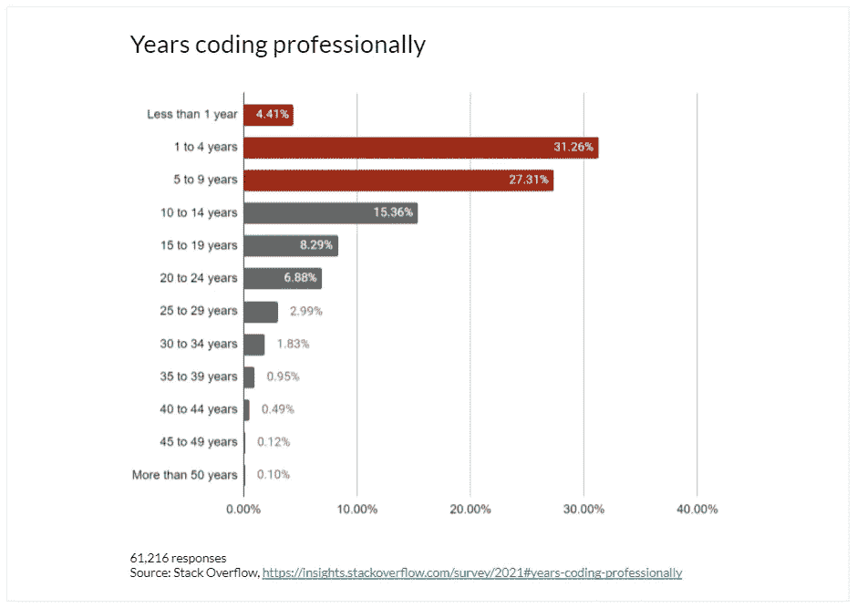

# 让我们回到编码上来

> 原文：<https://towardsdatascience.com/lets-get-back-to-coding-b45309ad407a?source=collection_archive---------27----------------------->

## 在几个月(甚至几年)的中断之后，你是如何重新开始编程的？

在 [Unsplash](https://unsplash.com/?utm_source=unsplash&utm_medium=referral&utm_content=creditCopyText) 上由 [Nadir sYzYgY](https://unsplash.com/@nadir_syzygy?utm_source=unsplash&utm_medium=referral&utm_content=creditCopyText) 拍摄的照片

Stack Overflow 最新的[年度开发人员调查](https://insights.stackoverflow.com/survey/2021#developer-profile-experience)显示，超过 63%的受访软件开发人员从事专业编码工作不到十年。**尤其是在数据科学领域，需要编程技能的工作之间的职业转换已经变得很常见。**那些曾经做过代码，但后来做了完全不同的事情(在非技术领域学习，获得一个不需要他们编程技能的工作机会，或者花时间开发一个与编码无关的个人项目)的人呢？如果他们想重新进入我这里称之为“编码的世界”会发生什么？如果你在这样的情况下，你会怎么做？

玛丽·勒费夫尔

为了回答这些问题，让我告诉你我个人故事的一部分。毕业后，我开始在一家战略咨询公司工作。在那个时候，这是我梦想的工作:我将在不同的行业进行多个项目，我将与超级聪明的人一起工作，我将迅速获得经验并承担责任。情况就是这样。然而，两年后，我仍然缺少一些东西:数值分析的技术部分，与编程语言对抗的感觉，从简单的字符行中创造新东西的能力。总之:**我漏了编码**。

这是我决定重新定位职业选择，进入数据科学领域的时候。从做出这个决定到得到我的第一份数据分析师的工作，我花了十个月的时间…在这个过程中我学到了很多东西。现在，我已经不间断地将编码作为我日常工作的一部分一年多了，我想与你分享我从这次“回归编码”中学到的经验。**最重要的是，我想让你相信一件事**:如果你目前正处于重新进入编码世界的状态，你会成功地回到这个状态。

> 坐下来，进入激励状态，现在是讲故事的时间。

# 跟上时代

世界没有等我前进。它一直在发展，尤其是在数据科学领域，每天都有创新。我注意到的第一件事是，我需要重新进入编码世界，了解自从我离开 1 和 0 的平行宇宙以来发生了什么变化。我的切入点是寻找我最感兴趣的招聘信息中最受欢迎的技能。这给了我一个方向:其中，**我必须学习 Python**——它同时成为数据科学的头号编程语言。

**你怎样才能跟上时代？这似乎是显而易见的，但我还是会写下来:从你喜欢的事情开始。通过首先搜索你最感兴趣的主题，没有比这更好的方法回到你曾经知道的主题。要找到最新趋势和数据科学新闻，我只能推荐专门的平台(如面向数据科学的媒体出版物)、数据科学博客(如 [SuperDataScience](https://www.superdatascience.com/blogs) 、 [Analytics Vidhya](https://www.analyticsvidhya.com/blog/?utm_source=feed) 、 [Data Camp](https://www.datacamp.com/community/blog) )和[收听播客](/5-data-science-podcasts-you-must-follow-in-2021-754771d2d104)。**

# (再次)学习基础知识

不管别人怎么说，舒适区是一个很棒的地方。然而，从第一天起我就知道，从技术角度来看，回到编码轨道上来并不容易。所以**我回到了我在大学**所学的关于统计和商业分析、R 和 SQL……并通过注册一个名为“[用 Python 应用数据科学](https://www.coursera.org/specializations/data-science-python)”的在线课程将它带到了一个新的高度。从一个新主题的底部开始教会了我两件事:我已经有了好的编程理念，并且——这是关键——我喜欢它！这正是要点:通过回顾基础知识，我注意到我没有忘记关于编码的一切。它增强了我的自信，同时确保我正在建立一个坚实的基础，以达到前所未有的能力水平。

你如何(再次)学习基础知识？如果你在过去已经获得了技术技能，为什么不再打开你的学生笔记本呢？为了给你正在学习的任何主题增加一点互动性，现在有各种各样的(大部分是免费的)在线资源。如果你碰巧与面临类似挑战的人一起工作或生活，与他们配对对你们双方来说都是一个共同发展技能的好机会。

# 练习再练习

我知道证明我能够用代码操作数据集的唯一方法是我的硕士成绩单(第四学期，介于“金融基础”和“高级德语”之间)，我不得不**用具体的例子展示我(重新)获得的技能**。事实上，这是我开始写作的时候:我用我的 GitHub 帐户存储数据，我在 Medium 上发表文章来展示我的个人项目。首先，这向我自己证明了我可以独自进行一个(甚至是小的)数据项目。第二，如果我以这种方式相信了我的技能，为什么其他人不能呢？

**你怎么能练习又练习呢？**通过构建自己的数据科学组合，无论是构建得很好的图表还是复杂的机器学习算法。首先，你可以在众所周知的数据集[上开展项目，比如 Iris、Boston Housing、信用卡欺诈检测。然后，为了更上一层楼，并使自己与众不同，创建自己的案例研究:选择一个你感兴趣的主题，找到关于它的开源数据(或创建自己的数据集)，并使用你学到的各种技术(探索性分析、数据可视化、机器学习等)进行分析。).](https://pub.towardsai.net/best-datasets-for-machine-learning-data-science-computer-vision-nlp-ai-c9541058cf4f)

> 最后但同样重要的是:

# 善待自己

我记得我有多想得到那份数据分析师的工作。尽管一个人有很高的动机，但他的简历还是被忽略了几次，这是很难的。然而，我注意到最难说服我真正进入数据科学世界的人是我自己。听数据科学专家之间的播客对话，阅读关于成功从非技术工作过渡到数据科学家的人的令人难以置信的故事，以及努力研究开源数据集，让我觉得我不属于这个领域。但是，一旦我意识到这些人也必须走一条与我相似的道路，我就能够继续下去，而不会有那个声音在背后告诉我，成功只发生在别人身上。

对于最后一条建议，我没有神奇的“如何做”公式。带着真正的兴趣、学习和实践——一句话，带着我刚刚经历的所有因素——重新进入一个你已经离开的世界是可能的，甚至可能是可取的。

*你喜欢读这篇文章吗？* [*成为*](https://marie-lefevre.medium.com/membership) *的一员，加入一个不断成长的充满好奇心的社区吧！*

由 [sydney Rae](https://unsplash.com/@srz?utm_source=unsplash&utm_medium=referral&utm_content=creditCopyText) 在 [Unsplash](https://unsplash.com/?utm_source=unsplash&utm_medium=referral&utm_content=creditCopyText) 上拍摄的照片