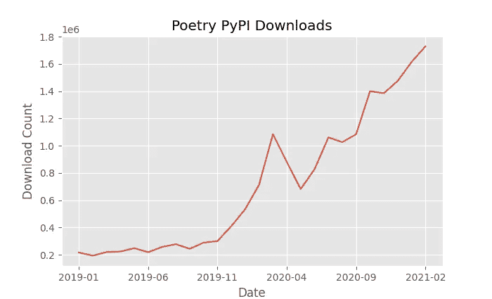
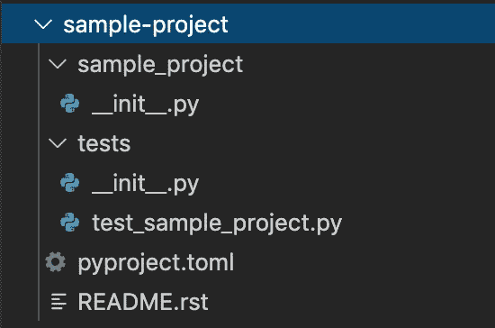
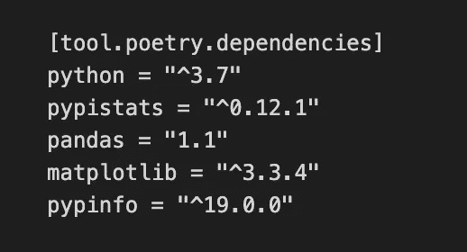
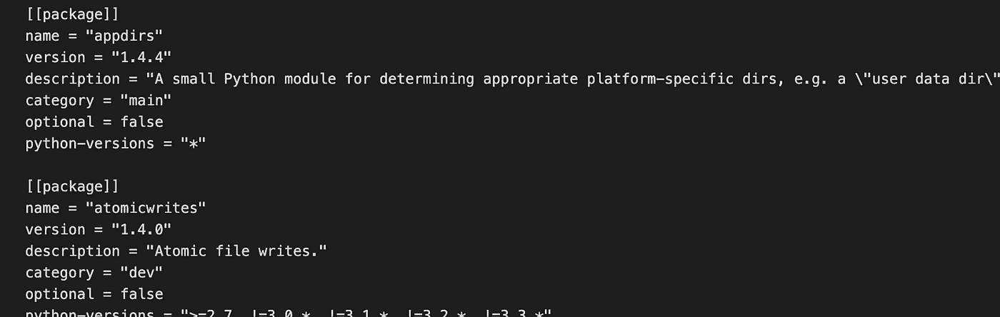

# 让我们加入诗歌潮流吧

> 原文：<https://towardsdatascience.com/lets-jump-on-the-poetry-bandwagon-d0b650de17b6?source=collection_archive---------11----------------------->

## 为什么应该在 Python 数据科学项目中使用诗歌

丹尼·豪在 [Unsplash](https://unsplash.com?utm_source=medium&utm_medium=referral) 上拍摄的照片

[诗歌](https://python-poetry.org/)可能会彻底改变当前 Python 项目的创建和共享方式。它使用起来很直观，解决了 Python 开发人员抱怨多年的一些关键痛点。在学习打包 Python 项目时，我偶然发现了诗歌。对于那些不熟悉打包的人来说，它本质上包含了轻松共享代码所需的步骤。不幸的是，众所周知 Python 的打包生态系统错综复杂，对新来者不友好([这里是 Python 打包的伟大历史](https://www.youtube.com/watch?v=AQsZsgJ30AE))。诗歌将自己推销为更好的选择——一站式商店，可以使整个过程更加顺畅。我同意它在这方面有所作为。但是，即使您没有完成整个打包工作流，诗歌也可以在您的数据科学项目中让您受益匪浅。请继续阅读它的一些最佳特性。

  

在过去的一年里，诗歌变得更受欢迎了。版本 1 于 2019 年 12 月发布。来源:使用 [pypinfo](https://github.com/ofek/pypinfo) 查询 PyPI 下载，参见[本文](https://packaging.python.org/guides/analyzing-pypi-package-downloads/)。作者创建的图表。

# 诗歌确保新开发人员遵循一些最佳实践

我记得在我的第一份数据科学工作中，我开始了一个项目，在开始编码之前，我被你必须要做的大量步骤所淹没。有 Git 和 [GitHub](https://github.com/) ，我不确定它们是不是一回事。还有一种叫做[康达](https://docs.conda.io/en/latest/)的东西……或者是蟒蛇……或者我听到的是迷你蟒蛇？然后有人让我建立一个持续集成管道，我完全不知所措地盯着他们…

关键是在开发任何软件时都有很多最佳实践。如果您的团队中有新的开发人员，或者如果您自己也是一名新的开发人员，诗歌将有助于执行一些标准实践。您的代码将受益于更有组织性和可重复性。这里有一些对新开发人员最有益的诗歌特性。

## 使用新项目创建一个目录结构

从头开始一个新的诗歌项目需要运行`poetry new <project>`。这个命令将创建一个简单的目录结构。它比你可能从诸如 [Cookie Cutter Data Science](https://drivendata.github.io/cookiecutter-data-science/) 之类的目录结构中找到的更加简单，但是那些模板中的一些对于新手数据科学项目来说可能是多余的。诗歌仍然强调一些重要的组成部分，例如:

*   主代码之外的测试
*   包括自述文件
*   正在添加 __init__。py 脚本

一个诗歌项目的例子可能如下所示:

诗歌项目的目录结构示例。图片作者。

对于现有的项目，或者如果您已经有了一个特定的目录结构，那么您可以使用`poetry init`来代替。

## 诗歌加强了环境隔离

为每个项目建立一个独立的虚拟环境非常重要，这也是经验丰富的开发人员的习惯。它将您需要的库从一个项目中分离出来。当不同的项目需要不同的版本时，这有助于防止错误。它还有助于再现性，因为您的项目的虚拟环境应该只包含项目的依赖项。如果被激活，does 将只在一个虚拟环境中运行代码(所以不会在全局环境中运行它)，如果一个新环境还不存在，does 将为您创建一个新环境。少了一个你必须记住要做的步骤。

# 诗歌是一个依赖管理器

依赖项是您导入的所有包(例如 pandas、numpy、scitkit-learn 等。)在您的项目中。对于 Python 项目，您可能已经使用了主要的 Python 安装程序`pip`来安装依赖项(注意:`pip`不是依赖项管理器)。依赖关系管理器帮助组织和维护这些依赖关系。它们很有用，因为它们可以确保在两个可能需要不同版本的子依赖项的包之间不会有版本冲突。它们还有助于确保您的环境是可复制的。当您希望更新依赖项的版本，并且不希望整个环境崩溃时，它们会有所帮助。让我们看看诗歌如何成功地成为一个依赖管理器。

## 更好的依赖性组织和可再现性

在 Python 中，维护所有依赖项列表的传统方法非常烦人。([这篇文章](https://realpython.com/pipenv-guide/)很好地概述了当前的方法)。这个过程依赖于一些手动步骤来更新需求文件(或者 environment.yml，如果您使用 conda 的话),只要依赖关系发生变化。这对新的和有经验的程序员来说都是容易出错的。诗歌用一个`poetry.lock`文件代替了任何对`requirements.txt`文件的需要。两者都实现了确保可再现环境的目标，但是当您在环境中修改包时，poems 的文件会自动更新。

诗歌的`add`和`remove`命令简化了这个过程。如果你输入`poetry add`，它将自动下载、安装(假设没有冲突)，并更新`pyproject.toml`文件中的依赖列表。安装的确切版本以及每个子依赖项版本都会在 poetry.lock 中更新。因此，团队不再需要依靠人们的组织技能来保持这些依赖项是最新的！

pyproject.toml. Image 中按作者列出的依赖关系示例。

示例 poetry.lock 文件。图片作者。

此外，如果您使用 pip，您可能尝试过安装一个包，可能是`pandas`，决定它不适合您的需要，然后卸载它。当你安装`pandas`时，它依赖于另一个名为`pytz`的包。Pip 安装了`pytz`和`pandas`。然而，当您移除`pandas`时，pip 并没有最终移除`pytz`。随着时间的推移，您的环境可能会因这些不需要的包而变得拥挤。从安全角度来看，安装这些不必要的设备是有问题的。这也使得重建您的环境变得更慢。有了诗歌，它会在你移除父包的时候移除这些未使用的子依赖，而你不会面临这个问题。

诗歌也很容易将开发需求和生产需求分开。只需在运行命令时添加一个标签，例如`poetry add --dev pandas`，它就会为您适当地组织依赖关系。新的诗歌项目将自动在开发列表中有`pytest`。

除了版本号之外，poem 的锁文件还包括散列。这些散列是额外的安全层，可以 100%确信包的散列与预期的相匹配。在软件包的源代码被黑客攻击并被恶意软件替换的危险事件中，这个特性可以帮助保护您的系统。

## 您可以避免冲突并更容易地更新您的依赖关系

你的依赖关系的依赖关系被称为*传递*依赖关系。这些可传递的依赖关系通常会在安装时导致问题。Pip 不能也不会以任何方式解析依赖关系。这意味着如果你运气不好，当你试图安装需要相同子依赖的不同版本的包时，你会得到**安装失败**错误。例如，假设您要在以下位置安装:

*   package_a 依赖于 package_c >1.5
*   package_b 依赖于 package_c ≤ 2.0

假设 package_c 的最新版本是 2.5。当 pip 首先安装 package_a 时，它可能会下载 package_c=2.5。当它尝试安装 package_b 时会发生冲突，然后安装会失败。(例子来自[本文](https://realpython.com/pipenv-guide/))。

依赖项管理器通过巧妙的确定需要哪个版本来满足所有必需的包来帮助避免这些冲突。(想象一下必须手动完成这项工作！)在上面的例子中，package_c 版本 1.6 将满足 package_a 和 package _ b。poeting 具有这种功能，因此您应该有较少的安装挑战。它将总是试图检索您试图添加的包的最新版本，除非您指定不同的版本。如果找不到依赖项的成功组合，poems 将通过对有问题的包的详细描述来提醒您这个问题。在这一点上，您将不得不尝试解决冲突，但是错误消息会清楚地告诉您到哪里去找。

此外，您可以想象保持每个依赖项和子依赖项都是最新的有多难。保持您的依赖项最新对于确保您拥有最新的功能和任何重要的安全修补程序非常重要。拥有一个可以更新所有依赖项的依赖项管理器，以便每个包都满足需求，这是您保持理智和环境成功的关键。使用`poetry update`，它将检查所有包的最新版本，并在不引入冲突的情况下更新任何包。魔法。

# 用诗歌发布应用程序很容易

最后，这一部分可能并不适用于那些对构建和分享他们的最终项目不感兴趣的人。但是如果你想这么做，诗歌会让它变得非常简单。

首先，对于任何熟悉包装的人来说，诗歌项目最引人注目的是它缺乏`setup.py`。诗歌已经完全取代了对“T1”的需求，代之以“T2”。这个新文件是对`setup.py` (PEP- [517](https://www.python.org/dev/peps/pep-0517/) 、 [518](https://www.python.org/dev/peps/pep-0518/) )的一些缺点提出的[解决方案](https://www.python.org/dev/peps/pep-0518/)，并取代了对`setup.py`、`requirements.txt`、`setup.cfg`、`MANIFEST.in`和`Pipfile`的需求。这减少了打包新手的困惑，并为项目的构建提供了更大的灵活性。这也有利于更干净的回购。

诗歌也通过给他们简单的命令来构建和发布帮助那些打包项目。改变你的包的版本就像运行`poetry version`一样简单。构建你的包就像`poetry build`一样简单，它生成轮子和源文件。并且发布就像`poetry publish`一样简单。

# 结论

poem 有许多有益于 Python 社区的特性，对于不太熟悉编程最佳实践的数据科学家来说，它抽象出了一些关于打包和依赖管理的复杂性。它非常易于使用，从 Python 的新用户到有几十年经验的用户都可以从中受益。是时候下载诗歌了。让我们加入这股潮流吧。

# 参考

[Pypinfo](https://pypi.org/project/pypinfo/) 用于诗歌的每月总下载量

介绍开发者如何使用诗歌来管理依赖关系

构建 pipenv 的动机，pipenv 是另一种依赖性管理器

[诗歌文献](https://python-poetry.org/)