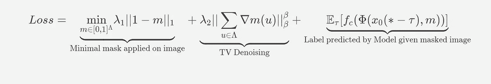

# 让我们保持可解释方法的实用性和相关性

> 原文：<https://towardsdatascience.com/lets-keep-explainable-methods-practical-and-relevant-92e963ce3f64?source=collection_archive---------63----------------------->

## 一种可解释的图像分类器掩蔽方法及其在视觉转换器(ViT)上的应用

原预测标签(从上至下):埃及猫、穹顶、雏菊。第二和第四列显示了模型“看”作出决定的图像区域。顶部和底部图像来自标准 scikit-learn 和 imageio 包目录(公共域)。中间图像是作者的。

随着机器学习(ML)模型被部署在不同的高风险社会领域，如公路旅行、医疗保健和金融，模型有必要解释它们的决定，以便这些模型按照其创造者的意图行事。另一个重要的问题是，这些模型的大多数用户既不是 ML 研究人员，也不是工程师。他们很可能无法以任何方式修改模型来解释其决策是否与用户期望的结果一致。因此，我们需要容易应用于黑盒模型的方法，我们不能修改也不知道其内部组件的模型，同时对于专家和外行来说都是直观和可访问的。

在本文中，我将展示一个这样的算法，在 [*有意义的扰动* ( *Fong，et。艾尔。，2018)*](https://arxiv.org/pdf/1704.03296.pdf) *，*即既适用于黑箱模型，又能让外行人接触到。我将解释它的好处，它是如何工作的，以及它在解释分类器方面的局限性。在最后一节中，我演示了该算法的多种应用。我将该算法用于输入到谷歌大脑视觉转换器(ViT)的图像，以展示如何使用该算法来解释你自己的图像分类模型(是的，即使它是 2021 年迄今为止最热门的模型)。我还使用快速梯度符号方法创建了对立图像，该图像向原始图像添加了视觉上不可察觉的噪声，使得模型错误地预测了标签，并表明该算法可以通过掩蔽这些噪声来对图像进行去噪。在某些情况下，遮罩会恢复模型在图像上的原始预测。

> 我的实现和演示笔记本可供您在我的 [Github](https://github.com/ajsanjoaquin/mPerturb) 上使用。

# 一幅图像是值得它的掩盖部分

我们的方法是一种局部解释，它试图解释**给定一个特定的输入，一个模型如何表现。**我们的方法具体回答了两个问题:

1.  模型最依赖图像的哪些部分来进行预测？
2.  这个模型在多大程度上依赖这些特征来进行预测？

我们的方法的目标是在给定一幅扰动图像(应用了遮罩的同一幅图像)时，创建能够改变模型在该图像上的原始预测的最小可能遮罩。蒙版影响的区域是模糊的(高斯模糊)。通过最小化被遮罩的区域，我们可以根据模型识别图像的最基本特征，并通过测量应用遮罩前后原始标签上模型置信度的变化来量化这些区域对模型预测的影响程度。

不仅仅是显示模型“看”什么，该方法允许我们验证模型是否正确地强调了某些特征。例如，如果我们认为飞机的机翼对于将其分类为飞机是重要的，并且我们的扰动图像显示我们的分类器仅掩盖了飞机图像的鼻子，那么我们的方法向我们发出信号，以包括更多的飞机图像，并且在训练数据中强调它们的机翼，以使我们的分类器将飞机的机翼关联为飞机的基本特征。

该方法通过(1)创建初始掩模，(2)用该掩模扰动图像，然后(3)在给定扰动图像的情况下迭代计算模型的梯度，以及(4)更新掩模，使得模型在原始标签上的概率最小化，来达到其目的。记住这个模型是一个黑盒:**它的权重永远不会改变，只有遮罩会更新**！

现在让我们来看看用于寻找最佳掩模的成本函数(损失)。乍一看，这似乎令人生畏，但是我们可以把损失分解成每个术语的作用以及它们为什么重要。

在论文(等式)中发现的损耗等式/掩模优化问题 4)

最小删除:第一个术语本质上是最小化应用于图像的遮罩，使得遮罩这些区域必须导致模型改变其预测。第三项本质上是给定扰动图像的模型预测，目标是标签已经改变。

平滑扰动:有时，通过 SGD 创建一个遮罩会导致利用模型中发现的工件。因此，它创建了与图像中发现的任何语义上可观察的特征(例如噪声、翅膀、眼睛)不对应的**噪声屏蔽**，这妨碍了它们的可解释性。因此，作者将噪声添加到掩模中，使得解释者不会从单个可能有噪声的掩模(第三项，其中图像 x_0 由 tau 给出一些噪声)和总变差(TV)范数(第二项)中学习。这导致平滑的掩模。

把图像中的噪声想象成面具学习到的。我们使用电视标准去噪图像。图片来自[维基百科](https://en.wikipedia.org/wiki/File:ROF_Denoising_Example.png) (CC BY-SA 3.0)

我认为这种方法的一个很大的局限性，就像大多数本地解释一样，是目前没有一种自动的方法来验证模型是基于每个预期输入的*的正确特征集进行分类的。但我可以想象这种方法可能是模型管道中的一个组件，该组件使用该方法为集合(一组模型)不同意(其预测不相同)的图像产生遮罩。*

另一个与一般解释有关的限制是，我们假设人类可以提供基本事实的解释，从这个基础上比较方法的解释。然而，没有一个通用的方法来确定一个物体的基本特征是什么，所以人类可能无法为所有可能的场景提供一个真实的解释。例如，如果创建者在训练分类器时假定“人”必须有四肢，并因此将重点放在这些四肢上作为基本特征，那么分类器可能会将残疾的人误分类为其他东西。

# 解释模型的决定

我们现在将使用最近来自 [*的视觉变压器(ViT)一张图像相当于 16x16 个字:Scal* e ( *Dosovitskiy 等)的图像识别变压器。艾尔。，2020)*](https://arxiv.org/abs/2010.11929) 来说明这种可解释性方法仍然适用于最近的(有时是革命性的)模型架构。我们还将使用北京颐和园的图像，其原始预测是**宫**(ImageNet 上的 698)

我们首先加载我们的 transformer 模型，在这种情况下是在 ImageNet 上预处理的 224 x 224 图像的 ViT 基础变量，并简单地调用 *perturb* 函数以及我们的预处理转换。结果绘制如下，并保存为图像。

由于遮罩根据模型突出显示了图像中最重要的细节，因此我们可以直接验证模型使用的特征是否正确。然而，这个面具也显示了我前面讨论过的基本事实问题。我们假设的地面真相面具中是否缺少面具的某些部分，比如建筑物的屋顶？如何才能知道哪些特征是标签*宫*必不可少的？然而，我们至少可以识别模型是否正在查看图像的正确区域中的细节，例如避免聚焦在树木上以进行这种分类(尽管掩模确实显示了对树木的一些轻微聚焦)。

事实上，模型在原始预测标签上的概率从大约 0.74%下降到大约 0.0008%，并且它将扰动的图像(应用了遮罩的原始图像)分类为灯塔(437)，这表明遮挡图像的基本区域阻止了模型正确地对图像进行分类。

随着模型逐渐学习更好的掩模(100 次迭代),类宫的概率(698)

# 针对对立的图像为模型辩护

我们现在将该方法应用于被对抗噪声干扰的去噪声图像(对抗图像)。这种方法对抗视觉上无法察觉的敌对噪音的效果如何？作者使用了一种迭代和强大的基于梯度的方法，但我们将看看该模型是否能对较弱的攻击做出反应。

我们考虑由 Goodfellow 等人介绍的[快速梯度符号方法(FGSM)](https://arxiv.org/abs/1412.6572) 的目标版本。艾尔。(2015)并将对抗性图像的标签设置为**城堡** (483)，这对许多人来说似乎在语义上类似于**宫殿**(思考这两个术语会在你的脑海中产生相同的图像吗？).毕竟，这两座雄伟的建筑都有防御工事，历史上也是皇室的住所。

变形金刚模型也容易受到敌对形象的影响。如你所见(或者不是！)，对立的噪音阻止我们区分两幅图像之间的任何视觉差异，但我们的模型将对立的图像错误地分类为**城堡**。然而，对对立图像应用有意义的扰动方法揭示了一种区分干净图像和对立图像的可能方式。

上图:对立的图像，下图:干净的图像

与具有更多高亮和平滑区域的干净图像的掩模相比，在对立图像上产生的掩模清楚地示出了更少的高亮区域和更多的可见像素化区域。作者指出**他们的算法以类似于基于梯度的对抗性攻击的方式工作，因为这两种类型的方法都基于成本函数对数据的梯度迭代地改变数据(即扰动图像)，以增加成本函数(即使模型对图像进行错误分类)。他们甚至训练了一个分类器，在区分由一种更强大的迭代攻击方法生成的干净和敌对图像的面具方面达到了约 93%的准确率。**

我们也可以使用蒙版去噪的图像。由于模型依赖于对抗噪声来对对抗图像进行分类，所以对抗图像的掩模应该突出对抗噪声作为图像中的重要区域。因此，在给定被扰动的图像的情况下，用其掩模扰动对立图像可以允许模型返回其原始预测。事实上，这就是我们带着面具的对立图像(干净的图像)的情况。我们的模型正确地预测出这个图像是一座**宫殿**。作者还对 5000 张敌对图像进行了降噪处理，发现他们的模型在 40%的情况下返回了原来的预测。

如果进一步探索，这两种针对敌对图像的应用似乎是一种可行的用于敌对检测的黑盒方法，并且分别是生成敌对网络(GANs)或具有特定去噪组件的定制模型的廉价去噪替代方案。

本文并不是算法的详尽展示，但是我希望我们的实现可以帮助 ML 研究人员、开发人员和用户解释他们的模型。我还希望我们探索的不同用途可以应用到您的项目中，甚至帮助您改进现有的管道或发现算法的新用途。随着新的最先进的模型和方法每年出现，我希望模型的可解释性仍然是保持模型安全和健壮的一个重要考虑因素。

为了节省计算，我的实现遵循 Jacob Gildenblat 的修改，通过计算一次模糊图像，并让遮罩成为唯一被迭代修改的对象。最后，掩模、模糊图像和原始图像被组合以产生扰动图像，使得只有掩模区域被模糊。

*虽然作者使用了 300 次迭代，但实际上我发现使用我的实现的前 20 次迭代已经大大降低了与原始标签相关联的概率。尽管如此，在 Google Colab 上使用 CUDA 进行 300 次迭代只需要 5 秒钟。*

*感谢 Patrick 和 Golam 的反馈。*