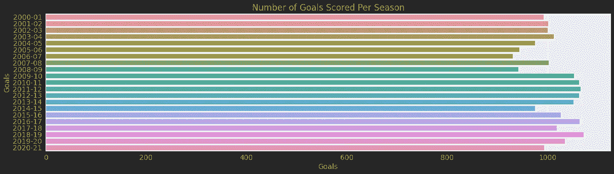
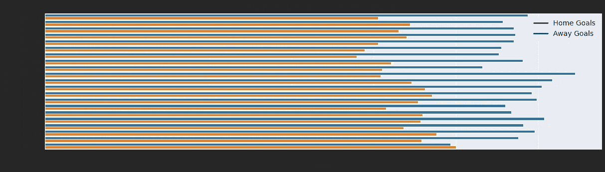
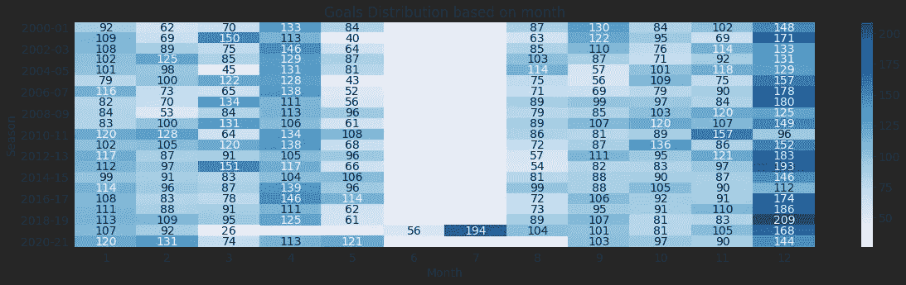
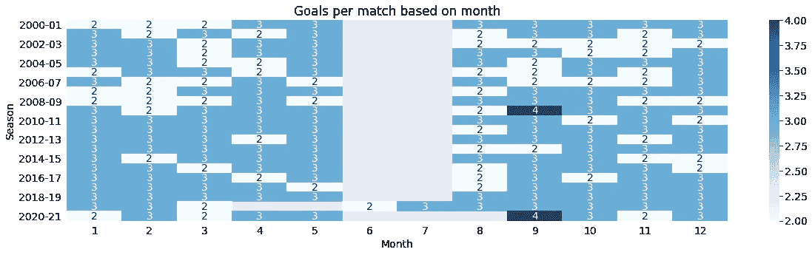
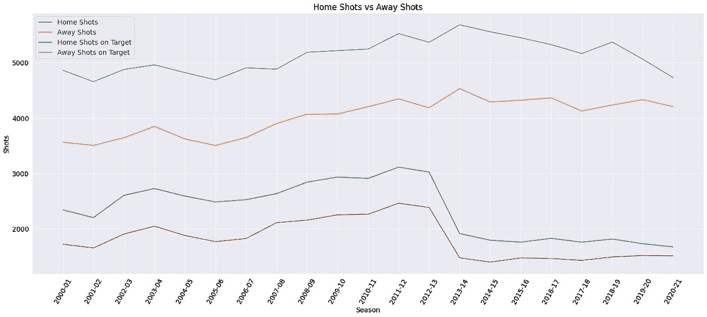
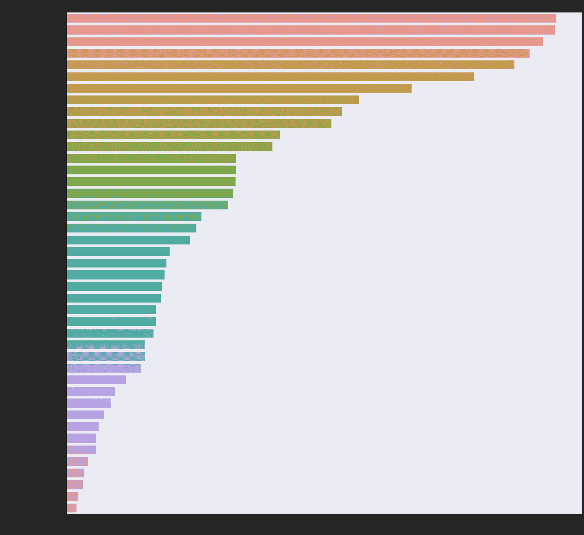
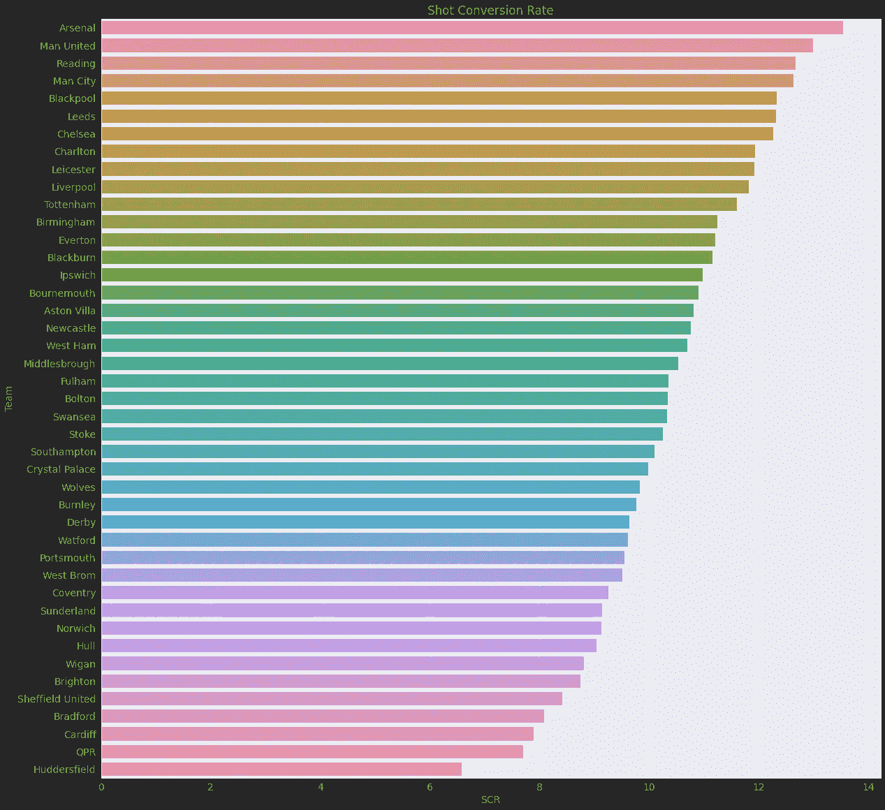
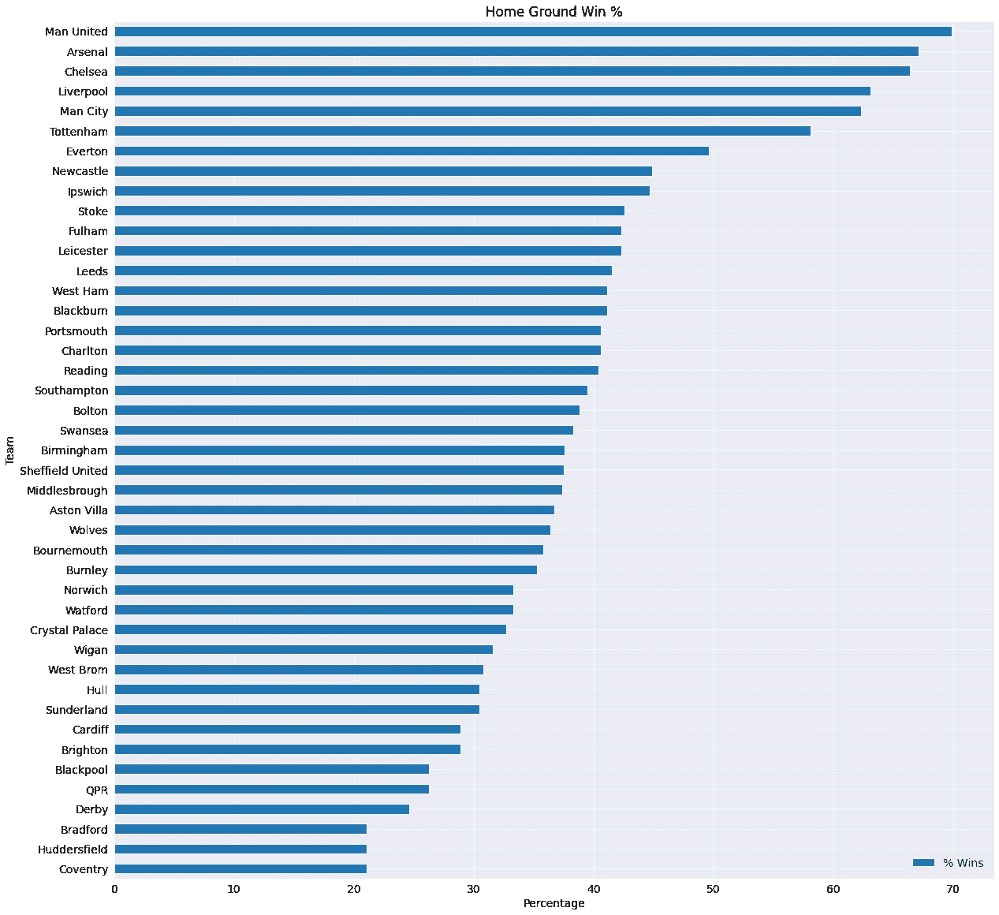
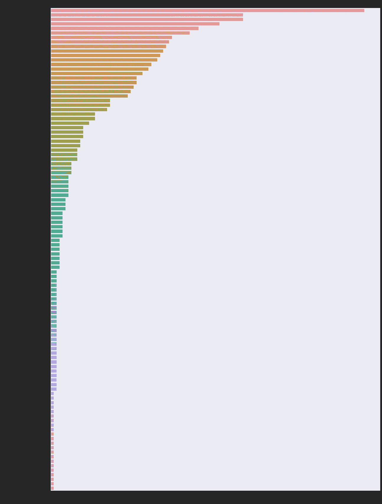
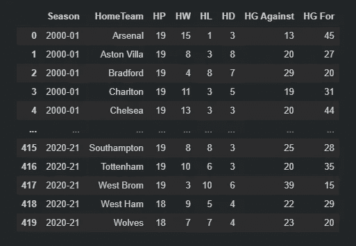

# 让我们实际学习探索性数据分析

> 原文：<https://towardsdatascience.com/lets-learn-exploratory-data-analysis-practically-4a923499b779?source=collection_archive---------17----------------------->

## [实践教程](https://towardsdatascience.com/tagged/hands-on-tutorials)

## U 演唱“英格兰超级联赛结果”数据集|一种初学者友好的循序渐进的方法

“超乎寻常”——彼得·德鲁里|内森·罗杰斯拍摄的 Unsplash 图片

可以说是世界上最有趣的足球联赛——英格兰超级联赛 2020-21 赛季已经结束。恭喜曼城获得联赛冠军。这是一个没有球迷在体育场的不同赛季，但它给了我们一些扣人心弦的比赛，疯狂和激动人心的比赛，难忘的进球和迷人的时刻。在我们为下一季准备好鞋钉和护腿之前，为什么不检查一下迄今为止 29 个赛季的漂亮比赛中一些有趣的趋势，并学习一步步进行探索性数据分析的方法呢？让我们开始吃吧。

我们正在使用的数据集来自于 **kaggle** ，包含了超过 10，000 场英超比赛的信息。数据集可以在这里找到[。](https://www.kaggle.com/irkaal/english-premier-league-results)

我们将在这个项目中使用 python 库`NumPy`、`Pandas`、`Matplotlib`和`Seaborn`。如果您通读，您将能够对您选择的任何数据集执行 EDA！

# 下载数据集

让我们从从 Kaggle 下载数据集开始。这里我们使用为 python 制作的`opendatasets`库来下载相同的内容。通过将数据集的 Kaggle 页面的 URL 传递给`opendatasets.download()`，我们将下载数据集。

数据集已下载并提取。

# 数据准备和清理

在任何数据分析项目中，当处理真实世界的原始数据时，为我们的分析准备数据是非常必要的。可能存在需要处理的错误条目、缺失值。除此之外，我们可能希望向数据集添加新的列，这对我们的分析很有用，或者我们可能希望将几个数据集合并在一起，这应该作为初步步骤来完成。

在我们的例子中，让我们从将数据集转换成熊猫`dataframe`开始。是一个 python 库，为我们提供了方便的数据清理、合并、操作等功能。它创建了一个名为 **DataFrame** 的对象，它基本上是以表格形式表示的数据。我们可以阅读不同类型的文件，如`CSV`、`JSON`、`XLSX`等。并使用其创建数据帧。

想知道更多关于熊猫的事情，可以看看我的笔记本。

让我们来看看我们的数据集

该数据集包含从 1993 年的**到 1994 年的**赛季到 2020 年的**到 2021 年的**赛季的所有比赛结果。要注意的标签:

*   `FTHG`:全职回家目标。
*   `FTAG`:全职客场进球。
*   `FTR`:全职成绩。
*   `HTHG`:半场主场进球。
*   `HTAG`:半场主场进球。
*   `HTR`:半场主场进球。
*   `HS`:主队镜头。
*   `AS`:客场球队镜头。
*   `HST`:主队射门中靶。
*   `AST`:客场球队打靶。
*   `HC`:主队角球。
*   `AC`:客场球队角球。
*   `HF`:主队犯规。
*   `AF`:客场球队犯规。
*   `HY`:主队黄牌。
*   `AY`:客场球队黄牌。
*   `HR`:主队红牌。
*   `AR`:客场球队红牌。

我们可以使用`.shape`方法检查数据集的形状。它以(行数，列数)的形式返回一个元组。

正如我们所看到的，数据集包含了超过 10000 场英超比赛的信息。

`.info`方法为我们提供了一种描述数据的方式，它向我们显示了列的名称、非空值的数量和数据的类型。

正如我们所看到的，有几列的值为空。这一定是因为详尽的数据记录开始得比英超联赛还要晚。我们可以使用`isna`函数查看每一列的空单元格数量，并使用`.drop`方法删除包含空值的行。我们必须提供轴参数，其中 0 =行，1 =列。

我们已经验证了所有的空值都已被删除。让我们看看我们的数据集现在是什么样子。

确切的时间对我们来说并不重要。我们可以使用 DateTime 对象的`.month`和`.day`属性提取月和日。然后我们将删除`DateTime`列，因为不需要它。

我们的数据现在可以可视化了。

# 探索性分析和可视化

我们已经以这样的方式准备了数据集，现在我们可以使用它来找到有趣的见解。让我们计算一些能告诉我们更多数据的东西。为此，我们将使用两个数据可视化库，即`matplotlib`和`seaborn`。这些库包含绘制图形和图表的有用方法。Matplotlib 提供基本功能，而 Seaborn 构建在 Matplotlib 之上，只需几行代码就能提供高级功能。

要了解 matplotlib 和 seaborn 的更多信息，请查看我的[概念笔记本](https://www.notion.so/Data-Visualization-34175fa561104d0295a6c8d46ea43045)。您也可以通过访问它们各自的网站来浏览它们的文档。

## 使用`.describe()`的数据洞察

在绘制图表之前，让我们首先使用 pandas 提供的`.describe()`方法从我们的数据集中获得一些见解。

这让我们对数据有了一些有趣的初步了解。正如我们所见，

1.  平均来说，主队进球更多，射门次数也更多。
2.  客队犯规更多。
3.  客队得到更多的黄牌和红牌。
4.  一个队在一场比赛中的大多数进球是 9 个。
5.  半场最多进 5 个球。

我们来导入`matplotlib.pyplot`和`seaborn`。

## 季节性分析

我们来看看数据，根据季节对比一下趋势。这里我们先用`.groupby()`函数将数据按季节排序。

**每个赛季的进球数**

“aguero ooo ooo ooo ooo ooo ooo ooo ”|图片由内森·罗杰斯拍摄

让我们比较一下每个赛季的进球数。我们将创建一个新列，增加主队进球和客场进球。

现在我们有了数据框架，让我们绘制条形图。这里我们使用 seaborn 库中的`barplot()`函数。作为参数，我们将为 x 轴提供`Goals`系列，为 y 轴提供`Season`系列和一个`data`参数。Seaborn 对熊猫有很好的支持。通过在“数据”参数中提供一个数据框，seaborn 将自动从给定的数据框中找到 x 和 y 系列。

正如我们在上面看到的，

1.  每个赛季的进球数都差不多，大约 1000 个。
2.  2018-19 赛季是进球最多的赛季。
3.  2005-06 赛季是进球数量最少的赛季。

**主场进球 vs 客场进球**

同样，我们将绘制一个**双柱状图**。在此之前，SNS 要求我们`melt`我们的数据，让我们使用比较参数作为色调。当你将下面的数据框与我们的原始数据框进行比较时，就会清楚了。

1.  我们可以注意到主队的进球数几乎总是比客队多。
2.  2020-21 赛季，比赛闭门进行。球迷的缺席清楚地反映在统计数据中。本赛季客队的进球数比主队多。

**绘制每月目标分布热图**

现在让我们为热图准备数据，热图显示了每个赛季每个月的进球情况。为此，我们使用了熊猫提供的一个特殊功能。pivot()将数据框转换为 2D 矩阵，第一个参数(系列)是行，第二个参数是列，第三个参数是对应于系列 1 和系列 2 的值。下面来看看吧。

现在我们通过将数据集传递给 seaborn 提供的`heatmap()`函数来绘制热图。如果您想显示块中的值，可将`annot`参数设置为`True`。试试吧！

上面的图表告诉我们更多关于我们的数据。

1.  六月和七月没有比赛，因此没有进球。
2.  几乎每年，12 月都是进球最多的月份。这是因为十二月是比赛最多的月份。
3.  2019-20 赛季因疫情而中断。根据项目重启，游戏在六月和七月进行，而不是四月和五月。
4.  赛季在五月中旬结束，因此五月份的进球数量很少。

让我们快速绘制另一张每场比赛的进球数图表。这相当简单。

在这里，我们可以观察到每场比赛的进球数保持相当一致，这表明没有真正可见的“稳定期”、“繁荣期”或“倦怠期”，或者至少它不会对比分线产生太大影响。非常有趣的是，九月见证了最高的场均进球两次。

**使用折线图进行镜头对比**

现在，让我们来看看每个赛季主队拍摄的照片与客队拍摄的照片相比如何。我们将使用之前创建的相同的`EPL_by_season`数据框。

我们可以通过在同一个单元格中写入所有的`sns.lineplot()`调用，在同一个图中绘制多条线，如下所示。

这是一个非常有趣的图表。它告诉我们，

1.  大约 60%的拍摄最终都在目标上。
2.  看没有线相交。主队投篮次数和命中目标次数总是比客队多。显然有主场优势。
3.  线之间的最低差异出现在 2020-21 赛季。这一季不允许粉丝入场。这显示了球迷如何扮演球队第 12 人的角色。
4.  即使投篮线保持相当平坦，但在 2013-14 赛季，投篮命中率明显下降。

## 团队比较

让我们看看在英格兰足球顶级联赛中踢球的球队的统计数据是如何比较的。我们需要创建两个分组对象，因为我们没有一个`teams`列。我们有`HomeTeam`和`AwayTeam`栏目。我们将在分析中进一步使用这些对象。

**各队所有赛季的总进球数**

我们将把主队在`EPL_home`对象上的得分和客场队在`EPL_away`对象上的得分相加。我们将绘制一个简单的条形图来直观显示这一点。

正如我们所见，

1.  自 2000-01 赛季至今，曼联在英超联赛中进球最多。
2.  传统的“六大”团队占据了前六名的位置。
3.  布拉德福德在英超联赛中进球最少。

**各队全队投篮命中率**

让我们看看哪支队伍最有杀伤力。投篮转换率基本上就是一个球队投了多少球最后入网。我们将创建一个新的栏目，将球队射门得分进行分类。

我们可以看到，

1.  几个赛季以来，阿森纳一直是最致命的球队，其次是曼联。
2.  哈德斯菲尔德是最浪费投篮机会的。
3.  布莱顿总是被专家们认为踢的是真正的攻击性足球，但却没有将机会转化为进球。上图证明了这一点。

**主场胜率**

球队把他们的主场称为堡垒。让我们看看谁保卫了他们的堡垒最多。我们将计算一支球队赢得主场比赛的百分比。我们将使用数据帧的`loc`方法找到`FTR`是`H`的行，或者用简单的语言来说，主队赢了。

1.  曼联在老特拉福德赢得了最多的比赛，其次是阿森纳在酋长球场和海布里，切尔西在斯坦福桥。
2.  考文垂保持着在圣安德鲁体育场和理光竞技场比赛中赢球最少的记录。

# 深潜

现在我们基本上知道了数据集的基本细节。有趣的是，仅仅几行代码就能理解包含原始数据和大量值的庞大数据集。可视化在很大程度上有所帮助。除了数据包含的列之外，我们对数据一无所知。现在，仅仅几行代码之后，我们对英超联赛和主要趋势有了更多的了解。

现在，让我们更深入一些，回答一些关于数据集的有趣问题，这些问题可以帮助我们更好地理解数据。

Q1:哪个裁判给了最多的红牌？

要回答这个问题，我们可以根据`Referee`对数据进行分组，并对值求和。我们将为红牌绘制图表。

相当多的裁判，但麦克·迪恩高居榜首，是唯一一个出示超过 100 张红牌的裁判。

Q2:哪个赛季复出次数最多？

让我们把卷土重来定义为一个半场落后的球队最终赢得比赛的情况。

我们会发现结果，

1.  `HTR`不等于`FTR`
2.  `FTR`或`HTR`不等于`D`或平局。

利物浦赢得的 2019-20 赛季见证了最多的复出，其次是 2012-13 赛季。

Q3:赛季末积分榜怎么样？

可以为每个赛季绘制一个积分表。让我们看看如何！

我们首先需要找到主队的以下统计数据。

1.  进行的主场比赛次数。
2.  赢得的主场比赛数量。
3.  抽签的主场比赛数量。
4.  输掉的主场比赛数量。
5.  进球数和进球数。

我们可以在客场比赛中找到同样的情况。

现在让我们合并两个数据库，计算点数如下:

1.  赢了 3 分。
2.  平局得 1 分。

让我们同样计算承诺金额，并使用社交网络为目标添加点。`scatterplot()`用于比较。

现在让我们根据分数对队伍进行排名。当两个队以相同的分数结束时，不确定性就出现了。在这种情况下，我们根据净胜球或`GD.`对球队进行排名

现在让我们绘制一个样本表。

我们找到了。我们已经成功地从现有的数据中可视化了积分表。我们可以看到，

1.  曼城赢得了 2020-21 赛季英超冠军。
2.  曼城、曼联、利物浦和切尔西将参加 2021-22 赛季的冠军联赛(前 4 名)
3.  莱斯特和西汉姆将参加欧联杯，热刺将参加欧联杯。
4.  不幸的是，富勒姆、西布朗和谢菲尔德联队已经从英超降级。

# 结论

尽管英超联赛看起来很有趣，但围绕它的数据也很有趣。我们看到了不同赛季的数据对比，不同球队在英超联赛中的表现。我们对什么是英超联赛以及它是如何运作的有一点了解。我们看到了一些有趣的趋势和一些明显的趋势(麦克·迪恩，我说的是你)

玩笑归玩笑，本文的主要目的是帮助您实际学习如何选择任何数据集，并使用这些数据集进行简单而深入的探索性数据分析。我们使用的强大的 python 库使我们的工作变得非常简单！现在，你需要做的就是从 Kaggle、Google Datasets 等平台中选择任何数据集，并为你的简历创建一个值得的 EDA 项目。祝你在这个令人惊叹的数据科学世界中好运！

# 参考资料(特别感谢)

1.  我的[概念笔记本](https://www.notion.so/58cf2b852a67449ebdea6a541db0ab90?v=d1c79b65c16741079e11e99102896b29)装满了笔记、函数和例子。
2.  [Matplotlib 文档](https://matplotlib.org/api/index.html)
3.  [Seaborn 文档](https://seaborn.pydata.org/)
4.  [www.stackoverflow.com](https://jovian.ai/outlink?url=http%3A%2F%2Fwww.stackoverflow.com)
5.  [www.quora.com](https://jovian.ai/outlink?url=http%3A%2F%2Fwww.quora.com)
6.  [Jovian.ai](https://jovian.ai/outlink?url=http%3A%2F%2FJovian.ai)
7.  [Kaggle 数据集](https://www.kaggle.com/irkaal/english-premier-league-results)

# 未来的工作和启示

1.  构建互动情节。
2.  玩家特定数据集上的 EDA。
3.  攻击与防御策略统计。
4.  使用 ML 算法和 DL 模型预测结果。
5.  预测比赛的预期目标。