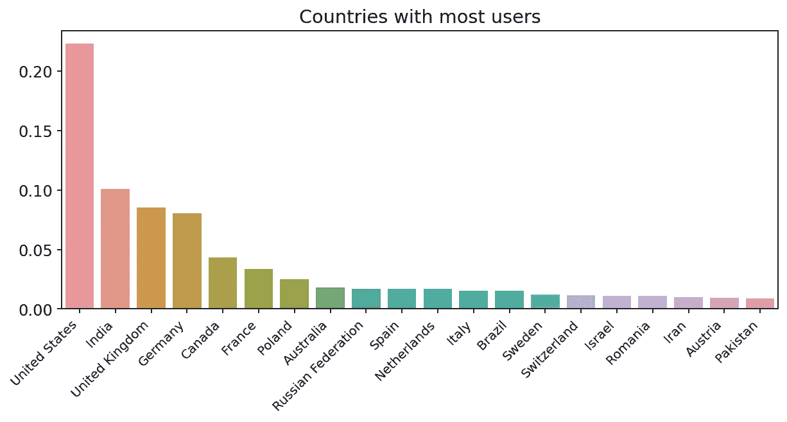
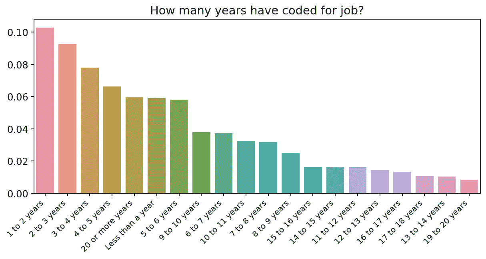
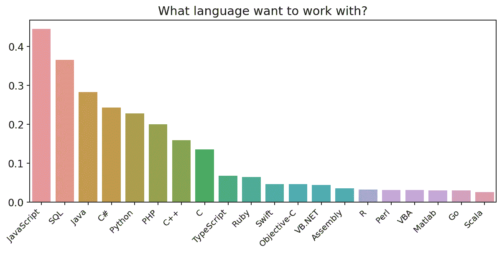
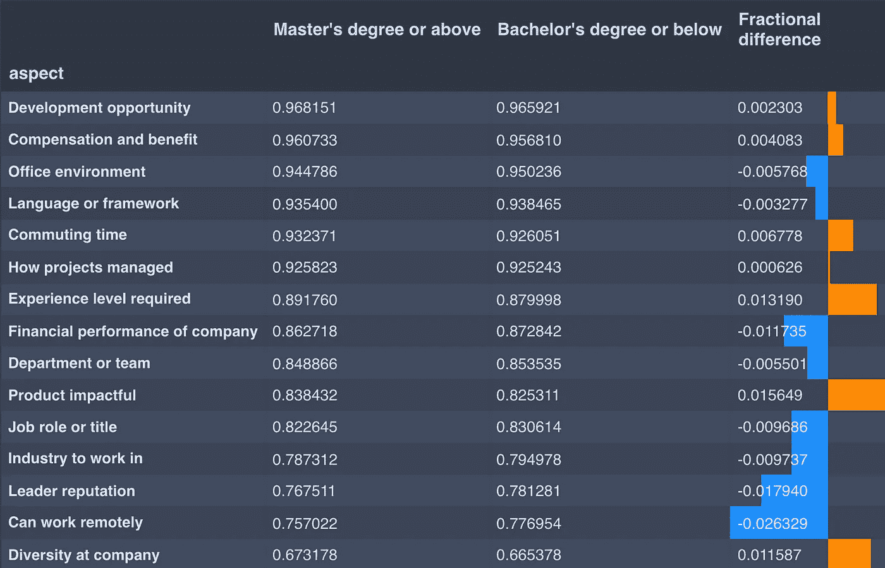
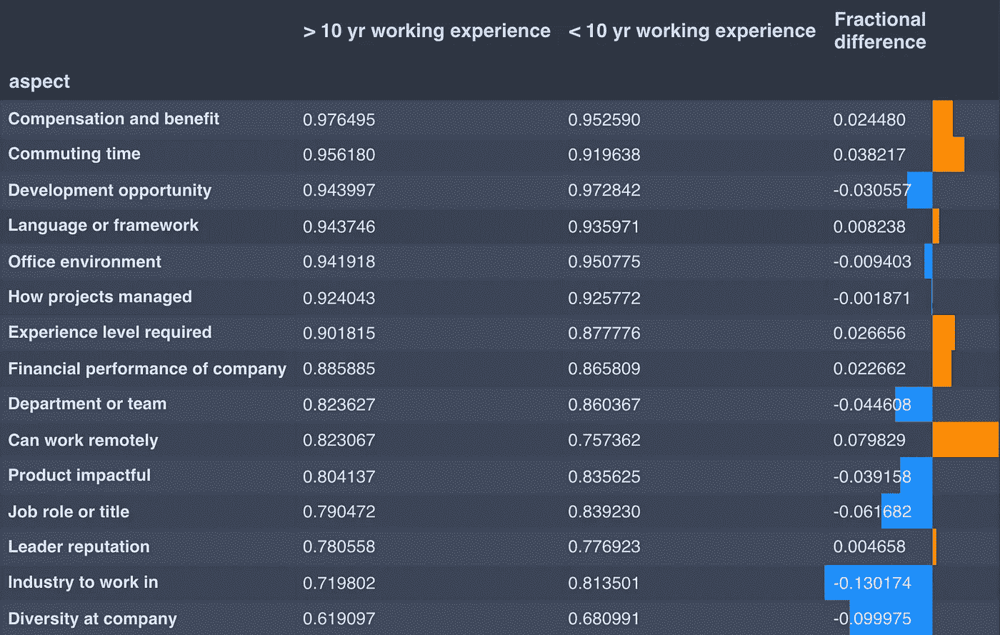
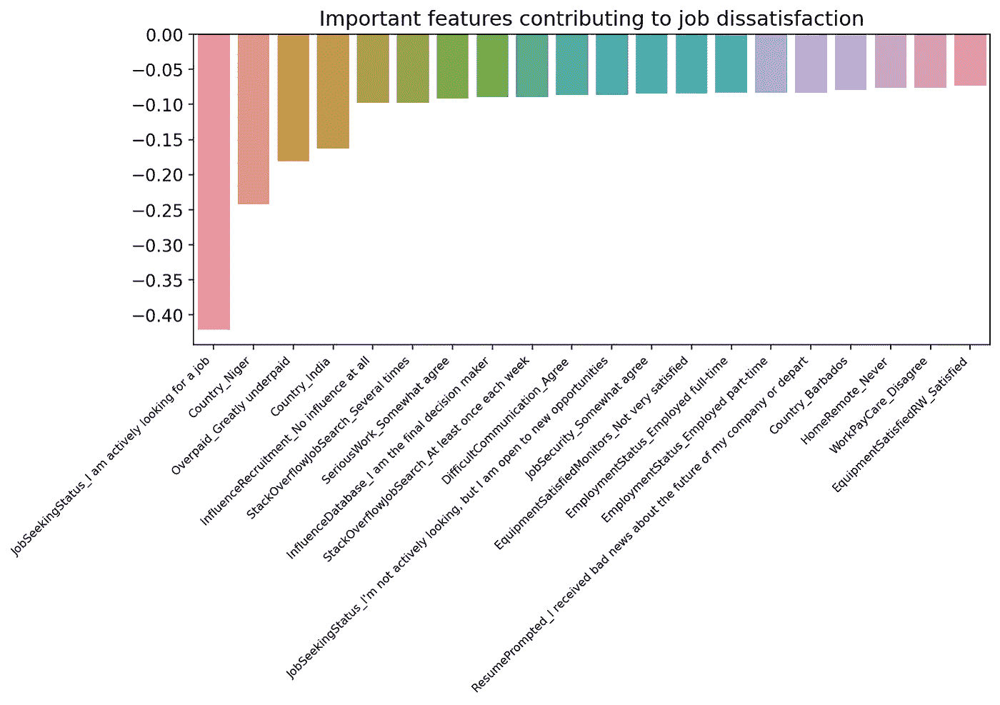

# 让我们从 StackOverflow 调查中了解一下

> 原文：<https://towardsdatascience.com/lets-learn-from-the-stackoverflow-survey-7f3eaf7db4b6?source=collection_archive---------24----------------------->

## 对熊猫、seaborn 和 sklearn 的探索性数据分析

[斯科特·格雷厄姆](https://unsplash.com/@homajob?utm_source=medium&utm_medium=referral)在 [Unsplash](https://unsplash.com?utm_source=medium&utm_medium=referral) 上拍照

最受欢迎的 ide 有哪些？软件开发人员在应聘一份新工作时注意哪些方面？是什么决定了人们的工作满意度？为了回答这些问题，我深入研究了 [2017 年堆栈溢出调查](https://insights.stackoverflow.com/survey/2017)，发现了一些有趣的结果。

我选择了 2017 年的调查，而不是最新的调查，因为它包含了更多相关的数字信息。该调查通过与堆栈溢出相关的网站发送给全球超过 6 万名开发人员，回复率约为 57%。牢记各种选择偏差，我首先执行一些数据可视化以获得一些见解。

# 可视化调查结果

1.  **大部分栈溢出用户来自哪里？**

*作者图片*

正如我们所料，大多数(回应的)开发者来自美国，其次是印度和英国。如果中国被包括在抽样框架内，我预计它将是第二或第三个拥有最多用户的国家。

**2。多少年来，人们一直将编码作为一项工作？**

*作者图片*

似乎编程世界正在不断吸引新人进入这个领域。随着机器学习和数据科学的兴起，我预计新开发人员的比例将在未来几年迅速增加。

**3。人们想用什么编程语言？**

*作者图片*

不出所料，JavaScript、SQL、Java 是人们的首选，但令我惊讶的是，C#在 2017 年进入了前 4，甚至排在 Python 之前。

# 开发人员如何评估一份新工作？

现在我们可以更深入地研究数据集。如果一个开发人员在找一份新工作，他/她会关注角色的哪些方面(比如薪资、职称、使用的开发工具)？这种偏好对于不同教育/经历背景的人是否有所不同？

该调查有一个问题，询问人们对新工作的评估，并提供了几个评估指标。对于每个指标，人们可以从 5 个选项中进行选择，从“一点都不重要”到“非常重要”。我将人们分成不同的教育和工作经历组，以考察他们的反应是否不同。

*作者图片*

上表显示了不同教育背景的人的结果。“方面”列显示了新工作的评估指标。接下来的两列显示了认为这个指标很重要的人的比例。最后一栏显示了人们回答中的百分比差异，橙色/蓝色条表示学历较高/较低的人比例较高。

正如我们所看到的，高学历(硕士或以上)的人会考虑他们产品的影响、所需的经验水平和多样性。学历较低(本科及以下)的人更看重远程工作的可能性、团队负责人的声誉以及公司的财务表现。

我们也可以检查不同工作经验的人的结果。下表中的每一列都表示与以前相同的信息，但人们是根据他们的经验水平分组的。

*作者图片*

拥有 10 年以上工作经验的人更关注生活质量因素，如远程工作、通勤时间和薪酬/福利。另一方面，经验较少的人会考虑与职业相关的因素，如他们工作的行业、公司的多样性和职称。

# 什么影响工作满意度？

该调查要求人们对自己的工作满意度进行评分，分值范围从 1 到 10。为了评估有助于工作满意度的因素，我们根据评级是否≥ 7，给数据分配“满意”和“不满意”标签，然后执行逻辑回归并计算特征重要性。

最具挑战性的部分是数据清理，因为调查回答大多是分类变量，并且有许多缺失值。我是这样处理的。

1.  删除缺少工作满意度评分的行。
2.  删除缺失值超过 90%的列。
3.  用列平均值填充数字列。
4.  对于每个分类变量:A)查找所有唯一的响应，B)为每个响应创建新列，C)创建一个指示原始列是否有缺失值的新列，以及 D)删除原始列。

在预处理之后，我们将我们的数据分成训练(80%)和验证(20%)集，标准化列，并用 [*sklearn*](https://scikit-learn.org/stable/modules/generated/sklearn.linear_model.LogisticRegression.html) 执行逻辑回归。我们达到了 74%的训练准确率和 70%的验证准确率。

然后，我们计算特征重要性，并相应地对特征进行排序。为了获得更好的视觉效果，新创建的用于指示原始列中缺失值的特性将被忽略。

*作者图片*

上面的条形图显示了有助于积极工作满意度的主要因素。例如，对新的工作机会不感兴趣、作为自由职业者/个体户工作以及工作报酬不低或不高等因素是工作满意度的主要积极指标。

有趣的是，在尼日利亚、荷兰或洪都拉斯等国家工作也会带来工作满意度。然而，由于这些国家的样本量较小，这可能不准确。同样不幸的是，身为男性也有助于满足感；值得思考的是如何确保工作场所的性别平等。

我们还可以想象哪些特征是导致工作不满意的主要原因。

*作者图片*

从剧情来看，如果一个开发人员正在积极找工作，工资大大偏低，或者来自某些国家，他/她很可能对这份工作不满意。有趣的是，成为公司数据库系统的最终决策者也会导致工作不满。也许更大的责任有时会带来更多的痛苦？

# 概述

我们研究了 2017 年堆栈溢出调查结果，发现了一些有趣的事实，这些事实与应答者的人口统计数据、人们对新工作的评估指标以及导致工作满意或不满意的主导因素有关。

如果您想进行自己的分析，请尝试一下！这里是 [*年度调查结果*的链接。为了你的参考，这是我的项目的代码](https://insights.stackoverflow.com/survey)。我相信你可以发现更多有趣的事情！