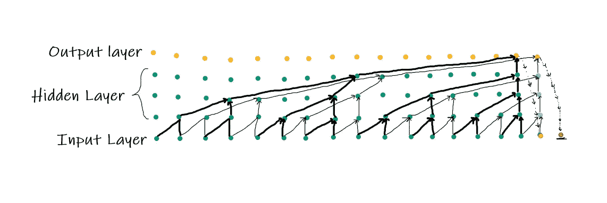
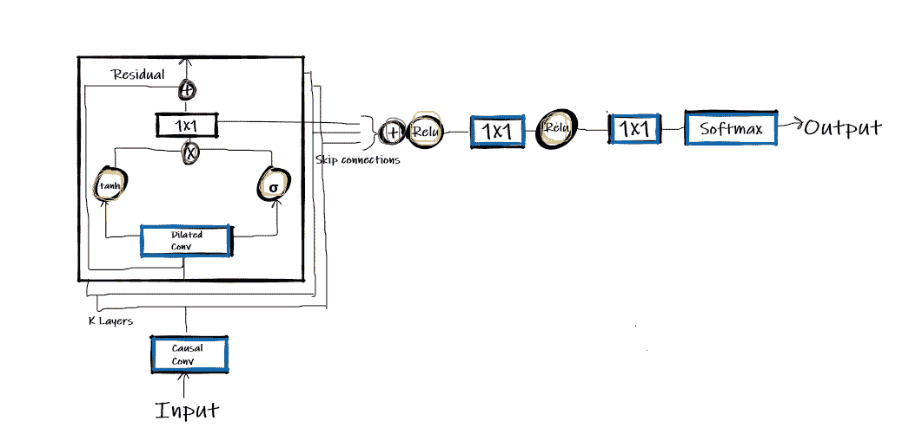

# 让我们开一家音乐制作公司

> 原文：<https://towardsdatascience.com/lets-start-a-music-production-house-ccd2655984f9?source=collection_archive---------46----------------------->

## wave net by[Google](https://google.com/)[deep mind](https://deepmind.com/)，时间就是现在。使用 WaveNet 生成音频


照片由[克里斯蒂安·范·贝伯](https://unsplash.com/@cvanbebber?utm_source=unsplash&utm_medium=referral&utm_content=creditCopyText)在 [Unsplash](https://unsplash.com/s/photos/waves?utm_source=unsplash&utm_medium=referral&utm_content=creditCopyText) 上拍摄

> 音乐是精神的语言。它揭示了生活的秘密，带来和平，消除冲突。——卡里·纪伯伦

最令人期待和期待的功能之一是以自然的形式与机器进行交互，类似于人类进行对话的方式。深度学习在许多方面都是人类的一个有效领域。具体来说，生成方法已经成为深度学习趋势的转折点，这种趋势开启了[机器人](https://en.wikipedia.org/wiki/Robotics#:~:text=Robotics%20is%20an%20interdisciplinary%20field,can%20help%20and%20assist%20humans.)、[物联网](https://en.wikipedia.org/wiki/Internet_of_things)、互联网、电信以及几乎整个软件行业的几个应用。应用涉及[自然语言处理](https://www.ibm.com/cloud/learn/natural-language-processing#:~:text=Natural%20language%20processing%20%28NLP%29%20refers,same%20way%20human%20beings%20can.)、[计算机视觉](https://www.ibm.com/topics/computer-vision#:~:text=Computer%20vision%20is%20a%20field,recommendations%20based%20on%20that%20information.)、语音转文本和文本转语音、生成音频等。今天，我们将了解音频生成的[生成模型](https://developers.google.com/machine-learning/gan/generative#:~:text=A%20generative%20model%20includes%20the,to%20a%20sequence%20of%20words.)之一。

## 介绍

**WaveNet:** 深度学习模型，一种生成原始音频[波形](https://whatis.techtarget.com/definition/waveform#:~:text=A%20waveform%20is%20a%20representation,sine%20of%20the%20elapsed%20time.)的神经网络。这是一个自回归以及[概率模型](https://www.statisticshowto.com/probabilistic/#:~:text=A%20probabilistic%20method%20or%20model,the%20added%20complication%20of%20randomness.)。它可以在大量的音频样本上进行训练。它提供了音频一代中最先进的性能，具有显著的自然感觉。它可以用来创作音乐。如果用大量的音频数据进行训练，可以获得非常逼真的音乐效果。实际上，开发类似人类声音背后的秘密是用神经网络直接模拟波形。Wavenet 模型提供了从多个代理中准确提取不同特征的灵活性。它还可以通过对声音身份进行调节来在这些声音之间切换，也称为条件 WaveNet 变体。

拼接 TTS(文本到语音)涉及从单个说话者收集音频片段形式的数据，然后将它们拼接起来以产生完整的话语。但是[串联的 TTS](https://en.wikipedia.org/wiki/Speech_synthesis) 听起来不自然，甚至不能修饰声音。

在[参数化 TTS](https://en.wikipedia.org/wiki/Speech_synthesis) 中，使用被称为声码器的语音合成器(一种音频处理算法)来创建语音。数据存储在模型的参数中。语音的特征可以通过模型的输入来控制。

## 典型卷积


2D 卷积

[卷积神经网络](/a-comprehensive-guide-to-convolutional-neural-networks-the-eli5-way-3bd2b1164a53)是一种深度学习模型，它接受图像作为输入，并进一步为其各个方面分配必要的可学习参数，这使得区分成为一项简单的任务。卷积采用以下参数:

1.  内核大小:在图中具有阴影状外观的图像上悬停和移动的过滤器的大小为 3×3，称为内核过滤器。3x3 是 2D 卷积常用的大小
2.  通道:通道是保存像素值的维度；对于彩色图像，它可以由三个通道 RGB 表示，即红色、绿色和蓝色。而在黑白图像的情况下，我们只有两个通道，黑色和白色
3.  填充:如图所示，边框被填充了一个单独的框，该框可以通过保持输入和输出维度的平衡和相等来处理它们。而无填充的卷积从边界裁剪开。
4.  步幅:滤镜覆盖整个图像所要走的步数，包括逐步填充，如图所示

上图显示了使用 3 填充=1 和步幅=1 的内核大小的 2D 卷积。

## 扩张的回旋


扩张卷积

[膨胀卷积](https://paperswithcode.com/method/dilated-convolution#:~:text=Dilated%20Convolutions%20are%20a%20type,spaces%20inserted%20between%20kernel%20elements.)是对自然卷积的一个微小修改，只增加了一个膨胀率参数。膨胀率只不过是在内核值之间消失的值的数量，即内核应该间隔多少步。它在内核的每个值之间定义了相等的空间。

在上图中，内核的大小是 3x3，但是，它仍然广泛存在；这是由于它们之间产生了空间，膨胀率为 2，因此行和列中的每一秒钟的值都消失了。膨胀率为 2 的 3×3 内核将具有与 5×5 内核相同的视野，而仅使用 9 个参数。扩张的卷积允许感受野的指数扩张，具有相同的计算能力并且没有任何损失。

## 扩张的因果回旋



扩展因果卷积工作

[膨胀因果卷积](https://paperswithcode.com/method/dilated-causal-convolution)是 WaveNet 模型的主要组成部分之一。特定时间步长 t 的模型输出不依赖于未来的时间步长。因果卷积可以模拟具有长期依赖性的序列。与 RNN 相比，它们速度更快，因为它们没有循环连接。它们遵循数据建模方式中的数据排序。输出按顺序得到，反馈给模型得到下一个。因果卷积需要一个很宽的感受野，这个障碍被我们之前看到的膨胀技术克服了，它的工作效率很高，降低了计算成本。堆叠的扩张卷积使得网络在保持输入分辨率的同时，仅用几层就具有广泛的感受野。

## Wavenet 架构

使用 WaveNet 可以以自然的方式生成文本到语音的音频波形。该模型是来自计算机视觉、音频处理和时间序列的各种策略的组合。



WaveNet 架构

输入是从因果卷积层传递到残差块的音频样本。对于每个残差块，前一个块的输出将被馈入下一个块。[门控激活单元](https://en.wikipedia.org/wiki/Gated_recurrent_unit#:~:text=Gated%20recurrent%20units%20%28GRUs%29%20are,it%20lacks%20an%20output%20gate.)的想法是从 [PixelCNN](https://keras.io/examples/generative/pixelcnn) 实现的。残差块产生两个输出，一个是将被用作输入的特征图，第二个是用于计算损失的跳过连接。输入进一步通过扩展卷积层、门和滤波器，并彼此相遇，以逐元素相乘。其中⊙表示基于元素的乘法运算符，∵表示卷积运算符，σ是 sigmoid 函数，f 和 g 表示滤波器和门。


【[来源](https://arxiv.org/pdf/1609.03499.pdf)

在整个网络中使用残差连接和参数化跳过连接的组合来加速收敛并实现更深层次的模型训练。该输入进一步与原始信息相加，并被下一个剩余黑色重新使用以产生输出。跳过连接通过整流线性单元被累加和激活， [Softmax](https://en.wikipedia.org/wiki/Softmax_function) 的最终结果不是一个连续值，但是我们应用了-law 压扩变换，然后将其量化为 256 种可能性。**根据论文，经过** [**量化**](https://en.wikipedia.org/wiki/Quantization#:~:text=Quantization%20is%20the%20process%20of,%28such%20as%20the%20integers%29.) **后的重构信号听起来与原始信号非常相似。**

Conditional Wavenet 带来了更多的修改，具有所需的特性，如馈送多个实体的声音；我们还将向模型提供他们的身份。

## 履行

需要 Python 版本 3.6 或更高版本。克隆我的 WaveNet 存储库，并按照说明运行文件。

```
!git clone [https://github.com/AmitNikhade/WaveNet.git](https://github.com/AmitNikhade/WaveNet.git)
```

首先，我们将从安装需求开始。

```
 pip install -r requirements.txt
```

接下来，我们将使用自定义数据训练模型；在我的例子中，我使用了来自 Kaggle 的**钢琴三和弦 wavset** 数据集。我刚刚把它训练了 20 个纪元来充分地与你交流。您还必须定义数据路径。

```
!python3 ./WaveNet/src/train.py --dp piano-triads-wavset --epochs 20
```

训练开始了。

现在是做音乐总监的时候了。生成定义保存路径和模型路径的音乐。

```
!python ./WaveNet/src/generate.py --mp src/trained_model/modelWN.h5 --fs ./
```

你完了。

尝试在至少 1000 个历元的足够数据上进行训练；你会看到杰出的成果。

完整代码请访问 [Github](https://github.com/AmitNikhade/WaveNet) 。

## 要尝试的事情

尝试实现股票价格预测模型等等，因为我们知道它也可以处理时间序列数据。此外，尝试通过手动调整参数来演奏一首好音乐。我希望你会。

## 结论

早期的 TTS 产生了有点机器人化的噪音，但是逐渐地，直到今天，音频处理的进步带来了更好的声音质量。Wavenet 是一个更高级的模型，它将 TTS 提升到了一个新的水平，听起来非常清晰、不可重构、有规律，这使它成为许多 TTS 引擎背后的一个秘密。WaveNet 需要太多的计算处理能力来用于现实世界的应用。

> WaveNet 随后被用于在所有谷歌平台上为美国英语和日语生成[谷歌助手](https://en.wikipedia.org/wiki/Google_Assistant)语音。-深度思维

希望你发现这个主题和解释很有见地；试着在循环中读两遍来熟悉它。

## 关于我

最初发表于 amitnikhade.com 的

LinkedIn [amitnikhade](https://www.linkedin.com/in/theamitnikhade/)

**Github**

[](https://github.com/AmitNikhade) [## AmitNikhade -概述

### 🂮 |人工智能和机器人爱好者|机器学习、深度学习、NLP、物联网、机器人| LinkedIn…

github.com](https://github.com/AmitNikhade) 

## 参考

[](https://deepmind.com/blog/wavenet-generative-model-raw-audio/) [## WaveNet:原始音频的生成模型

### 这篇文章介绍了 WaveNet，一个原始音频波形的深度生成模型。我们证明了波网能够产生…

deepmind.com](https://deepmind.com/blog/wavenet-generative-model-raw-audio/) [](https://en.wikipedia.org/wiki/WaveNet) [## WaveNet -维基百科

### WaveNet 是一个用于生成原始音频的深度神经网络。它是由总部位于伦敦的人工…

en.wikipedia.org](https://en.wikipedia.org/wiki/WaveNet) [](https://arxiv.org/abs/1609.03499) [## WaveNet:原始音频的生成模型

### 本文介绍了 WaveNet，一种用于生成原始音频波形的深度神经网络。该模型完全…

arxiv.org](https://arxiv.org/abs/1609.03499)  [## 论文与代码扩展因果卷积解释

### 扩展因果卷积是一种因果卷积，其中滤波器应用于比其长度大的区域…

paperswithcode.com](https://paperswithcode.com/method/dilated-causal-convolution)