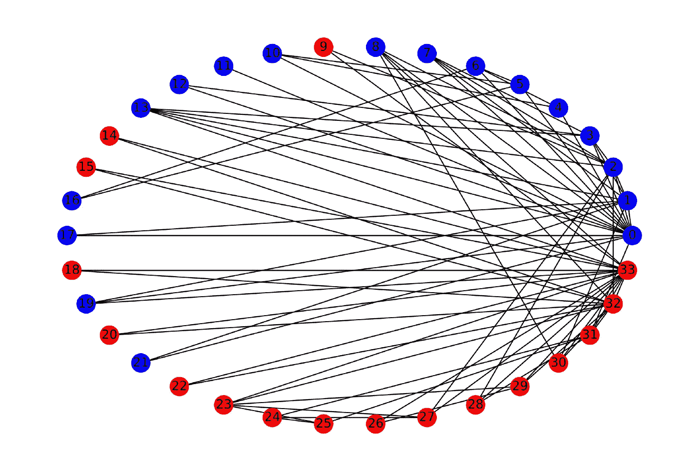

# 先说图形神经网络 Python 库！

> 原文：<https://towardsdatascience.com/lets-talk-about-graph-neural-network-python-libraries-a0b23ec983b0?source=collection_archive---------3----------------------->

## 并通过使用 DGL、PyG 和 Spektral 来制定节点分类任务。


亨特·哈里特在 [Unsplash](https://unsplash.com/s/photos/data-network?utm_source=unsplash&utm_medium=referral&utm_content=creditCopyText) 上的照片

T 图形神经网络(GNNs)的日益流行给了我们一堆 python 库。

由于我与 GNNs 打交道已经有一段时间了，我已经获得了一些流行的 GNN python 库的实践经验，并想对它们做一个小小的比较。

在本文中，我们将挑选一个节点分类任务(当然是一个简单的任务！)并使用 3 个不同的 python 库来公式化和解决问题。

我们将使用的库:

1.  [深度图库](https://docs.dgl.ai/)(DGL)——基于 PyTorch、TensorFlow 和 MXNet 构建
2.  [PyTorch 几何](https://pytorch-geometric.readthedocs.io/en/latest/)(PyG)——基于 PyTorch 打造
3.  [Spektral](https://graphneural.network/) —基于 Keras/ TensorFlow 2 构建

> 请参考这些图书馆官方网站上的安装指南。

# 数据集



空手道俱乐部数据可视化(来源:作者)

因为我想保持简单，我将使用流行的[扎卡里的空手道俱乐部](https://en.wikipedia.org/wiki/Zachary%27s_karate_club)图形数据集。这里，节点代表参与俱乐部的 34 名学生，链接代表俱乐部外成对成员之间的 78 种不同互动。有两种不同类型的标签*即*两派。

**节点分类**:在这项任务中，我们的目标是建立一个模型来预测节点的标签，即学生加入的派别。

我们使用特定的种子值将图分为训练集和测试集(比例为 70:30)。相同的训练和测试分割将用于建立不同库的预测模型，以便我们可以进行比较。

一旦我们选择了任务，有 6 个简单的步骤来建立预测模型:

1.  数据准备
2.  构建自定义数据集
3.  选择 GNN 方法
4.  训练模型
5.  执行超参数调谐
6.  预测测试数据上的节点标签

> 所有三个 python 库都有一个实现，我们可以将图形转换为库的自定义数据集，并使用它来训练图形神经网络模型。

# 1.数据准备

首先，我们将生成一些可以用作图形神经网络输入的节点嵌入。

我选择了基于随机行走概念的[深度行走](https://arxiv.org/abs/1403.6652)节点嵌入技术。[图形嵌入](https://github.com/shenweichen/GraphEmbedding) python 库将用于构建 DeepWalk 模型。

首先，安装图形嵌入库并运行安装程序:

```
!git clone [https://github.com/shenweichen/GraphEmbedding.git](https://github.com/shenweichen/GraphEmbedding.gitcd)[cd](https://github.com/shenweichen/GraphEmbedding.gitcd) GraphEmbedding/!python setup.py install
```

嵌入保存在`embeddings`字典变量中。现在我们有一个为库创建自定义数据集的工作。

# 2.自定义数据集


杰夫·卡林在 [Unsplash](https://unsplash.com/s/photos/custom?utm_source=unsplash&utm_medium=referral&utm_content=creditCopyText) 上的照片

我已经在我发表的这篇中型文章中解释了 PyTorch 几何库的过程。随便查！

[](/a-beginners-guide-to-graph-neural-networks-using-pytorch-geometric-part-2-cd82c01330ab) [## 使用 PyTorch 几何图形的神经网络初学者指南—第 2 部分

### 使用节点嵌入作为 GNN 模型的特征

towardsdatascience.com](/a-beginners-guide-to-graph-neural-networks-using-pytorch-geometric-part-2-cd82c01330ab) 

在本文中，我将重点介绍 DGL 和斯佩克特拉。

## DGL 自定义数据集

在自定义数据集中，我们添加了图信息，如节点嵌入、边、训练和测试掩码。

## 光谱自定义数据集

因为 Spektral 库是基于 Keras 的，所以我们需要将标签转换成一键向量。在自定义数据集中包括图形信息以及训练和测试掩码的其余过程是相似的。

# 3.选择图形神经网络方法


照片由 [JJ 英](https://unsplash.com/@jjying?utm_source=unsplash&utm_medium=referral&utm_content=creditCopyText)在 [Unsplash](https://unsplash.com/s/photos/network?utm_source=unsplash&utm_medium=referral&utm_content=creditCopyText) 上拍摄

为了这个实验。我选择的是 GNNs 中流行的[图卷积网络](https://arxiv.org/abs/1609.02907) (GCN)。

让我们使用这两个库来创建 GCN 模型。

## 深度图形库

对于 GCN 模型，我在隐藏层中使用了 16 个神经元。

## 光谱图书馆

由于只有两个派别/标签，我们使用二元交叉熵作为损失函数。

# 4.训练模型


约翰·施诺布里奇在 [Unsplash](https://unsplash.com/s/photos/training?utm_source=unsplash&utm_medium=referral&utm_content=creditCopyText) 上的照片

我们为两个库创建了自定义数据集，并且实例化了 GCN 模型，所以现在我们可以开始训练模型并预测测试集的标签。

## 深度图形库

在训练了 100 个时期的模型之后，预测了测试标签并计算了度量。我们获得了以下分数:

> 训练精度:1.0
> 测试精度:0.90

## 光谱图书馆

因为我们使用了相同的数据集、模型和超参数，所以我们从两个库中获得了相同的结果。

这些库中 GCN 的核心实现是相同的！

> 训练精度:1.0
> 测试精度:0.90

# 5.关于超参数的一个注记

这是一个玩具示例，所以我没有详细介绍超参数调整。如果您正在使用一个带有多个节点标签的更大的图形，那么您需要执行超参数调整，以找到最适合您的图形数据的模型。

您只需要添加一个验证集，并在自定义数据集中创建相应的验证掩码。然后，在训练集上训练模型，并使用验证度量调整超参数。根据对应于最高验证指标(如准确度分数/ F1 分数)的模型选择最佳模型。这个选择的模型将被用于预测测试集上的标签，并且最终的度量将被计算。

# GNN 图书馆之我见


照片由[布鲁斯·马斯](https://unsplash.com/@brucemars?utm_source=unsplash&utm_medium=referral&utm_content=creditCopyText)在 [Unsplash](https://unsplash.com/s/photos/think-computer?utm_source=unsplash&utm_medium=referral&utm_content=creditCopyText) 上拍摄

这三个库都不错，但我更喜欢 PyTorch Geometric 来建模图形神经网络。我可能对这个库的选择有偏见，因为我和 PyG 一起工作过，但是这个库有一个很好的 GNN 模型的集合，这是其他库所缺乏的。

所以我对这些图书馆的排名如下:

1.  PyTorch 几何
2.  深度图形库
3.  斯佩克特拉

再次，我有点偏向于用 PyTorch 来训练神经网络。如果你喜欢用 Keras 和 TensorFlow 构建神经网络，那么研究 Spektral 可能是个好主意。

此外，请记住，除了 PyTorch 之外，DGL 还提供其他后端支持，如 MXNet 和 TensorFlow。

# 代码参考

我用来制定节点分类任务的代码取自图书馆的存储库/网站中的示例。我很随意地修改了代码，使其可用于空手道俱乐部的数据集。下面是一些示例的链接，可供您参考:

1.  https://docs.dgl.ai/en/0.6.x/new-tutorial/6_load_data.html DGL 定制数据集—
2.  https://docs.dgl.ai/tutorials/blitz/1_introduction.html DGL GCN—。
3.  光谱自定义数据集—[https://graph neural . network/creating-Dataset/](https://graphneural.network/creating-dataset/)
4.  斯皮克特拉尔 GCN—[https://github . com/danielegrattarola/斯皮克特拉尔/blob/master/examples/node _ prediction/citation _ gcn . py](https://github.com/danielegrattarola/spektral/blob/master/examples/node_prediction/citation_gcn.py)
5.  DeepWalk 嵌入—[https://github . com/shenweichen/GraphEmbedding/blob/master/examples/deep walk _ wiki . py](https://github.com/shenweichen/GraphEmbedding/blob/master/examples/deepwalk_wiki.py)

> 注意:我的 DGL 代码的某些部分受到 PyTorch 几何库的影响，因为两个库都使用 PyTorch 作为后端。

如果你看到了这篇文章的这一部分，感谢你的阅读和关注。我希望你觉得这篇文章内容丰富，如果你有任何问题，请随时通过 [LinkedIn](https://www.linkedin.com/in/rohithteja/) 、 [Twitter](https://twitter.com/RohithTeja15) 或 [GitHub](https://github.com/rohithteja) 联系我。