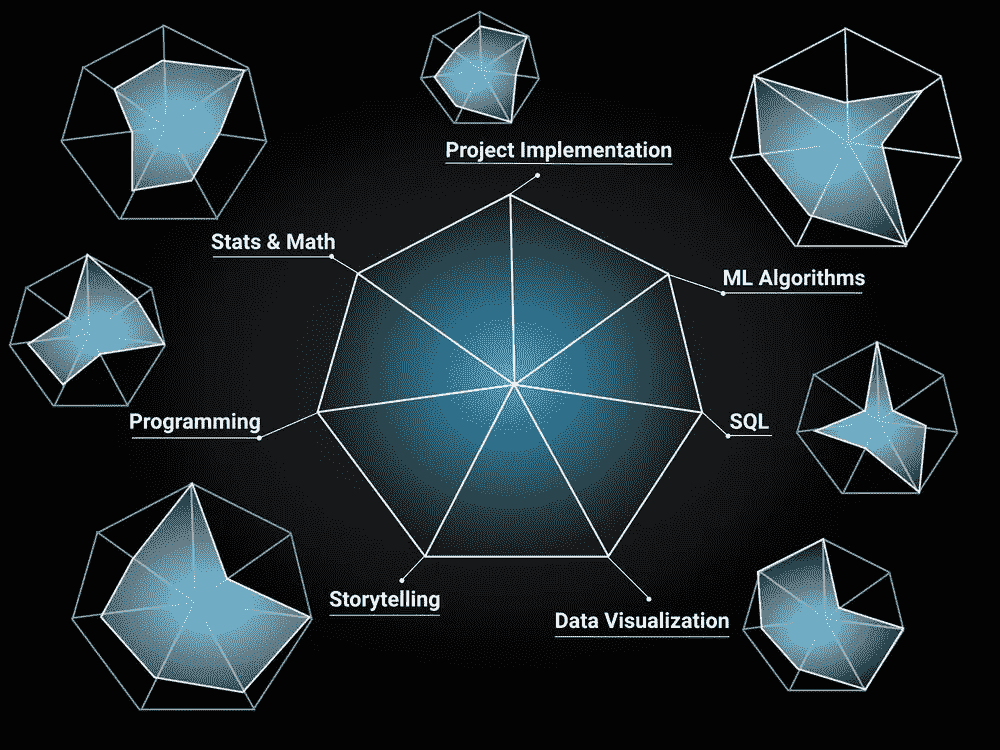
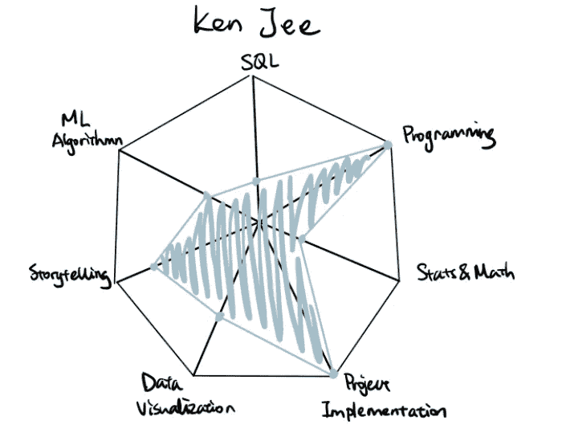
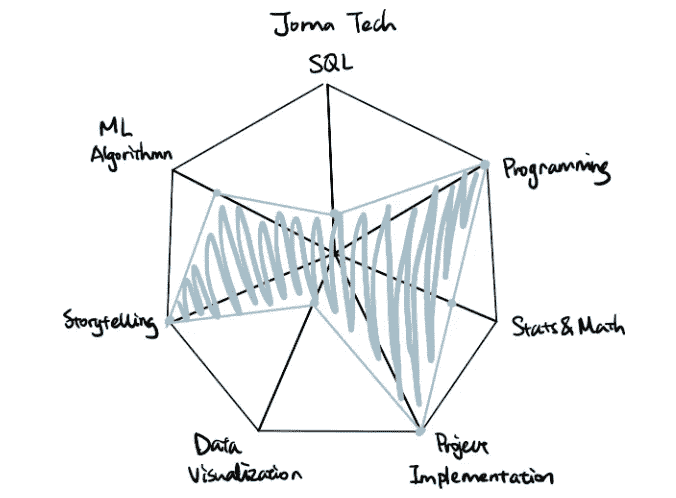
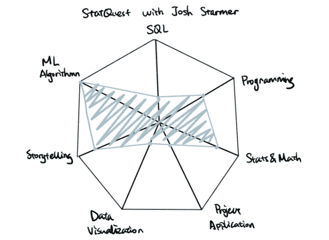
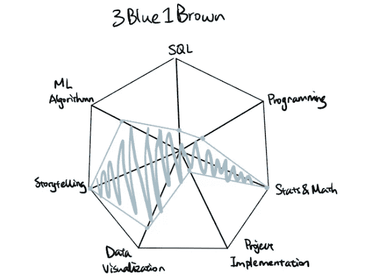
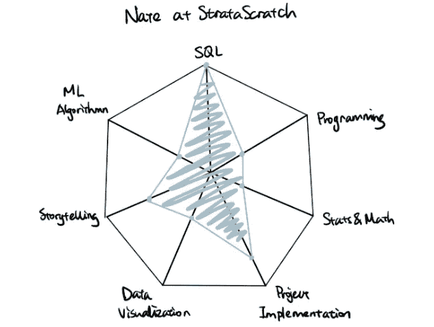
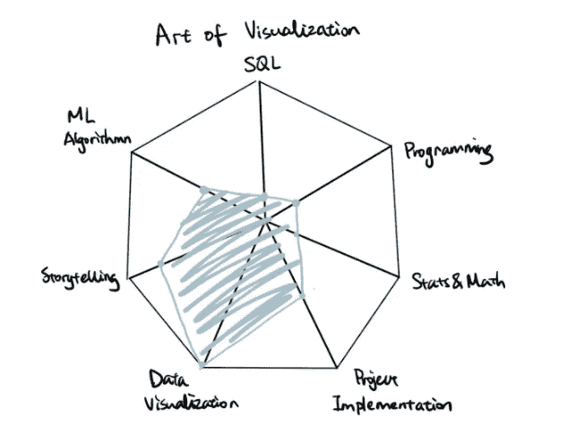

# 通过 YouTube 提升 7 项数据科学技能

> 原文：<https://towardsdatascience.com/level-up-7-data-science-skills-with-youtube-ef3778f34229?source=collection_archive---------8----------------------->

## 如果学习数据科学是一个游戏呢

七项数据科学技能(图片由作者提供)

我们都熟悉现代游戏设计，冠军或英雄总是配备有某些属性和专长。例如，Dota 英雄是根据敏捷、智力和力量等方面进行评分的。为了在战场上出类拔萃，英雄需要在所有属性上有高于平均水平的分数，同时至少在一个属性上有专长。

那么，如果我们将学习数据科学视为玩一场游戏，在这场游戏中，我们所有人都拥有多维度的能力。玩电子游戏需要不断地用武器、训练或魔法药水来磨练我们的技能。这类似于我们通过阅读、教程，当然还有本文后面提到的 YouTube 学习资源来学习。

首先，让我们来看一下**确保您在数据科学竞赛中获胜的七项基本技能**。

# 七项数据科学技能

1.  **机器学习算法**

理解监督、非监督和强化学习算法背后的基本理论，例如:

*   线性回归
*   神经网络
*   决策图表
*   KNN
*   使聚集
*   …

**2。统计&数学**

统计和数学是数据科学的基石，尤其是在机器学习和人工智能领域，包括以下基础知识:

*   线性代数
*   结石
*   概率分布
*   假设检验:t 检验，ANVOA，相关…

**3。SQL**

SQL 是用于与数据库通信并通过数据提取和查询获得洞察力的语言，一些基本技术包括:

*   CRUD —创建、读取、更新、删除
*   筛选、排序、聚合
*   日期、字符串、数字操作
*   加入和联合
*   子查询

如果您想了解更多细节，这些文章可能会有所帮助:

 [## 用日常语言学习 SQL

### SQL 就像 Excel 一样

towardsdatascience.com](/learn-sql-in-everyday-language-8d1e06f4daef)  [## SQL 连接入门

### 使用示例学习左连接、内连接、自连接

towardsdatascience.com](/get-started-with-sql-joins-87835422644b) 

**4。编程**

有一些容易开始但功能强大的编程语言，比如 Python 和 R。最重要的是，学习编程逻辑以及开发人员的思维方式，而不是关注编码语法:

*   循环结构:for 循环，while 循环
*   条件结构:if … else 语句
*   数据结构和复杂性
*   面向对象编程

**5。数据可视化**

数据可视化贯穿于数据科学之旅的始终，从一开始的探索性数据分析到最终的报告和交付成果。一些常用的工具有:

*   （舞台上由人扮的）静态画面
*   PowerBI
*   seaborn (Python 包)
*   ggplot2 (R 封装)

**6。项目实施**

理解理论和概念是至关重要的，但实施也是必不可少的。这项技能更侧重于如何通过构建项目和实施[数据科学生命周期](http://sudeep.co/data-science/Understanding-the-Data-Science-Lifecycle/)将知识付诸实践:

*   商业理解
*   数据挖掘
*   数据清理
*   电子设计自动化(Electronic Design Automation)
*   特征工程
*   预测建模
*   数据可视化

**7。讲故事**

往往被忽视的是软技能。这决定了数据科学家是否能够简洁地向受众传达信息，同时保持他们的参与。由于数据科学正在搭建业务和技术之间的桥梁，能够向不同学科的人阐述复杂的技术成为一项必备技能。

# 关注哪些 YouTube 频道？

对于初学者来说，有许多渠道提供非常有帮助的教程，但在某种程度上，使数据科学看起来令人生畏。最终，学习之旅变得更像是一件苦差事。为了让学习过程游戏化，我们需要将自己的个性和创造力嵌入频道的 YouTubers 用户。我真的很感谢关注 YouTubers，努力让内容更容易被观众接受，更吸引观众。

在数据科学游戏中，如果我们想要提升技能组合，就需要相应地消耗适当的资源。如果我们继续打 Dota 的比方，有些武器比如剑主要增加你的力量，而靴子增加你的敏捷。同样，这些渠道各有各的不公平优势。我用雷达图来说明该频道的专业领域。将它们结合在一起，您将能够以整体的方式磨练您的数据科学技能。

[**1。肯吉**](https://www.youtube.com/channel/UCiT9RITQ9PW6BhXK0y2jaeg)

肯吉频道专业化(图片由作者提供)

他的频道非常关注项目，对初学者也很友好。这是一个开始构建数据科学项目的好地方，尤其是 Kaggle 项目，并且不会被复杂算法背后的数学或统计数据所吓倒。Ken Jee 还提供了有用的职业建议和生产力技巧。

[**2。霍马理工**](https://www.youtube.com/channel/UCV0qA-eDDICsRR9rPcnG7tw)

霍马技术频道专业化(图片由作者提供)

这可能是我见过的最随机但最有创造力的数据科学家。它确实有魔力让你一直看他的视频。霍马理工大学从程序员的角度描述了数据科学。例如，他有一个名为[“如果编程是一部动画”](https://www.youtube.com/watch?v=pKO9UjSeLew)的系列节目，观看次数高达数百万。他的 vlog 风格的内容一定会让你同时得到娱乐和教育。

[**3。乔希·斯塔默**的任务 T5](https://www.youtube.com/channel/UCtYLUTtgS3k1Fg4y5tAhLbw)

Josh Starmer 渠道专业化的 StatQuest(图片由作者提供)

该频道专注于通过动画视觉效果阐释机器学习概念和算法。创作者如何将复杂的概念(例如随机梯度下降，支持向量机)分解为可消化的片段，这令人惊叹。每当我需要学习新的 ML 模型时，它都是我的首选渠道。

[**4。3 蓝色 1 棕色**](https://www.youtube.com/channel/UCYO_jab_esuFRV4b17AJtAw)

3Blue1Brown 频道专业化(图片由作者提供)

3Blue1Brown 是艺术和科学的完美结合。创作者格兰特·桑德森从独特的视角通过令人惊叹的视觉插图讲述了数学世界的故事。新冠肺炎背后有一个关于[数学和概率的系列，我极力推荐。](https://www.youtube.com/watch?v=gxAaO2rsdIs&list=PLZHQObOWTQDOcxqQ36Vow3TdTRjkdSvT-&index=2)

[**5。内特在斯特拉斯克拉奇**](https://www.youtube.com/channel/UCW8Ews7tdKKkBT6GdtQaXvQ/videos)

Nate 在 StrataScratch 频道专业化(图片由作者提供)

它提供了微软、脸书等大型科技公司的 SQL 面试问题的完整演练。对于那些准备参加数据科学技术面试的人，您可能想了解一下。这些练习有助于通过主动回忆过程巩固 SQL 实施。

[⑥**⑥。可视化艺术**](https://www.youtube.com/channel/UCHBWJGoZMkhJyElgvuN1U1w)

可视化频道专业化的艺术(作者图片)

让这个频道脱颖而出的是，它覆盖了一系列在 Tableau 中创建起来不直观的自定义图表，包括 Sankey 图、Sunburst 图。此外，还有一系列教程围绕使用 Python、R 等语言进行数据可视化的主题。

# **带回家的信息**

本文涵盖了数据科学家的七项基本技能:

*   ML 算法
*   统计和数学
*   编程；编排
*   结构化查询语言
*   项目执行
*   数据可视化
*   讲故事

此外，我推荐六个 YouTube 频道来帮助学习这些技能。希望您会发现这些资源对您的学习之旅有所帮助。

一如既往，让我们一起继续提升我们的技能。

## **更多类似的文章**

 [## 2021 年将推出 5 个数据科学播客

### 当没有学习数据科学的动机时，您每天的灵感剂量

towardsdatascience.com](/five-data-science-podcasts-to-follow-1b82d7a092a5)  [## 2021 年数据科学家关注的 15 大网站

### 启发学习的网站和博客

medium.com](https://medium.com/analytics-vidhya/top-15-websites-for-data-scientists-to-follow-in-2021-67352092c54d)  [## Python 中的特征选择和 EDA

### 如何使用数据可视化来指导 ML 中的特征选择

towardsdatascience.com](/feature-selection-and-eda-in-python-c6c4eb1058a3)  [## Python 中的简单逻辑回归

### 从数据预处理到模型评估的逐步指南

towardsdatascience.com](/simple-logistic-regression-using-python-scikit-learn-86bf984f61f1) 

*原载于 2021 年 4 月 10 日*[*【https://www.visual-design.net】*](https://www.visual-design.net/post/level-up-7-data-science-skills-with-these-youtube-channels)*。*