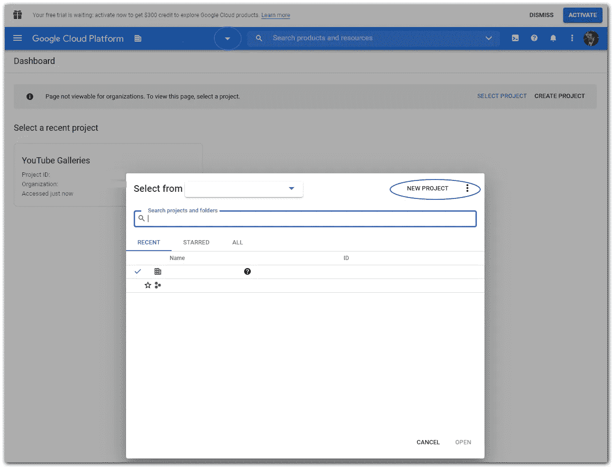
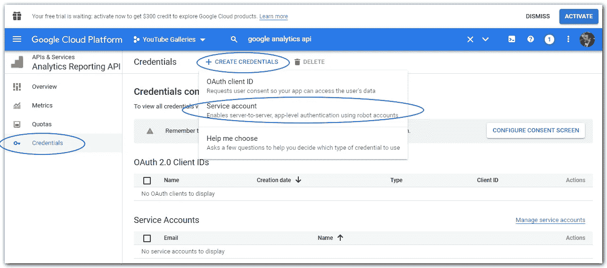
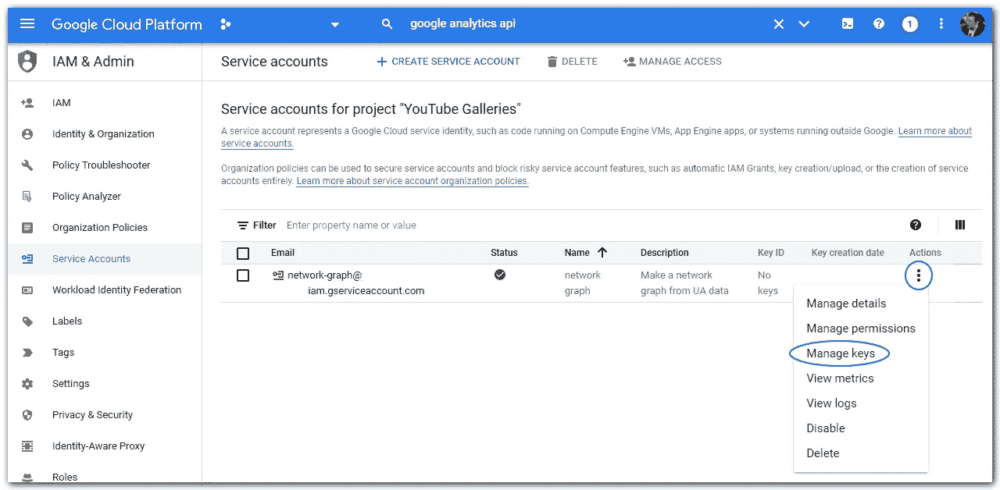
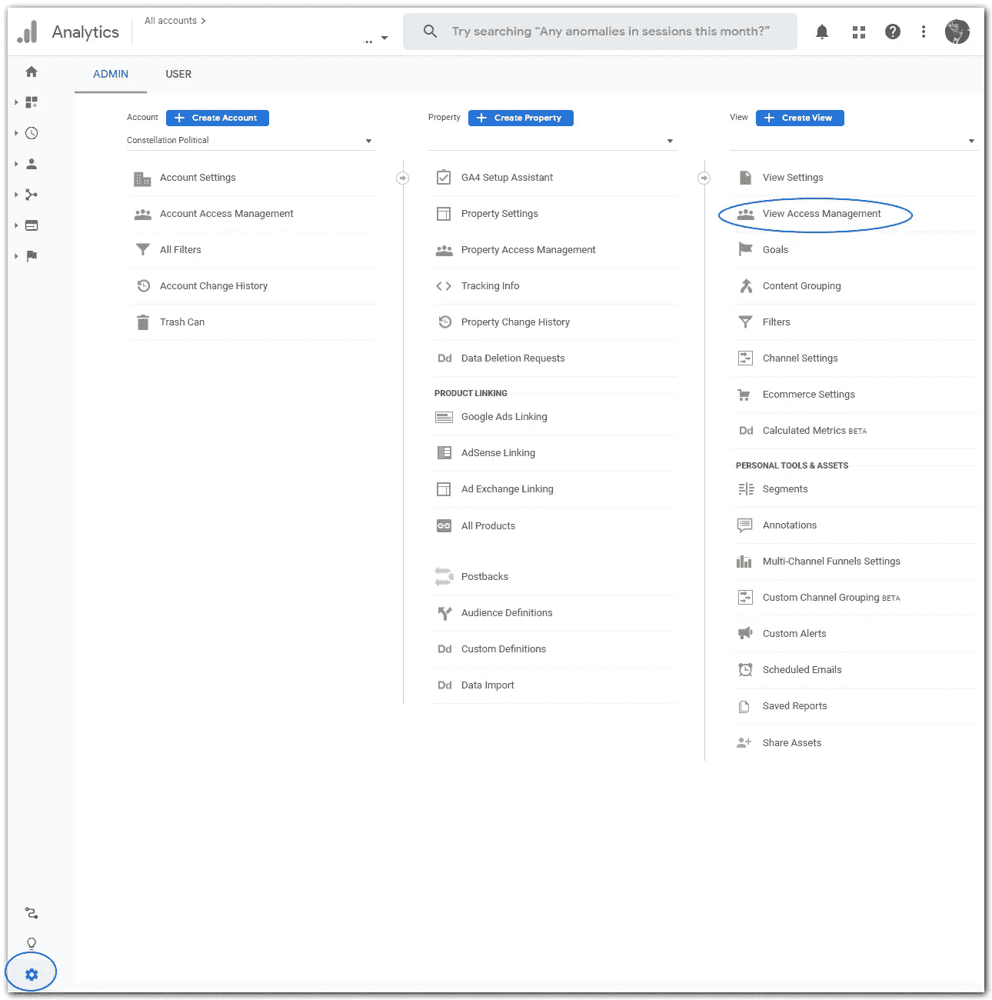
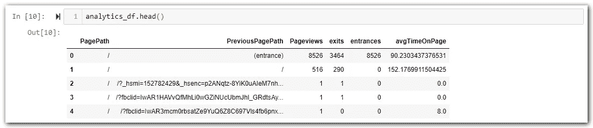
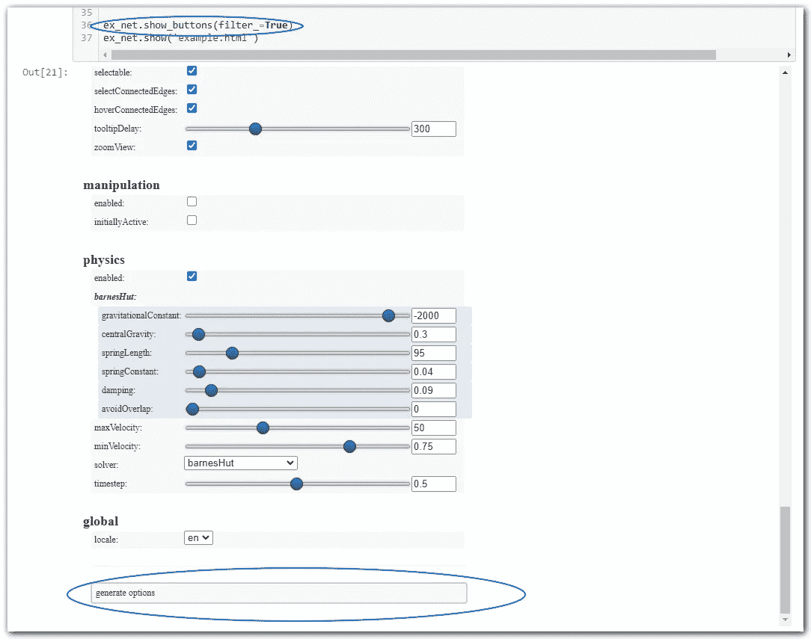
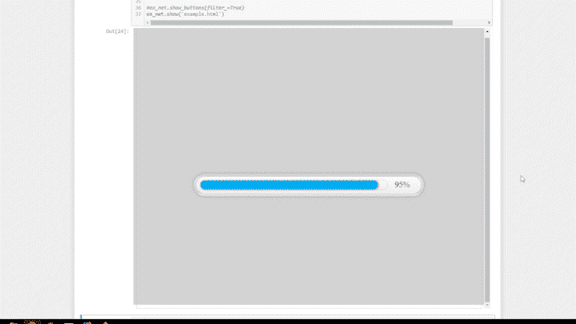

# 只需几行 Python 代码就能提升你的转化率

> 原文：<https://towardsdatascience.com/level-up-your-conversion-rate-in-just-a-few-lines-of-python-c9e2c4af3684?source=collection_archive---------20----------------------->

Preethi Viswanathan 在 [Unsplash](https://unsplash.com?utm_source=medium&utm_medium=referral) 上拍摄的照片

## 当你在做的时候，产生一些美丽的视觉效果

## 介绍

你的网络体验让你的销售成本增加了吗？如果你没有在转化率优化(CRO)方面做出积极努力，答案是*是的*。然而，在商业中大量存在的缩略语中，CRO 是促进销售最便宜、最容易的方式之一。在销售线索成为客户的过程中，糟糕的网络体验有时可以通过添加或删除一个按钮、减少文本或完全删除一页这样的小事来弥补。

但是，要了解你的销售损失在哪里，你首先需要了解用户是如何浏览构成你网站的页面集合的。你需要检查他们在销售过程中遵循的流程。

谷歌分析是免费的，几乎普遍被用于网络分析。但是，它的路径分析选项可能是令人沮丧的线性——线性很少是客户进行销售的路径。

幸运的是，我们可以使用来自 Google Analytics 的数据结合几行 Python 来创建一个直观的、交互式的网络图，这将允许我们检查用户如何通过您的网站进行转换。

为此，我们将:

1.  [设置谷歌分析 API &配置访问权限](#ab3d)
2.  [使用 Python 下载谷歌分析数据](#10aa)
3.  [在 Pandas 中清理和格式化我们的数据](#7bca)
4.  [使用 Pyvis 创建交互式网络图](#5a65)

如果你对这一步一步不感兴趣，你可以[在 GitHub repo](https://github.com/bengen343/ua-network-graph) 中查看这项任务的完整代码。

> 如果您觉得本指南有用和/或您对更详细的入门指南感兴趣，请 [**在 Medium**](https://medium.com/@bengen) 上跟随我。

## 配置 Google 分析 API

首先，你需要允许自己的 API 访问谷歌分析。谷歌让这一过程变得非常容易，但是，如果这是你第一次涉足谷歌的云平台的深处，这可能会令人望而生畏。

首先前往[https://cloud.google.com/](https://cloud.google.com/)，如果你是完全从零开始，选择“控制台”或“免费开始”。

作者图片

从这里开始，您可能需要创建一个新项目。选择顶部搜索栏左侧的下拉箭头，然后从弹出窗口的右上角选择“新建项目”。

作者图片

现在你有了你的项目，你需要在你的账户上启用 Google Analytics API。因为这是谷歌，所以搜索这个功能很容易。前往顶部搜索栏，输入“谷歌分析应用编程接口”将出现几个选项，选择“谷歌分析报告 API。”然后点击“启用”你应该不会错过的。

一旦你这样做了，你应该会发现自己在谷歌分析报告 API 的“概述”部分。在这里，您需要在左侧菜单中选择“凭据”，然后在新屏幕的顶部选择“+创建凭据”，并从弹出的选项中选择“服务帐户”。

作者图片

这将带你进入一个三步流程。为您的服务帐户取一个好记的名称，在步骤 2 中为项目访问选择“所有者”,然后完成。

这会将您带到“服务帐户”屏幕，您应该会看到您的新服务帐户已列出。现在，您需要下载一个密钥到您的计算机，以用于访问。选择服务帐户旁边“操作”下的三个点，然后选择“管理密钥”

作者图片

在下一个屏幕上，选择“添加密钥”下拉菜单，然后选择 JSON 作为“密钥类型”这将立即创建一个 JSON 文件，并提示您将它下载到您的计算机上。将该文件下载到您的代码所在的文件夹中。

在我们深入研究代码之前，最后一步是让这个新的服务帐户访问您将从中提取数据的 [Google Analytics](https://analytics.google.com/analytics/web/) (GA/UA)帐户。正如你在上面的截图中看到的，服务帐户有自己的电子邮件地址。复制这个地址。

前往你的[谷歌分析](https://analytics.google.com/analytics/web/)账户。选择屏幕左下方的“设置”齿轮，然后为您要构建图表的视图选择“视图访问管理”。添加你从[谷歌云平台](https://cloud.google.com/)复制的服务账号邮箱地址作为查看者。当您在这里时，请记下您要添加服务帐户的视图的“视图 ID”。您可以在搜索栏左侧最顶端的下拉列表中找到它。

作者图片

现在我们可以开始实际的编码了！

## 用 Python 下载谷歌分析数据

除了随处可见的熊猫，你还需要:

*   apiclient 和 oauth2client —连接到 Goolge Analytics API。
*   [pyvis](https://pyvis.readthedocs.io/en/latest/) —创建我们的网络图可视化。

所有必需的软件包都可以通过 PIP 轻松获得。

除了导入您的包，您还需要预先定义一些变量。最重要的是，您需要输入从 Google Cloud Platform 下载的包含 API 访问密钥的 JSON 文件的名称。该文件在下面被命名为“密钥文件”。如前所述，您还需要创建一个名为“VIEW_ID”的变量，并为其提供您的分析属性的视图 ID。请注意，虽然这是一个数字，但您应该将其作为字符串存储在 Python 中。

现在，我们需要定义几个函数来帮助我们访问我们的谷歌分析数据。我们将创建“initialize_analyticsreporting”来构建 API 连接，“get_report”来定义我们想要下载和检索的维度和指标，以及“response_to_df”来获取分析数据，确保数据已完全下载，并将其保存在 pandas 数据帧中，以便更有序。

请注意，在“get_report”函数的第 23 行和第 24 行中，我们传递了我们希望作为变量检索的维度和指标，因为它们可能会经常变化。该函数需要维度和度量作为字典，我们从传递给该函数的列表中生成这些字典。

[谷歌有一个非常容易导航的网站](https://ga-dev-tools.web.app/dimensions-metrics-explorer/)，上面有可以下载的所有维度和指标的名称。使用此网页，我们可以为维度制作一个列表，并为我们希望下载的指标制作另一个列表。我们还需要定义我们希望检查的日期范围。谷歌分析 API 很方便，因为它支持描述性的、相对的时间框架，比如“14 天”和“昨天”完成后，我们可以调用我们的分析函数。

…并检查我们得到的数据。

## 检查、清理和格式化 Pandas 数据框架中的数据

一切看起来都很好。…除了…您的页面路径可能仍然附加有查询参数。(除非你事先计划好了，并且已经在你的分析视图中过滤掉了)。为了真正了解所有页面之间的流量，我们需要删除这些查询参数，并根据真正的页面路径聚合结果。在此过程中，我还要确保将数字存储为数字，而不是字符串。

## 创建一个网络图来可视化您的流量

随着我们的数据现在被清理和组织，我们可以把它组合成一个网络，并把它可视化。

可视化功能的核心是用。add_node '和'。add_edge '行，然后显示带有'的 HTML 图形。'显示'

你可以看到我对数据和显示做了一些修改。例如，在开始时，我缩小了显示最常去的前 10%的路径的范围，以免图表变得过于混乱。我还在末尾添加了一个“for”循环，为每个节点的工具提示添加额外的信息。而且，最复杂的是，我使用了一个颜色字典，根据每个页面所属的更大站点的部分，使我的节点具有不同的颜色。

我的网络图使用两个节点之间的流量来定义线的权重。节点本身的大小取决于每个页面的退出率。节点圆越大，退出率越小。

注意第 36 行；。show_buttons(filter_=True)'。第一次运行图形时，可以包含此代码来加载格式化选项的交互式菜单。这个菜单使调整图形变得容易，直到你对它的外观满意为止。然后，您可以单击“生成选项”来生成您选择的选项作为字典，该字典可用于在将来重新创建您的格式。

如您所见，我已经设置了我选择的选项，并调用了上面代码片段第 7 行中的选项，在那里我调用了图形。

使用预定义的格式和 viola 再次调用可视化，viola 是 web 流量的交互式可视化。您可以使用它来轻松查看用户在您的站点中最常经过的路径，哪些页面会导致退出，以及人们最有可能进入您的页面的位置。

你可以在 GitHub 上找到保存为笔记本的该项目的[完整代码。](https://github.com/bengen343/ua-network-graph)

尽情享受吧！