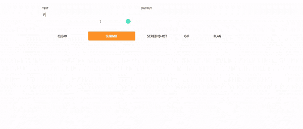
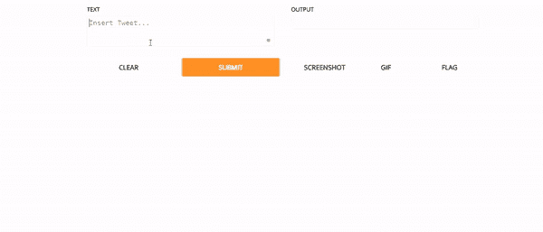

# 使用图形界面提升您的数据科学项目

> 原文：<https://towardsdatascience.com/level-up-your-data-science-project-with-a-graphical-interface-cb5704792509?source=collection_archive---------35----------------------->

## 为我的情感分析项目创建一个 GUI

作者 Gif

## 介绍

我相信数据科学从业者对项目在获得第一份工作中的力量的看法是一致的。如果你想有机会进入数据科学领域，一个项目几乎是必不可少的，许多人开始关注这意味着你应该做一些不同的事情来脱颖而出。

由于许多数据科学家没有很好的软件工程技能——当然，除非你已经从软件工程过渡过来——为你的项目创建一个图形用户界面(GUI)会让你立即领先于许多其他候选人。

如果你像我一样，属于缺乏软件工程诀窍的数据科学家，不要感到气馁。有许多开源平台可以帮助你。Streamlit 是一个非常受欢迎的产品，但是为了这个项目，我决定和 Gradio(T1)一起玩，没有任何原因，只是因为首席执行官[阿布巴卡尔·阿比德(T3)在 LinkedIn 上和我联系，我很好奇他创造了什么。](https://medium.com/u/27ce1dff7ecd?source=post_page-----cb5704792509--------------------------------)

> **注意**:Gradio 的任何人都没有要求我制作这个演示。

## 格拉迪欧是什么？

Gradio 是一个免费的开源软件包。它允许人们围绕他们的机器学习模型和任意功能快速创建可定制的用户界面组件。Gradio 的伟大之处在于它与许多机器学习框架兼容，所以我的 Tensorflow Keras 模型可以放在那里。

## 构建界面

要跟进，您可以简单地分叉 Github 存储库:

<https://github.com/kurtispykes/twitter-sentiment-analysis>  

按照 README.md 文件中的说明来安装需求、数据和模型——参见我的讨论 README 文件的重要性以及如何为您的下一个项目编写一个 ReadME 文件的帖子。这样做将安装您需要的所有必要的软件包。

你们中的许多人一直在关注我的 [*情绪分析:预测一条推文是否是关于一个灾难*](/sentiment-analysis-predicting-whether-a-tweet-is-about-a-disaster-c004d09d7245) 项目。目标是确定一条推文是否在谈论一场灾难。我们界面的目标是用我们的深度学习模型测试新的和看不见的实例。在这个实例中，我使用了 Tensorflow Keras BiLSTM 模型，但是您可以决定切换模型。

*   为此，您需要在`train.py`脚本上训练一个新模型，并在`user_interface.py`脚本中更改模型路径。

为了用 Gradio 创建我们的 GUI，我们只需调用接口函数并传递三个参数:

*   **fn** :接口包裹的一个函数。当用户与用户界面交互时，这个函数会被自动调用，这样我们就可以得到模型的预测。
*   **输入**:输入可以是单个 Gradio 输入组件，也可以是一列 Gradio 输入组件。本质上，我们正在定义 Gradio 应该从 UI 中得到的输入类型。
*   **outputs** :根据您的问题，输出可以是单个 Gradio 输出组件，也可以是一系列 Gradio 输出组件。我们必须事先告诉 Gradio 我们的函数返回的输出应该是什么。这允许 Gradio 决定如何在用户界面上显示我们的输出。

现在我们已经创建了函数和 Gradio 接口。我们只需要启动它并运行脚本。

示例实例—作者 Gif

## 结论

当寻求进入数据科学领域时，尽可能从人群中脱颖而出是非常重要的。为您的数据科学项目创建接口使您的源代码变得生动，在某些情况下，使招聘经理、招聘人员和其他数据科学家的体验更加真实。进一步说，你作为数据科学家的能力也变得更容易被那些不懂代码的非技术人员获得，这是你必须考虑的事情。

感谢阅读。一定要在 [LinkedIn](https://www.linkedin.com/in/kurtispykes/) 和 [Twitter](https://twitter.com/KurtisPykes) 上和我联系！

## 相关帖子:

<https://pub.towardsai.net/7-free-online-resources-for-nlp-lovers-26b1e0bba343>  <https://medium.datadriveninvestor.com/blogging-for-your-data-science-portfolio-61b07da8005d>  </3-tips-to-transition-into-data-science-from-any-field-6baaecdcac2d> 