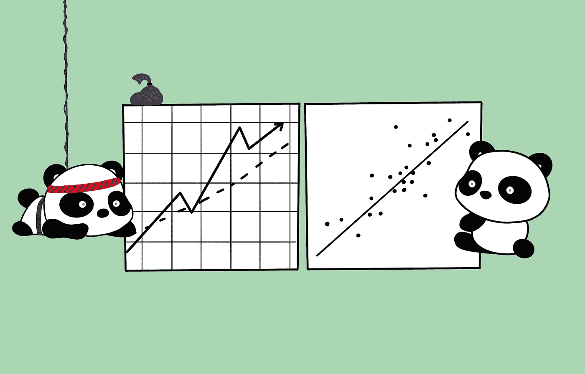
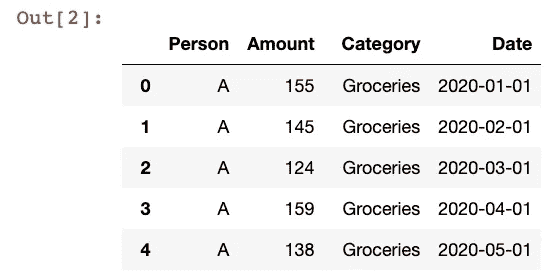
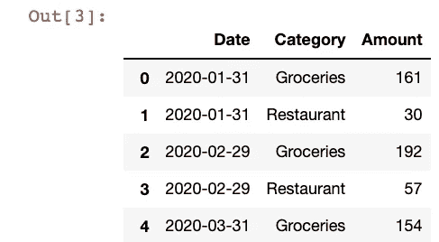
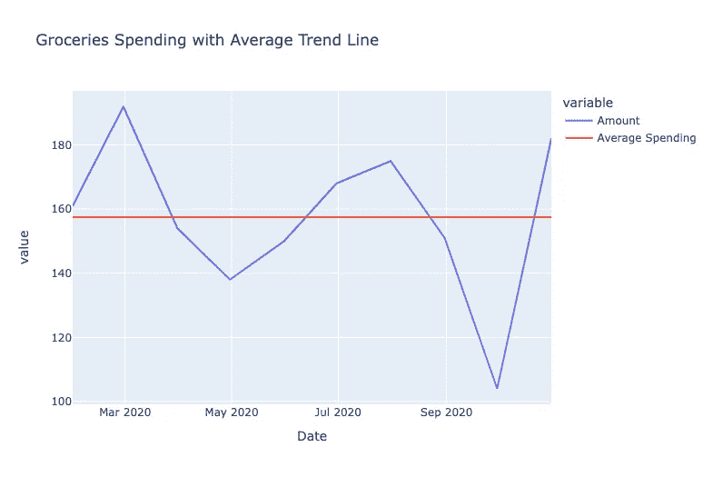
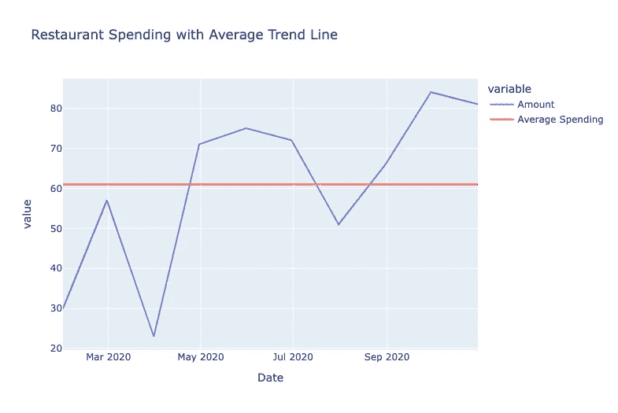
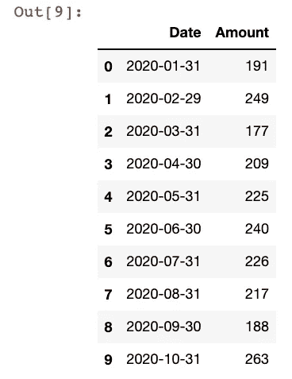
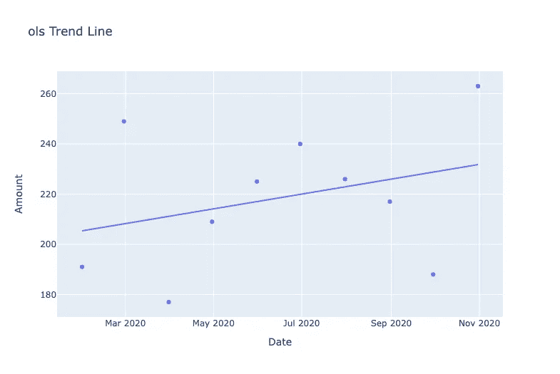
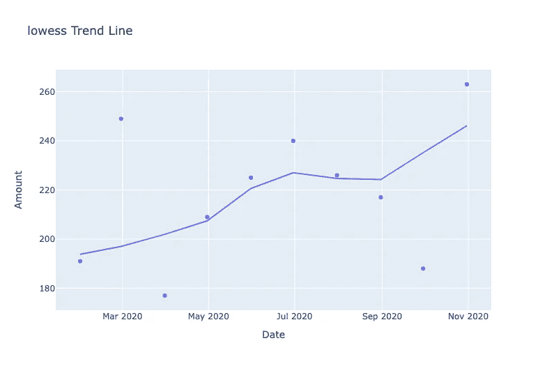
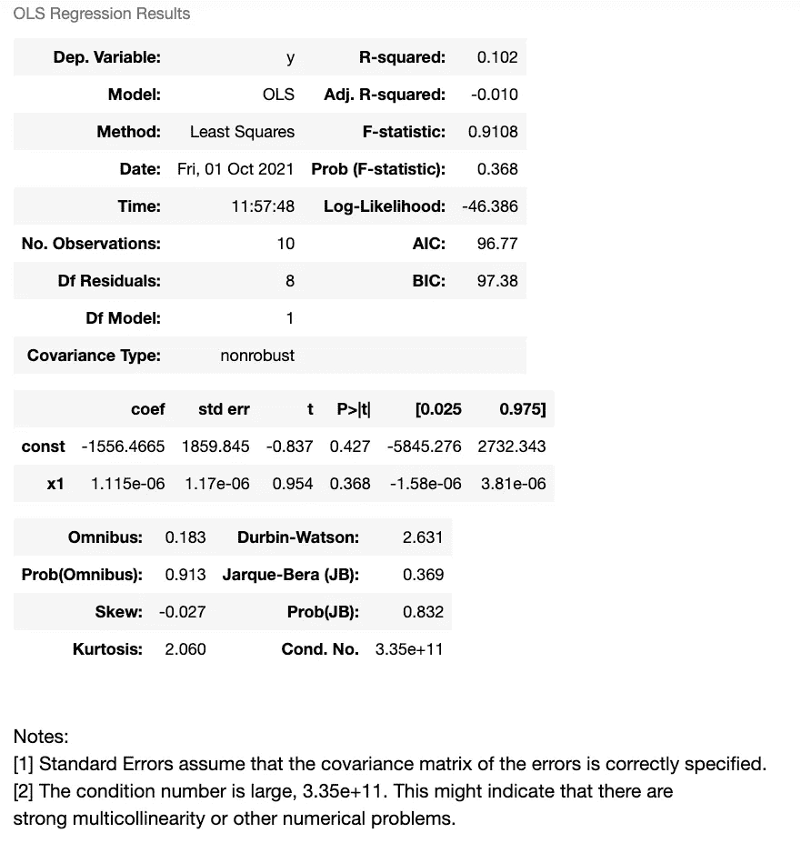

# 使用 Python 中的趋势线提升数据可视化水平

> 原文：<https://towardsdatascience.com/level-up-your-data-visualizations-with-trend-lines-in-python-6ad4a8253d6?source=collection_archive---------8----------------------->

## 大蟒

## 使用 Plotly 库轻松可视化数据趋势



我才华横溢的姐姐的作品

数据可视化是数据分析的关键部分。与只看表格上的数字相比，可视化数据使人们更容易理解数据集中的趋势。其中一部分包括选择正确的图表类型，以搭配您试图展示的正确数据类型，比如对时间序列数据使用折线图。

除此之外，您还可以添加一些修饰性的更改，如颜色和字体，使重要的数据点突出。此外，趋势线有助于清晰地勾勒出数据集在其所有数据点上的大致方向。您还可以实现静态趋势线，使您选择的值成为图表上的水平线或垂直线，以便轻松查看数据集中的值是高于还是低于静态线。

在本文中，我们将看看如何使用 Python 中的 Plotly 库实现两种形式的趋势线，以实现数据可视化。我们还将使用 Pandas 进行一些初始数据预处理，所以请确保您已经安装了这两个包。然后，导入以下内容，并准备好跟随！

```
import pandas as pd
import plotly.express as px
import random
```

我们开始吧！

# 使用 Plotly 创建带有平均趋势线的折线图

让我们首先生成一些样本数据。为此，请运行以下代码。

```
expense_data = {
    "Person": random.choices(["A", "B"], k=20),
    "Amount": random.sample(range(100, 200), 10) + random.sample(range(0, 99), 10),
    "Category": ["Groceries"] * 10 + ["Restaurant"] * 10,
    "Date": pd.to_datetime(pd.date_range('2020-01-01','2020-10-01', freq='MS').tolist() * 2)
}
df = pd.DataFrame(data=expense_data)
```



我们将要可视化的数据将基于一些随机生成的个人支出数据。从上面可以看到，我们只是随机创建了 10 个月的费用数据，并将其加载到 Pandas 数据框架中。上面的代码应该输出 20 行数据。

**在这篇文章中，我们数据分析的第一个目标是比较每个类别的平均月支出与该类别中每个月的支出。**

因此，让我们用一些熊猫来对每个类别每月的总支出进行分组。

```
df_grouped = df.groupby(by=[pd.Grouper(key="Date", freq="1M"), "Category"])["Amount"]
df_grouped = df_grouped.sum().reset_index()
```



现在，我们可以开始创建图表了。

由于我们希望为每个消费类别创建一个图表，其中包含每个月的数据点和一条静态平均趋势线，因此我们可以从在数据框架中创建一个类别列表开始。

```
categories = df["Category"].unique().tolist()
```

然后，我们将遍历所有类别，并使用以下代码为每个类别创建一个图表。

```
for category in categories:
    df_category = df_grouped.loc[df_grouped["Category"] == category].copy()
    df_category["Average Spending"] = round(df_category["Amount"].mean(), 2)
    category_graph = px.line(
        df_category, 
        x="Date", 
        y=["Amount", "Average Spending"], 
        title=f"{category} Spending with Average Trend Line"
    )
    category_graph.show()
```

这段代码首先创建一个新的 DataFrame，在每个循环中只包含具有所需类别的行。然后，我们创建一个新的列“Average Spending ”,它简单地对数据帧中的“Amount”列使用`mean`方法，返回一个只包含平均支出值的列。

最后，我们使用 Plotly Express 库用新的数据框架创建一个折线图。您会注意到我们将一个列表传递给了`y`参数，这将在折线图中给出两行。这段代码的结果如下图所示。



使用这些图表，您可以很容易地看到哪些月份超出了该类别的平均支出，哪些月份低于平均支出。这将有助于人们长期管理他们的财务，这样他们就可以相应地每月做预算，并检查他们是否每个月都达到他们的计划。

# 用 Plotly 实现图形上的线性和非线性趋势线

接下来，让我们来看看如何使用 Plotly 来**创建数据集**中每月总支出的趋势线。为此，我们将创建一个新的分组数据帧，只是这次我们只需要按月分组。

```
df_sum = df.groupby(by=[pd.Grouper(key="Date", freq="1M")])["Amount"]
df_sum = df_sum.sum().reset_index()
```



Plotly 允许您创建线性或非线性趋势线。您可以使用普通最小二乘(OLS)线性回归或局部加权散点图平滑(非线性)趋势线。

类似于我们为前面的部分创建图表的方式，我们现在将创建一个可能的趋势线列表，并使用另一个 for 循环创建散点图。

```
trend_lines = ["ols", "lowess"]for trend_line in trend_lines:
    fig = px.scatter(
        df_sum, 
        x="Date",
        y="Amount",
        trendline=trend_line,
        title=f"{trend_line} Trend Line"
    )
    fig.show()
```

代码和以前差不多，我们将数据帧和适当的列传递给 Plotly Express 散点图。为了添加趋势线，我们将我们定义的列表中的每个趋势线值传递到`trendline`参数中。运行上面的代码会得到下面的图形。



**根据您的数据集，线性或非线性趋势线可以更好地拟合数据点。这就是为什么尝试不同的趋势线来看哪条更符合数据是有用的。此外，仅仅因为有趋势线并不一定意味着趋势真的存在(就像相关性不等于因果关系一样)。您还可以使用以下代码访问模型参数(对于带有 OLS 趋势线的图表)。**

```
results = px.get_trendline_results(fig)
results.px_fit_results.iloc[0].summary()
```

请注意，上面的`fig`对象是在图形表达式`scatter`中的`trendline`参数被设置为“ols”时创建的图形。汇总的结果可以为您提供用于创建您在图表中看到的趋势线的参数的说明，这可以帮助您理解趋势线的意义。



在我们随机生成数据的例子中，很难真正看到一个显著的趋势。您将看到非常低的 R 平方值和小于 20 的样本大小估算出低相关性(如果有的话)。

然而，对于一个普通人的支出数据来说，当你查看每月的支出时，如果能看到一条基本平坦的趋势线就太好了。如果你注意到你每月支出的 R 平方值较高的高斜率正趋势线，你会知道你可能随着时间的推移增加了支出，因此支出超过了你的每月预算分配(除非你可能加薪并决定故意挥霍)。

仅此而已！

我希望你会发现这个关于 Python 中 Plotly 趋势线的快速介绍对你的数据分析很有用。Plotly 库，特别是当你使用 Plotly Express 时，使你只需插入一个 Pandas 数据框架就可以直接可视化你的数据。重要的是要记住，你选择显示数据的方式会影响其他人对它的看法，所以要确保当你做出改变时，比如添加趋势线，你是以真正代表基础数据的方式这样做的，而不是为了提出一个任意的观点。

再次感谢你的阅读！如果你正在考虑成为 Medium 的付费会员，如果你使用我下面的推荐链接注册，我会非常感激！这会让直接收到你的一部分会费，所以这将是一个很大的帮助。

<https://byrondolon.medium.com/membership>  

```
**More by me:** - [Check for a Substring in a Pandas DataFrame](/check-for-a-substring-in-a-pandas-dataframe-column-4b949f64852?sk=bfb5bbab11ae45c47bfb316d931c3b56)
- C[onditional Selection and Assignment With .loc in Pandas](/conditional-selection-and-assignment-with-loc-in-pandas-2a5d17c7765b?sk=e5672d859a3964c1453a1c09edca22cf)
- [2 Easy Ways to Get Tables From a Website With Pandas](/2-easy-ways-to-get-tables-from-a-website-with-pandas-b92fc835e741?sk=9981ddaf0785a79be893b5a1dd3e03dd)
- [Top 4 Repositories on GitHub to Learn Pandas](/top-4-repositories-on-github-to-learn-pandas-1008cb769f77?source=friends_link&sk=d3acc38062490a86ecb46875342224e6)
- [Better Data Visualization with Dual Axis Graphs in Python](/better-data-visualization-with-dual-axis-graphs-in-python-a7f35a493558?sk=4e080437f9d29818e25120e287fa550d)
```