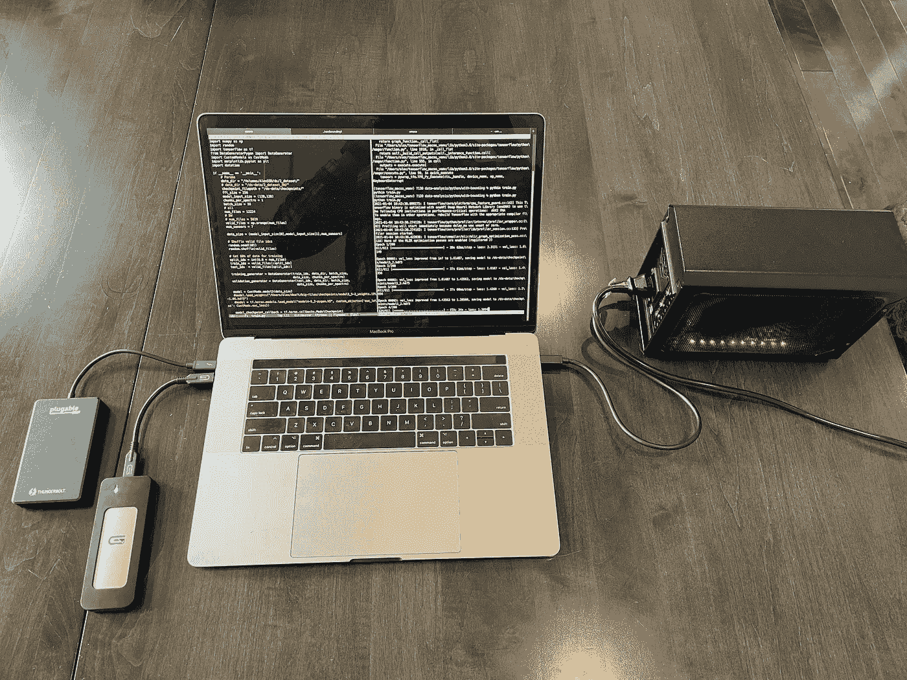
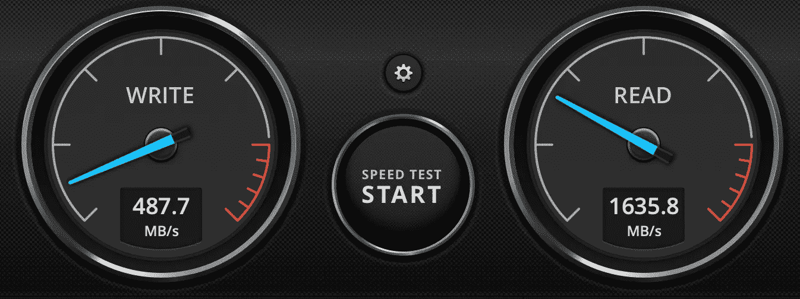
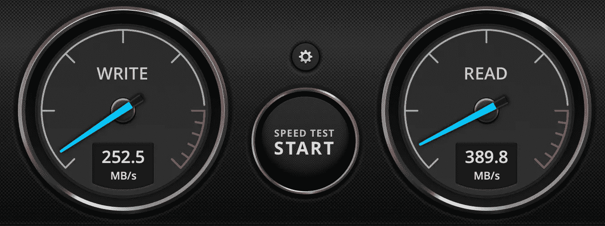
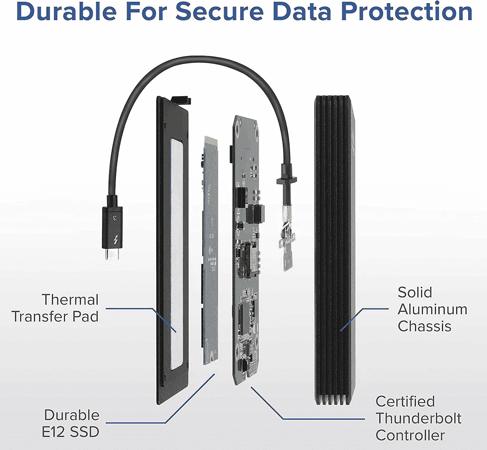
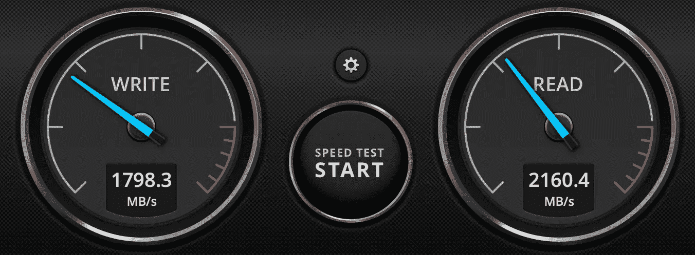
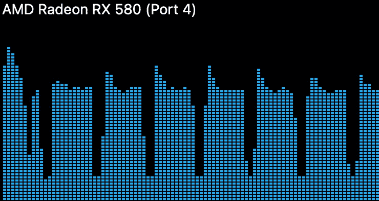
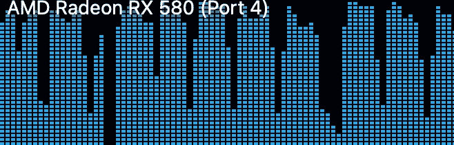

# 使用雷电 3 固态硬盘提升您的机器学习工作流程

> 原文：<https://towardsdatascience.com/level-up-your-machine-learning-workflow-with-a-thunderbolt-3-ssd-5682bcce8773?source=collection_archive---------48----------------------->

## 您是否正在耗尽计算机上的空间，但不想用慢速驱动器损害机器学习性能？雷电 3 固态硬盘就是答案。

我的测试中使用的所有外围设备。图片作者。

我最近开始在 TensorFlow 中对一些相当大的数据集进行模型训练。我已经不堪重负的内部固态硬盘很快就耗尽了仅剩的一点空间，这促使我寻找另一种解决方案。

我有一个旧的外部 SSD，所以我尝试将我的 20 GB 数据集移到上面。不幸的是，训练时间几乎增加了一倍。在我电脑的这个驱动器和内部驱动器[上运行一个快速的磁盘速度测试，很清楚地发现了问题。](https://amzn.to/2X9O5E0)

## 内部驱动

内部固态硬盘—图片由作者提供

## 外部固态硬盘

内部固态硬盘—图片由作者提供

外部固态硬盘的原始性能可能与我的 MacBook 内部的固态硬盘相似，但外部驱动器仅支持通过 USB 3.0 接口传输数据。这将最大实际传输速度限制在 500 MB/s 左右。相比之下，我的内部 SSD 通过 PCIe 总线连接到主板，实际限制为每秒数十 GB。这可以达到的最大速度仅受闪存性能的限制。

我的 2016 年 MacBook Pro，以及几乎所有新的苹果电脑和许多 Windows 电脑，都有雷电 3 (TB3)界面。这种外部连接支持高达 5 GB/s 的传输速率。如此快的速度支持大量有趣的外设，如外部 GPU 和快速外部存储。我很好奇，想知道支持雷电 3 的外置 SSD 能否解决我的存储难题，所以我订购了一个。

我订购的驱动器内部。图片来自[可插拔](https://amzn.to/359SU4j)。

我选择的驱动器是一个[可插拔 1 TB 雷电 3 固态硬盘](https://amzn.to/38XpJCI)。售价 300 美元，比普通 USB 外置固态硬盘贵了一点，但如果更快的连接不会产生瓶颈，我认为它是值得的。这个驱动器的理论最大读取速度为 2400 MB/s，写入速度为 1800 MB/s。我使用苹果新的苹果文件系统(APFS)格式格式化了驱动器，并进行了速度测试。

TB3 固态硬盘—作者图片

令我惊讶的是，这个硬盘竟然比我电脑里的硬盘还快！我怀疑这是由于我的内部固态硬盘的年龄。我订购的外置硬盘可能使用了更新的闪存技术。我还惊喜地发现，我至少可以接近广告上的速度，但情况并非总是如此。

然而，对我的驱动器的真正测试是它们在我的机器学习工作流中的表现如何。我对我的旧 USB 外部固态硬盘、新 TB3 固态硬盘和内部固态硬盘进行了测试。我在 TensorFlow 中对一个 20 GB 的图像数据集进行了 10 个时期的卷积神经网络训练，并与每个驱动器上的数据集进行了时间比较。

我在我的外部 RX580 GPU 上做了这个测试，它也使用了雷电 3 接口。我的电脑有两个 Thunderbolt 控制器(一个用于左侧端口，一个用于右侧端口)，所以我将 GPU 放在一侧，将外部驱动器放在另一侧。我不知道是否有可能使 Thunderbolt 控制器的带宽饱和，所以我想确保安全。

USB 3.0 固态硬盘是迄今为止最慢的，**在 10 分 29 秒内完成 10 个时代。**我的雷电 3 SSD **在 6:12**完成测试，我的内置 SSD **在 5:42** 完成测试。

我的 USB 外部固态硬盘(左)和内部固态硬盘(右)的 GPU 使用情况对比。正如预期的那样，内部 SSD 显示了更高的整体 GPU 利用率。

我很惊讶，我的内部固态硬盘仍然更快，因为它的传输速度比我的外部驱动器慢。我猜这是由于我的数据集的性质，它有许多小文件。我的内部 SSD 直接连接到我的计算机的 PCIe 总线，因此启动文件传输引起的延迟可能比我的外部驱动器低得多。外部驱动器使用与内部驱动器相同的 NVMe 接口，但在驱动器和 PCIe 总线之间有两个 Thunderbolt 控制器(一个在驱动器中，一个在计算机中)。如果我是在更大的文件上训练，我猜想外部驱动器会有优势，因为它的整体速度更快。

我仍然对新硬件的性能感到惊喜。我肯定会保留它，因为我现在可以在用于各种数据集的内部驱动器上释放近 100 GB 的空间。我怀疑这个提示会帮助其他有类似情况的人！

我希望这篇文章对你有用。在这里查看我写的更多内容，还有我的网站 www.alexwulff.com。