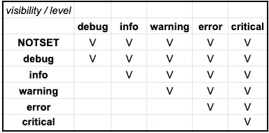

# 日志级别

> 原文：<https://towardsdatascience.com/levels-of-logs-a261a0f291a2?source=collection_archive---------35----------------------->

## 解释并举例说明日志级别


图片由 [Yusud Evil](https://unsplash.com/@yusufevli) 在 [Unsplash](https://unsplash.com)

这是一篇附录文章，写在文章[记录你的心流](https://medium.com/@naomikriger/log-your-flow-392d0d399127)之后。
本文的目的是总结和举例说明我们在代码中使用的不同日志级别。

下面解释的级别按严重程度升序排列。
当我们读取日志时，我们可以公开所需的严重性级别。暴露一个特定的严重级别——也暴露给我们，读者，更高的级别。
因此，例如，如果我们选择“信息”级别，我们也会看到警告&错误&严重。如果我们选择“关键”级别，这将是我们看到的唯一日志级别日志读取系统。



作者捕获

下面的解释附有例子。所有的例子都是汽车贷款申请系统。
系统检查客户是否有资格申请汽车贷款，如果有资格，系统将计算客户有资格申请的贷款金额。

# 调试

用于为开发人员、IT、技术支持等提供诊断信息。
回答“为什么会出现这个问题？”，“为什么会触发这种情况？”

```
**logger.debug(f'**Cannot offer the customer {customer_id} car loan — the customer is underage**')**
```

# 信息

这一级提供了“快乐流”中的信息，关于代码中发生的合法事件。

在一些公司中，这也是在生产中调试时可见的默认级别，因此被认为是生产调试中最“详细”的日志级别。

在这一级别，我们将提供我们希望了解的相关变更的信息。

```
**logger.info(f'**Customer {customer_id} — car loan application is approved. Loan amount is {loan_amount}**')**
```

# 警告

当我们可能在系统中发生错误时，这是相关的。错误可能会再次出现或被独立解决，但系统的关键功能/流程工作正常。

```
**logger.info(f'**Customer {customer_id} — car loan application is approved. Loan amount is {loan_amount}**')****logger.warning(f'**Customer {customer_id} — approval notification failed. Retrying to notify the customer**')**
```

# 错误

一种干扰正常操作但不干扰应用程序本身的错误。这些错误将需要开发人员/ IT /客户采取额外的步骤来解决问题，但这些步骤不包括重启应用程序等重大干预。

```
**logger.error(f'**Customer {customer_id} — eligibility for car loan cannot be processed. Bank statements provided by the customer are empty**')**
```

# 批评的

一种严重错误，需要关闭/重新启动应用程序，以防止进一步的损坏，如数据丢失或额外的数据丢失。

```
**logger.critical(f'**Connection to DB is lost at {datetime.datetime.now()}**')**
```

# 例外

当我们浏览日志时，读取异常的堆栈跟踪也是我们调试过程的一部分。

虽然“错误”日志级别存在并且在许多情况下使用，但我们需要考虑到，除非另有定义，否则错误日志的使用不会打印我们的错误位置。但是一个异常的堆栈跟踪会。

这可以通过以下方式完成:

```
**def dividing_by_zero(a):** try:
        a / 0
    except ZeroDivisionError:
        logger.exception**('**my exception message**')**>>> **dividing_by_zero(2)***ERROR:__main__:my exception message
Traceback (most recent call last):
    File "/Users/my_user/my_repo/my_module/my_file.py", line 12, in* dividing_by_zero *1 / 0
ZeroDivisionError: division by zero*
```

## 脚注

这篇文章是从“Pythonic 的观点”写的。当用其他编程语言编写日志时，您可能会意识到一些差异。例如，“严重”可以替换为“致命”，或者可以使用其他日志级别，如“跟踪”。

涵盖 Python 中的日志与其他语言中的日志之间的所有差异超出了本文的范围，但是我将简要解释一下“跟踪”级别:

“Trace”用于指示代码中的“我们在哪里”,其严重性级别低于“info”。例如，我们在代码中进入了一个重要的“if”或“else”语句，输入了一个特定的函数，等等。

```
**logger.trace(f'**Customer {customer_id} — starting to calculate average bank balance in the past {MONTHS_TO_CHECK} months based on bank statements**')**
```