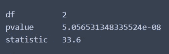

# 导航统计测试

> 原文：<https://towardsdatascience.com/levels-of-measurement-statistics-and-python-implementations-8ff8e7867d0b?source=collection_archive---------4----------------------->

## 快速参考指南；统计测试

# 介绍

假设您正在进行探索性的数据分析，或者决定特征工程的变量。但是，您不能确定变量组之间是否存在显著差异，以确认特定假设或保证变量用于建模。更糟糕的是，您可能要努力使用合适的测试。听起来很熟悉？

事实上，这篇文章的主要驱动力来自于努力加深理解并记下一些常用的统计方法及其应用背景以供将来参考。对于每种方法，概述如下

*   统计检验简介
*   使用虚拟数据的工作示例
*   结果的解释
*   讨论用例(如果有的话)和实现中的变化。


丹·梅耶斯在 [Unsplash](https://unsplash.com?utm_source=medium&utm_medium=referral) 上的照片

使用哪种类型的统计检验受变量的测量水平影响。变量可以是:

*   数值(测量可以是离散的或连续的；间隔或比例)
*   分类(测量是离散的；名义的或顺序的)

*注:*

*   *标称——测量级别中没有等级序列。*
*   *序数——在测量级别中有特定的顺序。*

考虑到自变量(预测值)和因变量(目标值)，统计检验可以这样安排:


统计测试的类型，按相应的变量类型排列|按作者排列的图片

# 示例和代码实现

```
# Import libraries
import pandas as pd
import numpy as np
import random
import scipy.stats as stats
import statsmodels.api as sm
import statsmodels.stats.contingency_tables as ct
from statsmodels.graphics.gofplots import qqplot
from statsmodels.stats.weightstats import ztest
import matplotlib.pyplot as plt 
plt.style.use('default')
plt.style.use ('seaborn-darkgrid')
```

# 卡方检验

独立性卡方检验确定两个**分类变量(即名义变量或顺序变量)(具有两个或更多互斥组)之间是否存在显著关系。**因此，零假设是两个变量之间不存在关系。

*   非参数化；不需要关于人口参数的假设
*   比较各组之间人口比例的差异
*   需要观察值的列联表。

这是表明变量是否相关(即相关)的测试。如果它们相关，我们可以使用**φ系数**来进一步确定相关的**强度。**

卡方检验对样本大小很敏感(即渐近)

*   随着样本量的增加，绝对差异在期望值中所占的比例越来越小。
*   结果是，如果样本量小，强关联可能不会出现。
*   在大样本量中，统计显著性可能会出现，但相关性并不显著(即非常弱)

## *卡方示例 1*

根据这些数据，肥胖和糖尿病之间有什么联系吗？

```
# Create contingency table 
OD = pd.DataFrame({'notObese': [173, 259],
                   'Obese' : [27, 61]},index ={'nonDiabetic','Diabetic'})
OD
```


作者图片

```
# chi-square test
chiRes = stats.chi2_contingency(OD)# Details
print(f'chi-square statistic: {chiRes[0]}')
print(f'p-value: {chiRes[1]}')
print(f'degree of freedom: {chiRes[2]}')
print('expected contingency table') 
print(chiRes[3])
```


卡方检验结果|图片由作者提供

结果解释:

当 p 值大于 0.05 时，我们无法拒绝零假设(H0:两个变量之间没有关系)。肥胖与糖尿病无关。如果零假设为真，期望列联表显示期望值。可以从预期列联表的值(如果肥胖与糖尿病密切相关)和初始列联表的值之间的差异来检查细节。

## 卡方示例 2

给定数据，性别和眼睛颜色有关系吗？

```
# Create the contigency table
GE = pd.DataFrame({'Blue' :[370, 359],
                   'Brown':[352, 290],
                   'Green':[198, 110],
                   'Hazel':[187, 169]},index={'Female','Male'})
GE
```


作者图片

```
# chi-square test
chiRes2 = stats.chi2_contingency(GE)# Details
print(f'chi-square statistic: {chiRes2[0]}')
print(f'p-value: {chiRes2[1]}')
print(f'degree of freedom: {chiRes2[2]}')
print('expected contingency table') 
print(chiRes2[3])
```


卡方检验结果|图片由作者提供

```
# An alternative approach usng stats model api to derive expected table
# statsmodel table object
table = sm.stats.Table(GE)
table.fittedvalues
```


期望值的列联表|作者图片

```
# Can derive the direction of change between initial and expected table
# resid_pearson method returns a table of residuals
# positives - more observations than expected
# negatives - less observations than expected
table.resid_pearson
```


初始表格和预期表格之间的变化方向|作者图片

结果解释:

p 值小于 0.05，我们拒绝零假设(H0:两个变量之间没有关系)。在初始列联表和期望列联表之间，性别和眼睛颜色是相互依赖的。

# 克莱姆氏 V

用于确定分类变量之间关系的强度。假设 p 值较低，将讨论返回到卡方；存在相关性(变量之间具有统计显著性的相关性)。克莱姆 V 有助于表明这种依赖的强度。在统计显著性卡方可能是大样本量的结果而不是变量之间的实质性关系的情况下将是有用的。

*   对大样本量稳健
*   比较两个分类变量之间的关系强度
*   每个类别的变量应该有两个或更多的唯一值
*   如果**只有两个唯一的测量水平**，则与**φ系数**相同
*   系数的范围从 0 到 1

## 克莱姆 V 例 1

性别和眼睛颜色之间的关联(即依赖)强度是多少？

```
# chi-square test
print(f'chi-square statistic: {chiRes2[0]}')
print(f'p-value: {chiRes2[1]}')
# chi-square test statistic (alternative method to derive chi-sq stat)
chisq_stat = stats.chi2_contingency(GE, correction=False)[0]
# sample size
n = np.sum(np.sum(GE))
# minimum of rows & columns
minshape = min(GE.shape)-1
# Cramer's v
V_ = np.sqrt( (chisq_stat/n)/minshape)
print(f"Cramer' V: {V_}")
```


克莱姆的 V 结果|作者图片

结果解释:

p 值小于 0.05，我们拒绝零假设(H0:两个变量之间没有关系)。看克莱姆的 V，依赖的强度低。

# Phi 系数

*   比较两个分类变量之间的关系强度
*   变量只有两个独特的测量水平
*   系数的范围从 0 到 1

## Phi 系数示例 1

性别和眼睛颜色(仅棕色和绿色)之间的关联强度(即依赖性)如何？

```
# Phi coefficient; two by by contigency table
GEsubset = GE.drop(columns=['Blue', 'Hazel'])
GEsubset
```


2 x 2 列联表|作者图片

```
chiRes3 = stats.chi2_contingency(GEsubset)# chi-square test
print(f'chi-square statistic: {chiRes3[0]}')
print(f'p-value: {chiRes3[1]}')# chi-square test statistic (alternative method to derive chi-sq stat)
chisq_stat = stats.chi2_contingency(GEsubset, correction=False)[0]# sample size
n = np.sum(np.sum(GEsubset))
# minimum of rows & columns
minshape = min(GEsubset.shape)-1
# Phi
Phi_ = np.sqrt( (chisq_stat/n)/minshape)
print(f"Phi Coefficient: {Phi_}")
```

结果解释:

p 值小于 0.05，我们拒绝零假设(H0:两个变量之间没有关系)。查看 Phi 系数，依赖的强度较低。

# 曼恩-惠特尼大学

也被称为曼·惠特尼·威尔科克森检验或威尔科克森秩和检验。

*   当**因变量为顺序变量或连续变量**、&、**非正态分布**时，比较两个变量之间的差异。
*   **自变量应该由两个分类的独立组组成**。

## Mann-Whitney U 示例 1

鉴于数据不是正态分布，有海鲜的拉面和无海鲜的拉面评分有区别吗？

```
# create dataframe
# for 'hasSeafood', 1 stands for noodles with seafood.
ramenRating = pd.DataFrame({'hasSeafood':[1,1,1,0,0,0,1,0,1,0,1,0],
                            'Stars':[5.0,2.5,1.5,3.5,4.75,3.0,4.0,3.0,3.0,2.75,1.0,1.0]})
ramenRating
```


选择拉面评分数据|作者图片

```
# mann-whitney u test
stats.mannwhitneyu(x=ramenRating['hasSeafood'],
                   y=ramenRating['Stars'])
```

结果解释:

p 值小于 0.05，我们可以拒绝含有海鲜的面条和不含海鲜的面条之间评级没有差异的零假设。

# 麦克内马试验

确定是否存在统计上显著的**差异**(注意:不是依赖性！)在**成对的分类变量或二分类变量**之间。这使它不同于独立性的卡方检验。

*   非参数
*   测量变量组之间的差异
*   受限于 2×2 表(即卡方检验的列联表可能是 n×2，取决于变量中的序数组)。
*   提示:要应用测试，请以嵌套数组的形式输入数据

## Mc nemar 的测试示例 1

服用特定测试药物前后的疼痛缓解有区别吗？

```
# Create table
Med = pd.DataFrame({'postMedpain_No': [400, 800],
                    'postMedpain_Yes' : [10, 40]},index={'priorMedpain_No','priorMedpain_Yes'})
Med
```


作者图片

```
# convert to array
frame = Med.to_numpy()
frame
```


作者图片

```
# McNemar's Test
print(ct.mcnemar(frame, exact=False))
```


Mc nemar 的测试结果|作者图片

结果解释:

p 值小于 0.05 时，用药前后出现疼痛的患者数量存在统计学差异。

# 科克伦 Q 检验

麦克内马检验的扩展。如果变量只有两个唯一值，则科克伦的 Q 检验与麦克内马的检验相同。

检验的无效假设是不同治疗的成功概率在人群中是相同的。如果无效假设被拒绝，建议进行事后分析。这是因为虽然我们只能推断出各组之间的比例存在差异，但科克伦的 Q 检验并不能说明哪些特定的组是不同的。

*   因变量是二分的。
*   独立变量是分类变量，有三个或更多的**相关的**组。相关组是允许的，因为在同一因变量上多次测量时，每个组中可能有相同的测试对象。
*   这些病例是从人群中随机抽样的。
*   样本量足够大。根据经验，回答不全是 0 或 1 的受试者人数 n 应≥ 4，nk 应≥ 24。这对于精确的二项式麦克纳玛检验是不需要的。

***补充说明*** :在 Python 中，Cochran 的 Q 测试实现的一个经常被忽视的方面是，要传入的数据格式和结构需要与数据记录中出现的一样；不在列联表格式中。

## 科克伦的 Q 测试示例 1

在随后的 3 个疗程中，抑郁症的情况有所不同吗？

```
# three columns for 3 sessions
# 1 represents depression
# 0 represents no more depression

cases = np.array([[0, 0, 0],
                  [1, 0, 0],
                  [1, 1, 0],
                  [1, 1, 1]])

count = np.array([ 6,  16, 4,  2])
data = np.repeat(cases, count, 0)# Cochran's Q Test
print(ct.cochrans_q(data))
```



科克伦的 Q 测试结果|作者图片

结果解释:

在 p 值小于 0.05 的情况下，在不同次数的会话之间，经历抑郁和没有抑郁的患者批次存在统计学差异。

# 点双列相关

*   用于衡量关联的强度和方向
*   **之间连续的** & **分类的**变量

## 点-双列相关示例 1

考试成绩和是否为考试而学习之间的联系有多大？

```
# initialize random number generator
random.seed(36)
# Assume y is studied (1)/ not studied (0) 
# X is the test score, max 20 marks
y = [random.randint(0, 1) for num in range(0, 10)]
print(f'y values: {y}')X = []
for i in y:
    if i != 0:
        ele = random.randint(11, 20)        
    else:
        ele = random.randint(1, 10) # 1-10 not studied
    X.append(ele)
print(f'X values: {X}')
```


虚拟 X 和 y 值|作者图片

```
# point-biserial correlation
# output is a tuple
result = stats.pointbiserialr(X, y)
print(f'correlation between X and y: {result[0]:.2f}')
print(f'p-value: {result[1]:.2g}')
```


作者图片

结果解释:

p 值小于 0.05 时，我们拒绝零假设。x 和 y 是依赖的；它们之间有着紧密的联系。

# 方差分析

*   比较多个独立变量组中连续度量的方差
*   **分类&连续变量**
*   可以是单向或双向方差分析
*   单因素方差分析适用于变量包含三个或更多独立测量水平的情况。

## 方差分析示例 1

三个排名在收入上有显著差异吗？

```
# Create a dataframe with artifical values
# Sector Ranking, SR1 to SR9, SR1 ranked highest (more than 3 groups)
# Salary; continuous variableSRs = ['SR1', 'SR9', 'SR2', 'SR8', 'SR3', 'SR7', 'SR4', 'SR6', 'SR5',
       'SR1', 'SR9'] 
Salary = [10000, 5000, 8000, 5500, 7500, 6000, 7000, 6500, 6800,
          11000, 5100]
rawData = pd.DataFrame({'ranks':SRs,
                        'sal':Salary })
```


工资到排名数据|作者图片

```
# derive the groups (i.e. sector ranks)
groups = pd.unique(frame.ranks.values)# Create a dictionary to hold respective salary of sector rank groups
statData = {grp: rawData['sal'][rawData['ranks'] == grp] for grp in groups}stats.f_oneway(statData['SR1'], statData['SR2'], statData['SR9'])
```


onewayAnova 结果|作者图片

结果解释:

零假设被拒绝，p 值小于 0.05。所分析的各级别之间的收入差异很大。

# z 检验

*   比较两个样本的均值是否不同
*   如果样本量小于 30，则不使用
*   假设样本是独立的；遵循正态分布
*   均值可能未知，方差已知

## z 测试示例 1

两个业务组的平均工资有区别吗？

```
# create dataframe of salary(K) for 2 business groups
np.random.seed(123)
marketing = np.random.normal(106,2,40) # mean 106, std dev 2, sample 40
finance = np.random.normal(108,1,40) # mean 108, std dev 1, sample 40
marketingLst = marketing.tolist()
financeLst = finance.tolist()
salData = pd.DataFrame({'marketing':marketingLst, 
                        'finance':financeLst})print('marketing median sal:', salData['marketing'].median(), '\n' 
      'finance median sal:', salData['finance'].median())
```


作者图片

```
# combine the 2 lists to get overall salary distribution
marketingLst.extend(financeLst)
salFrame = pd.DataFrame(marketingLst,columns=['salary'])# check normality
fig, ax = plt.subplots(figsize=(4,4))
qqplot(salFrame['salary'], fit=True, line='s',ax=ax)
plt.show()
```


工资数据 QQ plot |作者图片

如果大多数点都在红线内，则分布是正常的。两端有轻微的歪斜。工资大部分是正常分配的。z 检验适用于正态分布的数据。

```
# ztest
# z-score, p-value
zScore, pValue = ztest(salData['marketing'], salData['finance'])
print('zscore:', zScore, 'p-value:', pValue)
```


z 测试结果|作者图片

结果解释:

零假设被拒绝，p 值小于 0.05。两组的平均工资有显著差异。

# t 检验

*   类似于 z 检验，但适用于样本量小于 30 的情况
*   如果样本量很大，z 检验和 t 检验之间的差别很小
*   假设样本服从均值和方差未知的正态分布
*   一个样本 t 检验将平均值与总体值进行比较
*   如果两个样本的平均值相等，则进行两个样本 t 检验
*   通过等方差 t 检验和非等方差 t 检验(即韦尔奇检验)来区分

## t 检验示例 1(单样本)

营销组平均工资和公司平均工资有区别吗？

```
# Create the data (2 sets of test scores)
np.random.seed(42)
marketing2 = np.random.normal(106,2,20) # mean 106, std dev 2, sample 20
finance2 = np.random.normal(108,2,20) # mean 108, std dev 1, sample 20# Normality can be checked by shew and kurtosis besides qqplot
# For normally distributed data, the skewness should be about zero.
print('marketing2 skew:', stats.skew(marketing2), '\n'
      'finance2 skew:', stats.skew(finance2))
# value of kurtosis measure for normal distr is 3
print('marketing2 kurtosis:', stats.kurtosis(marketing2), '\n'
      'finance2 kurtosis:', stats.kurtosis(finance2))
```


作者图片

```
# 1 sample t-test, tests population mean salary 106
stats.ttest_1samp(a=marketing2, popmean=106)
```


作者图片

结果解释:

p 值大于 0.05，无法拒绝总体平均工资为 106 的零假设。

## t 检验示例 2(双样本；相似方差)

两组的平均工资有差别吗？

```
# check if variance similar
np.var(marketing2)/np.var(finance2)
```


作者图片

方差比小于 4:1 时，执行 t 检验，否则，执行韦尔奇 t 检验(即，将 equal_var 设置为 False)。)

```
# Can assume equal variance
stats.ttest_ind(a=marketing2, b=finance2, equal_var=True)
```


作者图片

## t 检验示例 2(双样本；不等方差)

两组的平均工资有差别吗？

```
# Create the data (2 sets of test scores)
np.random.seed(123)
marketing3 = np.random.normal(108,2.5,20) # mean 90, std dev 2.5, sample 20
finance3 = np.random.normal(108,1,20) # mean 108, std dev 1, sample 20# check if variance similar
np.var(marketing3)/np.var(finance3)
```


作者图片

方差比大于 4:1 时，执行韦尔奇 t 检验(即，将 equal_var 设置为 False。)

```
stats.ttest_ind(a=marketing3, b=finance3, equal_var=False)
```


作者图片

结果解释:

p 值大于 0.05，无法拒绝两个薪金均值相等的零假设。

# 皮尔逊相关

相关系数给出了两个变量之间线性关系的度量。如果使用。corr() via pandas，默认的关联方法是 Pearson。

*   负一比一的范围(分别为负相关和正相关)
*   计算相关系数的公式将变量标准化，**标度或测量单位的变化不会影响其值**。

**皮尔逊相关**是衡量两个连续变量之间线性关系的强度和方向。它依赖于四个关键假设:

*   数据是区间或比值。这些类型的连续数据对于相关性如何假设变量中的值是相关的非常重要。序数或分类变量编码不起作用。
*   皮尔森只处理线性数据。
*   数据中没有异常值。
*   数据呈正态分布。
*   数据必须是同质的。同方差假设数据在回归线周围均匀分布

**Spearman 相关性**是非参数的。它依赖于几乎所有与皮尔逊相同的假设，但它不依赖于正态性。一个变量的分数必须与另一个变量单调相关。可用于成对的**连续**(不遵循线性关系)或**顺序**变量。

**肯德尔等级相关性**是非参数的。它衡量两个变量之间的依赖程度。它可以用于顺序数据或连续数据。

**效果强度** : Cohen 的标准可应用于该系数，以确定效果的强度。


效果强度表|作者图片

## 皮尔逊相关性示例 1

连续变量 X1，X2 和 y 之间的相关性是什么？

```
X1 = [500,400,300,200,100]
X2 = [200,400,600,800,1000]
y = [100,200,300.5,400,500.5]
df = pd.DataFrame({'X1':X1,
                   'X2':X2,
                   'y' :y})
# correlation matrix
df.corr()
```


作者图片

结果解释:

假设 y 指的是房屋销售价格、X1 Sibor 利率和距离城市的 X2 距离(km)。从系数来看，X1 与 X2 和 y 呈强负相关，X2 与 y 呈强正相关

# 配对 t 检验

*   确定成对的连续变量之间是否存在统计上的显著差异。
*   两个相关样本之间(如前后测试分数)
*   测试变化倾向于正向还是负向

## 配对 t 检验示例 1

期中和期末考试成绩有显著差异吗？

```
# compare the two test scores for each individual student.
# create two score samples; one mid-term exam, the other end-of-term exam
np.random.seed(123)
midTerm = np.random.normal(59.45, 1.5, 100)
endTerm = np.random.normal(60.05, 1.5, 100)
# Paired (related) test
t,p = stats.ttest_rel(endTerm, midTerm)
# ttest_rel is 2-tailed, so half the resulting p-value to get a 1-tailed p-value
p1 = '%f' % (p/2)
print("t-statistic:" + str(t))
print("p-value:" + str(p1))
```


配对 t 检验结果|作者图片

结果解释:

p 值小于 0.1 (90% CI)时，我们拒绝零假设。两次考试成绩有显著差异。

目前就这些。希望这是一个有用的入门/指南，帮助你完成各种统计测试。

## 参考

进一步阅读变量和统计方法的简明资源:[http://web.pdx.edu/~newsomj/pa551/lectur23.htm](http://web.pdx.edu/~newsomj/pa551/lectur23.htm)

2021 年 7 月:初稿

2021 年 10 月 26 日:更新了新的测试，纠正了打字错误