# 利用 AWS 管道支持 DevSecOps

> 原文：<https://towardsdatascience.com/leverage-aws-pipelines-to-enable-devsecops-e671e710a9f9?source=collection_archive---------17----------------------->

## 使用 AWS CDK 创建安全的 CI/CD 管道，并在部署前扫描代码。

作为 AWS 的前安全顾问，我经常被问到类似这样的问题:“我们如何确保 T2 的 CI/CD 管道是安全的，我们如何在应用部署之前验证安全性？”像任何 CI 工具如 Jenkins 和 AWS 代码管道；您可以为您的用例添加安全分析器。

但是如何保护管道基础设施和堆栈本身呢？一种方法，至少如果你使用 AWS，是利用基础设施作为代码( [IaC](https://aws.amazon.com/cloudformation/) )技术让管道自部署并评估它自己的部署。

我们将学习如何利用 AWS CDK 框架来部署 CI/CD 管道，该管道将检查其自身的堆栈配置，部署一个示例 Lambda，这取决于它是否通过了流程中的安全检查。你准备好了吗？让我们开始吧。

先决条件:首先跟我来抢锅炉板块代号[这里](https://github.com/dc401/AWS-CDK-SecurePipeline/blob/main/demo_cdkapp_withdependecies.zip)。确保您至少安装并配置了以下内容:

*   AWS [CDK](https://aws.amazon.com/cdk/)
*   AWS [CLIv2](https://aws.amazon.com/cli/)
*   AWS [IAM 键](https://docs.aws.amazon.com/cli/latest/userguide/cli-services-iam-create-creds.html)或 SSO
*   [Python 3](https://www.python.org/downloads/)
*   [VS 代码](https://code.visualstudio.com/)或兼容的 IDE
*   [Git](https://git-scm.com/downloads)

*建筑概述*

CI/CD 管道将包括用于 lambda 示例应用程序静态代码分析的[代码提交](https://aws.amazon.com/codecommit/)、[代码管道](https://aws.amazon.com/codepipeline/)、[代码构建](https://aws.amazon.com/codebuild/)、 [Bridgecrew](https://github.com/bridgecrewio/checkov) 、可选的 [Bandit](https://github.com/PyCQA/bandit) 的自动化实践，以及部署我们的 lambda 应用程序之前的手动批准阶段:

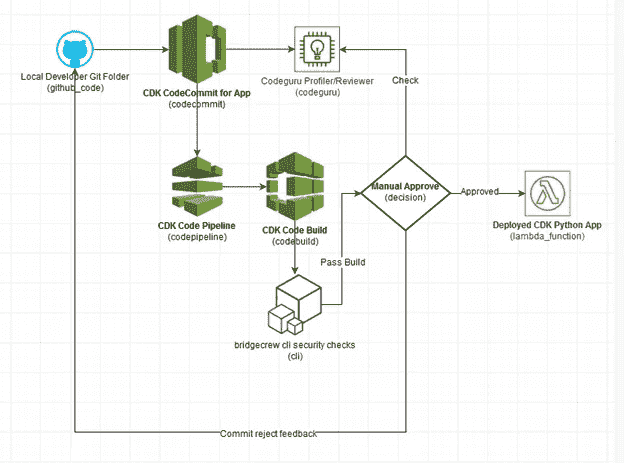

我们将建立的 CI/CD 管道图

*部署说明*

请在克隆 repo 后遵循“README.md”文件或下载[文件](https://github.com/dc401/AWS-CDK-SecurePipeline/blob/main/demo_cdkapp_withdependecies.zip)。确保您已将 repo 或 zip 文件提取到一个空的暂存文件夹中。自述文件包含原始语法步骤。要获得这方面的指导，请继续阅读本节。如果您不需要引导式演练，请跳到下一节查看代码亮点和解释。

解压缩 zip 文件或将克隆的存储库复制到临时文件夹中。不要将其命名为 demo_cdkapp:

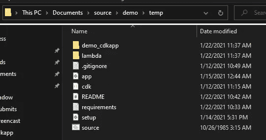

解压缩的 demo_cdkapp.zip 文件夹

在 temp 文件夹的相邻目录中，创建一个名为“demo_cdkapp”的新文件夹。这将是我们初始化 CDK 解决方案的地方:

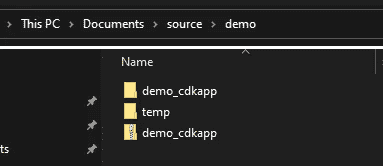

创建一个新文件夹，将您的 CDK 项目命名为 demo_cdkapp

打开终端，导航到空的“demo_cdkapp”路径，然后运行以下命令:

```
cdk init --language python
```

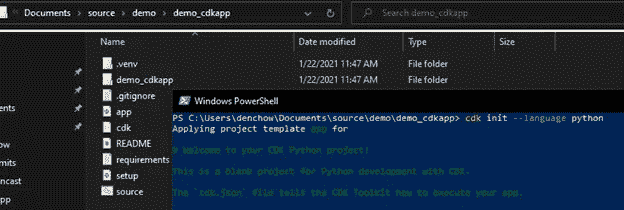

在新文件夹中初始化 cdk 项目的输出示例

CDK 现在为 Python 虚拟环境创建了框架初始化文件。从您创建的“temp”文件夹中复制解决方案，并在需要时替换文件。比如 requirements.txt，README。MD 等:

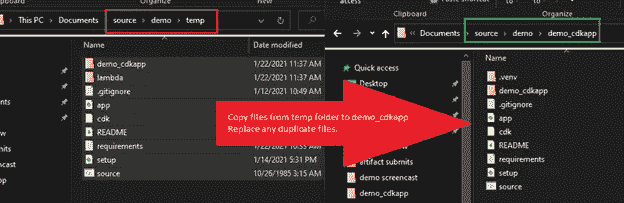

确保您的 CDK 框架文件位于正确的目录中

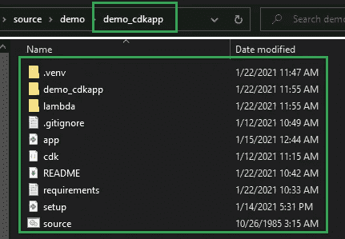

框架在目录中生成的新 CDK 文件的屏幕截图

使用适当的语法和激活脚本激活 Python 虚拟环境并设置依赖项。在 Windows PowerShell 中，这是通过以下方式调用的:

```
. .\.venv\Scripts\Activate.ps1
pip install -r .\requirements.txt
```

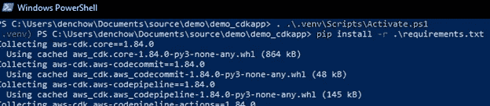

为 CDK 激活虚拟环境的输出

或者，您现在可以通过键入以下内容在 IDE(如 Microsoft VSCode 2019)中打开您的解决方案文件夹:

```
code .
```

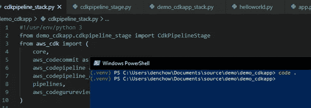

您可以看到您下载的样板示例提供的示例代码

确保代码中没有语法或其他错误，以防您可能通过执行“cdk ls”意外修改了 Python 堆栈文件。您应该会看到一个名为“CdkPipelineStack”的堆栈。我们需要引导 CDK，创建 IAM 资源，包括角色和 S3 存储桶，以便能够将我们的解决方案加载到客户中:

```
cdk ls
cdk bootstrap --cloudformation-execution-policies arn:aws:iam::aws:policy/AdministratorAccess
```

免责声明:请注意，这仅用于演示目的。在实际部署或利益相关方现场演示期间，您应该实践最佳实践，并使用权限最小的自定义执行策略，或者在将来使用 CDK 支持的替代策略或配置文件构造。

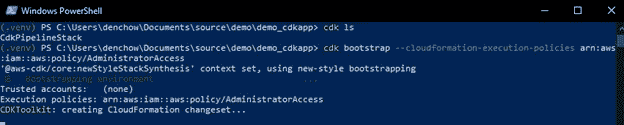

成功时的命令输出示例

现在我们必须部署我们的管道。运行“cdk 部署”,以便构建我们的 CI/CD 管道基础设施。将要求您确认更改，因为将创建新的角色和与安全相关的更改。按“y”确认:

```
cdk deploy
```

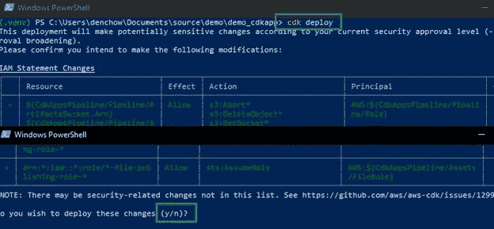

cdk 部署和确认提示的输出示例

一旦完成，预计会看到管道处于失败状态。这是因为我们还没有将任何内容推送到我们即将建立的 CodeCommit repo:

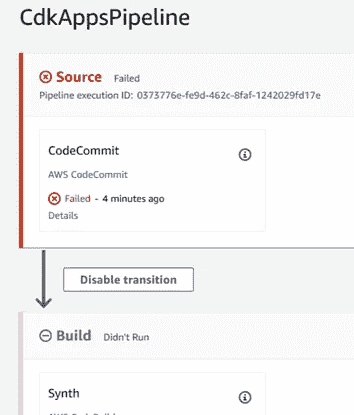

登录到您的 AWS 帐户，注意代码管道状态

初始化将被推送到 CodeCommit 的本地 git repo 目录。运行以下命令:*git init；git add-A；git commit -m '初始化'*。成功的提交和回购将返回:

```
git init; git add -A; git commit -m 'initialize'
```

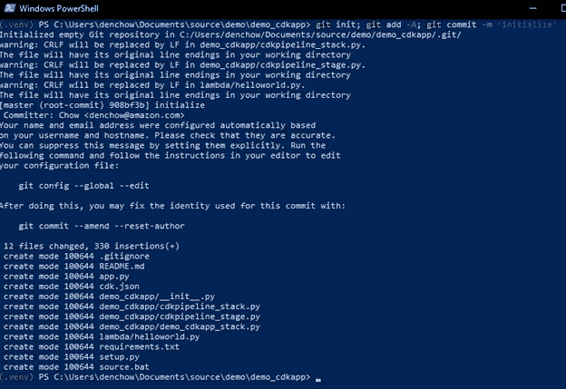

成功提交到代码提交存储库的 git 输出示例

确保您已经在 IAM 中为 CodeCommit 创建了 HTTPS Git 凭据。下载或保存它们，因为在推送至克隆 URL 时会用到它们:

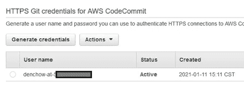

首先需要配置代码提交 Git URL

现在您需要设置您的 Git 克隆 HTTP/S URL，它是用 CodeCommit 的 repo 创建的。注意:如果您在代码中重命名或修改了回购名称，请相应地更新 URL:

```
git remote add origin https://git-codecommit.us-west-2.amazonaws.com/v1/repos/demo_cicid_pipeline_repo
git push --set-upstream origin master
```

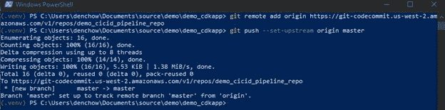

代码提交报告成功部署的输出

*验证应用和云架构堆栈安全性*

一旦您成功部署了 CI/CD 管道并执行了首次代码提交，您仍然会有一个“按原样”的失败构建状态管道，这是意料之中的。您需要更正有问题的不安全代码才能通过构建。现在是时候纠正不安全的代码，并演示我们的 Lambda 示例应用程序的成功构建和部署了。

打开 CodePipeline 并访问最近失败的构建阶段。单击详细信息，并按照执行链接进行操作:

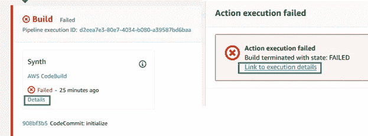

最初为代码管道生成失败状态

向下滚动日志，直到找到与 Lambda 函数的 Bandit 验证相关的测试结果错误，违规行包括 **helloworld.py** 中的第 6 行和第 9 行:

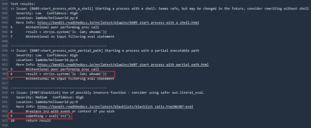

AWS CodeBuild 部署失败，因为来自 Bandit 检查的不安全代码

返回到您首选的编辑器或 IDE，将第 4 行中的 print 语句修改为结果变量。注释掉有问题的第 6 行和第 9 行。以下应该是您更新后的代码:

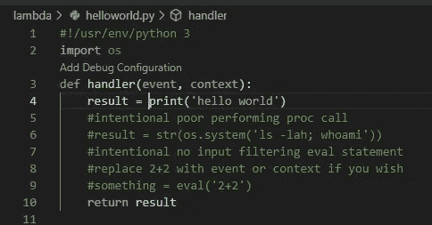

代码现在可以通过注释掉 helloworld.py 中有问题的不安全代码来通过

确保您已经在 IDE 或代码编辑器中保存并暂存了所有更改。对于 VSCode，它位于左侧，您需要在保存文件后单击菜单中的“+”按钮:

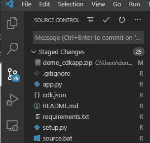

确保您的阶段性更改在 VS 代码中提交

回到终端，通过运行“git status”确保正确跟踪更改，然后通过运行以下命令提交和推送更改:

```
git status
git commit -am 'secured lambda code'; git push
```

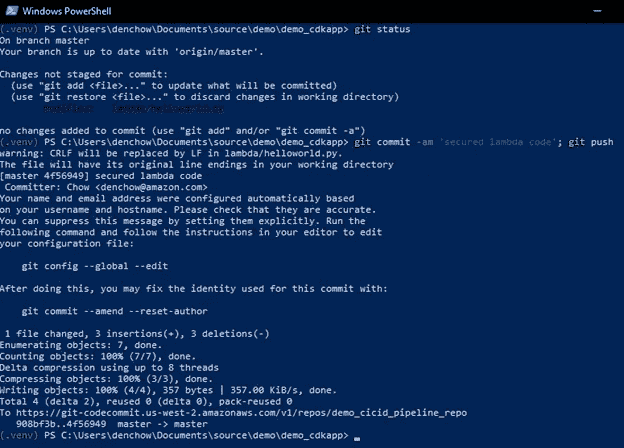

关于新 git 提交更改的命令输出

返回 web 控制台并检查代码管道，然后等待构建成功。它将贯穿更新其他阶段，并进入部署阶段。在部署阶段，我们已经在部署之前设置了手动合并审查，作为最佳实践完成。这将需要 3-5 分钟。打开一个新标签，探索 [*代码大师*](https://aws.amazon.com/codeguru/) 的概念。

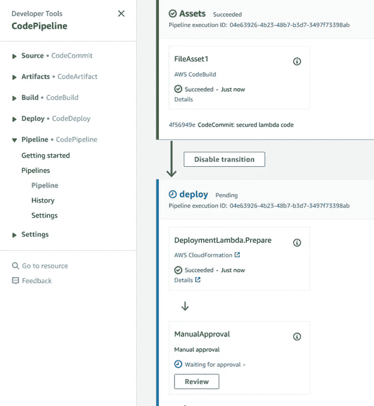

代码管道为部署阶段传递新的安全 lambda 代码

当管道处于“等待批准”状态时，作为代码审查最佳实践的一部分，您可以选择通过设置事件通知和 SNS 主题向电子邮件开发人员发送合并请求。

在 CodeGuru 中打开一个新的选项卡，并展开 Profiling Groups 部分，这样您就可以看到建议了。单击“{ code guru } DemoProfilingGroup-with issues”并显示性能建议，其中显示了代码中最“昂贵”的部分:

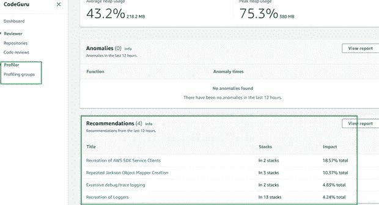

AWS CodeGuru 分析 lambda 函数的性能

接下来，浏览代码评审部分，点击“Create Repository Analysis ”,指向我们的演示 repo，将主分支作为目标。这将需要几分钟的时间，因此在现场演示期间，最好提前运行，或者将您的注意力转移到批准代码合并上:

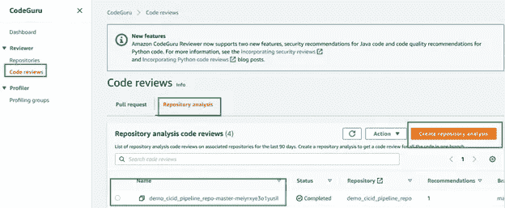

CodeGuru 允许您查看 helloworld.py lambda 建议的状态

在对 Codeguru 结果进行满意的审查之后，返回到代码管道并批准部署操作。这将需要 1-2 分钟:

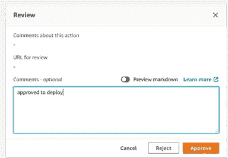

手动批准管道以开始部署到 AWS 帐户

由于 Lambda 函数正在进行部署，我们还可以编辑管道堆栈代码，并尝试将未加密的 AWS SQS 服务添加到我们的环境中。返回代码编辑器或 IDE。打开解决方案文件夹中的 **'cdkpipeline_stack.py** '文件夹。向下滚动并取消注释 SQS 的构造。在编辑器中保存并暂存您的更改:

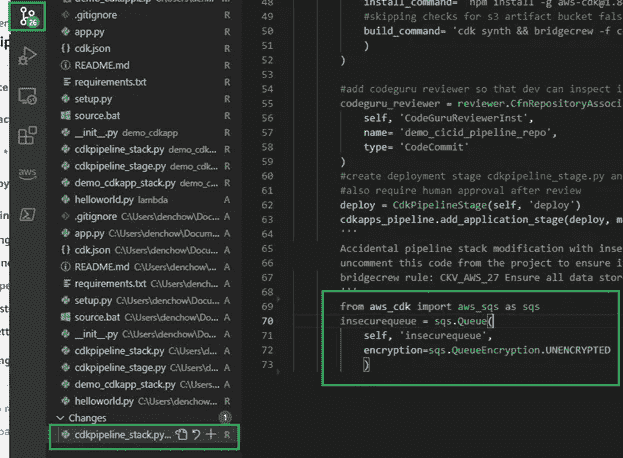

编辑您的管道，将未经授权的配置添加到您的 CDK 堆栈中

返回到终端，运行 git 提交和推送来启动管道触发的事件:

```
git commit –am 'added insecure SQS IaC'; git push
```

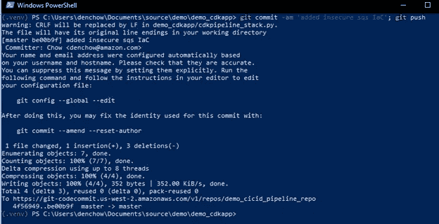

新代码提交和推送的输出

返回到 CodePipeline 页面，注意构建阶段正在进行，我们新的不安全基础设施作为代码堆栈，CDK 正在创建云结构变更集和更新。它会因为我们不安全的代码而失败。向下滚动，您应该会看到部署我们成功的 Lambda 函数的第一个按钮。

注意:您不必等到部署阶段才开始推送更多的提交更新。阶段可以有多个并行验证检查的操作:

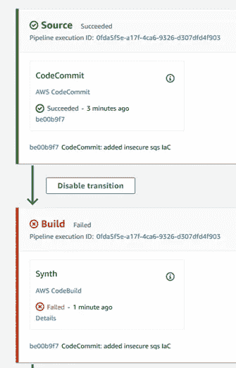

代码管道检测到不安全的 CI/CDstack 配置，导致构建失败。

不要被末尾的绿色所迷惑，增量是构建状态。从*之前的*部署来看，之前的阶段仍然是绿色的:

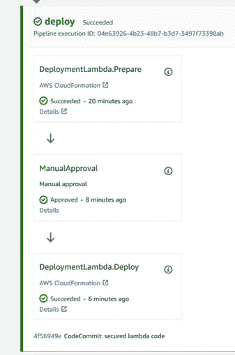

先前的构建和部署与您最近的更改无关

调查我们来自 CDK 的不安全的 SQS 构造代码推送的代码构建失败日志。向下滚动执行细节日志，您将看到由 CDK 生成的令人不快的云形成模板行以及失败的原因。APN 桥船员包注明这是检查 CKV_AWS_27:

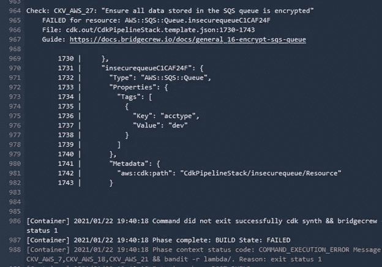

不安全的 SQS 尝试添加到 CI/CD 管道堆栈失败

或者，您可以在堆栈 Python 中再次重新注释与 SQS 相关的构造代码，演示另一个 commit，并再次推送以显示通过的管道状态。

*打扫卫生*

您将需要运行“cdk destroy ”,但也要删除 cdk 创建的 S3 存储桶，以及在我们成功部署期间创建的相关云形成堆栈。如果您需要演练，请执行以下步骤。如果它仍然打开，请关闭代码编辑器并返回到终端。运行“cdk destroy”并确认提示符为“y”:

```
cdk destroy
```

返回 CloudFormation 中的 AWS 控制台，删除 Lambda 部署应用程序堆栈和 CDKToolkit 引导堆栈:

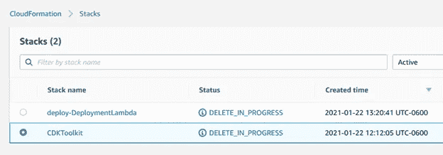

删除 CloudFormation 中的引导堆栈

现在删除 S3 工件桶和由 CDK 创建的引导桶。请注意，这些名称的前缀与我们的堆栈名称和我们所在地区的 cdk 引导后缀相关:

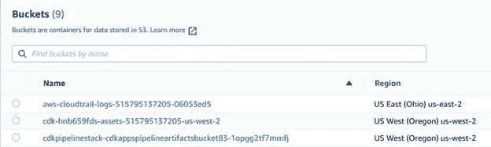

确保删除在 CDK 为您创建的 S3 引导存储桶

恭喜你。在 CDK 使用 boiler plate 代码，现在您可以使用 AWS 和第三方集成扩展创建自部署和安全的 CI/CD 管道。和往常一样，如果你觉得我的建议很有帮助，并且想要更多的咨询，请拨打[www.scissecurity.com](http://www.scissecurity.com)联系我

快乐*安全*发展！