# 利用地理位置数据进行机器学习:基本技术

> 原文：<https://towardsdatascience.com/leveraging-geolocation-data-for-machine-learning-essential-techniques-192ce3a969bc?source=collection_archive---------4----------------------->

## [实践教程](https://towardsdatascience.com/tagged/hands-on-tutorials)，直观地理定位系列

## 简明的地理空间数据特征工程和可视化指南

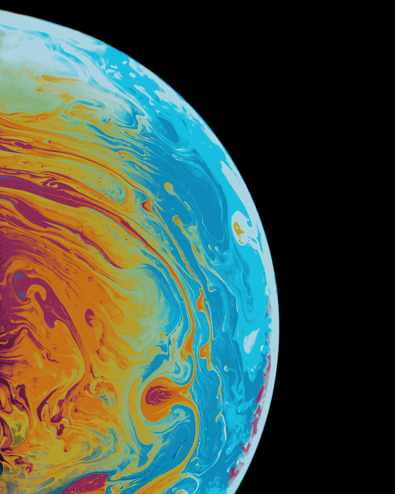

照片由[丹尼尔·奥拉](https://unsplash.com/@danesduet?utm_source=medium&utm_medium=referral)在 [Unsplash](https://unsplash.com?utm_source=medium&utm_medium=referral) 上拍摄

位置数据是许多机器学习应用程序中经常需要处理的一类重要数据。位置数据通常为您的应用程序数据提供许多额外的上下文。

例如，您可能希望根据您的客户数据来预测电子商务销售预测。机器学习模型可能能够通过考虑客户位置信息来识别更准确的客户购买模式。如果这是一个实体网站(而不是在线网站)，如零售店、餐馆、酒店或医院，这将变得更加重要。

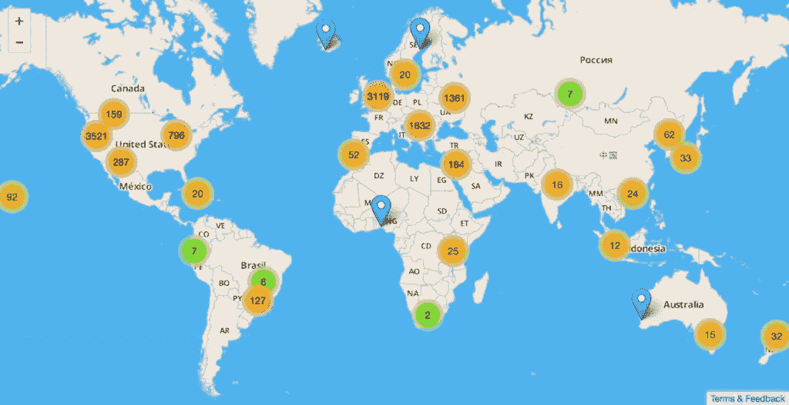

地理位置数据可以应用于一系列用例([来源](https://blog.mozilla.org/services/2013/10/28/introducing-the-mozilla-location-service/))

在本文中，我的目标是为机器学习应用程序提供处理地理位置数据的概述。这是一个很大的主题，所以我会试着让你对所涉及的问题有个大概的了解。在以后的文章中，我希望能更深入地研究这些特定的领域。

如果你对其他深度学习应用感兴趣，我有一些你可能会喜欢的其他文章。

1.  [图像字幕架构](/image-captions-with-deep-learning-state-of-the-art-architectures-3290573712db) *(具有图像特征编码器、序列解码器和注意力的多模态 CNN 和 RNN 架构)*
2.  [tensor flow 中带关注的图像字幕](/image-captions-with-attention-in-tensorflow-step-by-step-927dad3569fa)(Keras 和 Tensorflow 2.0 中带关注的编码器-解码器的*端到端示例*)

# **应用域数据(包括基本位置信息)**

与所有机器学习应用一样，我们从关于应用领域的数据集开始。关键是它还包含识别感兴趣的物理位置的信息，可以是地址的形式，也可以是地理坐标，如纬度或经度。

假设我们试图预测房地产价格。我们的数据集通常包含房子的信息(类型、年龄、面积等等)、价格，当然还有位置。这是结构化的表格数据。

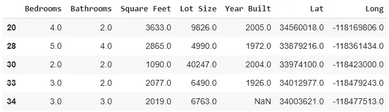

其他应用程序也可能使用其他类型的数据，例如图像。我们可能会使用卫星图像对农业(如预测粮食产量)、地质学(如最佳采矿位置)等应用进行预测。

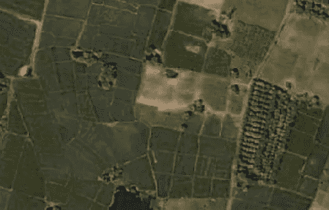

卫星图片(图片由作者提供)

显然，位置在决定这些预测时起着很大的作用。我们如何利用这一点？

# **地理空间数据(用于增强位置信息)**

我们可以通过添加外部的基于位置的数据(公开的或来自第三方的)来扩充我们的数据集。我将使用术语“地理空间数据”或“GIS 数据”来描述这一点，因为它包括与位置的地理环境相关的信息。

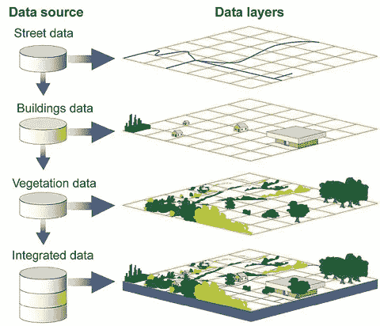

地理空间数据捕捉位置的基本地理属性([来源](https://upload.wikimedia.org/wikipedia/commons/thumb/7/73/Visual_Representation_of_Themes_in_a_GIS.jpg/679px-Visual_Representation_of_Themes_in_a_GIS.jpg)

对于我们的房地产应用程序，这可能是邻居信息、学校和公园的位置、城市行政边界、人口密度、地震或洪水区域以及任何数量的此类因素。

类似地，对于我们的卫星应用程序，这可能包括河流和森林的位置、地形(如山丘和山谷)、地区气候数据等等。

我们先来看看这个数据是怎么表示的。

# **地理空间数据格式**

有许多标准格式。它们存储几何数据以及关于地理实体的其他描述性属性。例如，它们可以存储道路的路线坐标以及路面、宽度、速度限制、类型(城市街道、高速公路等)。

一些最常用的格式是:

*   **Shapefile** ( *最古老、使用最广泛的标准。单个“shapefile”实际上由一组文件组成——一个文件存储几何数据，另一个文件存储自定义数据属性，等等*
*   **地理包** ( *越来越流行的新规范。在单个多层轻量级 SQLLite 数据库文件中捕获数据*
*   **GeoJSON** ( *使用基于标准文本的 JSON 格式*)

地理几何数据存储为矢量对象，例如:

*   **点**例如建筑物、房屋、餐馆、取货地点
*   线路如街道、河流、铁路线
*   **多边形**:可以包含洞，如地区、区域、湖泊、州、国家
*   **多多边形**:多边形集合。

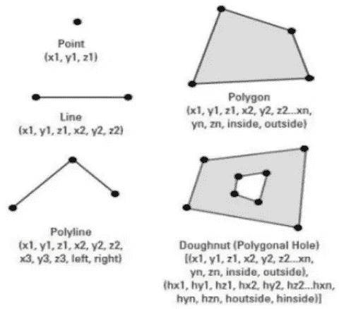

地理数据使用数据结构，如点、线和面([源](https://www.slideshare.net/MdYousufGazi/structure-of-geographic-data)，经 Yousuf Gazi 许可)

除了隔离存储这些单独的对象，地理数据还可以表示拓扑，即这些对象之间的关系。它们定义了其他对象，例如:

*   **圆弧**:类似于一条线
*   **节点**:不同圆弧或多边形的交点
*   **顶点**:一条线的弯曲

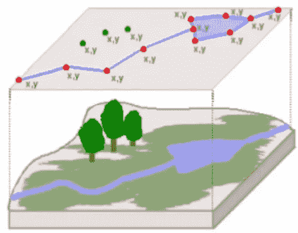

地理对象代表地理特征和它们之间的关系([来源](https://www.slideshare.net/MdYousufGazi/structure-of-geographic-data)，经 Yousuf Gazi 许可)

它们使用捕捉这些对象之间关系的数据结构，例如:

*   哪些对象紧挨着？
*   哪些弧线相互连接？
*   哪些对象在其他多边形内？

# **加载地理数据**

幸运的是，我们不必担心解析这些不同的格式和操作底层数据结构。

我们可以使用 Python 中出色的 GeoPandas 库，这使得所有这些变得非常容易。它是建立在熊猫的基础上的，所以熊猫的所有强大功能你都已经可以使用了。

它与地理数据框和地理系列一起工作，地理数据框和地理系列是 Pandas 数据框和系列对象的“空间感知”版本。它提供了许多附加方法和属性，可用于对数据框中的地理数据进行操作。

地理数据框架只不过是一个常规的 Pandas 数据框架，其中每一行都有一个额外的“几何”列来捕获位置数据。

Geopandas 还可以通过一个命令方便地将所有这些不同 geo 文件格式的地理空间数据加载到地理数据框架中。无论源格式如何，我们都可以以相同的方式对此地理数据框架执行操作。这抽象出了这些格式及其数据结构之间的所有差异。

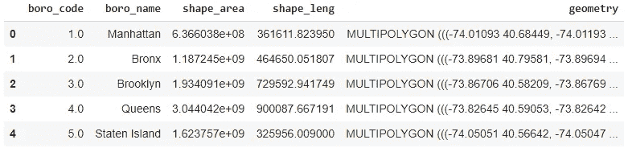

# **预处理地理数据(坐标参考系统)**

我们的地理数据包含地理位置的(x，y)坐标，通常是经度和纬度数字。然而，奇怪的是，这些坐标本身并不能映射到物理位置。

那些坐标只是任意空间中的数字。为了唯一地映射到现实世界中的实际位置，它们必须与一个坐标系相关联，称为 CRS。

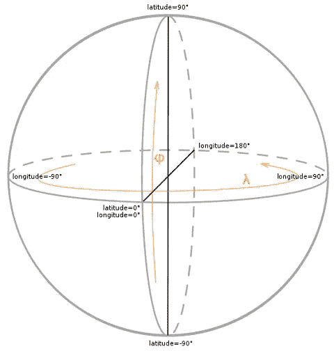

坐标参考系统将经纬度坐标映射到地球上的实际位置([源](https://commons.wikimedia.org/wiki/File:Geographic_coordinates_sphere_2.svg))

为了我们的目的，知道这一点就足够了，因为我们的地球不是一个完美的球体，没有一个完美的宇宙 CRS。我们有许多不同的 CRS，每个都针对特定目的或全球不同地区进行了优化。

# **预处理地理数据(地图投影)**

类似地，CRS 用于将位置坐标投影到地图上以便可视化。

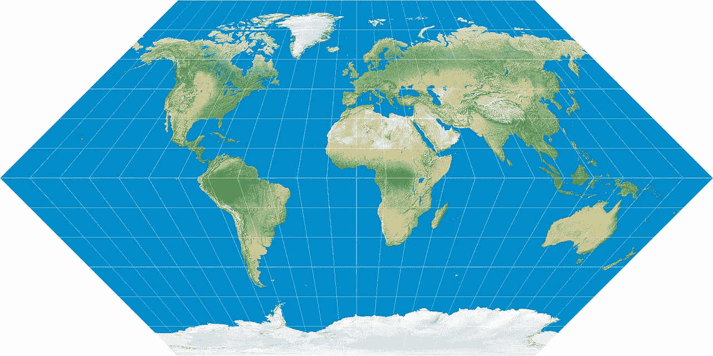

地图投影显示了 2D 表面上的 3D 球体([来源](https://commons.wikimedia.org/wiki/Category:Map_projections#/media/File:Eckert-1_map_projection.jpg)

因此，如果您从不同来源获取地理数据，则必须注意将所有这些坐标重新投影到同一个 CRS 上。并且还要确保它与可视化映射所使用的 CRS 相匹配。否则，您的位置坐标将无法正确对齐。

加载并标准化地理数据后，您可能希望执行探索性数据分析并可视化您的数据。

# **可视化**

Geopandas 具有良好的内置绘图功能。此外，还有许多优秀的 Python 库来可视化地理数据，如 follow 和 Plotly。

将您的应用程序数据加载到 Pandas 数据框架中。

通过将位置信息转换为几何格式，将其转换为地理数据框架。

然后绘制地理数据框架。

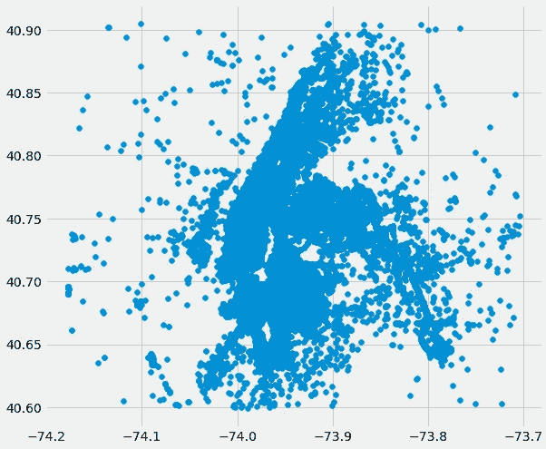

位置数据的绘图(图片由作者提供)

数据点本身没有足够的上下文。因为这些是纽约市的位置，所以您必须将它们覆盖在纽约的底图上(我们已经从 Shapefile 加载了该底图),以使其有意义。

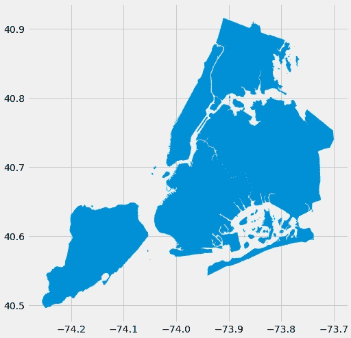

纽约市底图(图片由作者提供)

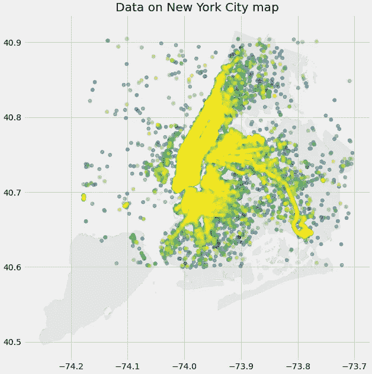

将位置数据叠加在底图上以获取背景信息(图片由作者提供)

# **特色工程**

根据您想要解决的问题，您可以使用位置数据向数据集中添加更多要素。以下是一些常用的方法:

## **地理编码和反向地理编码**

地理编码是如何将文本地址(例如，您正在尝试定价的房子的地址)映射到位置经纬度坐标。相反，反向地理编码将坐标映射到包含街道地址、城市、州和邮政编码等信息的地址。Geopy 是一个流行的 Python 库，它提供了这样的功能。

## **两点间的距离**

一旦你有了感兴趣的地方的精确位置坐标，你就可以计算它们之间的距离。例如，到最近医院的距离可能是一个有用的标准。或者出租车合乘问题的上车地点和下车地点之间的距离。有几种不同的方法来测量这个距离。

*   **欧氏距离**是两点的(x，y)坐标之间的简单直线距离。这个距离是在平坦的 2D 表面上测量的。
*   **测地距离**另一方面，是在 3D 表面上的球形地球上测量的。大圆距离是球体上两点之间的最短距离。或者，哈弗线距离在概念上类似于大圆，但使用哈弗线公式代替
*   **曼哈顿距离**与城市位置相关，街道可能具有网格布局。它旨在计算城市街道上两点之间的实际行驶距离(比如开车或步行)，因为这可能比“直线距离”的物理距离更相关。它的名字来自于计算纽约曼哈顿的距离，那里的一切都被安排在正方形的城市街区，道路相互平行，并以直角相交。然而在实践中，即使它们是笔直的，街道也不总是在南北和东西方向上对齐。因此，它会考虑这一点，并根据城市街道地图的旋转角度来计算校正后的距离。

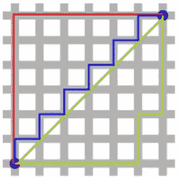

曼哈顿距离([来源](https://en.wikipedia.org/wiki/Taxicab_geometry#/media/File:Manhattan_distance.svg))

## **一点对另一点的方位**

当在地球上的两个地方之间旅行时，除了距离之外，你还可以计算旅行的方向。当您从起点出发时，方位角会计算初始方向。

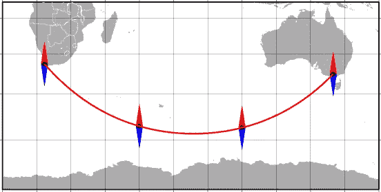

开普敦和墨尔本之间的方位([来源](https://upload.wikimedia.org/wikipedia/commons/8/80/Bearing_and_azimuth_along_the_geodesic.png By Darekk2 - Own work[[File:|32x20px]] This map was created with GMT., CC BY-SA 4.0, https://commons.wikimedia.org/w/index.php?curid=38676311))

## **点到一条线的距离**

这是您可能需要捕捉的另一个有用的数据点。例如，一所房子离高速公路、铁路轨道或公共汽车路线有多远？或者农场离河流有多远？

## **安全壳**

除了点位置之外，您可能还拥有区域形式的兴趣点。您可能想知道某个点是否在特定区域内。

例如，一所房子是否位于高评级学区内，这将显著影响其价值。

## **区域间重叠**

可以基于两个区域之间的交集或并集来测量重叠。例如，洪水区(或森林区)是否与县或州重叠。

## **地理聚类**

这有助于您将地理聚类中的位置组合在一起，这些地理聚类可能与现有的地理州或国家边界不一致。

例如，对于一个客户细分应用程序，您可以根据客户位置来识别聚类，并创建一个将每个客户分配到一个聚类的功能。

另一个例子可能是基于 Covid 感染患者的位置的聚类，以追踪疾病的传播。

## **地理区域嵌入**

就像我们对文本数据使用单词嵌入一样，深度学习模型可能会学习地理区域的基于位置的嵌入。例如，可以利用基于邮政编码或县名的嵌入来捕获区分每个此类区域的特征模式。

# **机器学习模型**

正如我们刚刚看到的，地理位置数据及其相关要素可以用数字或分类变量构造成常规表格数据。例如，地理数据以及新设计的房屋位置特征将与所有其他(非位置)属性(如年龄和面积)一起使用。

这意味着处理位置数据主要是关于数据准备，而不是关于建立任何特定于位置的机器学习或深度学习模型。您将继续使用通常用于表格数据的相同模型。

请注意，纬度/经度坐标通常可以按原样用于基于树的模型，如随机森林或梯度增强，这些模型不需要对数据进行归一化。诸如神经网络模型之类的其他模型通常需要对这些坐标进行归一化。

# **结论**

有了手机的 GPS 数据，现在可以前所未有地捕捉、跟踪和分析人们的位置和活动。这开启了大量依赖于理解位置数据的迷人应用。

本文为我们提供了一个处理地理位置数据的高层次图景。这使我们能够在以后的文章中更深入地研究这些主题。

最后，如果你喜欢这篇文章，你可能也会喜欢我关于变形金刚和音频深度学习的其他系列。

 [## 直观解释的变压器(第 1 部分):功能概述

### NLP 变形金刚的简明指南，以及为什么它们比 rnn 更好，用简单的英语。注意力如何帮助…

towardsdatascience.com](/transformers-explained-visually-part-1-overview-of-functionality-95a6dd460452)  [## 音频深度学习变得简单(第一部分):最新技术

### 颠覆性深度学习音频应用和架构世界的温和指南。以及为什么我们都需要…

towardsdatascience.com](/audio-deep-learning-made-simple-part-1-state-of-the-art-techniques-da1d3dff2504)  [## 神经网络优化器变得简单:核心算法和为什么需要它们

### 梯度下降优化器使用的基本技术的温和指南，如 SGD，Momentum，RMSProp，Adam 和…

towardsdatascience.com](/neural-network-optimizers-made-simple-core-algorithms-and-why-they-are-needed-7fd072cd2788) 

让我们继续学习吧！