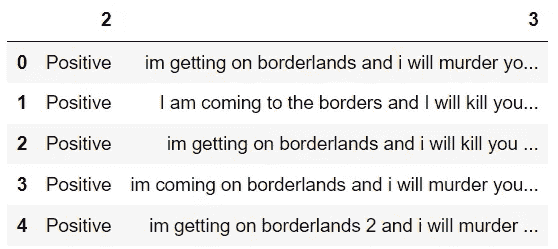
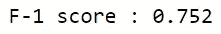
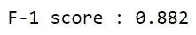
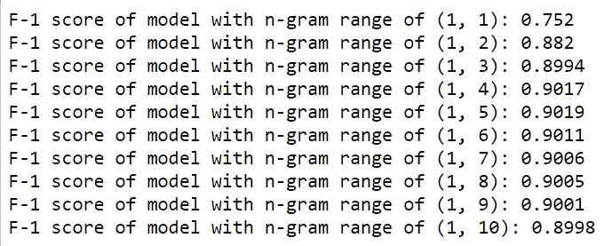

# 利用 N 元语法从文本中提取上下文

> 原文：<https://towardsdatascience.com/leveraging-n-grams-to-extract-context-from-text-bdc576b47049?source=collection_archive---------10----------------------->

## 简单介绍一个基本的 NLP 概念

照片由[亚历山大·奈特](https://www.pexels.com/@agk42?utm_content=attributionCopyText&utm_medium=referral&utm_source=pexels)从[派克斯](https://www.pexels.com/photo/high-angle-photo-of-robot-2599244/?utm_content=attributionCopyText&utm_medium=referral&utm_source=pexels)拍摄

人们在学习处理文本数据时，难免会碰到 n 元文法。它们通常在让机器理解给定文本的上下文方面起着关键作用。

因此，这个术语在无数的数据科学项目中被提出。

然而，不要将 n 元语法视为可以简单掩盖的行话，重要的是花时间了解这个概念的来龙去脉，因为它将作为理解更高级的自然语言处理工具和技术的基础。

那么，什么是 n-gram 呢？

简单来说，N 元文法是指 N 个单词或字符的序列。

# 例子

我们来考虑一下这句话:“我住在纽约”。

一个单字模型(n=1)将此文本存储在一个单词的标记中:

【“我”、“住”、“在”、“新”、“纽约”】

二元模型(n=2)将该文本存储在两个单词的标记中:

[“我住”，“住在”，“在纽约”，“纽约”]

在这个场景中，城市“New York”不会被识别为具有 unigram 的实体，因为每个标记只存储一个单词。另一方面，二元模型将单词“New”和“York”连接起来，并允许机器将“New York”识别为单个实体，从而从文本中提取上下文。

# 应用程序

照片由[罗曼·波霍雷基](https://www.pexels.com/@romanp?utm_content=attributionCopyText&utm_medium=referral&utm_source=pexels)从[派克斯](https://www.pexels.com/photo/person-sitting-inside-car-with-black-android-smartphone-turned-on-230554/?utm_content=attributionCopyText&utm_medium=referral&utm_source=pexels)拍摄

n 元语法在自然语言处理中无处不在。

想想你的信使或搜索引擎中的文本建议功能，你已经学会想当然。想想垃圾邮件检测器或仇恨言论检测器，它们让你的社交媒体体验更加愉快。这些特性都依赖于 n-grams 来实现它们所熟知的可靠性。

也就是说，没有一个特定的 n-gram 模型胜过所有其他模型。在 NLP 模型中利用 n-grams 的最佳方式只能通过实验来确定。

# 个案研究

让我们做一个案例研究来展示 n-grams 对模型性能的影响。

在这里，我们将使用一个包含视频游戏评论(此处[可访问](https://www.kaggle.com/jp797498e/twitter-entity-sentiment-analysis))及其相应情感得分的数据集进行一个简单的情感分析。

正在加载数据集

代码输出(图片由作者提供)

在任何预测建模之前，首先清理数据。

数据预处理

对于这个案例研究，在用于训练机器学习分类器之前，文本将通过 sklearn 模块中的[计数矢量器](https://scikit-learn.org/stable/modules/generated/sklearn.feature_extraction.text.CountVectorizer.html)对象转换为一袋单词。

一袋单字

注意:“ngram_range”参数指的是将包含在单词包中的文本的 n 元语法的范围。n-gram 范围(1，1)意味着单词包将只包括一元词。

让我们看看一个朴素贝叶斯模型是如何用 n 元语法范围(1，1)预测评论的情绪的。

使用 Unigrams 训练模型

代码输出(图片由作者提供)

朴素贝叶斯分类器的 f1 值为 0.752。

一般来说，单词袋模型是一种非常简单的单词矢量化方法，并且具有一定的局限性。主要是，单词在收集时没有排序，所以文本中的许多上下文丢失了。

在这种情况下，使用 n-gram 可以通过建立某种顺序来保存上下文，从而帮助解决这个问题。

让我们看看在将二元模型(n=2)添加到输入要素后，模型的表现如何。这可以通过将“ngrams_range”参数更改为(1，2)来实现。

用单字和双字训练模型

代码输出(图片由作者提供)

在纳入二元模型后，该模型获得了更高的 f-1 分数。这可以归因于当机器输入两个单词的序列而不仅仅是单个单词时，它获得了更大的上下文。

话虽如此，当涉及到 n-grams 时，越多不一定越好。在某些情况下，拥有太多的特征会导致模型不太理想。

我们可以通过展示该模型预测不同 n 元语法范围的给定文本的情感有多准确来证明这一点。

这里，用训练集构建了具有不同 n 元语法范围的 10 个模型，并用测试集进行了评估。

训练具有 10 个 N-gram 范围的模型

代码输出(图片由作者提供)

基于这些结果，该模型在 n 元语法范围为(1，5)时表现最佳。这意味着使用从一元到五元的 n 元模型训练模型有助于获得最佳结果，但更大的 n 元模型只会导致更稀疏的输入特征，这会影响模型的性能。

# 结论

照片由来自 [Pexels](https://www.pexels.com/photo/black-and-white-laptop-2740956/?utm_content=attributionCopyText&utm_medium=referral&utm_source=pexels) 的 [Prateek Katyal](https://www.pexels.com/@prateekkatyal?utm_content=attributionCopyText&utm_medium=referral&utm_source=pexels) 拍摄

n 元语法是自然语言处理中一个简单但重要的概念。考虑到需要从文本中提取洞察力的各种应用，n 元文法无疑将在许多机器学习项目中发挥重要作用。

这就是为什么深入理解 n 元语法及其对模型性能的影响至关重要。利用这个工具只会提高您的模型的能力。

我祝你在机器学习的努力中好运！