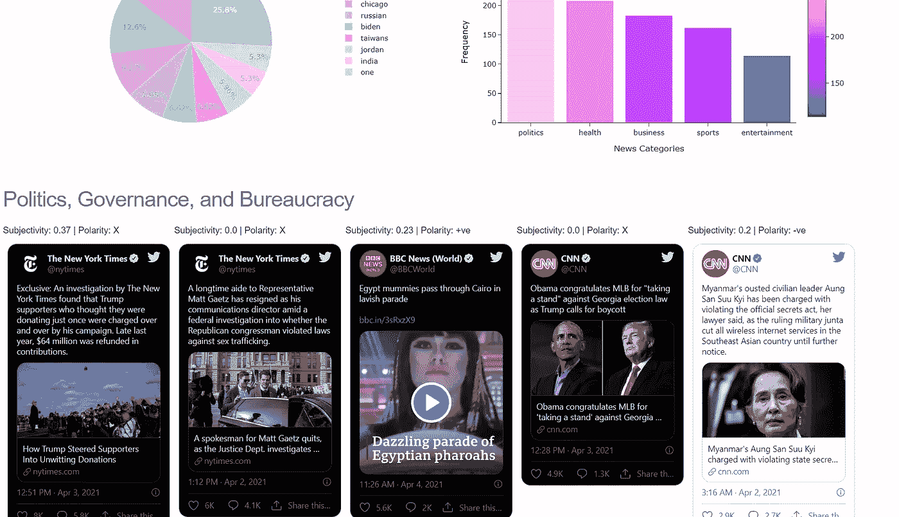

# 利用 NLP 和 ML 更好地消费新闻——然后用它制作一个应用程序

> 原文：<https://towardsdatascience.com/leveraging-nlp-and-ml-to-consume-news-better-and-then-making-an-app-out-of-it-2f1566a080e6?source=collection_archive---------28----------------------->

## 下面是我如何利用机器学习、NLP 和 Twitter 让我自己的数字报纸每天投递。


纽约公共图书馆在 [Unsplash](https://unsplash.com?utm_source=medium&utm_medium=referral) 拍摄的照片

> 他的姑姑和姑父交换了愤怒的眼神。
> “听新闻！又来了？”“嗯，它每天都在变化，你知道，”哈利说。

我喜欢看新闻——非常喜欢。为了阅读更好的新闻，我每天不停地浏览推特和谷歌新闻。当我想到它的时候，并没有什么特别的原因。

一个晴朗的日子，我的数字健康跟踪器显示我在 Twitter 上花了两个多小时。我知道我在做什么:搜寻新闻。

当压力来临时，我意识到我需要减少花在 Twitter 上的时间，我找到了一个变通办法，仍然可以找到我每天的新闻，而不会失去 Twitter 带来的所有乐趣。我建立了一个新闻聚合应用程序！

# 不仅仅是新闻。

阅读新闻和观看视频不是孤立的事件。当消费任何内容时，语境是必不可少的，就新闻而言，它所携带的观点/自以为是的文本及其引起的反应是形成这种语境的主要因素。

## 公共脉冲

新闻总是与观点纠缠在一起——无论是记者的观点还是读者的观点。理解这些观点的错综复杂有助于理解新闻本身。例如，一篇新闻或一篇观点文章有大量的负面回应，可能意味着它不受欢迎。这可能需要进一步挖掘它所说的内容。

不管有没有这个确切的动机，我们很多人经常会读到公众对一些有趣事物的看法。我认为，这是评论/回复/帖子存在的一个重要原因，而且通常是公开的，在几个流行的社交媒体中(无论是 Twitter、脸书、YouTube、Reddit)。我倾向于这样做，尤其是当我阅读新闻文章的时候——来衡量人们对发生的事情的看法——但是这只会增加无休止的滚动。

为了解决这个问题，我决定利用 NLP 向我灌输要点。对于每条新闻推文，该应用程序都会收集所有对该推文的回复，并使用 NLTK Vader 和 spaCy-textblob 计算这些回复的极性/情绪。通过判断是正面还是负面的回复主导了这条线索，我们确定了对新闻文章的反应的情绪——我们判断了围绕它的话语的极性。

## 新闻应该固执己见吗？

> “主播有观点并不是一个新现象。默罗有一个，这是麦卡锡的结束。克朗凯特有一个，这是越南的结束。”,
> 
> 查理·斯金纳，编辑部。

关于一个新闻来源是应该坚持只提供事实，还是应该塑造伴随新闻的对话，有不同的思想流派。我相信后者，但我将在另一个日期进行辩论。

不管你站在这场辩论的哪一边，知道新闻文本带有多少主观性总是好的。

虽然获得新闻文本本身的主观性在获得付费墙之外的新闻文本或没有昂贵的 API 方面提出了一些挑战，但在一些即时性方面，我们可以从载有文章的新闻源的经验证的句柄来确定推文的主观性。有了一个合理的假设，即推文的文本是对新闻文章本身内容的公平而简略的模仿，推文的主观性度量可以是一个很好的替代品。该应用程序还通过 spaCy-textblob 获取这些新闻推文的主观性。

# 一切都很好。那个应用程序是怎么回事？

我决定整天在 twitter 上浏览不同机构报道的新闻就足够了。我希望能够阅读这条新闻，但是要在尽可能短的时间内，以一种有条理的方式。我是这样做的:

## 从官方账号(@纽约时报，@华盛顿邮报等)收集推文。)

我使用 Twitter 的 API 挖掘了大约 1000 条这样的 tweetss，这些 tweet 每天都链接着著名新闻来源的文章。

## 让他们像报纸一样。

简而言之，把新闻分类。在没有某种正式结构的情况下，大脑连续理解不同类别的新闻在人体工程学上是不可行的。

因此，这些推文通过一组分类器(多项式朴素贝叶斯、逻辑回归和支持向量分类器)运行。当它们出现时，它们被按照它们所属的新闻类别分组——商业、政治、体育、娱乐或健康。分类器是通过使用 NewsAPI 挖掘数据以及使用从 Kaggle 获得的带注释的数据集的组合来构建的: [this](https://www.kaggle.com/rmisra/news-category-dataset) 和 [this](https://www.kaggle.com/c/learn-ai-bbc/rules) 。这些分类器的准确率超过 80%。

## 查找热门故事。

该应用程序然后列出每个类别中最好的五个故事，总计 25 个故事。这是通过简单地找到伴随着最佳参与度的推文(收藏和转发)来完成的。

## 创建上下文。

现在说说不那么秘密的成分。每条推文都经过主观性分析器，给我们一个 0-1 分的分数，显示推文语言的主观性。

在此之后，我们还收集所有的回复(这是一个谎言:我们收集 Twitter API 的速率限制没有把我们踢出去的推文的所有回复)，并使用两个不同的情感分析器为每条推文分配极性分数。

```
To know more about collecting replies, read: [Mining replies to Tweets: A Walkthrough](/mining-replies-to-tweets-a-walkthrough-9a936602c4d6)
```

一旦做到这一点，我们就知道围绕一条链接新闻故事的推文的对话线索是积极的还是消极的。

我们提供这些信息。

## 把它送到出版社。

我们有我们的新闻，我们有我们的背景。

为了让读者做好准备，我们还添加了一些额外的背景信息，以确保读者了解我们呈现给他们的故事之外发生的事情，以便他们了解这些故事对当天新闻数量的影响程度。

我们提供了额外的可视化效果，描绘了当天 10 大趋势命名实体，并使用饼图显示它们出现的频率(在所有约 1000 条带有命名实体的新闻推文中)。我们还展示了一个条形图，显示了属于每个类别的新闻故事的数量，以显示哪种新闻在当前环境中是流行的。

为了将所有这些联系在一起，我们在一个 web 应用程序中呈现所有这些内容，托管在以下位置:

```
bit.ly/northeastws
```

我们通过使用嵌入式推文尽可能贴近 twitter 的用户界面来呈现信息，同时描绘我们计算的每一个统计数据和我们与这些推文一起制作的每一个视觉效果。



快速瞥一眼这个应用程序的样子

## 结论

该应用程序未来还将增加几项功能——从分析实际新闻文章的文本到检查毒性和超党派性，以及分析缩略图图像以计算其极性。这些都是我希望以后补充的。

但是现在，如果你想阅读新闻，而不是整天在社交媒体上无休止地滚动，并且想满足你对其他人如何看待这条新闻的好奇心，我很乐意欢迎你和我一起在这个一站式商店购物。

对于任何评论、反馈、问题、聊天等。你可以在这里找到我。

—

***aditya Narayan an****是布法罗大学的研究生。他专门从事* ***运筹学*** *并有* ***计算机科学*** *的背景。阅读新闻并加以评论是他的本能。*

他有另一个自我，无聊时喜欢创作各种数字内容，但更喜欢纸和笔。他为多个大型体育实体创建了数字内容，如 LaLiga Santander、Roland-Garros 和 NBA 篮球学校。

*这是他的* [***领英***](http://linkedin.com/in/adithya-narayanan)***&***[***邮箱***](http://me@adithya-narayanan.com) *。*