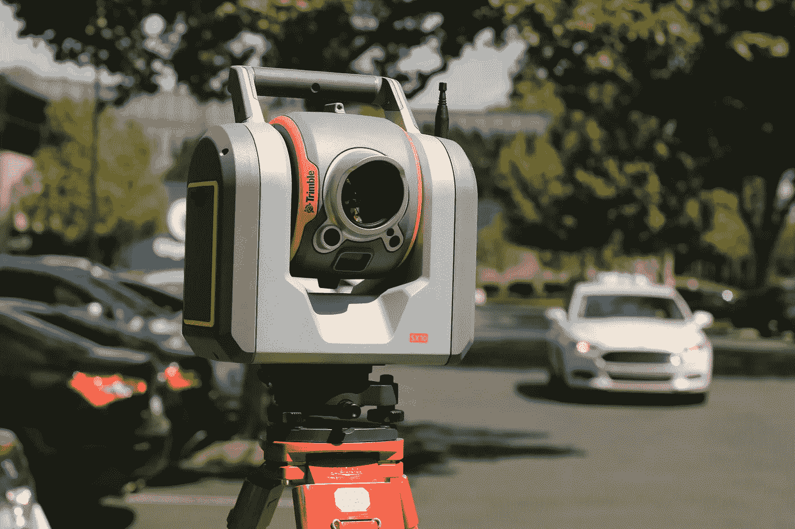
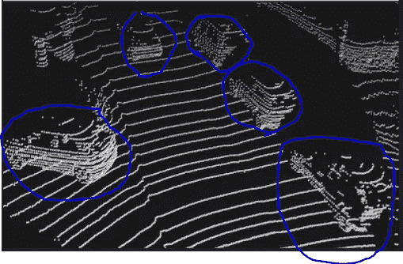
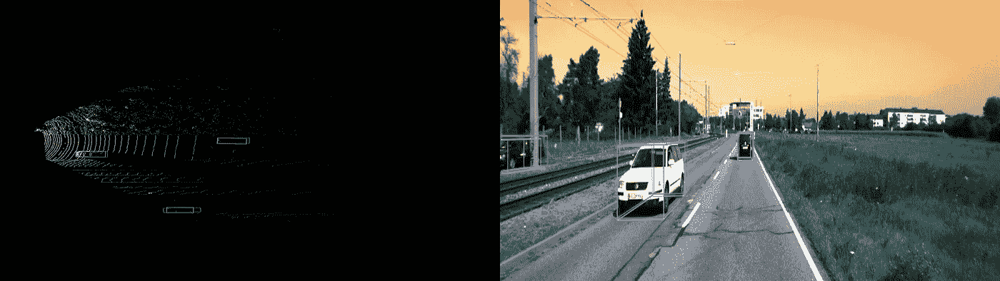

# 激光雷达及其在自动驾驶车辆中的能力

> 原文：<https://towardsdatascience.com/lidar-and-its-capability-in-self-driving-vehicles-1514eb8365ca?source=collection_archive---------23----------------------->

## 在本文中，我们将了解激光雷达及其原理，激光雷达的组成部分，激光雷达中使用的术语，激光雷达与其他传感器的比较



致谢:斯科特·布雷克，[unsplash.com](https://unsplash.com/s/photos/lidar)

在本文中，我们将了解激光雷达及其原理，激光雷达的组成部分，激光雷达中使用的术语，激光雷达与其他传感器的比较

# 激光雷达——T2 光探测和测距

激光雷达的缩写是**Li**ght**D**detection 和 **R** anging

## 激光雷达的类型

1.  **地形激光雷达—** 使用近红外(Infra-Red)光绘制土地。
2.  **测深激光雷达—** 使用透水绿光来测量海底和河床高程。
3.  **地面激光雷达—** 测绘建筑物、自然特征、地面树木。

## 激光雷达的工作原理

我们将了解激光雷达如何测量距离并生成周围环境的 3D 点云信息。

*   激光脉冲向各个方向传播，直到脉冲碰到物体/障碍物
*   在撞击物体时，脉冲在激光雷达系统中被反射
*   激光雷达记录这个回波脉冲
*   系统计算物体的距离，如下所述

1.  **飞行时间:距离测量**

测距激光雷达(1D 激光雷达)中的主要部件是一个**激光器**、**光电探测器**和**一个校准过的秒表**。

激光:向周围环境发射激光脉冲，这些脉冲散射，一些激光脉冲反射回激光雷达

光电探测器:捕捉反射的激光脉冲

秒表:计算从发送脉冲到返回脉冲所用的时间，这个时间称为**往返时间。**

往返时间(r)计算如下:

```
**r = 1/2* c * t**r - round trip time, c- velocity of the light, t - transmitting time
```

*等式中的 1/2 表示激光雷达传感器和物体之间的距离是圆形距离的一半，这被称为* ***飞行时间测距***

**2。点云数据:3D 信息**

每个反射的激光脉冲被映射为一个点(具体地说是一个数据点)。每个数据点包含 3 个值，代表 X、Y、Z 坐标，以及其他属性，例如反射脉冲的强度、旋转等。这些数据点的集合称为**点云数据**。

使用扫描仪的位置和方向(来自 GPS 和 IMU)、扫描镜的角度和距离来计算每个回波的 X、Y、Z 坐标

原始点云数据可用于使用点云处理软件/库创建 3D 网格和模型。

# 自动驾驶汽车如何使用激光雷达数据

如前所述，激光雷达数据接收数百万个点云数据。该数据被聚集以识别对象。

## 使聚集

所有的点云被覆盖，给物体一个可识别的形状。



图 1:原始点云数据，承蒙: [KITTI 数据集](http://www.cvlibs.net/datasets/kitti/raw_data.php)

密集的点云提供了一个可识别的形状

## 分类/检测

然后，聚类被分为不同的类别，即行人、汽车和其他类别



点云数据上的 3D 物体检测，承蒙: [KITTI 数据集](http://www.cvlibs.net/datasets/kitti/raw_data.php)

# 激光雷达系统的组件

激光雷达传感器有 5 个组件

## 激光扫描器

*   **频率:**

每秒 50，000 到 200，000 个脉冲(赫兹)

*   **波长:**

> 气象用红外线(1500-2000 纳米)
> 
> 用于陆地测绘的近红外(1040–1060 纳米)
> 
> 蓝绿色(500-600 纳米)用于测深
> 
> 气象用紫外线(250 纳米)

## 扫描仪

*   镜子将激光脉冲投射到表面
*   它测量每个脉冲发射的角度
*   接收来自地面的反射脉冲

## 全球定位系统

*   记录扫描仪的 x、y、z 位置

## 惯性测量单元(IMU)

*   测量扫描仪相对于地面的角度方向(俯仰、滚动、偏航)

## 时钟

*   记录激光脉冲离开和返回扫描仪的时间

# 激光雷达术语

我们应该了解这些参数及其定义，以便更好地了解传感器。

让我们试着了解一些常用术语

## 重复率

激光器发射脉冲的速率，单位为千赫兹(kHz)。该信息将由激光雷达制造商提供。

如果制造商指定传感器工作在 150 kHz，这意味着激光雷达脉冲每秒 150，000 次，同时具有 150，000 个反射脉冲的接收能力。

## 扫描频率

扫描频率显示每秒钟的转数，即激光雷达扫描仪的移动速度。

当激光发射脉冲时，设备中的扫描仪将这些脉冲反射到周围环境中。

## 扫描角度

这是以度为单位测量的，是扫描仪从一端移动到另一端的距离。扫描角度还表明激光雷达在其旋转范围内的精确度。角度越小，生成的地图质量就越高。

## 跨磁道分辨率

来自激光雷达系统的脉冲在扫描方向上的间隔。

## 强度

*   反射的强度随着反射反射的表面物体的成分而变化
*   反射百分比被称为激光雷达强度

# 照相机、雷达和激光雷达的比较

# 激光雷达反射率示例

# 汽车用例的激光雷达公共数据集

1.  [Waymo 开放数据集](https://waymo.com/open/)
2.  [Aptiv 的 nu scenes](https://www.nuscenes.org/)
3.  [百度 Apollo scape](http://apolloscape.auto/)
4.  [KITTI Vision 基准测试套件](http://www.cvlibs.net/datasets/kitti/raw_data.php)

感谢你阅读这篇文章，请在评论中告诉我你的想法。