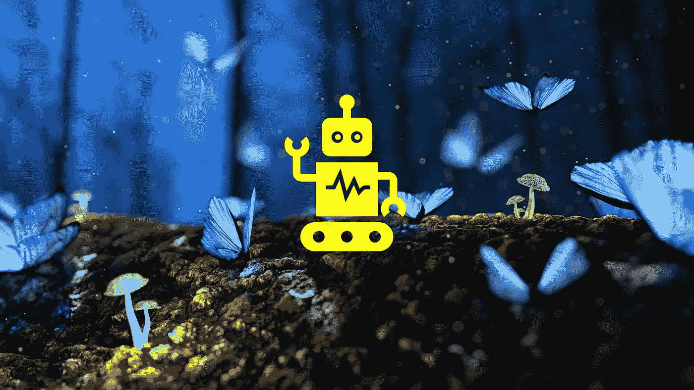
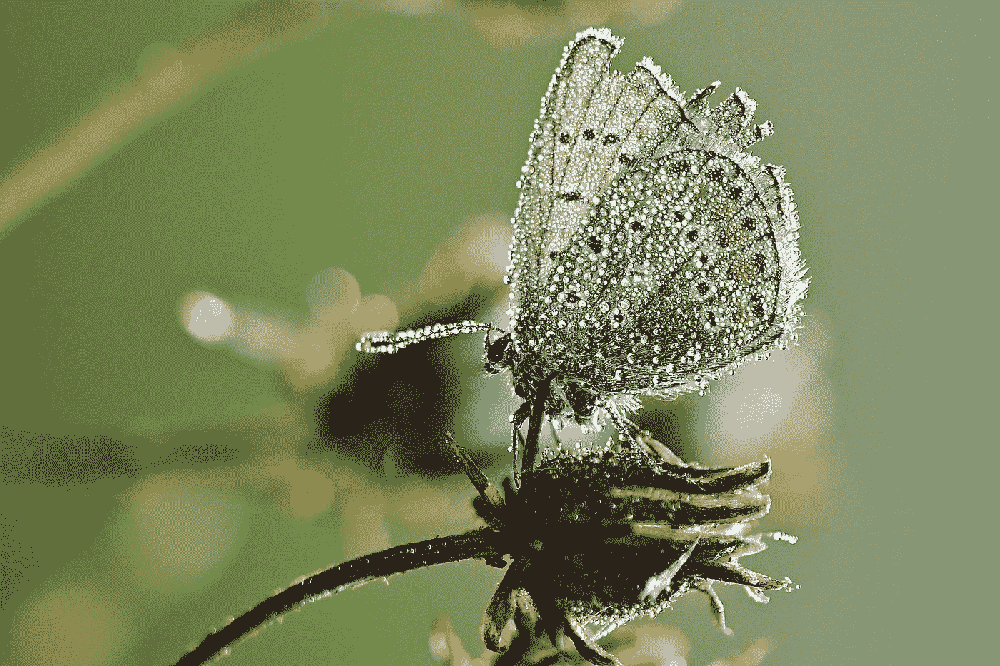
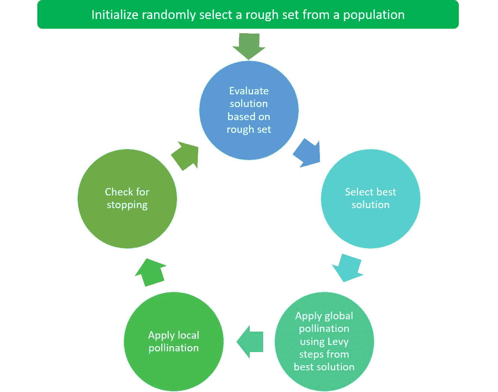

# 生活和自然对艾的影响

> 原文：<https://towardsdatascience.com/life-and-natures-influence-on-ai-237647e85823?source=collection_archive---------30----------------------->

图片由来自 Pixabay 的[игорьлевченко](https://pixabay.com/photos/fantasy-butterflies-mushrooms-2049567/)拍摄

## 人工智能算法如何受到我们的生活、自然和环境的影响

科学家、工程师和人工智能专家从他们的环境中汲取灵感，创造出各种人工智能和机器学习算法。深度学习近年来迎来了一场人工智能革命，始于人类大脑特别是神经元的灵感。在这篇文章中，我将强调几个受自然强烈影响的人工智能和机器学习的著名算法或学科。幸运的是，大自然没有专利；否则，我们将不得不征求蜜蜂、鱼甚至蚂蚁的同意。

# 花朵授粉算法

图片由来自 Pixabay 的 [jggrz](https://pixabay.com/photos/pollination-butterfly-bud-5541489/) 提供

花卉授粉算法(FPA)是一种受自然启发的元启发式算法，模拟开花植物授粉行为。著名启发式算法开发人员杨新社于 2012 年开发了 FPA，展示了其优于之前许多算法的性能，包括遗传算法和粒子群优化算法。传粉者在这个算法中表现出各种各样的特征。例如，生物传粉者代表全局搜索，而非生物传粉者代表局部搜索。花朵授粉算法代表 4 个规则:

*   **规则 1:** 鸟类等传粉者的异花授粉被视为一个全球授粉阶段，传粉者表现出[征飞](https://en.wikipedia.org/wiki/L%C3%A9vy_flight)行为。这就像一次全球搜索。
*   **规则 2:** 附近花朵的自花授粉被认为是局部授粉过程。这就像是局部搜索。
*   **规则三:**花的恒常性作为繁殖率，直接关系到两个涉案花的相似程度。
*   **规则 4:** 使用切换概率实现全局和局部授粉。

作者图片

该算法用于:

*   机器人最优路径规划
*   神经网络反向传播学习权值的优化
*   无人水下航行器最优路径规划
*   医学图像分割
*   NP-hard 组合优化问题
*   生产调度等调度问题

你可能想查看 youtube 上的 below Khan Academy 视频中对花卉授粉概念的精彩解释。

Youtube 上[可汗学院](https://www.youtube.com/watch?v=hCloCHwrJdQ&t=47s)的视频

# 粒子群优化算法

> **粒子群优化(PSO)** 是由 Kennedy 和 Eberhart 于 1995 年开发的受自然启发的流行元启发式算法(根据谷歌学术有超过 60，000 条引用)。PSO 模拟社会行为，对鸟类或鱼类等群体中生物的运动进行风格化描述。PSO 是蓬勃发展的人工智能领域****【SI】**的灵感来源。**
> 
> **PSO 是一种计算方法，通过迭代地尝试改进关于给定质量度量的候选解决方案来优化问题。PSO 方法的一个简单形式是采用潜在解决方案(称为**粒子**)的群体(称为**群体**)。PSO 是一种元启发式算法，因为它对优化问题做出很少或没有假设，并且可以搜索候选解的巨大空间。目的是找到一个解决方案，使得它优于整个搜索空间中所有其他可能的解决方案。这个过程不断重复，希望最终能找到满意的解决方案，但这并不能保证。—来自维基百科**

**PSO 最基本的工作方式如下:**

*   **PSO 从一组随机粒子(解)开始，然后通过更新代来迭代地寻找最优解。**
*   **粒子穿过解空间，并在每个时间步之后基于一些适合度标准进行评估。每个组件的初始迭代是它迄今为止获得的最佳解决方案(适应性)(适应性值也被存储)。**
*   **粒子群优化器监控的另一个“最佳”值是群体中任何粒子迄今为止获得的最佳值。这个第二好的值是全局最佳值。**
*   **当粒子具有来自群体的拓扑邻居时，次佳值是局部最佳值。**
*   **邻域最佳允许搜索空间的同时探索，并最小化粒子群算法陷入局部极小值的敏感性，但它们减慢了收敛速度；通过跟随两个“最佳”值来更新粒子。**

**Ali Mirjalili 在 Youtube 上的一个精彩视频解释了 PSO。**

**来自 Youtube[的](https://www.youtube.com/watch?v=JhgDMAm-imI) [Ali Mirjalili](https://www.youtube.com/channel/UCGqlMrnhuH3DD80cWG8xw8A) 的视频**

**PSO 变体还解决了**多目标问题**，其中目标函数的比较考虑了 PSO 粒子的帕累托最优。**

**我们看到许多新的和更复杂的粒子群优化变异，提高性能优化。一种是使用 PSO 结合其他优化工具(例如，PSO 结合遗传算法)创建一种混合优化方法。**

**该算法用法如下:**

*   **安排生产设备和人员**
*   **神经网络训练**
*   **移动机器人导航**
*   **图像识别**
*   **电影特效生成**
*   **能量存储优化**

# **遗传算法**

****

**图片由[皮克斯拜](https://pixabay.com)的 Gerd Altmann 提供**

****遗传算法**，由霍兰德和他的同事在 20 世纪 70 年代创造(Holland，1975；De Jong，1975)是基于查尔斯·达尔文的自然选择理论的生物进化模型或抽象。霍兰德很可能是第一个使用**交叉、重组、变异和选择**来探索适应性和人工系统的人。遗传算法是进化计算的一个子集，进化计算是一个相当广泛的计算领域。**

**遗传算法使用自然选择来尝试为一个问题创建更好的模型。首先，你的目标函数适用于所有人群。排名最高的答案被允许生育和繁衍后代。最后，低分模型被淘汰，为更合适的模型创造条件。每一代都有一群看起来像人类 DNA 染色体的字符串。群体中的每个人代表搜索空间中的一个点，因此每个人都是一个潜在的解决方案。我们让人们经历一个进化过程，以增加解决方案的数量。**

**遗传算法在本质上是充分随机化的，但它们优于随机局部搜索(在随机局部搜索中，我们尝试许多随机解决方案，并跟踪迄今为止的最佳方案)，因为它们使用了以前的知识。**

**该算法在较高层次上运行如下:**

*   **该方法从称为群体的一组解(由染色体表示)开始。**
*   **来自一个群体的解决方案被用来形成一个新的群体以创造一个更好的群体。**
*   **被选择来生成新解(后代)的解是基于它们的适合度来选择的——它们越适合，它们就越有可能繁殖。**
*   **重复这个过程，直到满足一个条件。**

**参考下面的视频，它解释了遗传算法是如何工作的。**

**Youtube 上由 [Kie Codes](https://www.youtube.com/watch?v=uQj5UNhCPuo) 制作的视频**

# **蚁群算法**

****蚁群优化**是一种针对组合优化问题的元启发式算法设计方法。1991 年报道了第一个被归入这一范式的算法，从那以后，这一基本思想出现了无数不同的版本。**

**现实世界中蚂蚁的觅食行为是 ACO 的灵感来源。根据生物学家的说法，盲蚁可以确定食物来源和巢穴之间的最快路径。根据研究，蚂蚁在移动时会在地面上留下信息素。当经过时，其他蚂蚁可能会跟随前面的信息素。因此，蚂蚁们会沿着**浓度更高的**的信息素踪迹前进。蚂蚁通过信息素轨迹进行间接交流，这使它们能够识别巢穴和食物来源之间的最快路径。自然蚁群的这一特性被用来解决人工蚁群中的离散优化问题。**

**蚁群算法可以用来改进机器学习模型。将关于预期解的结构的先验知识与关于先前获得的好解的结构的后验信息相结合是 ACO 算法的关键特征。**

**观看这段视频，了解关于蚁群的有趣事实。**

**Youtube 上来自[的视频](https://www.youtube.com/watch?v=vG-QZOTc5_Q)**

# ****人工免疫系统****

**生物免疫系统是一个极其平行、分散和适应性强的系统。为了解决识别和分类任务，它采用了**学习、记忆和关联检索**。它学习识别重要的模式，回忆以前遇到的模式，并使用组合学有效地创建模式检测器。免疫系统非凡的信息处理技能在计算领域发挥着至关重要的作用。**人工免疫系统(AIS)** 是一种基于规则的机器学习系统，其灵感来自脊椎动物免疫系统的概念和操作。**

**人工智能通常有多种算法:**

*   **克隆选择**
*   **树突细胞**
*   **否定选择**
*   **人工免疫识别**

**人工智能可以将系统中的每个“细胞”分成“自体”或“非自体”细胞，这与生物免疫系统相同。AIS 使用分布式智能任务组对所有单元执行操作。人工免疫系统通常被集成到常用的企业级软件中，并通过监控入侵检测来抵御网络攻击。**

**参考下面的 Youtube 视频，它雄辩地解释了这一点。**

**朱莉·格林史密斯博士的视频来自 [Youtube](https://www.youtube.com/watch?v=u2qRUtg2k3Y)**

**如果我们讨论生命和自然的影响，我们永远不会忘记对 DL 和 RL 的影响，但我不会在这里花超过一行的时间，因为这些就像现在人工智能的主流。**

****深度学习(DL)** :人脑和神经元启发的人工神经网络。**

****强化学习(RL)** :当前人工智能的热门领域，强化学习很大程度上受人类行为和习惯模式的影响。**

**一旦我们开始浏览算法或 AI/ML 领域的列表，这些算法或领域受到生物学、自然或生命的影响，这个列表似乎是无穷无尽的。**

**鲜为人知的有:**

****人工蜂群(ABC)** :该算法模拟蜂群的协作行为**

**Youtube 上来自[新星科学](https://www.youtube.com/watch?v=q-5XjWZlosg)的视频**

****鱼群算法(FSA)** :这是模仿鱼类的行为，每条鱼可以根据不同的方式寻找食物来源，并可以与其他鱼进行信息交流，直到获得全局优化。**

**鲸鱼优化算法 (WOA):这模仿了座头鲸的行为。**

****灰狼优化** (GWO):这模仿了灰狼的狩猎技术和社会领导力。**

# **最后注意:**

**有时候，我们所需要的只是来自大自然或我们动物王国的一点影响或灵感。但是，然后，我们需要观察和实验这些想法，谁知道下一个重要的发明可能就在你每天看到或经历的眼睛附近的某个地方。**

**我期待看到你的反馈或分享任何其他受生活或自然影响的算法或 AI & ML 领域。**

**感谢阅读。你可以在 [LinkedIn](http://www.linkedin.com/in/baijayantaroy) 上联系我。**

# **参考:**

**[https://en.wikipedia.org/wiki/Particle_swarm_optimization](https://en.wikipedia.org/wiki/Particle_swarm_optimization)
[https://en.wikipedia.org/wiki/Genetic_algorithm](https://en.wikipedia.org/wiki/Genetic_algorithm)
[https://ieeexplore.ieee.org/document/9048215](https://ieeexplore.ieee.org/document/9048215)
[https://www . intechopen . com/books/swarm-intelligence-recent-advances-new-perspectives-and-applications/particle-swarm-optimization-a-powerful-technique-for-solving-engineering-problems](https://www.intechopen.com/books/swarm-intelligence-recent-advances-new-perspectives-and-applications/particle-swarm-optimization-a-powerful-technique-for-solving-engineering-problems)
[http://www.scholarpedia.org/article/Ant_colony_optimization](http://www.scholarpedia.org/article/Ant_colony_optimization)
[https://core.ac.uk/download/pdf/74033538.pdf](https://core.ac.uk/download/pdf/74033538.pdf)**